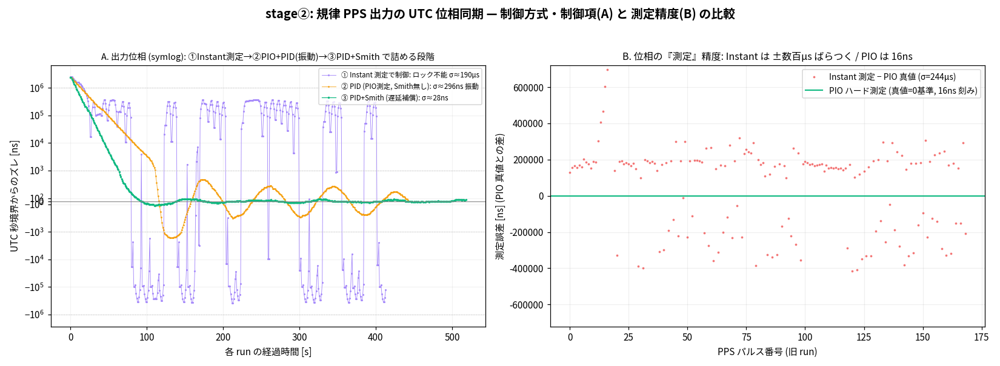

# pico-gnss-rs

[](https://crates.io/crates/gnssdo)
[](https://docs.rs/gnssdo)
[](LICENSE)

[English](README.md) | **日本語**

RP2040 上に構築した GNSS **1PPS を基準にした時計 (GPSDO/GNSSDO)**。再利用可能な `no_std`
コアクレートと、リアルタイム Web ダッシュボードを含みます。

GNSS 受信機の 1Hz PPS は、パルスの始まりで UTC 秒境界を刻みます (この GPS-R は active low なので立ち下がりです)。本プロジェクトはそのエッジを
ナノ秒分解能で捕捉し、ローカル水晶の周波数誤差を推定して、**PPS が切れている間
(holdover) も含めて** UTC を保ちます。


*評価ハードウェア: Raspberry Pi Pico (RP2040) を breakout に載せ、秋月 [AE-GNSS-EXTANT](https://akizukidenshi.com/catalog/g/g113849/)
(太陽誘電 GYSFFMANC, MediaTek MT3333) GNSS モジュールをジャンパワイヤで接続。GPSDO 1PPS
出力 (GP3) と GPS PPS にオシロのプローブを当てて位相を測る。*


*リアルタイム Web ダッシュボード (`webapp/`): UTC 時刻・PPS ジッタ・周波数の推定と
holdover・スカイプロット / C/N₀・測位 fix。(位置はプライバシーのためマスク — ダッシュボード
には座標・地図マーカー・NMEA 緯度経度を伏せる privacy モードを内蔵。)*

## ワークスペース構成

| パス | 内容 |
|---|---|
| [`gnssdo/`](gnssdo/) | **時刻同期のコア** ([crate `gnssdo`](gnssdo/README.md))。`no_std`・HAL 非依存・整数演算のみ・**依存ゼロ**。周波数 (ppb) 推定、holdover、PPS エッジ追跡、出力位相ロック servo (PLL)。timestamp と UTC epoch を消費。host テスト可能。 |
| [`rp-pps/`](rp-pps/) | **RP2040/RP2350 PIO + 受信機 I/O** (crate `rp-pps`)。PPS エッジのハード捕捉・操舵可能な 1PPS 出力、NMEA フレーミング/パース、PPS↔UTC 秒の対応付け — `gnssdo` が消費する timestamp と epoch を生産。HAL 非依存コア (host テスト可) + embassy-rp / rp2040-hal backend。 |
| [`pico-gnss/`](pico-gnss/) | RP2040 firmware (embassy-rp)。PIO ハード PPS 捕捉、時刻同期、GPSDO PPS 出力。embedded 専用で `gnssdo` + `rp-pps` を配線。 |
| [`webapp/`](webapp/) | リアルタイムダッシュボード (React 19 + Vite + TypeScript)。firmware の defmt/RTT 出力を依存ゼロの Node ブリッジ経由で表示。 |
| [`docs/report/`](docs/report/) | 実機評価のログと図。 |
| [`NOTES.md`](NOTES.md) | 設計判断とハマった罠の記録。 |

## クイックスタート

```sh
# コアライブラリ — ハード不要で host 上で動く:
cargo test -p gnssdo

# firmware — probe-rs 対応プローブ + RP2040 が必要:
cd pico-gnss && cargo run --release       # build → flash → defmt ログを表示
```

ワークスペースの `default-members` は `gnssdo` なので、ルートでの素の
`cargo build`/`cargo test` は host 安全なコアだけを対象にします。firmware は
embedded 専用で、`pico-gnss/`(その `.cargo/config.toml` が `thumbv6m-none-eabi`
ターゲットと probe-rs runner を選ぶ)の中からビルドします。

## ハードウェア

- **MCU**: RP2040 (Raspberry Pi Pico, Seeed XIAO RP2040 など)。
- **GNSS モジュール** (NMEA + 1PPS 出力)。例: 秋月 [`AE-GNSS-EXTANT`](https://akizukidenshi.com/catalog/g/g113849/) /
  GYSFFMANC (MediaTek MT3333)、9600 baud。
- **配線**: UART0 RX = GP1 (モジュール TX)、UART0 TX = GP0 (モジュール RX)、PPS = GP2。
  共通 GND が必要。

## 実機評価結果 (RP2040 @ 125 MHz)


実機ログ ([`sample-capture.log`](docs/report/sample-capture.log), ~227s) から
`uv run webapp/plot_report.py` で生成:

- **A** — GPSDO が起動時に水晶ドリフト (~+2.5 ppm) を学習し、その後 ppb 級で保持する。
  これが holdover を可能にする。
- **B** — 時刻補正残差 σ ≈ 数十 ns で、**受信機の ±10 ns 1PPS 仕様の内側**。
- **C** — PPS ジッタは 16 ns 捕捉量子化の数段階に収まる (PIO ハード捕捉、~10–16 ns。
  ソフト GPIO 割込方式の ~9 µs に対して)。
- **D** — GPSDO PPS 出力は GPS 秒境界に **短窓・良受信で σ ~35–50 ns**。ただし低周波の位相変動
  (数分で ~150 ns、~10 分超で σ ~200–250 ns) は **ハード律速で firmware では詰められない** — 出所は
  外部基準なしには分離できないが、データはむしろ水晶/発振器側 (温度相関) で受信機ではない
  (受信律速なのは極小の ~13–18 ns 下限のみ)。出力 vs GPS の絶対オフセットは **≤100 ns に中心化・
  再起動再現性あり** (Smith 予測子サーボ + ループバック自己校正。旧ソフトサーボは ±1.4 ms)。
  窓依存と限界は [`docs/report/REPORT.md`](docs/report/REPORT.md) を参照。

before/after — 位相の「測定」精度 (Instant ±ms → PIO 16 ns) と、その結果の出力位相:



GPSDO 1PPS をオシロで GPS 基準と独立検証 (GPS エッジを画面中央=0 に; 生成側はわずかに早く、量は操舵可能):


起動からの引き込み全体を毎 PPS で: 出力 PPS が GPS エッジへ収束する様子 (上段, auto-zoom するオシロ) と、
firmware の内部状態 — offset/hwphase・時刻誤差・水晶 ppb・温度とその feed-forward 寄与 — を同時に:


手法の詳細・全図は [`docs/report/REPORT.md`](docs/report/REPORT.md) を参照。
