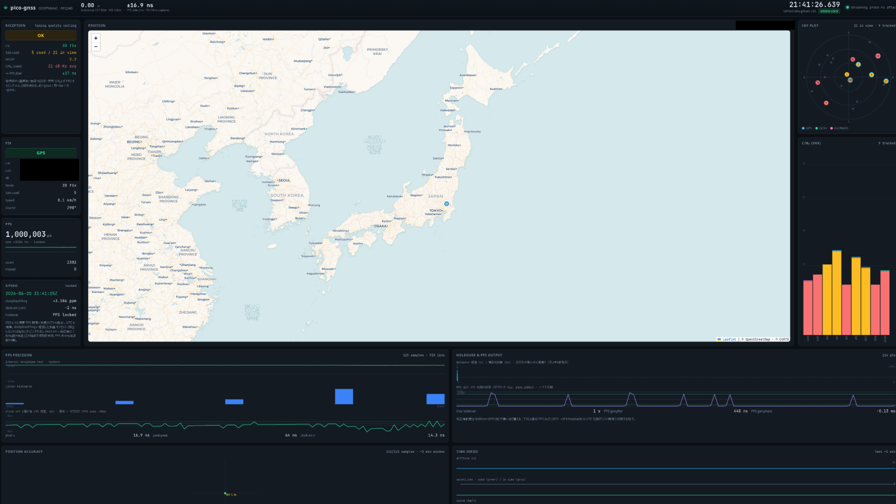

# pico-gnss

[](https://crates.io/crates/gnssdo)
[](https://docs.rs/gnssdo)
[](LICENSE)

**English** | [日本語](README.ja.md)

A GNSS **PPS-disciplined clock (GPSDO/GNSSDO)** built on the RP2040, plus a reusable
`no_std` core crate and a real-time web dashboard.

The 1 Hz PPS edge from a GNSS receiver marks the UTC second boundary. This project
captures that edge with nanosecond resolution, estimates the local crystal's
frequency error, and keeps disciplined UTC — including **holdover** while the PPS
signal is lost.


*The hardware: a Raspberry Pi Pico (RP2040) on a breakout, the Akizuki [AE-GNSS-EXTANT](https://akizukidenshi.com/catalog/g/g113849/)
(Taiyo Yuden GYSFFMANC, MediaTek MT3333) GNSS module on the ribbon cable, and oscilloscope
probes on the disciplined GP3 1PPS output and the GPS PPS for the phase measurements.*



*Real-time web dashboard (`webapp/`): GPSDO/GNSSDO-disciplined UTC, PPS jitter, frequency
discipline & holdover, sky plot / C/N₀, and the position fix. (Location masked for
privacy — the dashboard has a built-in privacy mode that hides coordinates, the map
marker and the NMEA lat/lon.)*

## Workspace layout

| Path | What |
|---|---|
| [`gnssdo/`](gnssdo/) | **Discipline core** ([crate `gnssdo`](gnssdo/README.md)). `no_std`, HAL-agnostic, integer-only, **zero-dependency**. Frequency (ppb) estimation, holdover, PPS edge tracking, output phase-lock servo (PLL). Consumes timestamps + a UTC epoch. Host-testable. |
| [`rp-pps/`](rp-pps/) | **RP2040/RP2350 PIO + receiver I/O** (crate `rp-pps`). Hardware PPS edge-capture & steerable 1PPS output, NMEA framing/parsing, PPS↔UTC-second pairing — produces the timestamps + epoch `gnssdo` consumes. HAL-agnostic core (host-testable) + embassy-rp / rp2040-hal backends. |
| [`pico-gnss/`](pico-gnss/) | RP2040 firmware (embassy-rp). PIO hardware PPS capture, clock discipline, disciplined PPS output. Embedded-only; wires `gnssdo` + `rp-pps`. |
| [`webapp/`](webapp/) | Real-time dashboard (React 19 + Vite + TypeScript), fed from the firmware's defmt/RTT output via a zero-dependency Node bridge. |
| [`docs/report/`](docs/report/) | On-hardware evaluation logs and figures. |
| [`NOTES.md`](NOTES.md) | Design decisions and hard-won gotchas. |

## Quick start

```sh
# Core library — runs on the host, no hardware needed:
cargo test -p gnssdo

# Firmware — needs a probe-rs-compatible probe + RP2040:
cd pico-gnss && cargo run --release       # builds, flashes, streams defmt logs
```

The workspace's `default-members` is `gnssdo`, so a bare `cargo build`/`cargo test`
from the root only touches the host-safe core. The firmware is embedded-only and is
built from within `pico-gnss/` (where its `.cargo/config.toml` selects the
`thumbv6m-none-eabi` target and the probe-rs runner).

## Hardware

- **MCU**: RP2040 (Raspberry Pi Pico, Seeed XIAO RP2040, …).
- **GNSS module** with NMEA + 1PPS output, e.g. Akizuki [`AE-GNSS-EXTANT`](https://akizukidenshi.com/catalog/g/g113849/) /
  GYSFFMANC (MediaTek MT3333), 9600 baud.
- **Wiring**: UART0 RX = GP1 (module TX), UART0 TX = GP0 (module RX), PPS = GP2.
  Common ground is required.

## Results (RP2040 @ 125 MHz)


Generated from a real on-device log (~227 s)
with `uv run webapp/plot_report.py`:

- **A** — the GPSDO/GNSSDO learns the crystal drift (~+2.5 ppm) at boot and then holds it at the
  ppb level, which is what enables holdover.
- **B** — time-correction residual σ ≈ tens of ns, **inside the receiver's ±10 ns 1PPS spec**.
- **C** — PPS jitter fits within a few 16 ns capture-quantization steps (PIO hardware capture,
  ~10–16 ns; vs ~9 µs for a software GPIO-interrupt approach).
- **D** — the disciplined PPS output tracks the GPS second to **σ ~35–50 ns in short,
  good-reception windows**, but the low-frequency variation (~150 ns over minutes,
  σ ~200–250 ns beyond ~10 min) is **hardware-limited, not firmware-fixable** — its source
  isn't separable without an external reference, and the data leans the crystal/oscillator
  (temperature-correlated) rather than the receiver (only a small ~13–18 ns floor is
  receiver-limited). The absolute output-vs-GPS offset is centered to **≤100 ns and
  reproducible across reboots** (Smith-predictor servo + loopback self-calibration; the old
  software servo was ±1.4 ms). See [`docs/report/precision-ladder/README.md`](docs/report/precision-ladder/README.md) for the limits.

Before/after — phase *measurement* precision (Instant ±ms → PIO 16 ns) and the resulting
output phase:


Independently cross-checked on an oscilloscope against the GPS reference (GPS edge at screen
center = 0; the disciplined output leads it by a small, steerable offset):


The whole pull-in from boot, one frame per PPS: the output PPS converging onto the GPS edge
(top, auto-zooming scope) alongside the firmware's internal state — offset/hwphase, time
error, crystal ppb, and temperature with its feed-forward contribution:


See [`docs/report/precision-ladder/README.md`](docs/report/precision-ladder/README.md) for the full methodology and figures (Japanese).
