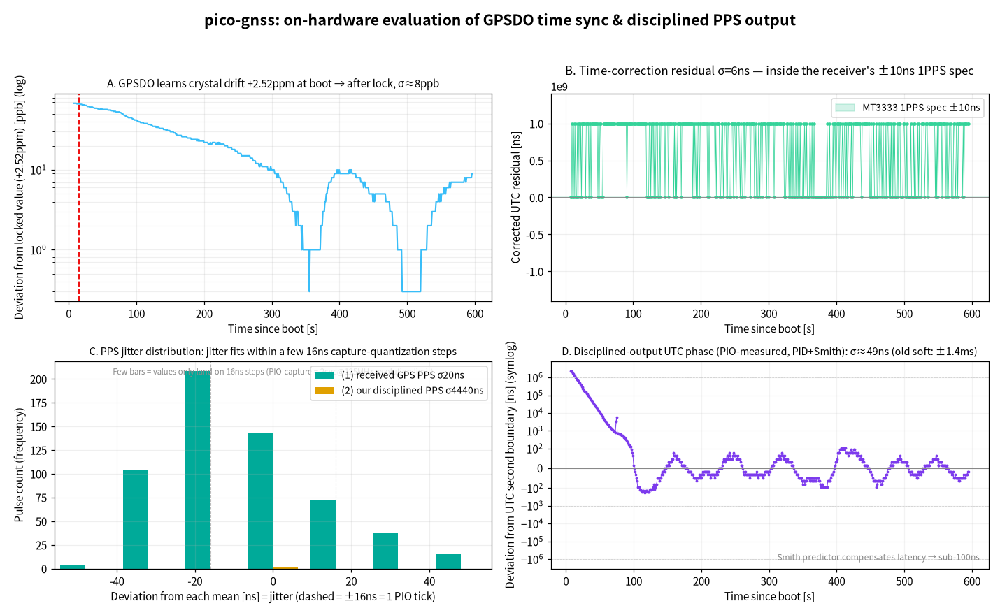
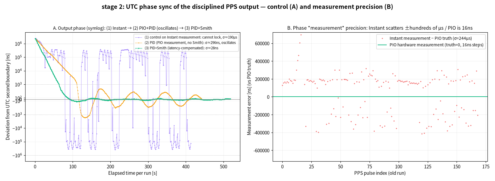

# pico-gnss-rs

[](https://crates.io/crates/gnssdo)
[](https://docs.rs/gnssdo)
[](LICENSE)

**English** | [日本語](README.ja.md)

A GNSS **PPS-disciplined clock (GPSDO/GNSSDO)** built on the RP2040, plus a reusable
`no_std` core crate and a real-time web dashboard.

The 1 Hz PPS edge from a GNSS receiver marks the UTC second boundary. This project
captures that edge with nanosecond resolution, estimates the local crystal's
frequency error, and keeps disciplined UTC — including **holdover** while the PPS
signal is lost.

## Workspace layout

| Path | What |
|---|---|
| [`gnssdo/`](gnssdo/) | **Core library** ([crate `gnssdo`](gnssdo/README.md)). `no_std`, HAL-agnostic, integer-only, zero-dependency. Frequency (ppb) estimation, holdover, PPS tracking, NMEA/PPS time sync. Host-testable. |
| [`pico-gnss/`](pico-gnss/) | RP2040 firmware (embassy-rp). PIO hardware PPS capture, clock discipline, disciplined PPS output. Embedded-only; uses `gnssdo`. |
| [`webapp/`](webapp/) | Real-time dashboard (React 19 + Vite + TypeScript), fed from the firmware's defmt/RTT output via a zero-dependency Node bridge. |
| [`report/`](report/) | On-hardware evaluation logs and figures. |
| [`NOTES.md`](NOTES.md) | Design decisions and hard-won gotchas. |

## Quick start

```sh
# Core library — runs on the host, no hardware needed:
cargo test -p gnssdo

# Firmware — needs a probe-rs-compatible probe + RP2040 and the embedded target:
rustup target add thumbv6m-none-eabi
cd pico-gnss && cargo run --release       # builds, flashes, streams defmt logs
```

The workspace's `default-members` is `gnssdo`, so a bare `cargo build`/`cargo test`
from the root only touches the host-safe core. The firmware is embedded-only and is
built from within `pico-gnss/` (where its `.cargo/config.toml` selects the
`thumbv6m-none-eabi` target and the probe-rs runner).

## Hardware

- **MCU**: RP2040 (Raspberry Pi Pico, Seeed XIAO RP2040, …).
- **GNSS module** with NMEA + 1PPS output, e.g. Akizuki `AE-GNSS-EXTANT` /
  GYSFFMANC (MediaTek MT3333), 9600 baud.
- **Wiring**: UART0 RX = GP1 (module TX), UART0 TX = GP0 (module RX), PPS = GP2.
  Common ground is required.

## Results (measured on hardware, RP2040 @ 125 MHz)



Generated from a real on-device log ([`sample-capture.log`](report/sample-capture.log), ~227 s)
with `uv run webapp/plot_report.py`:

- **A** — the GPSDO learns the crystal drift (~+2.5 ppm) at boot and then holds it at the
  ppb level, which is what enables holdover.
- **B** — time-correction residual σ ≈ tens of ns, **inside the receiver's ±10 ns 1PPS spec**.
- **C** — PPS jitter fits within a few 16 ns capture-quantization steps (PIO hardware capture,
  ~10–16 ns; vs ~9 µs for a software GPIO-interrupt approach).
- **D** — the disciplined PPS output is phase-locked to the UTC second to **σ ~35–48 ns**
  (Smith-predictor servo; the old software servo was ±1.4 ms).

Before/after — phase *measurement* precision (Instant ±ms → PIO 16 ns) and the resulting
output phase:



See [`report/REPORT.md`](report/REPORT.md) for the full methodology and figures (Japanese).
