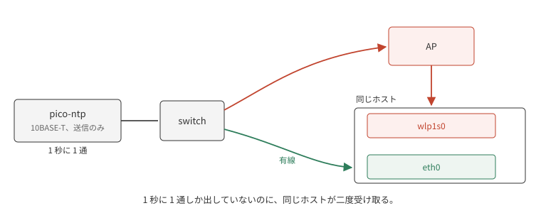
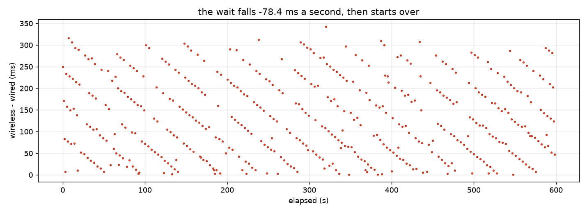
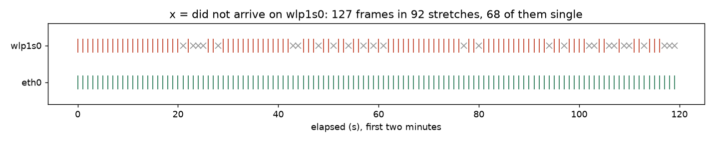

# 10BASE-T に流した NTP を受ける

`pico-ntp` は GPSDO が保持している時刻を NTP のパケットに載せ、1 秒に 1 通ずつ 10BASE-T へ流す。
物理層は GPIO 2 本と抵抗 3 本なので送信しかできず、client の問い合わせには答えられない。
返事を必要としない broadcast (RFC 5905 の mode 5) だけが、この配線で成立するやりとりである。

受け側は同じ LAN に置いた PC で、UDP を待ち受け、パケットに載っている送信時刻とカーネルが打刻した受信時刻を比べる。
受信時刻は `SO_TIMESTAMPNS` でカーネルから取る。
測りたい揺れは後で見るとおり 200 µs を切るので、userspace で時刻を読むとスケジューリングの遅れに埋もれかねない。

以下の計測は 600 秒ぶんの記録で、この時点の firmware は送信時刻として秒境界そのものを書いていた。
それが実際の送出より早いことは最後の節で測って直す。

## eth0 が受けた 598 通

10 分のあいだに、どちらかの経路に届いた秒が 598 個あった。
どのパケットも `mode` が broadcast、`stratum` が 1、`refid` が `GPS`、`root dispersion` が 1.007 ms で、記録した 1069 行すべてで一致している。
この 598 通は有線側で受けたもので、同じ 1 通が無線からも届いていることと、その分け方は次節で扱う。

有線で受けた 598 通について、パケットの送信時刻から受信時刻を引くと、平均 **−3816.5 µs**、標準偏差 **177.4 µs** だった。

この平均は 4 つの合計で、ここでは分かれない。
送信時刻の申告そのものの誤り、送出から線に出るまでの遅れ、線からカーネルの打刻までの経路、そして受信ホストの時計の誤差である。
broadcast は受信側から経路を測れないので、この記録だけでは切り分けられない。
最後の 2 つの節で、前二つをオシロで、後ろ二つを外部の基準で追う。

標準偏差のほうは分ける必要がない。
動かない部分は揺れないので、177 µs はそのまま両端と経路の揺れである。

## どちらのインタフェースで受けたか

測り始めてすぐ、1 秒に 2 通届いていることに気付いた。
firmware の `NTPTX` ログは 1 秒に 1 通しか出していない。

このホストは有線と無線の両方で同じ LAN に居る。
broadcast は LAN 全体に配られるので、switch から直接来る分と、AP を経由して無線で来る分の二つが、同じホストに入る。

どちらから来たのかはカーネルに聞く。
`IP_PKTINFO` を有効にすると、パケットごとに ancillary data で受信インタフェースの番号が返る。
これを付けずに全部を混ぜると、平均 −62.2 ms、標準偏差 88.7 ms という、どちらの経路のものでもない数字が出る。

無線側は 471 通で、平均 −136.3 ms、標準偏差 89.7 ms だった。

598 という数がどこから来たかは、受信側だけでは決められない。
両方が落とした秒は受信ログに現れないからである。
そこで送信側の記録と突き合わせた。
受信ログの最初の 143 秒については `NTPTX` の記録が残っていて、通し番号に飛びがなく、eth0 はその 143 通をすべて受けている。
残りの 76% については送信側の記録がないので、eth0 が落としていないことは確かめていない。
受信ログの秒には 2 秒の切れ目が 1 か所あり、その位置は `NTPTX` の記録が終わった次の秒にあたる。
記録を止めたのは `probe-rs run` を終了させたときで、両経路が同時に落としたのか、送信が止まったのかは決めていない。

## 無線は有線より 120 ms 遅れて届く

二つの到着は同じ 1 通である。
送信時刻が同じなので、二つの受信時刻を引き算すると、server の時計もホストの時計も同じ値として消える。
残るのは経路の差だけになる。
前節の −3816 µs が誰のものか決まらないままでも、この差は決まる。

無線は有線に対して、中央値 **119.8 ms**、平均 132.5 ms、標準偏差 89.7 ms 遅れて届いた (n=471)。
最小は 1.0 ms、p99 は 308.1 ms である。

## AP が broadcast を溜める周期

無線側に省電力の端末が居るあいだ、AP は broadcast をすぐには流さない。
溜めておいて、DTIM (delivery traffic indication map) を立てたビーコンでまとめて放出する。
何個に 1 個を DTIM にするかは AP の設定である。

送信が 1 秒ごと、放出が周期 T ごとなら、次の放出までの待ちは毎秒 `1000 mod T` ずつ減り、T で折り返す。

到着差はそのとおりの形をしていた。

T は階差から出さずに、600 秒ぶんの位相のまとまりで決めた。
待ちを `w(t) = (φ − 1000·t) mod T` と置くと、T が正しいときだけ `(w + 1000·t) mod T` が一点に集まる。
その集まり具合を最大にする T は **307.1995 ms** で、含意する勾配は 78.401 ms/s である。
階差の中央値から出すと 1 サンプルあたり 0.05 ms の誤差が 600 秒で 100 ms 積もり、位相が追えなくなる。

ビーコンの間隔は IEEE 802.11 の time unit (1 TU = 1024 µs) で数え、多くの AP の出荷時設定は 100 TU = 102.4 ms である。
307.1995 ms はその **3.0000 個ぶん**で、ちょうど 3 個との差は 0.5 µs しかない。
この AP が 100 TU なら、3 個に 1 個を DTIM にしている設定にあたる。
ビーコン間隔そのものは測っていないので、これは 100 TU を仮定したうえでの一致である。
省電力の端末が居たかどうかも見ていない。

周期を越えて届いたものが 5 通あり、越えた量は 1 から 35 ms だった。
1 周期ぶん遅れたのではなく数十 ms の超過なので、放出の直前に積まれて、その回に載り切らなかった通だと読める。

## 待たされた通ほど落ちる

eth0 が受けた 598 通のうち、wlp1s0 に届いたのは 471 通で、**127 通 (21.2%)** が届かなかった。
wlp1s0 が受けた秒は eth0 が受けた秒の部分集合なので、この 127 通は確かに線に出ている。

欠落は 92 回に分かれていて、そのうち 68 回は 1 通だけである。
最長でも 4 通しか続かない。

落ちた通が何 ms 待たされるはずだったかは、上でフィットした周期と位相から出せる。
届いた通で確かめると、この再構成は 89% が 10 ms 以内、72% が 5 ms 以内に当たる。
それを 598 通すべてに当てはめると、待ちと欠落がはっきり対応した。

いちばん短い区間 (0–38 ms) では 8.3%、いちばん長い区間 (269–307 ms) では 37.7% が届かない。
1 区間あたり 72 から 77 通なので、20% 前後の欠落率に対する標準誤差は 5 ポイントほどになる。
両端の差はその 6 倍ある。

## broadcast client には引く相手がいない

unicast の client は要求と応答の 4 つのタイムスタンプから経路の遅延を測り、その半分を引いて時刻を決める。
broadcast にはその往復がない。
RFC 5905 §3 は、broadcast client がまず client mode で数往復して伝搬遅延を較正し、そのあとで受信だけに移ることを想定している。
この配線では往復そのものが張れないので、その較正ができない。

つまり二つの経路の差は、そのまま client の時刻の差になる。
有線なら動かない部分が 3.8 ms、揺れが 0.18 ms。
無線なら動かない部分が 136 ms、揺れが 90 ms である。
無線の 90 ms は較正で引ける量ではない。
待ちはビーコンとの位相で毎秒変わり、その位相は client にも server にも見えないからである。

## 申告した送信時刻を、線に出た時刻に合わせる

ここまでの `−3816 µs` には、firmware が自分で作った分が入っている。
パケットは「秒境界に送った」と書いていたが、実際にはそれより後に出ていた。

firmware から見える範囲では、申告した時刻から送信を渡すまでが中央値 **118.4 µs** (n=389、102.4–133.4、標準偏差 5.4 µs) である。
その先、渡してから線に第 1 ビットが出るまでは、firmware のどんな読みにも現れない。
最後の読みの後に始まり、チップの外で終わるからである。

そこでオシロを当てた。
CH1 を GPS-R の 1PPS (この基板はアクティブ Low なので秒境界は立ち下がり)、CH2 を Pico の GP17 (TX+) に繋ぎ、秒境界でトリガして両方の波形を吸い出し、自分でエッジを求める。
掴んだのがフレームであってリンクパルスでないことは、活動の長さで確かめた。
60 shot すべてで 81.8 µs 続いていて、102 byte を 10 Mbit/s で送る計算値 81.6 µs と合う。
リンクパルスなら 100 ns しかない。

**秒境界から第 1 ビットまで 236.19 µs、標準偏差 6.87 µs (n=60)。**
firmware が見ていた 118.4 µs を引くと、渡してから線に出るまでが 117.8 µs 残る。

直し方は 2 つある。
その分だけ早く撃つか、申告する時刻を実際の送出に合わせるかである。
早く撃つほうを先に試して、悪化した。
残差は 118.4 µs から 0 へ行かずに 73.5 µs までしか下がらず、標準偏差は 5.4 µs から 26.5 µs へ広がり、13% の秒は眠る時間が尽きて即座に渡していた。
最終接近は 16 ms のリンクパルス間隔のどこに着地するか決まっていないので、そこから 118 µs 引くと残り時間ごと無くなる回が出る。

申告する時刻に足すほうは送出のタイミングに触らない。
実際、こちらに変えると残差は中央値 **+1.2 µs** (n=401、−12.9 から +15.1)、つまり ±15 µs で申告と実際が一致した。
広がりも増えていない。
`precision` はこの範囲を覆う **−15** (30.5 µs) にした。
RFC 5905 の precision は system clock のものと定義されていて、送信時刻の打刻誤差は厳密にはそれでも root dispersion でもないが、プロトコルに置き場がない。
下限としてここに入れておけば、client は受け取っているタイムスタンプについて本当のことを知らされる。

## 受信ホストの時計は、この精度では基準にならない

補正を入れた前後で client が読む値は **−3816.5 µs から +677.0 µs** へ動いた (n=130)。
入れた補正は 236 µs なので、4.5 ms は別の原因である。
しかもその数分後にもう一度取ると **+570.5 µs** (n=66) で、まだ動いている。

ホストの時計を疑って、公開サーバと往復して測った。
3 台が食い違い、しかも往復が長いサーバほど大きく外れた。

| server | 往復 (最小) | 推定した offset |
|---|---:|---:|
| time.cloudflare.com | 12.4 ms | −2098 µs |
| ntp.nict.jp | 28.2 ms | +2030 µs |
| time.google.com | 66.9 ms | −7787 µs |

3 台の開きは 10 ms ある。
往復の非対称は offset の推定にその半分だけ乗るので、この並びは経路の非対称そのものである。
**公開 NTP サーバでは、このホストの時計を ms 以下に決められない。**

server 側は決まっている。
オシロが GPS を基準にして、申告した送信時刻が実際の送出と 7 µs で一致することを示している。
決まっていないのは受信側で、client が読む ms 級の差は、ホストの時計と経路のものである。

[SWD 経由の unicast](../ntp-swd-unicast/README.md) が +4.00 ms、こちらが当初 −3816 µs と符号から食い違っていた件も、これで説明がつく。
どちらも同じホストの時計を基準にしていて、測った時刻が違う。

## 残っていること

受信ホストに、公開サーバより近い基準を置く。
LAN 内に GPS 同期のもう 1 台を置くか、この GPSDO 自身を基準にして循環しない形に組むかである。
それができるまで、client が読む ms 級の差は帰属できない。

有線側の分布は一つの山ではない。
図の谷から選んだ −3900 µs で切ると、上が 454 通で平均 −3726 µs、下が 144 通 (24%) で平均 −4103 µs、隔たりは 378 µs になる。
送信側ではない。
firmware の送出の遅れは単峰 (標準偏差 5.4 µs) で、どちらの群に落ちたかとの相関は −0.011、`dma_us` の中央値も 114 対 115 で差がない。
受信経路のどこで分かれているのかは追っていない。

AP のビーコン間隔と DTIM の設定、そのとき省電力の端末が居たかどうかは、monitor mode でビーコンの TIM を読めば決まる。

送信専用のまま client に経路を測らせる道が RFC 9769 §4 にある。
interleaved broadcast は、前回のパケットの実測送信時刻を次のパケットに載せる。
client 側の対応が要るので試していない。
