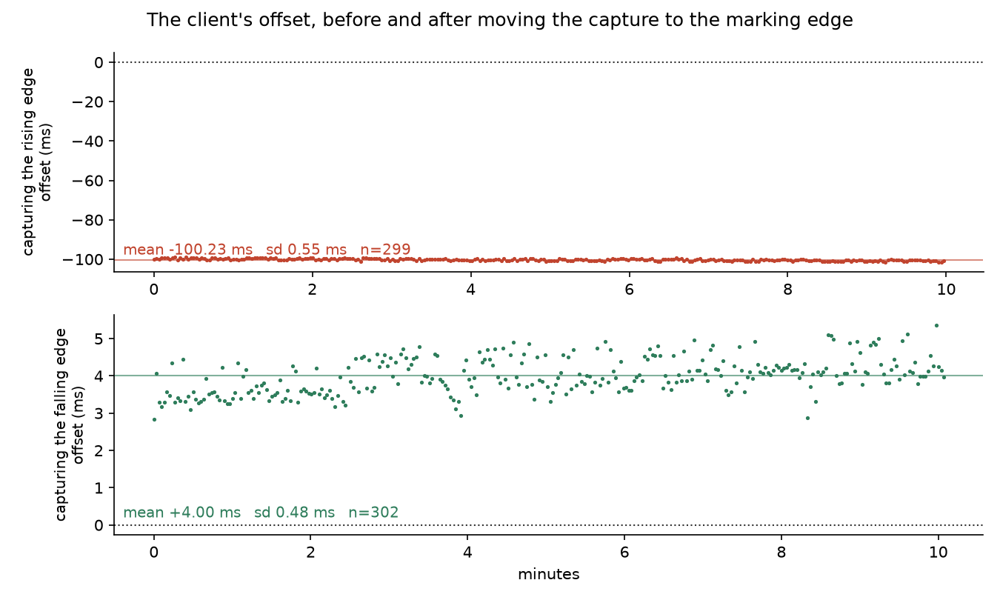
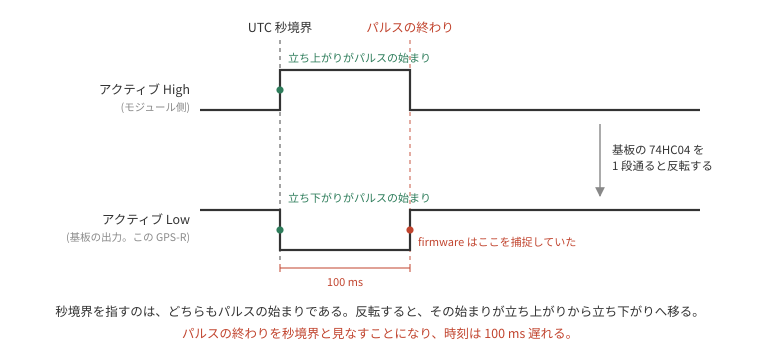
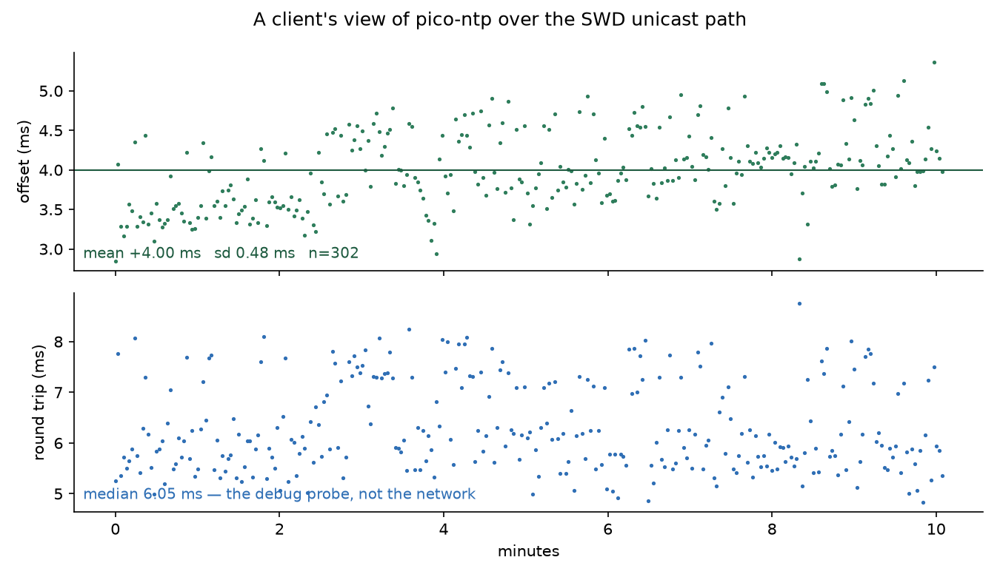
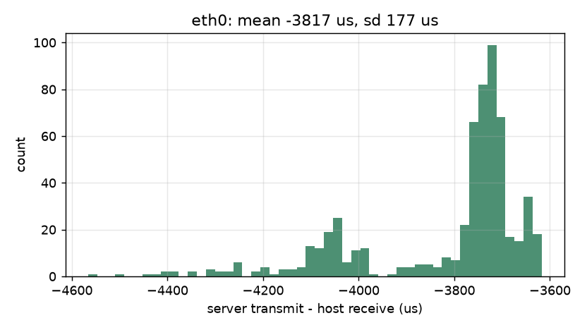
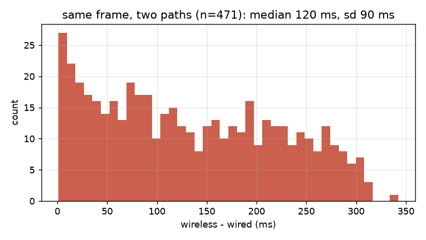
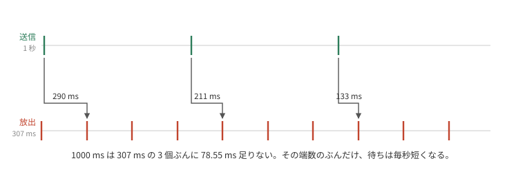
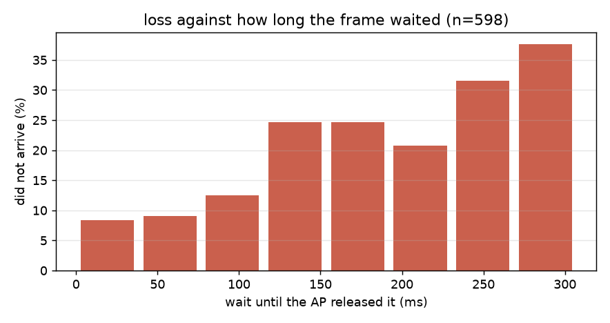

# GPSDO の時刻を NTP で配る

この GPSDO は 10BASE-T で時刻を配る Stratum-1 の NTP サーバになっている。
物理層は GPIO 2 本と抵抗 3 本で、送信しかできない。

そのせいで確かめたいことが確かめられない。
NTP のパケットは先頭バイトに 3 bit の mode を持っていて、そのやりとりでの役割を表す (RFC 5905 §7.3)。
本来の問い合わせは、client が要求を出す **mode 3** と、server が答える **mode 4** の 1 往復である。
このとき client の手元には 4 つの時刻が揃う。自分が送った時刻、server が受けた時刻、server が返した時刻、自分が受け取った時刻。
往復にかかった時間と、時計そのもののずれを、この 4 つが分離してくれる。

送信しかできない配線が出せるのは **mode 5**、一方向の broadcast だけである。
載っている時刻は server の送信時刻ひとつなので、client は経路の遅延を測れず仮定するしかない。

そこで二通りに確かめた。
受信経路を SWD から借りて本物の unicast を 1 往復させるのと、broadcast を実際の 10BASE-T でホストに受けさせるのと。
前半が最初の道で、そこで時計が 100 ms ずれていることが分かった。

## 送信しかできない配線で往復を張る

受信経路は SWD にある。
debug probe は core を止めずに target の RAM を読み書きできるので、要求だけをそこから流し込めば、残りは本物の NTP になる。


firmware 側は `swd-rx` feature で入る RAM のメールボックスひとつ。
ホスト側の `tools/swd-ntp-bridge` が probe を握ったまま UDP を待ち受け、要求を書き、応答を読んで返す。
client から見れば普通の NTP サーバである。

probe を握り続けるのが要点で、`probe-rs read` / `write` を都度呼ぶと 1 回あたり 1 秒近く attach に持っていかれる。
それは client が測る往復時間にそのまま入るので、測りたい ms が埋まる。
セッションを保てばメールボックスの往復は数 ms で済む。

RTT のほうが本筋だが、`rtt-target` の defmt 統合はまだ defmt 0.3 で、この firmware は 1.0 である。
defmt を 2 つ入れると global logger が噛み合わない。
RAM なら target 側に crate を足さずに済む。

## 100 ms 遅れていた

つないで最初に取れた数字がこれである。



上段が当初の状態で、offset は **平均 −100.23 ms、標準偏差 0.55 ms** (n=299)。
揺れが 0.55 ms しかないのに 100 ms ずれている。
往復時間が 4.6 ms から 8.7 ms まで動いても offset は動かないので、経路の非対称でもない。
holdover は 1.17 s、周波数オフセットは 578 ppb なので、外挿による誤差は 1 µs に満たない。

ホスト側の時計でもない。
後の節で見るとおり、公開 NTP サーバではこのホストの時計を ms 以下に決められないのだが、その不確かさは数 ms である。
100 ms には二桁足りない。

## 秒未満を決めているのは捕捉したエッジだけである

コード側から 100 ms が入る余地は、構造を追えば消える。

エポックを立てるのは `capture_ns` と `unix_ns` の素の代入で、サーボもクランプも挟まらない。
`unix_ns` は NMEA の**整数秒**から来る。
NMEA の時刻フィールドには小数部があるが、取得したログ 378 本すべてが `.000` だった。
`gnssdo` に 100 ms の定数はあるものの (`CORR_CLAMP_NS`)、これは出力 PPS の位相補正に対する 1 エッジあたりの制限で、時刻の読み出しには掛からない。
PPS とセンテンスの対応付けを間違えれば時計は動くが、その粒度は 1 秒である。

残るのは捕捉したエッジそのものだけになる。
100 ms ずれているなら、捕捉している瞬間が真の秒境界から 100 ms 離れている。

## パルスは low 側だった

ピンを直接見る。
`swd-ntp-bridge --duty` が probe から GPIO 入力レジスタを繰り返し読み、high の割合と最長の連続区間を出す。

```text
GP2: 89.9% high over 10.0 s (76592 samples, 0.131 ms/sample)
  longest run  high 926.1 ms   low 103.8 ms
```

1PPS は 1 秒に 1 回の短いパルスで、その短いほうが秒をマークする。
ここでは短いのは **low の 104 ms** である。
そして `rp-pps` の PIO は**立ち上がり**を捕捉している。
立ち上がりはパルスの終わりなので、捕捉点はマークより 104 ms 遅い。

## 幅を変えると誤差が追随する

これだけでは状況証拠である。
決め手は、パルス幅を変えて誤差が同じだけ動くかどうかになる。
`PMTK285` は 1PPS の幅を ms で設定できるので、200 ms を要求して測り直した。

| `PMTK285` の幅 | パッドの low 区間 | 立ち上がり捕捉時の offset |
|---|---:|---:|
| 100 ms | 104 ms | **−100.23 ms** |
| 200 ms | 201 ms | **−196.46 ms** |

low 区間が要求どおりに伸び、誤差が同じだけ伸びた。
エッジを取り違えている場合にしか起こらない対応である。

途中で一度、誤った結論を出しかけた。
反転を有効にしたまま duty を測ると 20.1% high と出て、パルスが high 側に見えたのである。
RP2040 の `INOVER` は SIO の入力読み出しにも掛かるので、反転後の波形を見ていた。
反転を切って測り直したら 80.0% high、low 区間 201 ms だった。
**計測器そのものが被検体を変えていないか**は、毎回疑うほうがよい。

## 直し方

`INOVER` でピンの入力を反転すれば、既存の立ち上がり捕捉が物理的な立ち下がりを捕まえる。
PIO プログラムを増やすより軽く、捕捉プログラムに手を入れずに済む。

反転の設定は、ピンを PIO へ割り当てた**後**でなければならない。
割り当てが同じ制御レジスタを書き直すので、先に設定すると黙って消える。
ログは「反転した」と言っているのに offset が −98 ms のままで、これも計測して初めて気付いた。

直した後が図の下段で、offset は **平均 +4.00 ms、標準偏差 0.48 ms** (n=302) になった。

## 測って決めるか、書いて決めるか

最初は起動のたびに決めていた。
1.5 秒ぶんサンプリングして短いほうの excursion を探し、それがマークだとして捕捉エッジを選ぶ。
受信機を替えても基板を替えても測り直せば追随する、という理屈である。

これは答えられないときに黙って間違える。
受信機が 1PPS を出すのは fix を得てからで、データシートは `3D_Fix 時のみ出力` と書いている。
起動直後のピンは止まっていることが多く、止まったピンにも多数派の level はある。
返ってくるのは、測定の顔をした推測になる。
外したときの症状はこの 100 ms の遅れなので、位相を見ている限り気付けない。

極性は受信機と基板で決まる事実で、変わるとすれば配線を変えたときである。
分かってしまえば定数のほうが確かで、起動も 1.5 秒速い。
サンプリングのほうは未知の受信機や基板でのブリングアップ用に残してあり、ログに出た答えを定数へ書き戻して使う。

```text
PPS on GP2: configured active low
```

## どこで反転しているのか

このピンで秒をマークしているのが立ち下がりであることは、上の測定で決まっている。
反転させているのは、受信機モジュールではなく、それを載せている基板だった。

秋月の AE-GNSS-EXTANT の回路図では、モジュールの 1PPS が 74HC04 の 1 ゲートを通ってピンヘッダへ出る。
UART の TX と RX は 2 ゲートずつ通るので極性が戻り、1PPS だけが 1 段なので反転したまま出てくる。
基板の取扱説明書もその結果を書いていて、「1PPS 出力 : C-MOS ロジック (3.3V) レベル, パルス幅 :100mS (アクティブ Low)」とある。



追いにくかったのは、資料が縫い目で割れていたからである。
太陽誘電の GYSFFMANC データシートが書いているのはモジュール自身の端子で、`GIO_7 (1PPS) CMOS Digital I/O, 3D_Fix 時のみ出力(パルス幅：100msec)` とあるだけで極性には触れていない。
同じ表の `RESET` には「アクティブ LOW」と書いてあるので、この文書が極性を書かない文書なのではなく、1PPS についてだけ書いていない。
MediaTek のソフトウェア仕様はパルスを rising edge 基準で説明する。
`PMTK255` の「NMEA の送出は PPS の rising edge から 465〜485 ms 後」もその一つで、どちらもモジュール側の話なので、基板を 1 段通った先とは食い違う。

同じところで止まった人は他にもいる。
Linux の `pps-gpio` には `dtparam=assert_falling_edge=true` があり、この基板で Stratum-1 を建てた記事は、これを書かないと「100ms ズレて参照リストから外れたサーバー "x"印になってしまいます」と警告している。

## client から見た姿



往復は中央値 6.05 ms で、これは probe の経路である。
Ethernet は片道も通っていない。
server の処理は 70 から 95 µs、`origin timestamp` の echo は全交換で一致し、`stratum` は 1、`root dispersion` は 1.007 ms だった。

残っている +4.00 ms の中身は分けられていない。
ブリッジは firmware が 2 ms 周期でメールボックスを見るので、`T2` が最大 2 ms 遅れて記録され、offset は最大 +1 ms 偏る。
残りは経路の非対称、ホスト時計の瞬時誤差、そして本当の残差の混合である。

## 10BASE-T で受ける

ここから先は SWD を外し、broadcast を実際の線でホストに受けさせた記録である。
受け側は同じ LAN に置いた PC で、UDP を待ち受け、パケットに載っている送信時刻とカーネルが打刻した受信時刻を比べる。
受信時刻は `SO_TIMESTAMPNS` でカーネルから取る。
測りたい揺れは後で見るとおり 200 µs を切るので、userspace で時刻を読むとスケジューリングの遅れに埋もれかねない。

以下は 600 秒ぶんの記録で、この時点の firmware は送信時刻として秒境界そのものを書いていた。
それが実際の送出より早いことは後の節で測って直す。

10 分のあいだに、どちらかの経路に届いた秒が 598 個あった。
どのパケットも `mode` が broadcast、`stratum` が 1、`refid` が `GPS`、`root dispersion` が 1.007 ms で、記録した 1069 行すべてで一致している。
この 598 パケットは有線側で受けたもので、同じ 1 つが無線からも届いていることと、その分け方は次節で扱う。

有線で受けた 598 パケットについて、送信時刻から受信時刻を引くと、平均 **−3816.5 µs**、標準偏差 **177.4 µs** だった。



この平均は 4 つの合計で、ここでは分かれない。
送信時刻の申告そのものの誤り、送出から線に出るまでの遅れ、線からカーネルの打刻までの経路、そして受信ホストの時計の誤差である。
broadcast は受信側から経路を測れないので、この記録だけでは切り分けられない。
後ろの 2 つの節で、前二つをオシロで、後ろ二つを外部の基準で追う。

標準偏差のほうは分ける必要がない。
動かない部分は揺れないので、177 µs はそのまま両端と経路の揺れである。

## どちらのインタフェースで受けたか

測り始めてすぐ、1 秒に 2 つ届いていることに気付いた。
firmware の `NTPTX` ログは 1 秒に 1 つしか出していない。

このホストは有線と無線の両方で同じ LAN に居る。
broadcast は LAN 全体に配られるので、switch から直接来る分と、AP を経由して無線で来る分の二つが、同じホストに入る。


どちらから来たのかはカーネルに聞く。
`IP_PKTINFO` を有効にすると、パケットごとに ancillary data で受信インタフェースの番号が返る。
これを付けずに全部を混ぜると、平均 −62.2 ms、標準偏差 88.7 ms という、どちらの経路のものでもない数字が出る。

無線側は 471 パケットで、平均 −136.3 ms、標準偏差 89.7 ms だった。

598 という数がどこから来たかは、受信側だけでは決められない。
両方が落とした秒は受信ログに現れないからである。
そこで送信側の記録と突き合わせた。
受信ログの最初の 143 秒については `NTPTX` の記録が残っていて、送信秒の並びに飛びがなく、eth0 はその 143 個をすべて受けている。
残りの 76% については送信側の記録がないので、eth0 が落としていないことは確かめていない。
受信ログの秒には 2 秒の切れ目が 1 か所あり、その位置は `NTPTX` の記録が終わった次の秒にあたる。
記録を止めたのは `probe-rs run` を終了させたときで、両経路が同時に落としたのか、送信が止まったのかは決めていない。

## 無線は有線より 120 ms 遅れて届く

二つの到着は同じ 1 つである。
送信時刻が同じなので、二つの受信時刻を引き算すると、server の時計もホストの時計も同じ値として消える。
残るのは経路の差だけになる。
前節の −3816 µs が誰のものか決まらないままでも、この差は決まる。

無線は有線に対して、中央値 **119.8 ms**、平均 132.5 ms、標準偏差 89.7 ms 遅れて届いた (n=471)。
最小は 1.0 ms、p99 は 308.1 ms である。



## AP が broadcast を溜める周期

無線側に省電力の端末が居るあいだ、AP は broadcast をすぐには流さない。
溜めておいて、DTIM (delivery traffic indication map) を立てたビーコンでまとめて放出する。
何個に 1 個を DTIM にするかは AP の設定である。

送信が 1 秒ごと、放出が周期 T ごとなら、次の放出までの待ちは毎秒 `1000 mod T` ずつ減り、T で折り返す。



到着差はそのとおりの形をしていた。


T は階差から出さずに、600 秒ぶんの位相のまとまりで決めた。
待ちを `w(t) = (φ − 1000·t) mod T` と置くと、T が正しいときだけ `(w + 1000·t) mod T` が一点に集まる。
その集まり具合を最大にする T は **307.1995 ms** で、含意する勾配は 78.401 ms/s である。
階差の中央値から出すと 1 サンプルあたり 0.05 ms の誤差が 600 秒で 100 ms 積もり、位相が追えなくなる。

ビーコンの間隔は IEEE 802.11 の time unit (1 TU = 1024 µs) で数え、多くの AP の出荷時設定は 100 TU = 102.4 ms である。
307.1995 ms はその **3.0000 個ぶん**で、ちょうど 3 個との差は 0.5 µs しかない。
この AP が 100 TU なら、3 個に 1 個を DTIM にしている設定にあたる。
ビーコン間隔そのものは測っていないので、これは 100 TU を仮定したうえでの一致である。
省電力の端末が居たかどうかも見ていない。

周期を越えて届いたものが 5 つあり、越えた量は 1 から 35 ms だった。
1 周期ぶん遅れたのではなく数十 ms の超過なので、放出の直前に積まれて、その回に載り切らなかったものだと読める。

## 待たされたパケットほど落ちる

eth0 が受けた 598 パケットのうち、wlp1s0 に届いたのは 471 で、**127 (21.2%)** が届かなかった。
wlp1s0 が受けた秒は eth0 が受けた秒の部分集合なので、この 127 は確かに線に出ている。


欠落は 92 回に分かれていて、そのうち 68 回は 1 つだけである。
最長でも 4 つしか続かない。

落ちたパケットが何 ms 待たされるはずだったかは、上でフィットした周期と位相から出せる。
届いたパケットで確かめると、この再構成は 89% が 10 ms 以内、72% が 5 ms 以内に当たる。
それを 598 個すべてに当てはめると、待ちと欠落がはっきり対応した。



いちばん短い区間 (0–38 ms) では 8.3%、いちばん長い区間 (269–307 ms) では 37.7% が届かない。
1 区間あたり 72 から 77 個なので、20% 前後の欠落率に対する標準誤差は 5 ポイントほどになる。
両端の差はその 6 倍ある。

## broadcast client には引く相手がいない

unicast の client は要求と応答の 4 つのタイムスタンプから経路の遅延を測り、その半分を引いて時刻を決める。
broadcast にはその往復がない。
RFC 5905 §3 は、broadcast client がまず client mode で数往復して伝搬遅延を較正し、そのあとで受信だけに移ることを想定している。
この配線では往復そのものが張れないので、その較正ができない。

つまり二つの経路の差は、そのまま client の時刻の差になる。
有線なら動かない部分が 3.8 ms、揺れが 0.18 ms。
無線なら動かない部分が 136 ms、揺れが 90 ms である。
無線の 90 ms は較正で引ける量ではない。
待ちはビーコンとの位相で毎秒変わり、その位相は client にも server にも見えないからである。

## 申告した送信時刻を、線に出た時刻に合わせる

ここまでの `−3816 µs` には、firmware が自分で作った分が入っている。
パケットは「秒境界に送った」と書いていたが、実際にはそれより後に出ていた。

firmware から見える範囲では、申告した時刻から送信を渡すまでが中央値 **118.4 µs** (n=389、102.4–133.4、標準偏差 5.4 µs) である。
SWD の計測時には同じ量を 67 から 75 µs と記録している。
あちらは `swd-rx` を有効にしたビルドで、こちらは無効という違いがあるが、なぜ増えたのかは追っていない。

その先、渡してから線に第 1 ビットが出るまでは、firmware のどんな読みにも現れない。
最後の読みの後に始まり、チップの外で終わるからである。

そこでオシロを当てた。
CH1 を GPS-R の 1PPS (この基板は active low なので秒境界は立ち下がり)、CH2 を Pico の GP17 (TX+) に繋ぎ、秒境界でトリガして両方の波形を吸い出し、自分でエッジを求める。
掴んだのがフレームであってリンクパルスでないことは、活動の長さで確かめた。
60 shot すべてで 81.8 µs 続いていて、102 byte を 10 Mbit/s で送る計算値 81.6 µs と合う。
リンクパルスなら 100 ns しかない。

**秒境界から第 1 ビットまで 236.19 µs、標準偏差 6.87 µs (n=60)。**
firmware が見ていた 118.4 µs を引くと、渡してから線に出るまでが 117.8 µs 残る。

直し方は 2 つある。
その分だけ早く撃つか、申告する時刻を実際の送出に合わせるかである。
早く撃つほうを先に試して、悪化した。
残差は 118.4 µs から 0 へ行かずに 73.5 µs までしか下がらず、標準偏差は 5.4 µs から 26.5 µs へ広がり、13% の秒は眠る時間が尽きて即座に渡していた。
最終接近は 16 ms のリンクパルス間隔のどこに着地するか決まっていないので、そこから 118 µs 引くと残り時間ごと無くなる回が出る。

申告する時刻に足すほうは送出のタイミングに触らない。
実際、こちらに変えると残差は中央値 **+1.2 µs** (n=401、−12.9 から +15.1)、つまり ±15 µs で申告と実際が一致した。
広がりも増えていない。
`precision` はこの範囲を覆う **−15** (30.5 µs) にした。
それまでの −20 は 0.95 µs で、実測の 30 倍以上を申告していたことになる。
RFC 5905 の precision は system clock のものと定義されていて、送信時刻の打刻誤差は厳密にはそれでも root dispersion でもないが、プロトコルに置き場がない。
下限としてここに入れておけば、client は受け取っているタイムスタンプについて本当のことを知らされる。

## 受信ホストの時計は、この精度では基準にならない

補正を入れた前後で client が読む値は **−3816.5 µs から +677.0 µs** へ動いた (n=130)。
入れた補正は 236 µs なので、4.5 ms は別の原因である。
しかもその数分後にもう一度取ると **+570.5 µs** (n=66) で、まだ動いている。

ホストの時計を疑って、公開サーバと往復して測った。
3 台が食い違い、しかも往復が長いサーバほど大きく外れた。

| server | 往復 (最小) | 推定した offset |
|---|---:|---:|
| time.cloudflare.com | 12.4 ms | −2098 µs |
| ntp.nict.jp | 28.2 ms | +2030 µs |
| time.google.com | 66.9 ms | −7787 µs |

3 台の開きは 10 ms ある。
往復の非対称は offset の推定にその半分だけ乗るので、この並びは経路の非対称そのものである。
**公開 NTP サーバでは、このホストの時計を ms 以下に決められない。**

server 側は決まっている。
オシロが GPS を基準にして、申告した送信時刻が実際の送出と 7 µs で一致することを示している。
決まっていないのは受信側で、client が読む ms 級の差は、ホストの時計と経路のものである。

SWD 経由の unicast が +4.00 ms、broadcast が当初 −3816 µs と符号から食い違っていたのも、これで説明がつく。
どちらも同じホストの時計を基準にしていて、測った時刻が違う。

## 位相の検証では見えない

[pps-nmea-pairing](../pps-nmea-pairing/README.md) が書いた盲点の、一段下に同じものがある。
あちらは「位相が合っていても、そのエッジに貼られた秒の名前は違いうる」だった。
こちらは「秒の名前が合っていても、どのエッジを境界と呼ぶかは別」である。

GPS-R の 1PPS と GPSDO の出力をオシロで重ねれば、どちらも数十 ns で一致する。
その一致は、両方が同じエッジを基準にしているというだけで、そのエッジが秒境界かどうかを何も言わない。
外部の時計と突き合わせて初めて出てくる。

## 残っていること

受信ホストに、公開サーバより近い基準を置く。
LAN 内に GPS 同期のもう 1 台を置くか、この GPSDO 自身を基準にして循環しない形に組むかである。
それができるまで、client が読む ms 級の差は帰属できない。

SWD 経由の +4.00 ms は、ブリッジの polling 周期を 2 ms から詰めれば、そのぶんだけ切り分けられる。

有線側の分布は一つの山ではない。
図の谷から選んだ −3900 µs で切ると、上が 454 で平均 −3726 µs、下が 144 (24%) で平均 −4103 µs、隔たりは 378 µs になる。
送信側ではない。
firmware の送出の遅れは単峰 (標準偏差 5.4 µs) で、どちらの群に落ちたかとの相関は −0.011、`dma_us` の中央値も 114 対 115 で差がない。
受信経路のどこで分かれているのかは追っていない。

AP のビーコン間隔と DTIM の設定、そのとき省電力の端末が居たかどうかは、monitor mode でビーコンの TIM を読めば決まる。

モジュールのパッドをオシロで見る。
回路図から 1 段の反転は分かっているので、74HC04 の手前は high アサートのはずだが、実測はしていない。

送信専用のまま client に経路を測らせる道が RFC 9769 §4 にある。
interleaved broadcast は、前回のパケットの実測送信時刻を次のパケットに載せる。
client 側の対応が要るので試していない。
