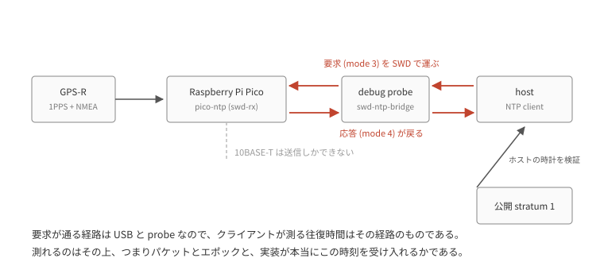

# SWD を受信経路にして NTP を確かめる

この GPSDO は 10BASE-T で時刻を配る Stratum-1 の NTP サーバになっている。
配線は抵抗 3 本で GPIO 2 本から出しているだけなので、送信しかできない。

そのせいで確かめたいことが確かめられない。
NTP の本来のやりとりは client が要求を出し server が答える mode 3 → mode 4 で、往復する両方の時刻が揃って初めて client は経路の遅延を測れる。
一方向の broadcast にはその往復がなく、client は遅延を仮定するしかない。
おまけに chrony も systemd-timesyncd も broadcast client を実装していないので、手元にある client では受け取ることすらできない。

受信経路は SWD にある。
debug probe は core を止めずに target の RAM を読み書きできるので、要求だけをそこから流し込めば、残りは本物の NTP になる。

firmware 側は `swd-rx` feature で入る RAM のメールボックスひとつ。
ホスト側の `tools/swd-ntp-bridge` が probe を握ったまま UDP を待ち受け、要求を書き、応答を読んで返す。
client から見れば普通の NTP サーバである。

probe を握り続けるのが要点で、`probe-rs read` / `write` を都度呼ぶと 1 回あたり 1 秒近く attach に持っていかれる。
それは client が測る往復時間にそのまま入るので、測りたい ms が埋まる。
セッションを保てばメールボックスの往復は数 ms で済む。

RTT のほうが本筋だが、`rtt-target` の defmt 統合はまだ defmt 0.3 で、この firmware は 1.0 である。
defmt を 2 つ入れると global logger が噛み合わない。
RAM なら target 側に crate を足さずに済む。

## client から見た姿

`uv run docs/report/ntp-swd-unicast/logs/unicast/plot_unicast.py` で描いた、2 秒間隔 10 分ぶんの交換である。

往復は中央値 7.02 ms で、これは probe の経路である。
Ethernet は片道も通っていない。

server の処理は 73 から 83 µs だった。
`origin timestamp` の echo は全交換で一致していて、client が応答を自分の要求のものだと確かめる手順は通っている。
`stratum` は 1、`root delay` は 0、`root dispersion` は 1.007 ms。

## 100 ms 遅れている

offset は **平均 −100.23 ms、標準偏差 0.55 ms** (n=299) だった。

揺れが 0.55 ms しかないのに 100 ms ずれている。
往復時間が 4.6 ms から 8.7 ms まで動いても offset はほとんど動かないので、経路の非対称でもない。
holdover は 1.17 s、周波数オフセットは 578 ppb なので、外挿による誤差は 1 µs に満たない。

ホスト側の時計を疑う余地は測って潰した。
公開 stratum 1 (`ntp.nict.jp`) と突き合わせると **平均 −0.333 ms、標準偏差 1.77 ms** (n=30)、最小 delay 14.3 ms のサンプルで −0.538 ms である。
ホストは真の UTC から 1 ms の内側にいる。

つまり **この基板の UTC は真の UTC から 100.2 ms 遅れている**。
ns で規律している系の誤差としては桁が違うので、規律ではなくエポックの置き場所の問題である。

100 ms には心当たりがある。
この受信機の 1PPS は 900 ms high / 100 ms low で、`rp-pps` の PIO が捕捉しているのは立ち上がりである。
もし秒境界が立ち下がりの側なら、捕捉点は 100 ms 遅れ、時計は 100 ms 遅れて読める。
符号も大きさも合う。

**ただしこれは仮説で、確定していない。**
確かめるには GPS-R の 1PPS をオシロで見て、どちらのエッジが秒境界かを直接読む必要がある。
firmware のログだけで決めてはいけない類の量で、この計測環境にはオシロがない。

[pps-nmea-pairing](../pps-nmea-pairing/README.md) が書いたのと同じ盲点の一段下にあたる。
あちらは「位相が合っていても、そのエッジに貼られた秒の名前は違いうる」だった。
こちらは「秒の名前が合っていても、どのエッジを境界と呼ぶかは別」である。
どちらも 2 つの立ち上がりを重ねる位相比較では見えない。

## 送信タイミングの申告

この計測のために足した `sched_ns` — 申告した送信時刻と、実際に PIO へ渡した瞬間の差 — は **67 から 75 µs** だった。

`CFG.precision` は −20、つまり 0.95 µs を申告している。
70 倍の過大申告である。
precision は client の source selection に効くので、実測に合わせて詰め直す必要がある。

この数字が取れたのは、フレームの組み立てを秒境界の前へ移し、残差をログに出すようにしてからである。
それ以前は定数 `TX_LEAD_NS` と DMA 時間だけを出していて、両者が打ち消すべき当の誤差が観測できなかった。

## 残っていること

オシロで 1PPS のエッジを直接読む。
100 ms の仮説はそれで立つか倒れる。

`TX_LEAD_NS` を実測の 70 µs に置き、`precision` をそれに合わせる。
どちらも置いたあとに `sched_ns` を測り直して確かめる。

offset には 10 分で 1.8 ms ほどの緩い drift と、1 分強の周期で戻る鋸歯が乗っている。
基板の規律とホストの時刻補正のどちらの形かは分けていない。
