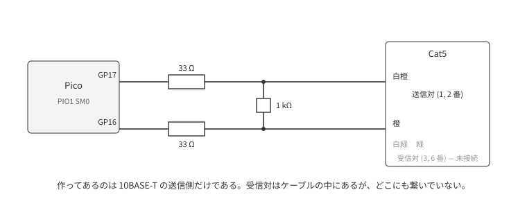
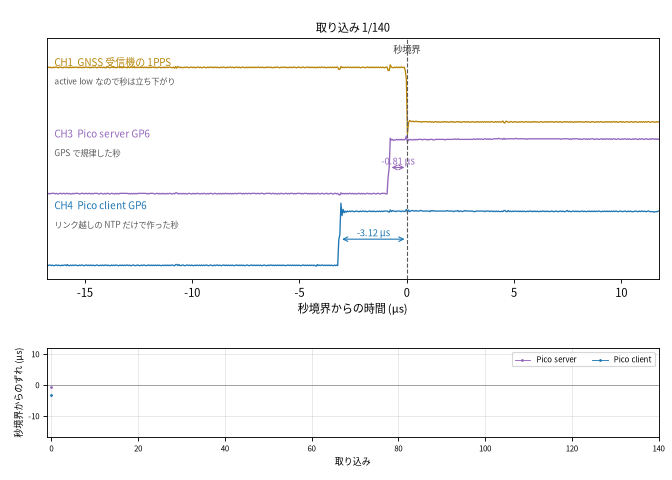

# Pico 間擬似 Ethernet 接続での NTP 時刻同期

**GPSDO が持っている時刻を NTP で相手に渡し、どれだけの精度で渡せたのかを測る。**
その回の図とスクリプトを置く。
生データは repo top の `logs/20260820-pico-link/` にある。

## これまで: スイッチと AP を挟んで PC で受ける

### 構成



板 1 枚からギガビットスイッチへの、送信 1 方向である。
GP17 を TX+、GP16 を TX− とし、それぞれに 33 Ω を直列に入れ、対のあいだに 1 kΩ を渡して、
Cat5 の被覆を剥いた芯線に半田付けし、そのまま RJ45 へ入れる。
線に出るのは 10BASE-T の線符号そのもので、スイッチはリンクを張り、その先の PC が普通の
UDP パケットとして受け取る。
絶縁と共通モードの除去はスイッチ側のパルストランスが持つので、こちら側は GPIO 2 本と抵抗 3 本で
足りる。

使ったのは送信対だけである。
受信対から届く信号は差動で、その共通モードはこちらの GND とは無関係に決まるので、受けるには
コンパレータが要る。そのコンパレータが見る共通モードは、パルストランスが無ければこちらで
面倒を見ることになる。

送信だけで線の上に成立するのは broadcast (mode 5) で、時刻を一方的に配る形である。
以下はこの構成の記録で、詳しくは前回のレポート
[GPSDO の時刻を NTP で配る](../ntp-stratum1/) にある。

### 測り方

同じ LAN に置いた PC で UDP を待ち受け、**パケットが申告した送信時刻**と、**カーネルが付けた
受信時刻** (`SO_TIMESTAMPNS`) を比べる。

このホストは有線と無線の両方で同じ LAN に居るので、broadcast は AP を経由した無線でも同じ
ホストに入り、同じ 1 つが二度届く。どちらで受けたかは `IP_PKTINFO` で分ける。

server が線に出す時刻そのものは、オシロを GPS 受信機の 1PPS に当てて別に測る。

### 結果

**線に出るところまでは µs で決まった。**
秒境界から線の第 1 ビットまでは 236.19 µs、1 回ごとの揺れは 6.87 µs だった (n=60、オシロ実測)。
申告する送信時刻をこれに合わせると、申告と実際の送出は中央値 **+1.2 µs** (n=401、−12.9 から
+15.1) で一致する。この時点で server 側は ±15 µs である。

**受け取った PC で読むと ms になった。**
600 秒ぶんの記録で、申告した送信時刻から受信時刻を引いた値である
(上の補正を入れる前、firmware が秒境界そのものを申告していたときのもの)。

| 受けた経路 | 平均 | 1 回ごとの揺れ |
|---|---:|---:|
| 有線 (n=598) | −3816.5 µs | 177.4 µs |
| 無線 (n=471) | −136.3 ms | 89.7 ms |
| 経路を分けずに混ぜる (n=1069) | −62.2 ms | 88.7 ms |

上の送信時刻の補正を入れたあとでも、有線で読む値は +677.0 µs (n=130) で、数分おいて取り直すと
+570.5 µs (n=66) とまだ動いていた。

**読めない理由は 3 つある。**

- broadcast の client は経路を測れない。RFC 5905 §3 は、先に client mode で数往復して伝搬遅延を
  校正し、そのあと受信だけに移ることを想定しているが、送信だけの配線ではその往復が張れない。
  経路の動かない部分がそのまま時刻に乗り、有線で 3.8 ms、無線で 136 ms になる
- 揺れは校正でも引けない。有線で 0.18 ms、無線で 90 ms ある。無線の 90 ms は AP がビーコンに
  合わせて broadcast を溜めるためで、その位相は client にも server にも見えない
- 受け側のホストの時計そのものが決まっていない。公開 NTP サーバ 3 台と往復して推定すると 10 ms
  開き、往復が長いサーバほど大きく外れた

server 側は ±15 µs で決まっているのに、受け取った側で読める値は ms 級で、しかも経路によって桁が
変わる。**この構成では server 自身の µs は読めない。**

## 今回: Pico 2 枚を直結する

### 構成


スイッチと PC の代わりに、2 枚目の Pico を置いた。
片方の GP16/GP17 を相手の GP18/GP19 へ、両方向ぶん、ジャンパで繋ぐ。GND どうしも繋ぐ。
どちらも 3.3 V のロジックで相手の GPIO 入力を駆動するので、抵抗もパルストランスも要らない。

各方向 2 本なのは、送信側が 2 ピンを対で駆動していて線の状態が 3 つあるためである
(`0b00` idle、`0b01`、`0b10`)。
片側だけでは idle と `0b01` が区別できず、フレームの終わりが決められない。

これで両方向が通り、client が訊いて server が答える往復 (mode 3/4) が線の上で成立する。

本物の Ethernet セグメントから受けるにはパルストランスと受信側のアナログ回路が要るが、それを
用意する前に、**論理的には Ethernet のまま物理層だけ省く**ことができる。
Manchester 符号、preamble/SFD の検出、FCS、IPv4/UDP、NTP のやりとりという、digital で決まる
部分だけを先に確定させる。相手はそのピンを駆動できるもの、つまりここでは 2 台目の Pico に限られる。

2 台は **Pico server** (受信機つき、NTP を配る) と **Pico client** (リンク越しの NTP だけで時刻を作る) と呼ぶ。

### 測り方

**PC の時計をどこにも入れない。**
Pico client は届いた NTP だけで時刻を保ち、その結果を 1 秒ごとのパルスとして GP6 に出す。
GNSS 受信機は Pico server に繋ぐ。

受信機の 1PPS、Pico server の GP6、Pico client の GP6 の 3 本を、同じトリガでオシロに取る。
CH1 との差が、その板の**時刻差**になる。
受信機の 1PPS は active low なので、秒を指すのは立ち下がりである。

前の構成で ms を作っていた経路とホストの時計は、これで測定系から外れる。
残るのは GPS 受信機のパルスと、2 枚の板が出すパルスだけである。

### 何を精度と呼ぶか

オシロで 1 回トリガするたびに、3 本のパルスの立ち上がり位置が読める。
これを 90 回繰り返すと 90 個の値が出る。
**平均**がそのまま「ふだんどれだけずれているか」、**標準偏差**が「1 回ごとにどれだけ揺れるか」で、
同期精度はこの 2 つの組で言う。片方だけでは足りない。

- 平均は測り方の癖 (校正の誤り) で動く。動いたことに気づけないと、そのまま誤差になる
- 標準偏差はその癖では動かない。校正が間違っていても、揺れの大きさは変わらない

測れる量も 2 つある。

- **受信機のパルスとの時刻差**: その板が GPS の秒からどれだけ離れているか。
  Pico server 側の校正定数がそのまま乗る
- **Pico client − Pico server**: NTP が秒をどれだけ忠実に渡せたか。同じトリガで両方を読んだ差なので、
  server の校正定数は両方に等しく乗って消える

**NTP の精度と呼べるのは後者だけである。** 以下はこの区別で読む。

## 結果

### 1 回の取り込み


横軸は秒境界からの時間 (µs)。
上から CH1 が受信機の 1PPS、CH3 が Pico server の GP6、CH4 が Pico client の GP6 で、
矢印が秒境界から各立ち上がりまでの時刻差である。

**1 回の取り込みは分布から引いた 1 点であって、オフセットではない。**
この取り込みの Pico server は −0.81 µs だが、同じ 140 回の平均は +0.29 µs、1 回ごとの揺れは 1.24 µs である。
表題に両方を出してあるのはそのためで、判断は次の図の分布で行う。

同じ描き方で、連続した 140 回をそのまま並べたのが次の図である。



1 コマが 1 回の取り込みで、上段は上の図と同じ描き方 (秒境界 = CH1 の立ち下がりが 0)。
下段は、そのコマまでの CH3 と CH4 のずれを取り込みの順に並べたものである。
コマごとに矢印の長さが変わるのが、上で「1 点」と言ったものの正体である。

オシロの画面そのものは `fig-scope-5us.png` にある。黄が CH1、紫が CH3、青が CH4。

### 8 分ぶん


上段が受信機を基準にした 2 枚、下段が Pico client − Pico server。
横軸は取り込みの回数で、5 秒に 1 回ほどの間隔である。

Pico server は 0 のまわりに標準偏差 1.4 µs で揺れる。
Pico client は ±8 µs をゆっくり往復していて、これは白色雑音ではなく、時刻を追い込むループが
3 分ほどの周期で行き過ぎては戻っている応答である。
下段が上段の橙とほとんど同じ形になるのは、Pico server が動かないぶん client の往復がそのまま
差に出るからである。

### NTP の精度


左が run ごとの分布 (点が各取り込み、丸と横棒が平均と標準偏差、灰色の帯が ±10 µs)、
右が同じ差を Pico server の時刻差に対して並べたもの。

12 run 226 取り込みでの同期精度は、次の 2 つの組である。

- **ふだんどれだけずれているか**: run ごとの平均が −8.1 〜 +9.7 µs
- **1 回ごとにどれだけ揺れるか**: run 内の標準偏差が 0.6 〜 3.5 µs

Pico server が受信機から 0 µs のときも +204 µs のときも、差は同じ帯に収まる。
server 側の校正がどれだけ狂っていても NTP の精度は変わらない、ということである。

平均が run ごとに 18 µs ぶん動くのは、まだ残っている送信側の校正定数が run ごとに違う効き方を
するためで、揺れとは別の原因である。
個々の取り込みは両方を足した −10.0 〜 +14.0 µs に散り、±10 µs の内側にあるのは 96%。
図の灰色の帯はその ±10 µs で、**全部が入る範囲ではない**。

### broadcast と unicast

同じバイナリを 2 通りにビルドして比べた (`broadcast-client` feature)。
broadcast のときは要求を出さず、beacon だけで時計を進める。
server は最初に 1 度だけ焼いて以後触っていない。落ち着き 240 秒、90 取り込み、8 分。

値は「平均 ± 1 回ごとの揺れ」である。

| 配り方 | server のずれ | client のずれ | NTP の精度 (client − server) |
|---|---|---|---|
| unicast (往復) | −9.27 ± 1.29 µs | +19.76 ± 2.19 µs | **+29.03 ± 1.72 µs** |
| broadcast (片道) | −23.73 ± 1.27 µs | −10.86 ± 2.42 µs | **+12.87 ± 2.53 µs** |

**1 回ごとの揺れは unicast のほうが 1.5 倍小さい** (標準偏差 1.72 対 2.53 µs)。
往復は 2 つのタイムスタンプで送信側の変動を打ち消せるが、片道はそれができない。

平均のほうは 16 µs 違うが、こちらは比べられない。
2 つの経路がそれぞれ別の送信側の校正定数に乗っていて、その定数自体がまだ正しくないためである
(下記)。`WIRE_LAG_NS` が片付くまで、モード間で意味があるのは揺れのほうだけになる。

### 時間の尺度で見え方が変わる

上の表で Pico server の平均が 2 つの run で 14.5 µs 違う。
同じ電源、同じファームウェアで、再起動もしていない。18 分のあいだに動いた。

`locked=1` のままで、周波数推定はこの間 112 ppb から 250 ppb へ登っていた。
出力の位相はその推定の上に乗るので、推定が動くあいだは位相も動く。

したがって、この節の数字は**尺度とともに読む**必要がある。

| どれだけの長さで見るか | Pico server のパルスに見えるもの |
|---|---|
| 40 秒 (16 取り込み) | 1 回ごとに 4.4 ns 揺れる |
| 8 分 (90 取り込み) | 1 回ごとに 1.3 µs 揺れる |
| 18 分 (2 つの run のあいだ) | 平均そのものが 14.5 µs 動く |

基準をカウンタ側に置いて消えたのは、いちばん上の**取り込みごとの揺れ**である。
下の 2 つは GPSDO の制御が落ち着くまでの応答で、別の問題として残っている。

## 出力パルスをどこに置くか

サーバが出すパルスを、UTC の秒のどこに置くかは firmware が決める。
その決め方に**ソフトウェアの時計を一切使わない**のが、ここでの設計である。

### PIO のカウンタ

RP2040 の PIO は、CPU とは独立に走る小さな状態機械を持っている。
そこで数え上げを回しておくと、**ソフトウェアが何をしていようと一定の速さで進み続ける目盛り**に
なる。この firmware では 16 ns で 1 目盛り進む。以下これをカウンタと呼ぶ。

GPS 受信機のパルスが来た瞬間のカウンタの値は、この状態機械が自分で読んで FIFO に積む。
CPU がいつそれを取りに行っても、積まれた値は変わらない。

### ソフトウェアの時計を使うと、誤差が見えなくなる

パルスが来た瞬間のカウンタの値は上のとおり正確に取れる。
問題はそれを UTC に結びつけるときで、**FIFO から値を取り出したときにソフトウェアの時計を読んで
基準にする**と (`rp_pps::embassy::run_capture` の `on_pps_edge(edge, query_ns())`)、取りに行くのが
遅れた分だけ、配る時刻も出すパルスも遅れる。

出力側も同じである。`PpsSchedule` に「出力の状態機械を動かし始めた時刻」をソフトウェアの時計で
渡すと、その読みの遅れがパルスの位置に乗る。

サーボはこの 2 つが作った結果を見て操舵するので、どちらの誤差も見えない。
上の右パネルで Pico server が 0 µs から +204 µs まで散っているのは、この 2 つが動いたときの姿で
ある。

取り出しの直前に 100 µs の待ちをわざと入れると、出すパルスは +80 µs から **+204.1 µs**
(標準偏差 1.4 µs、n=16) へ動き、パルスを見ていない Pico client もパケット越しに +197.4 µs へ
付いてくる。

**順番待ちではないので、優先度を上げても消えない。**
`pps_task` を割込み executor に置くと、`Priority::P0` では周波数推定が +257 ppb から
−356584 ppb に固着して時計そのものが壊れ、`Priority::P1` では 9.4 µs 悪化する
(+0.29 µs → +9.65 µs)。

### 基準をカウンタ側に置く

**2 つの状態機械を同じ 1 回の書き込みで動かし始めれば、その瞬間が両方のカウンタの 0 になる。**
出力のパルスは、その 0 から数えた目盛りの積み上げで決まる。
GPS のパルスを捉えた瞬間も、同じ 0 から数えた目盛りである。
どちらもソフトウェアの時計を通らない。

- `start_in_sync` が、動かし始めるのと分周器のリセットを同じ書き込みに入れる
- 数え上げに使うレジスタは、動かし始める前に `mov x, null` を注入して 0 にする
  (プログラムはこのレジスタを数えるだけで読み込まないので、そうしないと数えはじめが不定になる)
- `PpsSchedule` に渡す開始時刻は 0 (= 上の書き込みの瞬間) になる
- 出力タスクは `now_from_capture_ns` で、自分のパルスがどの UTC かをカウンタの値で訊く

ソフトウェアの時計を読むのは、この書き込みの次の行の 1 回だけになる。
あいだに待ちを挟まないので、書き込みと読み出しは数命令ぶんしか離れていない。

### 結果

受信機の秒に対して、オシロで 16 取り込み (40 秒ほど) ずつ測った。

| 時刻の基準 | GPS の秒からのずれ | 1 回ごとの揺れ | コードに書いた補正 |
|---|---|---|---|
| ソフトウェアの時計 | +0.29 µs | **1.24 µs** | 53.16 µs |
| カウンタ | −4.99 µs | **0.0035 µs** | なし |
| カウンタ (起動し直し) | −4.96 µs | 0.076 µs | なし |
| カウンタ (数分おいて) | −5.99 µs | **0.0044 µs** | なし |

**同じ長さで比べて、1 回ごとの揺れが 1.24 µs から 4 ns になった。**
パルスの位置を「タスクが起きたとき」ではなく「数えた目盛り」で決めた結果である。
起動し直しても同じところに戻る (2 行目と 3 行目で平均の差が 35 ns)。

**ただしこれは 40 秒での話である。**
上の「時間の尺度で見え方が変わる」のとおり、8 分で見れば揺れは 1.3 µs、18 分では平均が
14.5 µs 動く。消えたのは取り込みごとの揺れで、分単位のうねりは残っている。

残る −6.0 µs も、この尺度でのみ動かない。
何なのかは分かっていないので、補正として引くことはしていない。

## 残っているもの

送信側には `WIRE_LAG_NS = 117.8 µs` が残っている。
オシロで測った 236.19 µs から firmware 自身の 118.4 µs を引いた残りだが、前者は受信機の秒、
後者は当時 53 µs 遅れていた firmware の時計が基準で、**ゼロ点の違う引き算**である。
分割そのものに根拠がない。

「DMA に渡してから線に先頭ビットが出るまで」を TX ピンの捕捉で測れば、この定数は要らなくなる。

## スクリプト

```sh
uv run docs/report/pico-link-ntp/logs/plot_link.py
```

波形は `scope_pair.py trace` で取る。
画面のスクリーンショットと違い 3 本のサンプルが 1 取り込みぶんずつ残るので、
`fig-scope-annotated.png` と `fig-scope.gif` はそこから描いている。
