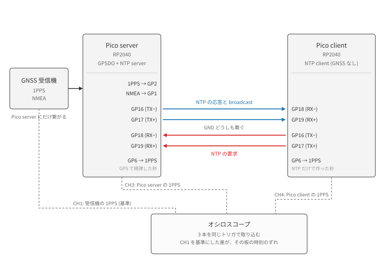
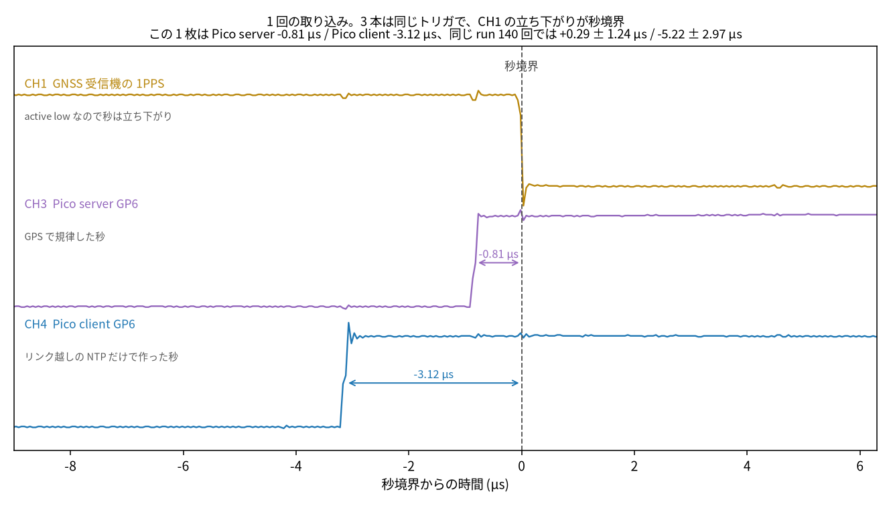
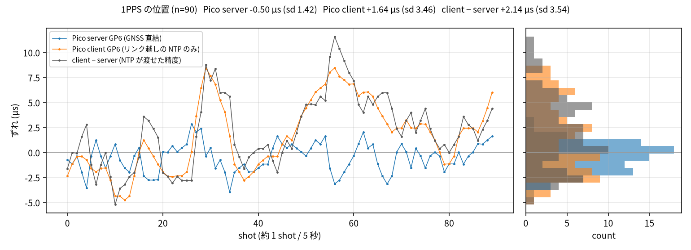
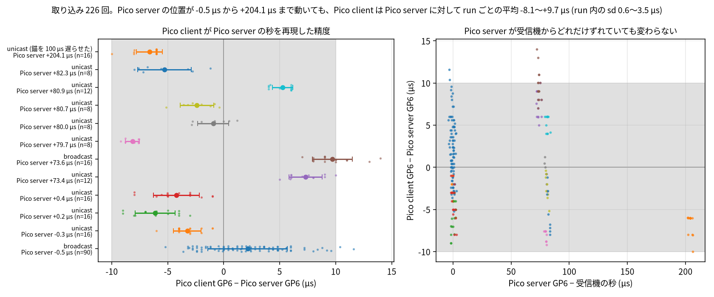

# Pico 間リンクの時刻同期

GNSS 受信機を 1 台にだけ繋ぎ、もう 1 台が NTP だけで UTC を保てるか、どれだけの精度で保てるかを
測った回の図とスクリプト。
生データは repo top の `logs/20260820-pico-link/` にあり、gitignore 配下なのでコミットしない。

2 台は **Pico server** (受信機つき、NTP を配る) と **Pico client** (GNSS なし) と呼ぶ。

## 配線と測り方



受信機は Pico server にしか繋がっていない。
Pico client が持つ時刻は、この 4 本を渡ってきた NTP パケットだけから作られる。

各方向 2 本なのは、送信側が 2 ピンを対で駆動していて線の状態が 3 つあるためである
(`0b00` idle、`0b01`、`0b10`)。
片側だけでは idle と `0b01` が区別できず、フレームの終わりが決められない。

両方の板が自分の思う秒に GP6 を立ち上げ、受信機も自分の秒に 1PPS を出す。
この 3 本を同じトリガでオシロに取れば、CH1 との差がその板の**時刻差**になる。
受信機の 1PPS は active low なので、秒を指すのは立ち下がりである。

## 何を精度と呼ぶか

測れる量は 2 つある。

- **受信機の 1PPS との時刻差**: その板が GPS の秒からどれだけ離れているか。Pico server 側の
  校正定数がそのまま乗る。
- **Pico client − Pico server**: NTP が秒をどれだけ忠実に渡せたか。同じ取り込みから両方を読んだ
  差なので、server の定数は両方に等しく乗って落ちる。

NTP の精度と呼べるのは後者だけである。以下はこの区別で読む。

## 結果

### 1 回の取り込み



横軸は秒境界からの時間 (µs)。
上から CH1 が受信機の 1PPS、CH3 が Pico server の GP6、CH4 が Pico client の GP6 で、
矢印が秒境界から各立ち上がりまでの時刻差である。

**1 回の取り込みは分布から引いた 1 点であって、オフセットではない。**
この取り込みの Pico server は −0.81 µs だが、同じ 140 回の平均は +0.29 µs (sd 1.24) である。
表題に両方を出してあるのはそのためで、判断は次の図の分布で行う。

オシロの画面そのものは `fig-scope-5us.png` にある。黄が CH1、紫が CH3、青が CH4。

### 8 分ぶん



上段が受信機を基準にした 2 枚、下段が Pico client − Pico server。
横軸は取り込みの回数で、5 秒に 1 回ほどの間隔である。

Pico server は 0 のまわりに 1.4 µs で散る。
Pico client は ±8 µs をゆっくり往復していて、これは白色雑音ではなく、時刻を追い込むループが
3 分ほどの周期で行き過ぎては戻っている応答である。
下段が上段の橙とほとんど同じ形になるのは、Pico server が動かないぶん client の往復がそのまま
差に出るからである。

同じ描き方で連続した取り込みを並べた 140 コマが `fig-scope.gif` にある。

### NTP の精度



左が run ごとの分布 (点が各取り込み、丸と横棒が平均と標準偏差、灰色の帯が ±10 µs)、
右が同じ差を Pico server の時刻差に対して並べたもの。

12 run 226 取り込みで、**run ごとの平均は −8.1 〜 +9.7 µs、run 内の揺れは sd 0.6 〜 3.5 µs**。
Pico server が受信機から 0 µs のときも +204 µs のときも、差は同じ帯に収まる。

この 2 つは別の量である。
run 内の sd は同じ条件で繰り返したときの揺れで、run をまたぐと平均そのものが 18 µs ぶん動く。
個々の取り込みは両方を足した −10.0 〜 +14.0 µs に散り、±10 µs の内側にあるのは 96% である。
図の灰色の帯はその ±10 µs で、**全部が入る範囲ではない**。

### broadcast と unicast

broadcast は往復を測れないので経路遅延を仮定に頼るが、この配線では経路が ns なので効かない。
実際、どちらのモードでも同じ桁である。

| | run | 取り込み | run 平均 | run 内 sd |
|---|---|---|---|---|
| broadcast | 2 | 106 | +2.1 〜 +9.7 µs | 1.8 〜 3.5 µs |
| unicast | 10 | 120 | −8.1 〜 +7.3 µs | 0.6 〜 2.4 µs |

**ただし同じ長さで測っていない。**
8 分の run は broadcast の 1 つだけで、unicast はどれも 1 〜 2 分である。
規律ループは 3 分ほどの周期で往復するので、短い run はその周期を一巡しない。
broadcast の sd が大きいのは、唯一その周期を丸ごと含んでいるためと説明がつく。
この測り方では「unicast の方が締まっている」とは言えない。

## 受信機に対する時刻差は、何で決まるか

上の右パネルで Pico server の時刻差が 0 µs から +204 µs まで散っているのは、そう振らせたのでは
なく、そう動いてしまうからである。

firmware は 1PPS を PIO で捕まえて ns のタイムスタンプを作る。
だが UTC に結びつける錨は、捉えたエッジではなく **FIFO からその値を汲み出したときにソフトウェアの
時計を読んだ値**だった (`rp_pps::embassy::run_capture` の `on_pps_edge(edge, query_ns())`)。
出力の位相も同じで、`PpsSchedule` は出力 state machine を有効にした時刻を錨にする。
サーボはこの 2 つが作った結果を見て操舵するので、どちらの誤差も見えない。

錨が遅れれば、同じだけ供給する秒も GP6 も遅れる。
汲み出しの直前に既知の 100 µs を入れると、出力は +80 µs から **+204.1 µs** (sd 1.4、n=16) へ動き、
GP6 を見ていない Pico client もパケット越しに +197.4 µs へ付いてきた。

**順番待ちではないので、優先度では消えない。**
`pps_task` を割込み executor に移すと、`Priority::P0` では周波数推定が +257 ppb から
−356584 ppb に固着して時計そのものが壊れ、`Priority::P1` では GP6 が +0.29 µs から +9.65 µs へ、
つまり 9.4 µs 悪化した。

### 錨をカウンタに移す

**2 つの state machine を同じ書き込みで起動すれば、その瞬間が両方のカウンタのゼロになる。**
出力のエッジはそのゼロから数えた period word の積み上げ、捕捉のエッジは同じゼロから数えた
カウンタの値で、どちらもソフトウェアの時計を経由しない。

- `start_in_sync` が `CLKDIV_RESTART` を同じ書き込みに入れ、分周器の位相まで揃える
- 捕捉の `X` は起動前に `mov x, null` を注入して 0 にする (プログラムは `X` を数えるだけで
  読み込まないので、そうしないと数えはじめが不定になる)
- スケジュールに渡す `enable_ns` は 0
- 出力タスクは `now_from_capture_ns` で、自分のエッジがどの UTC かを訊く

ソフトウェアの時計を読むのは、起動の書き込みの次の行の 1 回だけになる。
await を挟まないので、書き込みと読み出しは数命令ぶんしか離れていない。

### 結果

受信機の秒に対して、オシロで 16 取り込み。

| | GP6 の時刻差 | sd | 引いている定数 |
|---|---|---|---|
| 前 | +0.29 µs | **1.24 µs** | 53.16 µs |
| 後 | −4.99 µs | **0.0035 µs** | なし |
| 後、起動し直し | −4.96 µs | 0.076 µs | なし |
| 後、数分おいて | −5.99 µs | **0.0044 µs** | なし |

**標準偏差が 1.24 µs から 4 ns になった。**
エッジを「タスクが起きたとき」ではなく「計数」で置いた結果である。

起動し直しても同じところに戻る (2 行目と 3 行目の平均の差は 35 ns)。
また、起動から数分のあいだに 1.00 µs だけ一度動いて、そこで止まる。
ちょうどソフトウェアの時計の刻みと同じ値だが、そこを疑っているだけで確かめていない。

残る −6.0 µs は固定で、置き換えた定数は同じ量がビルドの違いで 80 µs 動いていた。
**固定であること自体がここでの成果**で、動くものは特徴づけられないが、止まっているものは追える。
何なのかはまだ分かっていない。フィットで埋めずに残してある。

## 残っているもの

送信側には `WIRE_LAG_NS = 117.8 µs` が残っている。
オシロで測った 236.19 µs から firmware 自身の 118.4 µs を引いた残りだが、前者は受信機の秒、
後者は当時 53 µs 遅れていた firmware の時計が基準で、**ゼロ点の違う引き算**である。
分割そのものに根拠がない。

「DMA に渡してから線に先頭ビットが出るまで」を TX ピンの捕捉で測れば、この定数は要らなくなる。
それが次の PR の中身である。

## スクリプト

```sh
uv run docs/report/pico-link-ntp/logs/plot_link.py
```

図中に日本語を出すので Noto Sans CJK JP を明示している。無い環境では豆腐になる。

波形は `scope_pair.py trace` で取る。
画面のスクリーンショットと違い 3 本のサンプルが 1 取り込みぶんずつ残るので、
`fig-scope-annotated.png` と `fig-scope.gif` はそこから描いている。
