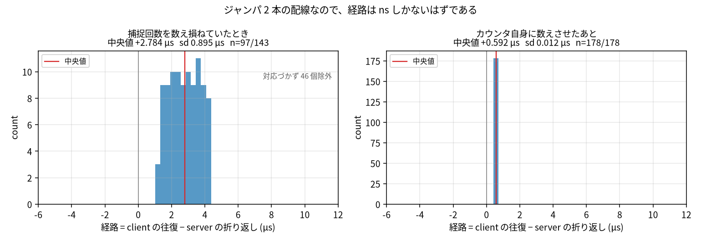

# フレームの時刻を PIO で記録する

リンクを出入りするフレームの先頭ビットの時刻を、ソフトウェアではなく PIO の state machine に
記録させた回の図とスクリプト。
生データは repo top の `logs/20260820-pico-link/` にあり、gitignore 配下なのでコミットしない。

## 何を測るか

知りたいのは信号が線を渡る時間だが、2 枚の板の時計は合っているとは限らない。
そこで、**どちらの板も自分の中での長さだけを測る**。

- Pico client: 自分の質問の先頭ビットが線に出てから、応答の先頭ビットが着くまで
- Pico server: 質問の先頭ビットが着いてから、応答の先頭ビットが線に出るまで

どちらも自分の state machine が自分のピンを見て記録する。
2 つの差が経路で、板どうしの時計のずれは結果に入らない。
この配線はジャンパ 2 本なので、経路は ns しかないはずである。

## 結果



横軸は Pico client の往復時間から Pico server の折り返し時間を引いた値 (µs)、縦軸は度数、
赤い縦線が中央値である。
順番の対応づけに失敗した回は中央絶対偏差で切り出して除いてあり、除いた数は図に出してある。

右が現在の実装で、散らばりは **12 ns**、対応づけも全数一致する。

左は、**カウンタが止まった回数を数え損ねるとどう見えるか**である。
このカウンタはピンを跨ぐものすべてで止まるのに、数えていたのは関心のあるフレームだけだった。
補正が毎秒ずれていくので、散らばり 895 ns はばらつきではなく数え損ねの累積である。
カウンタ自身に数えさせると消える。

残る中央値 592 ns の出どころは分かっていない。
両端とも同じ物理エッジを 16 ns 分解能で見ているので、原理的には 0 に近いはずである。

## 1PPS の出力

#10 が 1PPS の錨をカウンタ側へ移したので、この監視 2 本も同じ書き込みに入る。
PIO0 の 4 本 (1PPS の捕捉、1PPS の出力、リンクの入口、リンクの出口) が同時に走り出し、
その瞬間が 4 つのカウンタに共通のゼロになる。

受信機の秒に対する Pico server の GP6 は **−2996.2 ns、sd 6.2 ns (n=16、幅 26 ns)**。
起動直後から締まっている。
捕捉が #10 とは別のプログラム (`event_capture_program`) を走らせるので固定の時刻差は違うが、
どちらも動かない。

Pico client はこの run で +58.4 µs 離れている。
送信の定数 `TX_LAG_NS` が古い較正のままで、正しくなった時計と噛み合っていないためである。
ここのタイムスタンプは、その定数を測り直すための計器にあたる。

## スクリプト

```sh
uv run docs/report/pico-link-ptp/logs/plot_path.py
```

図中に日本語を出すので Noto Sans CJK JP を明示している。
