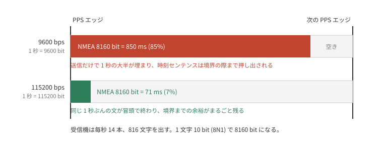

# 1PPS と NMEA の対応付け

GNSS 受信機の 1PPS は、立ち上がりエッジが UTC の秒境界を指す。
エッジが伝えるのはその境界だけで、今が何秒かは受信機が UART に流す NMEA センテンスから読む。

`rp-pps` の対応付けは素朴である。
PPS エッジが来たらその時刻を保持し、次に時刻センテンスが来たら、保持したエッジにそのセンテンスの秒を対応付ける。
受信機はパルスごとに時刻を報告するので、順に対応させていけば合う。

ずれるのは、センテンスが**次の**エッジより後に届いたときである。
そのときセンテンスは保留中のエッジ(すでに次のもの)に対応付き、エポックは 1 秒進む。
遅れは数 ms でも足り、境界を跨ぐかどうかだけで結果は 1 秒単位で飛ぶ。

これが実際に起きていた。
使った受信機は秋月の [AE-GNSS-EXTANT](https://akizukidenshi.com/catalog/g/g113849/)(MediaTek MT3333)で、構成は [precision-ladder](../precision-ladder/README.md) と同じである。

## 位相の検証をすり抜ける

この不具合は、それまでの検証をすべてすり抜けていた。
どの検証も**位相**を見ていたからである。

規律された 1PPS 出力は、GPS-R の 1PPS に対して数十 ns で合っている。
オシロで両者を重ねれば、確かに合っている。
そのエッジに対応付いた秒が一つずれていても、オシロに映るのは同じ波形である。
波形は正しく、時刻だけが間違っている。

見えるようになったのは、この GPSDO を NTP サーバに仕立てて、NTP 同期済みのホストと比べたときだった。
この種の誤りは、外部の時計と突き合わせて初めて出てくる。

## RMC と ZDA

`rp-pps` は RMC で対応付けていた。
RMC は **Recommended Minimum Navigation Information** の略で、NMEA 0183 の現行版 v4.11 でもその展開のままである。
航法源が最低限出すべきもの、つまり位置と進路と速度、そしてそれらがいつのものかという時刻を載せる。
時刻が入っているのは航法に時刻が要るからで、時刻そのものは付随情報である。

パルスに対して定義されているのは **ZDA** のほうである。
MT3333 の NMEA 仕様はメッセージ一覧で ZDA にだけ "PPS timing message (synchronized to PPS)" と注記し、§2.2.7 でこう書いている。

> Outputs the time associated with the current 1PPS pulse.
> Each message is output within a few hundred ms after the 1PPS pulse is output and tells the time of the pulse that just occurred.

ZDA に切り替えた。
規律 UTC は 1 秒遅れたままだった。

## 9600 bps の NMEA バースト

ログに残った到着時刻を、エッジからエッジまでの 1 秒に並べる。

上段の 9600 bps では、14 本のセンテンスが 48 ms から 974 ms まで、1 秒ぜんたいに散らばっている。
RMC は次のエッジの 55 ms 手前、ZDA はさらに後ろなので、この秒には前の周期ぶんが冒頭に写っている。
どちらの時刻センテンスも、境界のすぐ近くにある。

散らばるのは帯域が足りないからである。

この受信機は毎秒 14 本、816 文字を出す。
1 文字 10 bit として 8160 bit/s であり、**9600 bps では 1 秒の 85% を送信が占める**。
UART はほぼ埋まっていて、センテンス間の最大の空きは 209 ms しかない。

ZDA に替えても直らなかったのは、これで説明がつく。
ZDA はバーストの終端にあるので、RMC より後に届く。
仕様のうえで正しいセンテンスを選んでも、届く時刻が境界を跨いでしまえば同じことになる。

下段の 115200 bps では、同じ一群が 197 ms から 266 ms までの 69 ms に収まっている。
バーストが終わってから次のエッジまで 734 ms あり、境界は視野の外にある。

## 次のエッジまでの余裕

その残り時間を 188 本ぶん測ると、9600 bps の分布は二つの山に割れる。

0 ms の壁に張り付いた山と、1000 ms 側の山である。
後者はエッジを跨いだあとに届いたぶんで、同じ量を反対側から見ている。
分布そのものが境界をまたいでいる。

| ボーレート | センテンス | 平均 | 標準偏差 | 最小 |
|---|---|---:|---:|---:|
| 9600 | RMC | 490 ms | 460 ms | **2 ms** |
| 9600 | ZDA | 866 ms | 218 ms | **1 ms** |
| 115200 | RMC | 749 ms | 26 ms | 718 ms |

最小 1 ms から 2 ms は、対応付けがコイン投げになっているということである。
衛星が増えて GSV が伸びれば、バーストは後ろに延びて境界を越える。

`rp-pps` には NMEA の秒とエッジの関係を ±1 秒補正する設定があり、その doc は「このライブラリ最大の footgun」と書いている。
9600 bps でこの補正を入れると時刻は合った。
合ったが、直ってはいない。
コイン投げのどちら側を正解と呼ぶかを入れ替えただけである。

## ボーレートを 115200 bps に上げる

直すべきは余裕そのものである。
`PMTK251` で受信機を 115200 bps に上げると、最悪ケースの余裕は 2 ms から 718 ms になった。

外部の NTP 同期済みホストと、probe 経由で読んだ firmware の時刻を突き合わせる。

| 条件 | ホスト − firmware |
|---|---:|
| 9600、補正なし | +1.11 … +1.20 s |
| 9600、+1 秒補正 | +0.11 … +0.20 s |
| 115200、補正なし | +0.11 … +0.20 s |
| 115200、+1 秒補正 | −0.85 s |

残差の +0.15 秒前後は probe のポーリング遅延である。
バースト長を変えただけで、必要な補正が +1 秒から 0 へ移っている。
これはバーストのタイミングが対応付けを決めていた場合にだけ起こる。
つまり余裕さえあれば、ZDA と「そのパルスの時刻」という仕様どおりの解釈が、補正なしで成立する。

帯域を空ける手段はもう一つある。
`PMTK314` でセンテンスの種類を減らせば、レートを上げるのと同じくバーストは短くなる。
両端のレートを揃えたままでいられるぶん扱いやすいはずで、今回は試していない。

## PMTK251 はいつ効くか

`PMTK251` を投げて UART を切り替えるだけでは動かなかった。
最初の実装は 250 ms 待って切り替え、framing エラーしか出なくなった。

受信機は Pico よりはるかに遅く起動し、設定を受け付けるのは喋り始めてからである。
既存の `mt3333.rs` が PMTK 送出前に 2000 ms 待っていたのは、同じことを踏んだ跡だったのだろう。

もう一つ、レート設定は firmware の再フラッシュを跨いで残る。
仕様 §2.3.14 によれば、`PMTK251` が既定に戻るのは full cold start か standby のときだけである。
再フラッシュ後もモジュールは前回のレートのままなので、9600 で開いて沈黙を見た firmware は「受信機が死んだ」と判断してしまう。

`PMTK251` には ACK がない。
旧レートで返事を出してから切り替える設計はあり得るので、ACK を省いたのはこの受信機の選択である。
仕様は切替に要する時間も規定していない。
成否も完了時刻も、こちらから確かめて知るしかない。

そこでコマンドの前後で port を probe する形にした。
副産物として、コマンド後の待ち時間は大まかでよくなった。
短すぎても、後段の probe がモジュールの実際に落ち着いたレートを見つけて追従する。

## 後入れ先出しと先入れ先出し

今の対応付けはエッジを一つだけ保持して、次に来たセンテンスをそこに割り当てる。
保持しているのは常に最新のエッジなので、後入れ先出しにあたる。

この形は脱落に強い。
センテンスが 1 本落ちても、次のセンテンスはそのとき保持されているエッジに割り当てられ、正しい対応に戻る。
弱いのは遅延のほうで、境界を跨いだセンテンスは新しいほうのエッジに割り当てられる。
今回の 1 秒スリップがこれである。

エッジを待ち行列に積み、センテンスが来たら最も古いものから取り出す形にすると、性質が入れ替わる。
遅れて届いたセンテンスも自分のエッジを取り出せるので、境界を跨いでも正しく対応付く。
代わりに脱落が致命的になる。
取り出されないエッジが行列に残り続け、以後のセンテンスはすべて一つ古いエッジに割り当てられる。

違いは、失敗が一過性か持続的かにある。
後入れ先出しの誤りはその 1 秒で終わるが、先入れ先出しの誤りは再同期するまで残る。
どちらを選ぶかは、この受信機で脱落と遅延のどちらが起きやすいかによる。
まだ測っていない。
