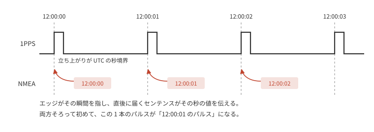
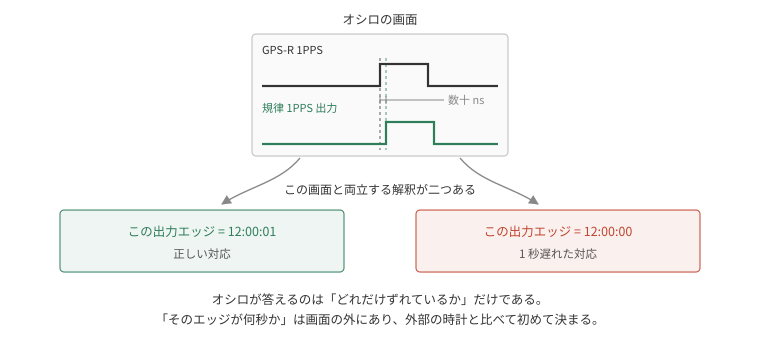
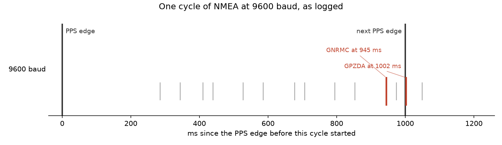
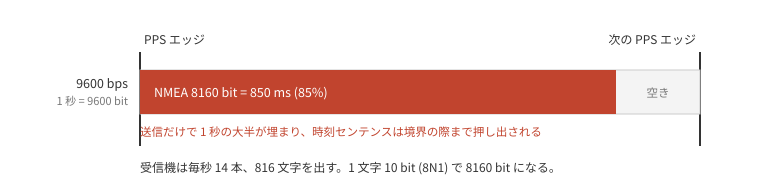
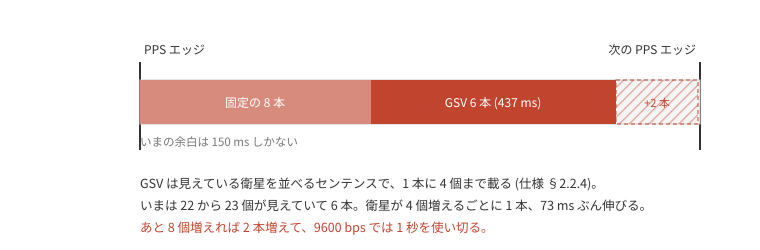
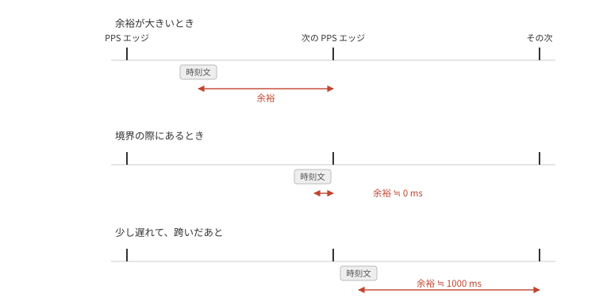
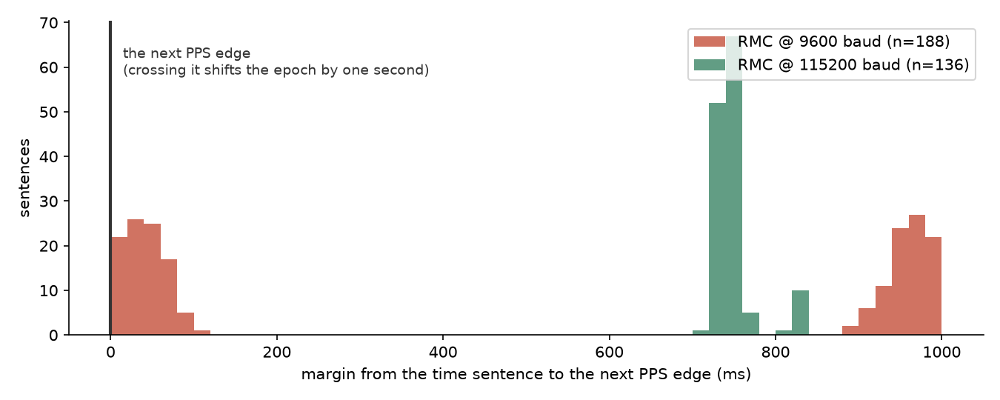
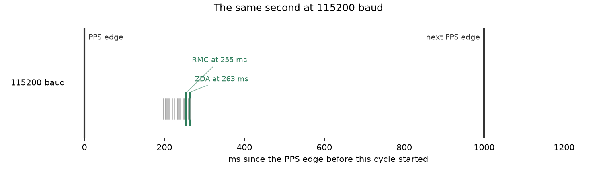
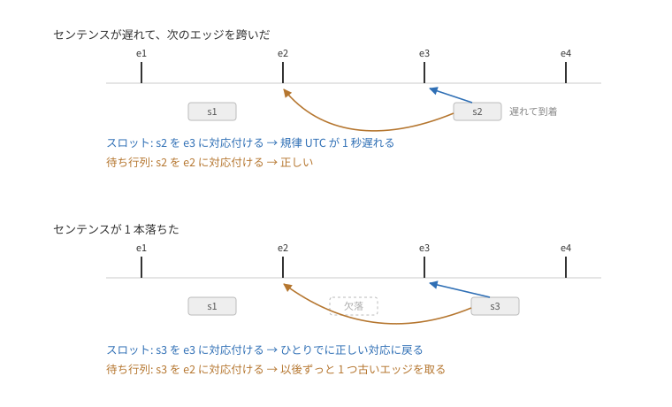

# 1PPS と NMEA の対応付け

GNSS 受信機の 1PPS は、立ち上がりエッジが UTC の秒境界を指す。
エッジが伝えるのはその境界だけで、今が何秒かは受信機が UART に流す NMEA センテンスから読む。



`rp-pps` の対応付けは素朴である。
PPS エッジが来たらその時刻を保持し、次に時刻センテンスが来たら、保持したエッジにそのセンテンスの秒を対応付ける。
受信機はパルスごとに時刻を報告するので、順に対応させていけば合う。

ずれるのは、センテンスが**次の**エッジより後に届いたときである。
そのときセンテンスは保留中のエッジ(すでに次のもの)に対応付き、そのエッジに一つ前の秒が書き込まれる。
以降そのエポックから作る時刻は、まるごと 1 秒遅れる。
遅れは数 ms でも足り、境界を跨ぐかどうかだけで結果は 1 秒単位で飛ぶ。

これが実際に起きていた。
使った受信機は秋月の [AE-GNSS-EXTANT](https://akizukidenshi.com/catalog/g/g113849/)(MediaTek MT3333、以下 GPS-R)で、構成は [precision-ladder](../precision-ladder/README.md) と同じである。
Pico は GPS-R の 1PPS に合わせて自分の 1PPS と UTC を出す GPSDO (GPS disciplined oscillator) になっている。

## 位相の検証をすり抜ける

この不具合は、それまでの検証をすべてすり抜けていた。
どの検証も**位相**を見ていたからである。

GPSDO の 1PPS 出力は、GPS-R の 1PPS に対して数十 ns で合っている。
オシロで両者を重ねれば、確かに合っている。



ずれているのは firmware が内部で持つエポックだけで、ピンの上の波形はどちらの解釈でも同じである。
波形は正しく、時刻だけが間違っている。

見えるようになったのは、この GPSDO を NTP サーバに仕立てて、NTP 同期済みのホストと比べたときだった。
この種の誤りは、外部の時計と突き合わせて初めて出てくる。

## GNRMC と GPZDA

受信機は測位のたびに、種類の違う何本かのセンテンスを ASCII で吐く。
`rp-pps` はそのうち RMC を時刻源にしていた。

MT3333 の NMEA 仕様 §2.2.5 は RMC を **Recommended Minimum Specific GNSS Data** と展開する。
航法源が最低限出すべき一本で、位置と進路と速度、そしてそれらがいつのものかという時刻を載せる。

```text
$GNRMC,024921.000,A,ddmm.mmmm,N,dddmm.mmmm,E,0.26,99.22,180826,,,A*45
```

| フィールド | 値 | 意味 |
|---|---|---|
| talker + 種別 | `GNRMC` | 複数測位系をまとめた RMC |
| 1 | `024921.000` | UTC 時刻 02:49:21.000 |
| 2 | `A` | 測位状態 (A = 有効) |
| 3–6 | `ddmm.mmmm,N,dddmm.mmmm,E` | 緯度と経度 |
| 7 | `0.26` | 対地速度 (knot) |
| 8 | `99.22` | 進路 (真方位) |
| 9 | `180826` | 日付 2026-08-18 (ddmmyy) |
| 10–11 | 空 | 磁気偏角 |
| 12 | `A` | mode indicator |

頭の `GN` は測位に使った系を表す。
GPS だけなら `GP`、GLONASS なら `GL`、複数をまとめたものが `GN` である。

時刻は入っているが、航法データに「いつのものか」を添えるための欄である。
RMC の名前に "Navigation" が入ると紹介されることがあるが、それは RMB (Recommended Minimum Navigation Information) のほうで、別のセンテンスである。

ZDA は §2.2.7 の Time & Date で、時刻と日付だけを載せる。

```text
$GPZDA,024921.000,18,08,2026,,*5D
```

| フィールド | 値 | 意味 |
|---|---|---|
| talker + 種別 | `GPZDA` | ZDA |
| 1 | `024921.000` | UTC 時刻 02:49:21.000 |
| 2 | `18` | 日 |
| 3 | `08` | 月 |
| 4 | `2026` | 年 (仕様では 1980 to 2079) |
| 5–6 | 空 | ローカル時差 (時, 分)。仕様に "Not supported" とある |

日付の持ち方も違う。
RMC は `ddmmyy` の 6 桁で世紀を持たないが、ZDA は年を 4 桁で持つ。

そして ZDA だけが、パルスとの関係を明文で持つ。
仕様はメッセージ一覧で ZDA にだけ "PPS timing message (synchronized to PPS)" と注記し、§2.2.7 でこう書いている。

> This message is included only with systems which support a time-mark output pulse identified as "1PPS".
> Outputs the time associated with the current 1PPS pulse.
> Each message is output within a few hundred ms after the 1PPS pulse is output and tells the time of the pulse that just occurred.

この一文が、対応付けに要る二つを決めている。
どのパルスの時刻を載せているかは「いま起きたパルス」であり、いつ届くかは「そのパルスが出た後、数百 ms 以内」である。
RMC の定義にはどちらもない。
測位した時刻を載せるとしか書いておらず、その時刻がどのパルスに結び付くのか、パルスの前と後のどちらに出てくるのかは決まっていない。

そこで対応付けを ZDA に切り替えた。
GPSDO の UTC は 1 秒遅れたままだった。

## 9600 bps の NMEA バースト

ログに残った到着時刻を、1 サイクルぶん並べると以下のようになる。



1 サイクル 14 本が 285 ms から 1049 ms まで、764 ms にわたって並んでいる。
RMC は次のエッジの 55 ms 手前に、ZDA はその先、エッジを 2 ms 越えたところに届いている。
一組のセンテンスが境界をまたいでいる。

散らばるのは帯域が足りないからである。
NMEA は ASCII なので 1 byte が 1 文字にあたり、8N1 の UART では 1 byte が 10 bit になる。
9600 bps ならその送信に約 1 ms かかるので (10 / 9600 = 1.04 ms)、1 秒で送れるのは 1000 byte ほどである。
この受信機は毎秒 14 本、816 byte を出す。



送信だけで 850 ms、**1 秒の 85% を占める**。
UART はほぼ埋まっていて、センテンス間の最大の空きは 209 ms しかない。

しかもこの 850 ms は固定ではない。
14 本のうち 6 本は GSV で、見えている衛星の情報を載せるセンテンスである。
1 センテンスに 4 衛星ぶんまでしか入らないので、それを超えると複数のセンテンスに分割して送られる。



いまは 22 から 23 衛星が見えていて、6 センテンスに分かれている。
そして時刻センテンスは、その GSV の後ろにいる。
衛星が 4 つ増えるごとに GSV が 1 センテンス、73 ms ぶん増え、そのぶん RMC と ZDA が後ろへ動く。
空きは 150 ms しかないので、あと 8 衛星で末尾が境界に届く。

バーストが 1 秒を端から端まで使うので、その開始が少し揺れるだけで、どのセンテンスも境界の反対側へ移る。

## RMC と ZDA は、境界の手前に収まるか

1 秒がここまで埋まっていると、時刻センテンスが次のエッジより前に届くかどうかは際どい。
仕様のうえで ZDA が正しいことと、その ZDA が境界の手前に収まることは別なので、RMC と ZDA の両方について測った。

まず、バーストの中でどちらが先に出るか。
仕様は順番について何も書いていないが、同じ UTC 秒を載せたセンテンスを一つのサイクルとしてまとめると、時刻を先頭フィールドに持つ 4 本はどちらの baudrate でもこの順に届いた。

```text
GGA → … → RMC → ZDA → GST
```

ZDA がいるのは終わりのほうで、9600 bps では RMC の 73 ms 後になる。
バーストの尻に近いぶん、ZDA のほうが境界へ押し付けられやすい。

次に、それぞれが届いてから次のエッジまで何ミリ秒残っているかを測る。



跨ぐ直前に届けば残りは 0 に近づき、跨いだ直後に届けば、そこから次のエッジまでの 1000 ms 近くになる。
同じ「境界の際」が、跨ぐ前と後で分布の両端に分かれて出る。

連続する 188 サイクルについて測ると以下のようになる。



RMC は 51% が跨ぐ直前に、48% が跨いだ直後にいる。
ほぼ半々で、毎秒どちらに転ぶかが変わる。
ZDA は 6% と 62% で、片側に寄っている。
ほとんどいつも跨いだ後にいる。

| baudrate | センテンス | 平均 | 標準偏差 | 最小 |
|---|---|---:|---:|---:|
| 9600 | RMC | 490 ms | 460 ms | **2 ms** |
| 9600 | ZDA | 866 ms | 218 ms | **1 ms** |

同じ「境界の際」でも、外れ方が違う。
RMC は毎秒どちらに転ぶか分からず、ZDA は毎回同じ向きに外す。
ZDA に替えて、誤りが 1 秒遅れのまま動かなくなったのはこれである。
そして、どちらを選んでも境界から離れた場所には届かない。

`rp-pps` には NMEA の秒とエッジの関係を ±1 秒補正する設定があり、その doc は「このライブラリ最大の footgun」と書いている。
9600 bps でこの補正を入れると時刻は合った。
合ったが、直ってはいない。
境界のどちら側に落ちるかは変わらないまま、どちら側を正解と呼ぶかを入れ替えただけである。

## baudrate を 115200 bps に上げる

センテンスを替えても境界からは離れられない以上、バーストそのものを短くするしかない。
GPS-R には UART の baudrate を動かすコマンドがあり、仕様 §2.3.14 の `PMTK251` がそれにあたる。
これで 115200 bps に上げると 1 byte が 87 µs になり、同じ 816 byte を 71 ms で送り終わる。
占有率にすると 85% が 7% になる。


同じ 1 秒を、同じ 14 本が埋め尽くすか、冒頭で終わるかの違いである。
実測でも次のようになる。



同じ一群が 197 ms から 266 ms までの 69 ms に収まっている。
バーストが終わってから次のエッジまで 734 ms あり、境界は視野の外にある。
最悪でも次のエッジまで 718 ms 残る。9600 bps では 2 ms だった。

サイクルが 1 秒に収まると、受信機が本当はいつ喋り始めるのかが読める。
時刻を先頭フィールドに持つのは GGA、RMC、ZDA、GST の 4 本なので、これを目印にして、同じ UTC 秒を載せたものを一つのサイクルとしてまとめる。

| baudrate | サイクル長 (GGA→GST) | 先頭から RMC | 先頭から ZDA |
|---|---:|---:|---:|
| 9600 | 765 ms | +650 ms | +723 ms |
| 115200 | 69 ms | +58 ms | +64 ms |

115200 bps ではサイクル全体が 69 ms で終わり、先頭の GGA は直前のパルスの 198 ms 後、ZDA は 263 ms 後に届く。
仕様の「パルスが出た後、数百 ms 以内」がそのまま出ている。

受信機が喋り始めるまでの時間は baudrate では変わらないはずなので、9600 bps でもサイクルの先頭は自分のパルスの 200 ms ほど後にある。
そこから 650 ms 後の RMC はパルスの 850 ms すぎ、723 ms 後の ZDA は 950 ms すぎになる。
実測でも、直前のパルスから RMC が 913 ms、ZDA が 83 ms だった。
ZDA の 83 ms は次のパルスを越えたあとの値で、越えていなければ 1083 ms にあたる。

9600 bps では、RMC は境界の 87 ms 手前に、ZDA は境界を越えた先に落ちていたことになる。
RMC はバーストの揺れで境界の両側に散ってコイン投げになり、ZDA はほぼ必ず越えるので毎回 1 秒遅れる。
仕様のうえで正しいセンテンスを選ぶことと、それが境界の手前に届くこととは、別の話だった。

外部の NTP 同期済みホストと、probe 経由で読んだ firmware の時刻を突き合わせる。

| 条件 | ホスト − firmware |
|---|---:|
| 9600、補正なし | +1.11 … +1.20 s |
| 9600、+1 秒補正 | +0.11 … +0.20 s |
| 115200、補正なし | +0.11 … +0.20 s |
| 115200、+1 秒補正 | −0.85 s |

残差の +0.15 秒前後は probe のポーリング遅延である。
バースト長を変えただけで、必要な補正が +1 秒から 0 へ移っている。
これはバーストのタイミングが対応付けを決めていた場合にだけ起こる。
つまり境界から十分離れて届きさえすれば、ZDA と「そのパルスの時刻」という仕様どおりの解釈が、補正なしで成立する。

`PMTK251` を使うときに気をつける点が二つある。
設定は firmware の再フラッシュを跨いで残り、既定に戻るのは full cold start か standby のときだけである (§2.3.14)。
既定の 9600 で開く firmware を焼くと、一度上げた受信機からは何も受け取れない。
もう一つ、このコマンドは ACK を返さず、切替に要する時間も規定されていない。
どちらも、コマンドの前後で port を probe して、実際に落ち着いた baudrate に合わせれば扱える。

帯域を空ける手段はもう一つある。
`PMTK314` でセンテンスの種類を減らせば、レートを上げるのと同じくバーストは短くなる。
両端の baudrate を揃えたままでいられるぶん扱いやすいはずで、今回は試していない。

受信機に送出時刻そのものを固定させる道もある。
Telit の MT GNSS Software User Guide には `PMTK255` があり、"enables or disables the fix NMEA output time behind PPS" と説明されている。
有効にすると "the latency range of the beginning of UART Tx is between 170 ms and 180 ms at MT3339 platform (465 ms~485ms at MT3333 platform) and behind the rising edge of PPS" とある。
測位の負荷で前後する送出開始を、パルスからの固定オフセットに釘付けにできるということである。
ただし MT3333 の 465 ms から 9600 bps のバースト 850 ms を流すと次のエッジを越えるので、これは baudrate を上げたうえで初めて効く。
こちらも試していない。

## 時刻で決めるか、順番で決めるか

いまの対応付けは、届いた時刻だけで決めている。
センテンスが来た瞬間にスロットへ入っているエッジが、その秒の持ち主になる。
9600 bps でこれが外れたのは、時刻センテンスが境界の際に届いていたからだった。

決め方はもう一つある。
エッジを待ち行列に積んでおいて、センテンスが来たら最も古いものから取り出す。
順番だけで決めるので、境界のどちら側に届いても正しい組になる。

ただし、遅延に強くなる代わりに脱落に弱くなる。



センテンスが遅れて次のエッジを跨いだとき、スロットはすでに新しいエッジで上書きされている。
そこに一つ前の秒を書き込むので、GPSDO の UTC は 1 秒遅れる。
待ち行列なら、遅れて届いても自分のエッジを取り出せる。

センテンスが 1 本落ちたときは逆になる。
スロットは次のセンテンスが来た時点のエッジを使うだけなので、ひとりでに正しい対応に戻る。
待ち行列には取り出されないエッジが残り、それ以降のセンテンスがすべて一つ古いエッジを取る。
放っておいても戻らない。

待ち行列は、エッジとセンテンスが 1 対 1 で順番どおりに届くことを当てにしている。
脱落がどれぐらいの頻度で起きるか分からないうちは選べない。
115200 bps なら時刻で決めても次のエッジまで 700 ms 以上あるので、いま替える理由もない。

この受信機で脱落と遅延のどちらが起きやすいかは、まだ測っていない。
