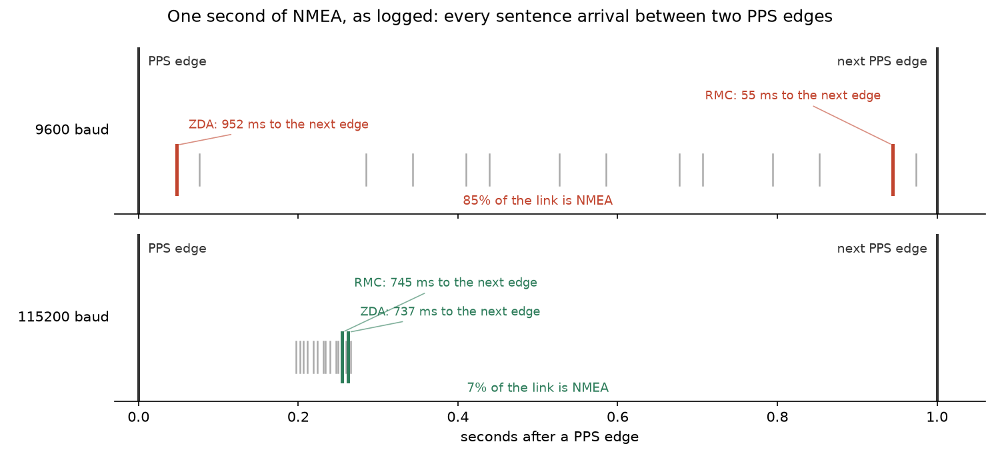

# 1PPS と NMEA の対応付けが 1 秒ずれる

GNSS 受信機の 1PPS は、立ち上がりエッジが UTC の秒境界を指す。
ただしエッジ自体は「今が何秒か」を言わない。
そこで受信機が UART に流す NMEA センテンスから秒を読み、エッジと対応付けて UTC のエポックを立てる。
この対応付けを間違えると、規律された時刻が 1 秒まるごとずれる。

この記録では、その 1 秒ずれが実際に起きていたことと、原因が「どのセンテンスを使うか」と「そのセンテンスがいつ届くか」の二つに分かれていたこと、後者が帯域の問題だったことを扱う。

使ったのは秋月の [AE-GNSS-EXTANT](https://akizukidenshi.com/catalog/g/g113849/)(MediaTek MT3333)と Raspberry Pi Pico で、[precision-ladder](../precision-ladder/README.md) と同じ構成である。

## エッジに秒の名前を付ける

`rp-pps` の対応付けは単純である。
PPS エッジが来たらその時刻を保持し、次に時刻センテンスが来たら、保持したエッジにそのセンテンスの秒を貼る。

```text
PPS エッジ ──保持──> 保留中のエッジ
時刻センテンス ────> 保留中のエッジに秒を貼り、UTC エポックが立つ
```

エッジとセンテンスは 1 対 1 に対応する前提である。
受信機はパルスごとに時刻を報告するので、順番に食べていけば合う。

合わなくなるのは、センテンスが**次の**エッジより後に届いたときである。
そのときセンテンスは保留中のエッジ(すでに次のもの)に貼られ、エポックは 1 秒進む。
遅れが 1 秒に満たなくても、境界を跨ぐかどうかだけで結果は 1 秒単位で飛ぶ。

## 位相を測っても気付けない

この不具合は、このプロジェクトのそれまでの検証をすべてすり抜けていた。
理由は単純で、既存の検証はどれも**位相**を見ているからである。

規律された 1PPS 出力は、GPS-R の 1PPS に対して数十 ns で合っている。
オシロで両者を重ねれば、確かに合っている。
しかしそのエッジに貼られた秒の名前が一つずれていても、オシロには何も映らない。
波形は正しく、ラベルだけが間違っている。

外部の時計と突き合わせて初めて見える種類の誤りである。
今回それが見えたのは、この GPSDO を NTP サーバにして、NTP 同期済みのホストと比べたからだった。

## どちらのセンテンスが時刻を運ぶのか

`rp-pps` は RMC で対応付けていた。
RMC は **Recommended Minimum Navigation Information** の略で、NMEA 0183 の現行版 v4.11 でもその展開のままである。
航法源が最低限出すべきもの、つまり位置と進路と速度、そしてそれらがいつのものかという時刻である。
時刻が入っているのは航法に時刻が要るからで、時刻を述べるために設計された文ではない。

パルスに対して定義されているのは **ZDA** のほうである。
MT3333 の NMEA 仕様はメッセージ一覧で ZDA にだけ "PPS timing message (synchronized to PPS)" と注記し、§2.2.7 でこう書いている。

> Outputs the time associated with the current 1PPS pulse.
> Each message is output within a few hundred ms after the 1PPS pulse is output and tells the time of the pulse that just occurred.

であれば ZDA を使えばよい、と考えて切り替えた。
それだけでは直らなかった。
ZDA でも規律 UTC はきっちり 1 秒遅れたままだった。

## センテンスは 1 秒のどこに届くのか

直らない理由は、ログの時刻を並べれば見える。



上段が 9600 bps である。
14 本のセンテンスが 1 秒のあいだに散らばっていて、RMC は次のエッジの 55 ms 手前に届いている。
ZDA はさらに後ろにいるので、この秒では前の周期ぶんが冒頭に写っている。

なぜこう散らばるのかは、帯域を数えるとわかる。
この受信機は毎秒 14 本、788 文字を出す。
1 文字 10 bit として 7884 bit/s であり、**9600 bps の 82% を NMEA が占めている**。
短いバーストのあとに長い静寂があるのではなく、UART がほぼ埋まっている。
センテンス間の最大の空きは 380 ms しかない。

つまり時刻センテンスは、どれを選んでも次のエッジのすぐ近くに来る。
ZDA がバーストの終端にいるぶん、RMC より事情は悪い。

## 余裕がどれだけ残っているか

次のエッジまでの残りを、188 本ぶん測った分布が下図である。


9600 bps(赤)は二つの山に割れている。
0 ms の壁に張り付いた山と、1000 ms 側の山である。
後者はエッジを跨いだあとに届いたぶんで、同じ量を反対側から見ている。
つまりこの分布は境界そのものをまたいでいる。

数値でも同じことが出る。

| ボーレート | センテンス | 平均 | 標準偏差 | 最小 |
|---|---|---:|---:|---:|
| 9600 | RMC | 490 ms | 460 ms | **2 ms** |
| 9600 | ZDA | 866 ms | 218 ms | **1 ms** |
| 115200 | RMC | 749 ms | 26 ms | 718 ms |

最小 1 ms から 2 ms というのは、対応付けがコイン投げになっているということである。
衛星が増えて GSV が伸びれば、バーストは後ろに延びて境界を越える。
どちらの association を設定しても、飛ぶときは飛ぶ。

`rp-pps` には NMEA の秒とエッジの関係を ±1 秒補正する設定があり、その doc は「このライブラリ最大の footgun」と書いている。
9600 bps ではこの補正を入れると時刻が合った。
合ったが、直ってはいなかった。
コイン投げのどちら側を正解と呼ぶかを入れ替えただけである。

## 帯域を空けて余裕を作る

センテンスの選択でも補正定数でもなく、余裕そのものを作る。
`PMTK251` で受信機を 115200 bps に上げると、同じ 14 本が 69 ms に収まる。
図の下段がそれで、全部が 200 ms から 270 ms のあいだに固まり、次のエッジまで 745 ms 空いている。
最悪ケースの余裕は 2 ms から 718 ms になった。

これが再ラベリングではなく実際の修正であることは、必要な補正が変わったことでわかる。
外部の NTP 同期済みホストと突き合わせた結果が以下である。
測定は probe 経由で行った。
ネットワークを通さないので、経路の遅延を時計のずれと取り違える余地がない(probe 自身のポーリング遅延は残るが、これは後述のとおり 0.15 秒程度で、1 秒の判定には効かない)。

| 条件 | ホスト − firmware |
|---|---:|
| 9600、補正なし | +1.11 … +1.20 s |
| 9600、+1 秒補正 | +0.11 … +0.20 s |
| 115200、補正なし | +0.11 … +0.20 s |
| 115200、+1 秒補正 | −0.85 s |

残差の +0.15 秒前後は probe のポーリング遅延であって、時計のずれではない。
バースト長だけを変えたのに必要な association が反転したのは、バーストのタイミングが対応付けを決めていた場合にしか起こらない。
余裕さえあれば、仕様どおりの組み合わせ、つまり ZDA と「そのパルスの時刻」という解釈が、補正なしで成立する。

## ボーレートを上げるのに要ったこと

`PMTK251` を投げて UART を切り替えるだけでは動かなかった。
最初の実装は 250 ms 待って切り替え、framing エラーしか出なくなった。

理由が二つあった。

**受信機は Pico よりはるかに遅く起動する**。
喋り始める前に設定を投げても受け付けない。
既存の `mt3333.rs` が PMTK 送出前に 2000 ms 待っていたのは、同じことを踏んだ跡だったのだろう。

**レート設定は firmware の再フラッシュを跨いで残る**。
仕様 §2.3.14 によれば `PMTK251` が既定に戻るのは full cold start か standby のときだけである。
再フラッシュ後もモジュールは前回のレートのままなので、9600 で開いて沈黙を見た firmware は「受信機が死んだ」と判断してしまう。

そこでコマンドの前後で port を probe する形にした。
`PMTK251` には ACK がない。
旧レートで返事を出してから切り替える設計はあり得るので、ACK が不可能なわけではない。
この受信機が返さないというだけである。
仕様は切替に要する時間も規定していない。
つまり成否も完了時刻も、こちらから確かめる以外に知る方法がない。

副産物として、コマンド後の待ち時間が critical でなくなった。
短すぎても、後段の probe がモジュールの実際に落ち着いたレートを見つけて追従する。
一つのモジュールを一日測って調整した定数を持たずに済む。

## 残っていること

有線での受信は測れていない。
今回ホスト側で見たオフセットの大半は WiFi 経由の broadcast 配送によるもので、AP が DTIM まで溜める分が乗っている。
有線の受信機なら別の数字になるはずだが、手元に有線 NIC がなく確かめていない。

`PMTK314` でセンテンスを削る手も残っている。
帯域を空けるという意味ではボーレートを上げるのと同じ効果で、両端のレートを揃える必要がないぶん扱いやすい可能性がある。
今回は試していない。

対応付けの機構そのものを、到着時刻に依存しない形にする道もある。
現在は「保留中のエッジ」に貼る後入れ先出しなので、センテンスが 1 本落ちると復帰する代わりに、遅れると跨ぐ。
先入れ先出しにすれば遅れには強くなるが、脱落に弱くなる。
どちらが良いかは、この受信機で脱落と遅延のどちらが起きやすいかを測ってから決めるべきで、まだ測っていない。

## 図の作り方

```sh
uv run docs/report/pps-nmea-pairing/logs/pairing/plot_pairing.py
```

生データは `logs/20260818-ntp-bringup/` から読む(リポジトリには含めない)。
どちらの図も実測から起こしていて、模式図に見えるほうもログに残ったセンテンス到着そのものを描いている。
