Raspberry Pi Pico に秋月の GNSS 受信モジュール [AE-GNSS-EXTANT](https://akizukidenshi.com/catalog/g/g113849/)(MediaTek MT3333、以下 GPS-R)を接続し、時刻同期の精度を詰めていく。GPS-R が 1 秒ごとに出す 1PPS に合わせて、Pico 側からも同期した 1PPS を出す GPSDO (GPS disciplined oscillator) を作っていく。

1PPS は、立ち上がりエッジが UTC の秒境界を指す基準になる。ただしその精度は GPS-R ごとに違い、MT3333 のデータシートでは PPS の時刻精度は typical ±10 ns とされている。Pico 側をどれだけ詰めても、最後はこの ±10 ns が天井になる。この記録では、GPS-R の 1PPS に対して 100 ns 以内で合い続ける出力を目標にする。
GPS-R からはこの 1PPS のほかに、時刻と測位を載せた NMEA 文字列も UART から出力される。

今回の構成は以下の通り。GPS-R の PPS と UART を Pico の GPIO で受け、別の GPIO から GPSDO PPS を出力する。

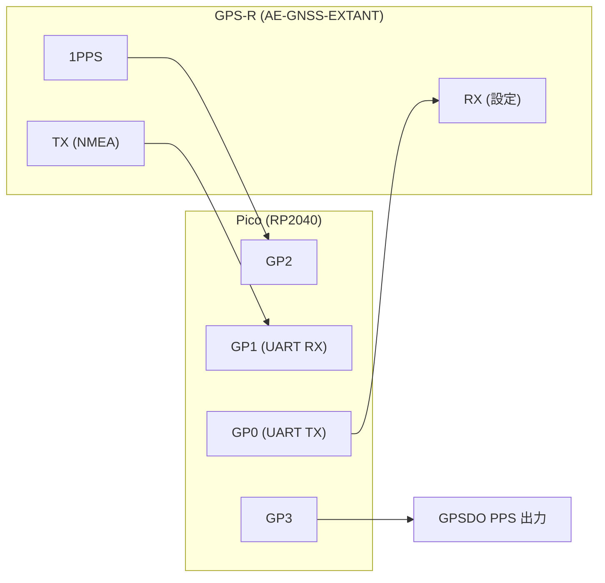
```mermaid
flowchart LR
  subgraph GPSR["GPS-R (AE-GNSS-EXTANT)"]
    R_PPS["1PPS"]
    R_TX["TX (NMEA)"]
    R_RX["RX (設定)"]
  end
  subgraph PICO["Pico (RP2040)"]
    P_G2["GP2"]
    P_G1["GP1 (UART RX)"]
    P_G0["GP0 (UART TX)"]
    P_G3["GP3"]
  end
  R_PPS --> P_G2
  R_TX --> P_G1
  P_G0 --> R_RX
  P_G3 --> OUT["GPSDO PPS 出力"]
```

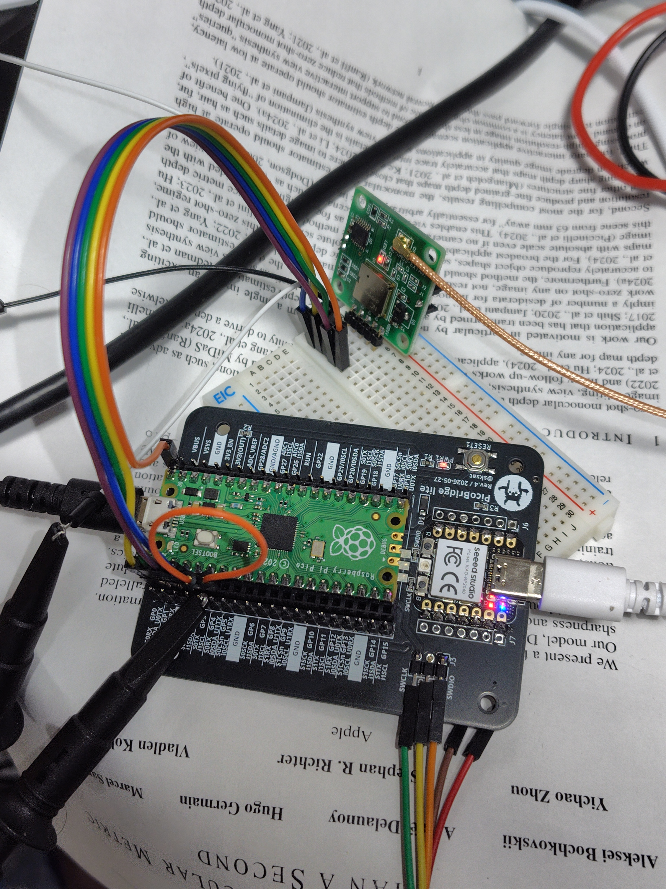

## まずは Pico のタイマーで素朴に 1PPS を作って様子を見る

まずは、シンプルに Pico のタイマーで 1PPS を出力するところから始める。Pico の内蔵タイマーは水晶から作ったクロックを刻んでいるので、1 秒ぶん進むたびに出力ピンを上げ下げすれば、1 秒周期のパルス、つまり 1PPS になる。タイミング検知には割り込みを使う。擬似コードで書くと、タイマー割り込みと GPIO 割り込みの 2 つのハンドラになる。

```text
// 起動時: 最初の立ち上がり時刻を予約する
next = timer.now();
schedule_at(next);

// タイマー割り込みハンドラ: 予約した時刻が来ると呼ばれる
on_timer() {
    out_pin.set_high();        // この立ち上がりが 1PPS
    // (パルス幅ぶん後に low へ戻すのも同様に予約する)
    next += 1s;                // 次の立ち上がりは 1 秒後
    schedule_at(next);
}

// GPIO 割り込みハンドラ: GPS-R 1PPS の立ち上がりで呼ばれる
on_gps_edge() {
    t = timer.now();           // 割り込みが上がってからここで読む
    interval = t - t_prev;     // GPS-R の 1 秒がタイマーでどう見えるか
    phase = t - last_out_edge; // 出力との位相差 (±0.5 秒に折り返す)
    t_prev = t;
}
```

その上で、この出力タイミングと GPS-R PPS の入力タイミングを比較すると、Pico のタイマー(の元になる水晶の発振周波数)がどれぐらいズレているかがわかる。比べる量は擬似コードの 2 つ、つまり間隔 `interval` と位相差 `phase` になる。

実際に 8 回起動して、位相差 `phase` を毎秒記録してみる。ズレは 2 つに分かれて見える。まず、起動直後の位相差は毎回バラバラで、1 秒の中のどこにでも落ちる。出力の秒の刻み目は firmware が起動した瞬間で決まり、GPS-R の秒境界とは無関係だからだ。これがオフセットのズレになる。もうひとつ、出力のエッジは GPS-R のエッジに対して、どの起動でも毎秒 2.5〜3 µs ずつ同じ向きに動き続ける。いまの室温では Pico の水晶が GPS-R より約 2.7 ppm 速く、出力の「1 秒」がわずかに短いためだ。これが間隔のズレになる。

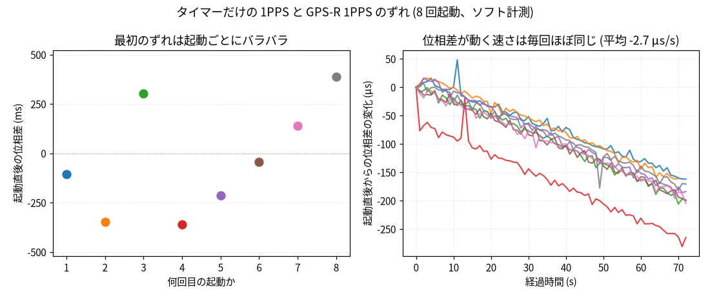

エッジが動き続けるのは、測ったズレをまだ出力へ戻していないからだ。ズレを測って戻す前に、この測定自体の質も見ておく。

擬似コードのとおり、どちらのハンドラも CPU が割り込みに反応してから、ソフトウェアで時刻を読んだりピンを叩いたりする。この動き出すまでの遅れがそのまま読み値の揺れになる。さらに firmware には、共有データを守るために割り込みを一時的に止める区間 (critical section) があり、RP2040 の Cortex-M0+ ではこれが全割り込みのマスクになる。エッジがそこに当たると、区間が終わるまでハンドラは待たされる。

実際、8 回の boot で GPS-R 1PPS の間隔の読み値を集めると、92% は ±2 µs に収まる一方、まれに 10〜64 µs まで跳び、全体では σ 約 4 µs になる。大きく跳んだ読み値は、エッジが長めの critical section に当たった回と見られる。これは GPS-R の質ではなく、ソフトで時刻を扱う側の下限だ。

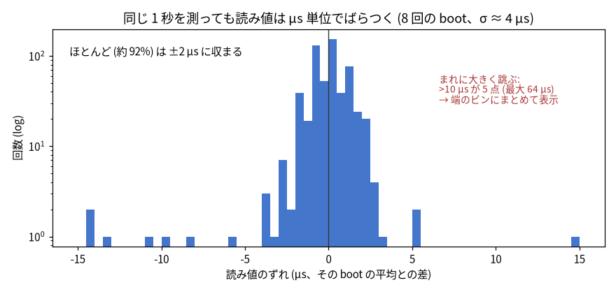

## GPS-R を見て周期を寄せる

水晶のズレが見えたので、次は GPS-R 1PPS が来るたびにその時刻を Pico のタイマーで読み、ズレに合わせて出力周期を少しずつ寄せる。Pico の水晶が速ければ次の周期をわずかに長くし、遅ければ短くする。PPS が届いている間に周波数を学習しておけば、PPS が途切れても推定で時刻を進められる。この状態を holdover と呼ぶ。

タイマーだけのときは、位相差が毎秒 µs 単位で動いていた。周期を寄せて周波数の推定が落ち着くと、位相差はほとんど動かなくなる。水晶のズレの大半は、これで打ち消せている。ただし、この補正で合わせているのは周期(1 秒の長さ)だけで、位相差そのものを 0 へ戻す力はない。だから位相差は成り行きの場所で止まる。この計測では +388 ms で止まり、その周りを σ 3.6 µs で揺れている。位相差を 0 へ寄せるのは、のちの PLL の仕事になる。

その周期合わせにも制約がある。出したい周期は「GPS-R の 1 秒」そのもので、Pico のタイマーで測ると、この計測では平均 1000002.9 µs にあたる。水晶が速いぶんタイマーの 1 µs はわずかに短く、本当の 1 秒を数えるには 1000002.9 個ぶん必要になるからだ(ズレの大きさは温度でも動くので、前の節の 8 回とは少し違う値になっている)。ところが出力周期は、タイマーの 1 µs 単位でしか指定できない。1000002 µs や 1000003 µs は出せても、端数の 0.9 µs は出せない。そこで、ある秒は 1000003 µs、別の秒は 1000002 µs、と混ぜて出し、何秒も平均すると 1000002.9 µs になるようにする。1 回ごとの周期は最大 1 µs 弱ズレるが、平均は狙いに乗る。これが一次 sigma-delta と呼ばれるやり方だ。

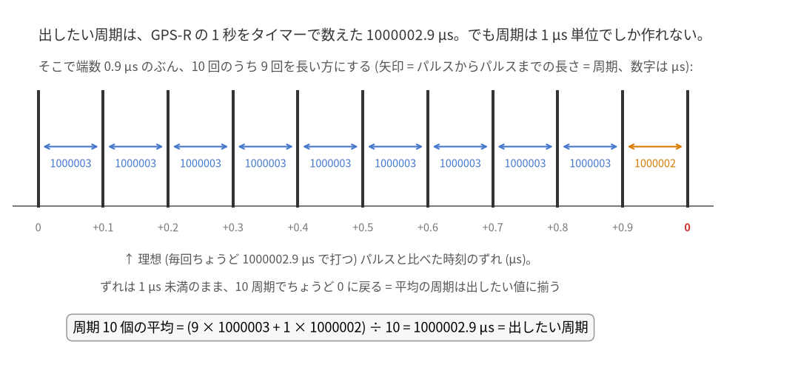

実際のログでも、周波数が落ち着くと毎周期 1000002〜1000004 µs を選び分けて、平均は狙いどおりになる。ただ、平均を細かく作れても、GPS-R 1PPS 周期をソフトで計った隣り合う差(連続する 2 回の読み値の差)は σ 3083 ns、約 3.1 µs ある。ソフトで時刻を計っている限り、µs の揺れからは抜けられない。

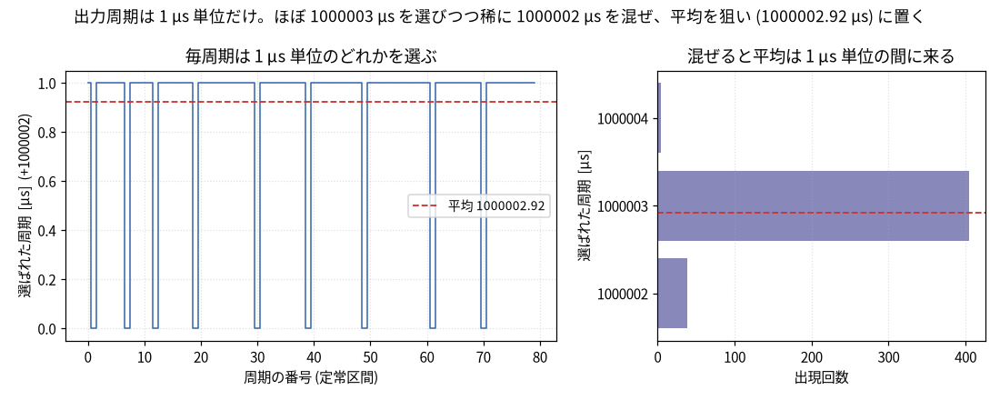

## PIO にエッジを任せる

測る側の µs の揺れが邪魔になってきたので、次は PIO を使う。PIO は Pico に載っている小さな補助ユニット (プログラマブル I/O) で、数命令の短いプログラムを、CPU とは独立に一定のクロックで回し続けられる。これに 1PPS のエッジ捕捉を任せる。擬似コードで書くとこうなる。

```text
// PIO の中で回り続ける小さなプログラム (CPU から独立、一定クロックで動く)
loop {
    X = X - 1;                // カウンタを刻む (2 クロックごと = 16 ns に 1 目盛り)
    if (rising_edge(gps_pin)) {
        FIFO に X を積む;     // この瞬間のカウンタ値がエッジのタイムスタンプ
    }
}

// CPU 側: FIFO をあとから読むだけ。読むのが遅れても、タイムスタンプはもう変わらない
```

タイマーと割り込みの構成との違いは、タイムスタンプを決めるのがハードだという点にある。エッジが来た瞬間のカウンタ値は PIO の中で確定していて、CPU がいつ FIFO を読んでも変わらない。critical section の待ちは、もう時刻に乗らない。出力側も同じで、指定した時刻が来た瞬間にピンを上げるところまでをハードがやる。CPU の仕事は、制御値を計算して次の指定時刻を渡すことだけになる。

同じ GPS-R 1PPS 周期を PIO で測ると、隣り合う差は σ 14 ns まで落ちる。ソフトで見えていた µs の揺れから約 200 倍の縮小だ。PIO の目盛りは 16 ns、MT3333 の 1PPS 自身も ±10 ns 相当の揺れを持つ。だからこの σ 14 ns は計測ノイズというより、合わせ込む相手である GPS-R 1PPS そのものの短期ジッタを見ていると考えるほうが近い。以後の数十 ns の議論では、これより下は詰めようのない下限になる。出力周期の揺れも σ 約 10 ns に収まる。ここでようやく、周期を寄せる制御の細かさを、測定系の揺れに埋もれさせずに見られるようになる。

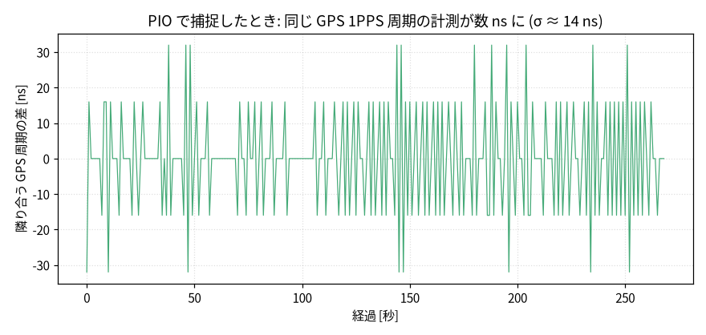

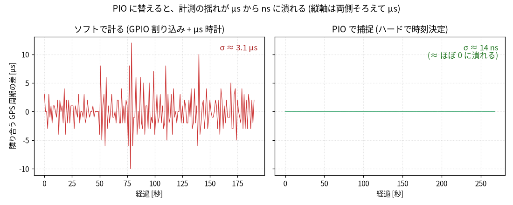

## PLL で位相を閉じる

ここから先は、出力の位相を GPS-R にぴったり合わせにいく。そのためにはまず、GPSDO PPS が GPS-R 1PPS からどれだけズレているかを測らなければならない。そこで出力を一本のワイヤで Pico に戻し(loopback)、GPS-R のエッジと同じように PIO で捕まえて、出力と GPS-R の位相差を内部で測る。この内部で測った位相差を、ここでは loopback 位相と呼ぶ(firmware のログでは hwphase という)。この流れを図にすると、次のようになる。


```mermaid
flowchart LR
  GPS["GPS-R 1PPS"] --> CAP["PIO でエッジ捕捉"]
  CAP --> EST["水晶の速さを推定"]
  EST --> PLL["PLL で位相を戻す"]
  PLL --> OUT["GPSDO PPS"]
  OUT -.-> LOOP["loopback で位相を観測"]
  LOOP --> PLL
```

追加する配線は 1 本だけで、出力の GP3 を GP4 へ戻す。

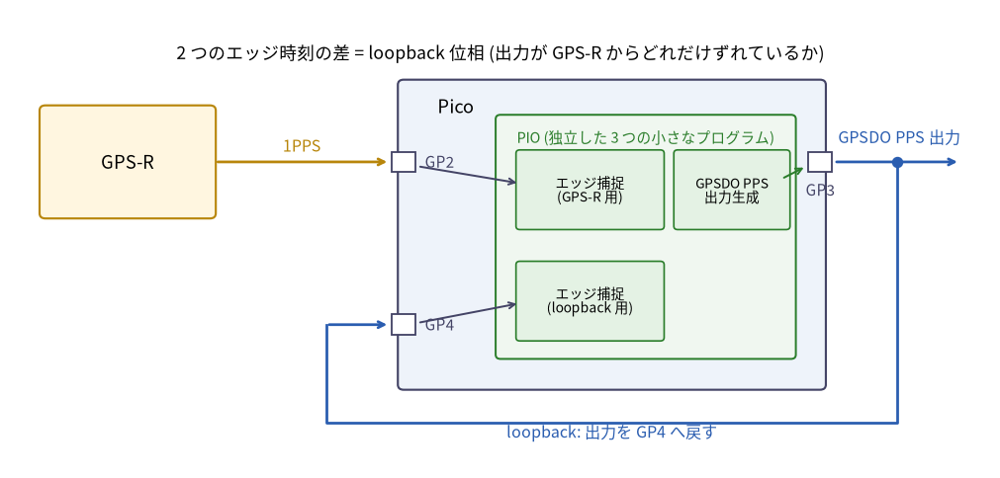

ただ、PIO だけではまだ開ループだ。開ループというのは、測った位相差を出力へ戻していない状態を指す。周波数を合わせただけのときと同じで、位相差は成り行きの場所に居座ったまま、残った小さな周波数ズレのぶんゆっくり動き続ける。この動きは σ にして約 1866 ns、およそ 1.9 µs ある。

そこで PLL (Phase-Locked Loop) を入れる。ここでは、GPS-R 1PPS と GPSDO PPS の位相差を見ながら出力周期を少しずつ戻す制御ループを指す。出力位相が進んでいれば少し遅らせ、遅れていれば進める。PIO がエッジの測定と生成を安定させ、PLL がゆっくりした位相の流れを戻す、という役割分担になる。

PLL で閉じると、開ループで σ 約 1866 ns だった位相差は、ロック中 σ 185 ns まで縮む。30 秒ごとに区切って σ を取ると平均 62 ns まで下がり、計測時間のうちロックしていた割合は 84.3% になる。直線的に流れていた位相が、GPS-R の近くへ寄っていってロックする様子が見える。

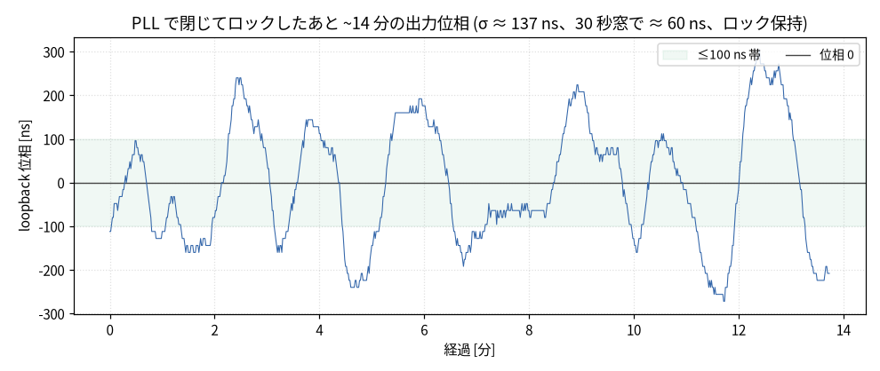

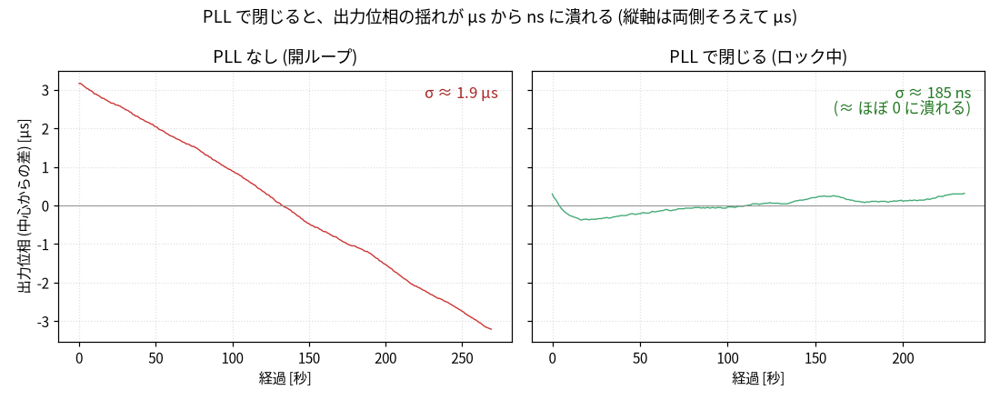

ここまでの結果を並べると、計測の揺れも位相差の揺れも、改良のたびに桁で縮んできた。ただ、位相差はまだ目標の 100 ns の外にいる。

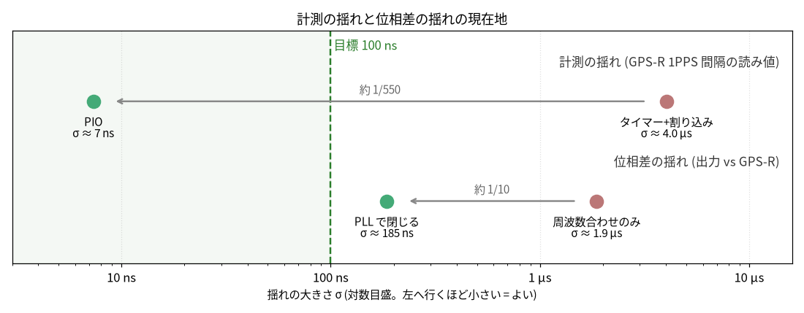

ロックはするので、次は何が σ を決めているかを制御器ごとに切り分ける。制御器は、位相差に比例した補正を返す P (比例)、位相差の変化に反応する D (微分)、たまった差を打ち消しにいく I (積分) の組み合わせでできている。P と PD は I を持たないため、出力に +370〜470 ns のオフセットが残る。σ は P 単体で約 120 ns。D 項が速い揺れを減衰する分、PD では約 30 ns まで締まる。ただし、どちらも中心へ戻し切る力はない。

I を入れた PI と PID では、オフセットは 0 中心へ戻る。その代わり、位相と周波数を同時に戻す type-II ループになり、ループ遅れを含んだ固有の振動が出る。PI は σ 約 370 ns、PID では D 項が振動を減衰して σ 約 300 ns、平均はほぼ 0 になる。中心に戻すために I は必要だが、そのままでは振動が σ を支配してしまう。


この σ 約 300 ns の中身を誤差収支で見ると、16 ns の測定量子化は σ にして約 4.6 ns、GPS-R PPS の揺れは約 10 ns で、合わせても約 11 ns にしかならない。これは分散の 0.13% にすぎず、σ のほとんどは測定の粗さではなく制御のリミットサイクルだ。リミットサイクルは制御が作る小さな持続振動で、この場合は type-II の固有振動として見えていて、周期は約 71 秒、減衰比は約 0.35 になる。PIO を overclock して量子化を 8 ns に細かくしても、ここにはほとんど効かない。詰めるべき相手は測定より制御だと見えてくる。

そこで Smith 予測子を入れる。Smith 予測子は、すでに出力へ指示したのにまだ観測位相に現れていない補正ぶんを、モデルで見積もって先回りで差し引く遅延補償だ。ここでは、前の秒に出したばかりでまだ観測に現れていない補正ぶんを、観測した位相差から差し引いた値で制御する。観測をそのまま見るよりループの遅れが実質的に減るため、高めのゲインでも安定し、σ は約 300 ns から約 35 ns まで締まる。およそ 9 倍の改善だ。以後の構成はこの PID+Smith を使っていて、先に出した 30 秒窓 σ 約 60 ns もこの構成で出した数字になる。

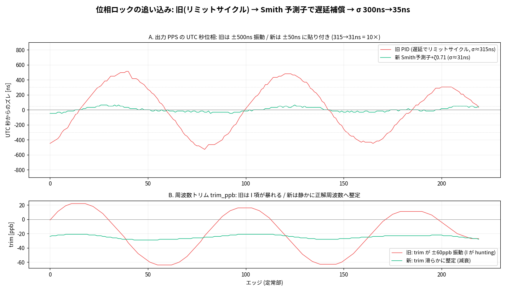

## オシロで答え合わせをする

PLL を入れると内部の loopback 位相は 0 付近に寄る。ただ、内部で合っていることと、ピンの上で合っていることは別の話だ。ピンの上で合っているとは、実際の出力ピンと GPS-R PPS ピンの位相が、外部計器で見て揃っているという意味になる。loopback 経路に固定のズレがあると、内部では合って見えてもピンの上ではズレる。

まず、内部の loopback 位相そのものに校正が要る。出力と GPS-R は別々の PIO カウンタで捕捉していて、2 つのカウンタは数え始めの瞬間が違うから、読みは常に一定量ズレている。この差をここではカウンタのズレと呼ぶ。大きさは 2 つを有効化するコードの間隔で決まり、この firmware では実測でおよそ 5500 tick (1 tick は PIO の 16 ns 目盛りで、88 µs ぶん)、目標 100 ns の 1000 倍ある。

直感的には、これは単なる固定オフセットのはずだ。数え始めの差は一定だし、同じクロックで刻む 2 つのカウンタが勝手に離れていく理由はない。だから起動時に一度だけ測って、差し引くことにする。測り方は単純で、同じエッジを 2 つのカウンタに見せれば、同じ瞬間の読みどうしの差がカウンタのズレそのものになる。

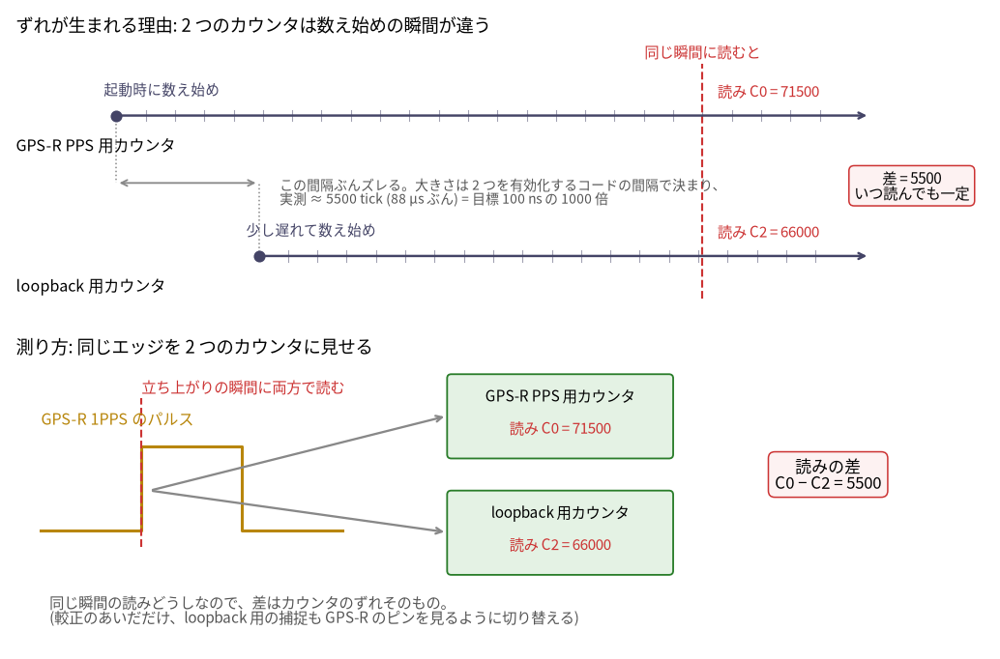

ところが、これで終わらなかった。起動時に校正した構成をオシロで見続けると、内部の loopback 位相は 0 付近のままなのに、ピンの上の位相差は時間とともにまた歩いていく。落ち着いてから約 20 分の時点で +249 ns (30 発平均、σ 18 ns)。つまりカウンタのズレは固定ではなく、動作中に少しずつスリップしていて、firmware は古い値のまま 0 を作り続けている。放置すると数 ns/min で歩く(この日の計測では +3.8 ns/min、以前の計測では +5.3 ns/min)。以前 793 ns の隠れたズレが出たのも、このスリップの放置が原因だった。

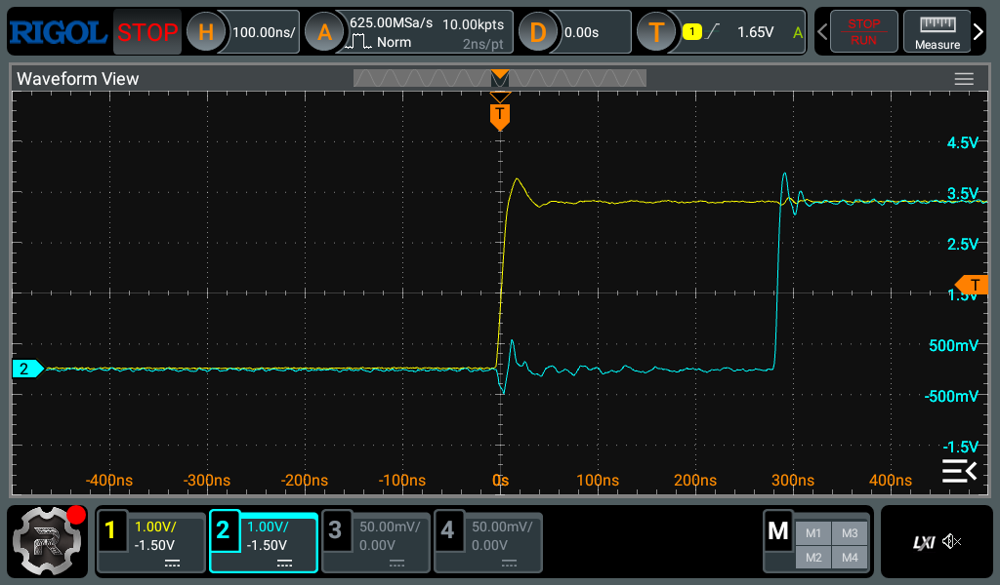

スリップの出どころは、この時点では分からない。ただカウンタのズレは測れる量なので、原因を知らなくても、測り直し続ければ追従できる。そこで約 2.5 分ごとにこれを測り直す。これを以後、定期校正と呼ぶ。測り直した値は急に飛ばさず、ゆっくり寄せるようにする。これでズレはほぼ止まり、長い目で見た傾きはほぼ 0 (この計測では −0.1 ns/min、以前の計測では +0.3 ns/min) に抑えられる。

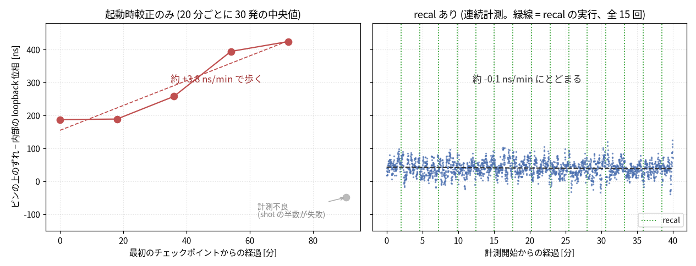

オシロで直接見ても、定期校正ありの出力エッジは GPS-R の +40 ns 前後に居座り続ける。下は上の連続計測中、ズレが走行平均の近傍にいた瞬間の 1 コマだ。

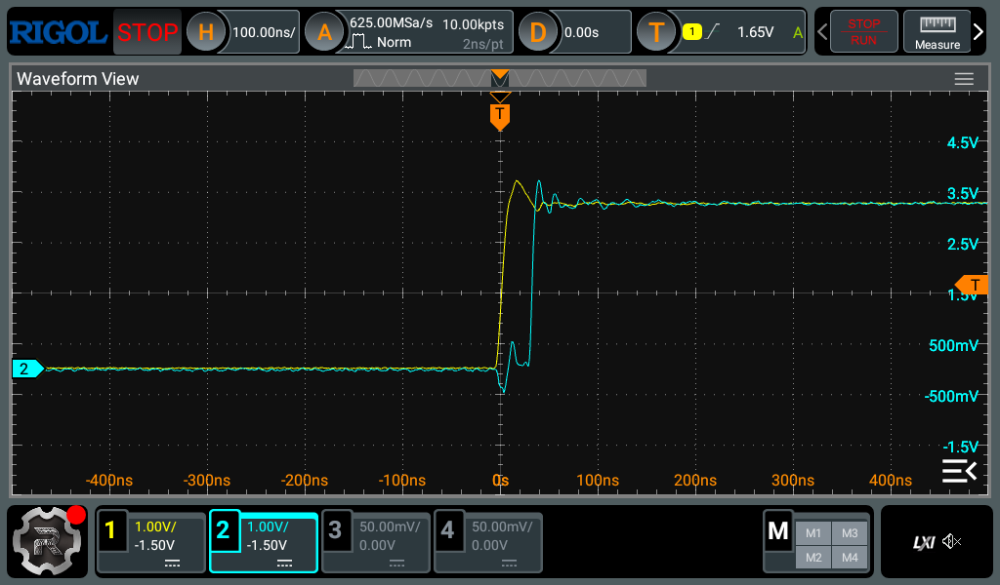

長期の中心を GPS-R 相対で安定させているのはこの仕組みで、ロックが 1 時間保つ下地にもなっている。

| 構成 | scope mean | scope std | ≤100 ns 率 |
|---|---:|---:|---:|
| PLL のみ、定期校正なし | +131.5 ns | 85.5 ns | 35% |
| 全部入り構成 (定期校正あり) | +33 ns | 約 20〜70 ns (窓によって変わる) | 穏やかな窓で 100%、揺れる窓で約 75% |

定期校正なしでは、出力は GPS-R に対して +131.5 ns に寄っていて、オシロの単発測定のうち ≤100 ns に入るのは 35% だけになる。ここまでの改良に、このあと足す温度補正まで入れた構成を、以後まとめて全部入り構成と呼ぶ。この構成ではカウンタのズレのスリップが抑えられ、GPS-R 相対の中心は安定する。一方で、定期校正をかけても、出力ピンと GPS-R PPS ピンの間には、時間で動かない一定のズレが残る。オシロでピンの上を直接見ると、全部入り構成の中心は +33 ns あたりにいて、0 ではない。loopback からは見えないずれなので、この時点では、pad や基板の配線、オシロのプローブを信号が伝わる時間の差だと考えていた。この見立ては次の節で覆る。

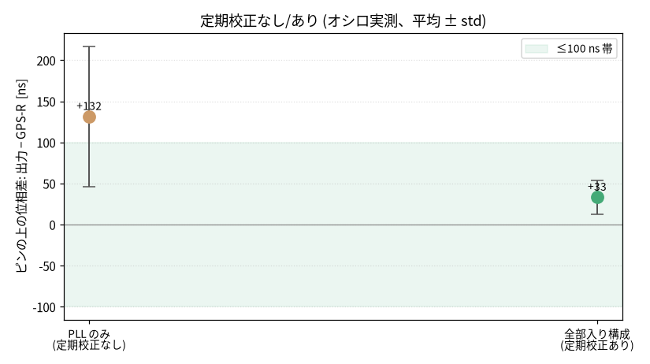

この安定は長時間でも保つ。全部入り構成を数時間走らせたあとにオシロで 30 発測っても、中心は +26 ns (σ 41 ns) にいた。

この固定のズレは、オシロの観測結果を制御に使えば消すことができる。ただ、firmware の中で処理を完結させたいので、やらない。オシロ計測にはプローブの遅れの差などのバイアスも入り得るので、それを firmware に焼き込むと計測系の癖まで固定してしまう。オシロは、ピンの上で実際に揃っているかを外から確かめる検証に使い、出力のチューニングには使わない。

なお、以前見えた 793 ns の隠れたズレは定期校正で消えていて、いま残っている +33 ns はそれとは別の固定のズレだ。

性能の数字を取るときは、落ち着くのを待つ。収束の途中で測ると、定常の実力とは別物の数字が出る。実際、最初の測定は収束途中のオーバーシュートの最中に取ってしまっていて、scope mean は +216 ns、≤100 ns 率は 0% だった。このとき loopback 位相も +272〜304 ns に振れている。

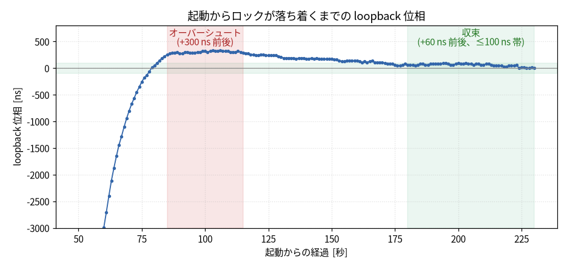

オシロ画面で見ると、落ち着いたあとの出力エッジ(青)は GPS-R エッジ(黄)から +33 ns ほど後ろにいる。表示は 30 ns/div、single trigger。定量値としては、上の表の scope mean と scope std を見る。

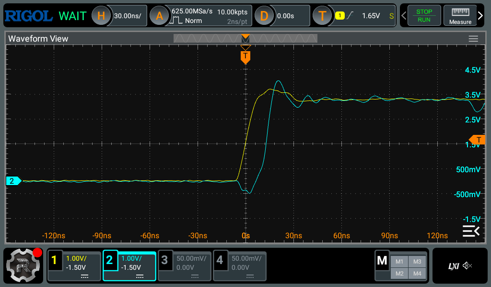

さらに、この出力エッジは 1 点に止まらず、フレームごとにゆっくりゆらいでいる。同じ設定で連続して撮ると、+33 ns あたりを中心に出力エッジが行ったり来たりする様子が見える。

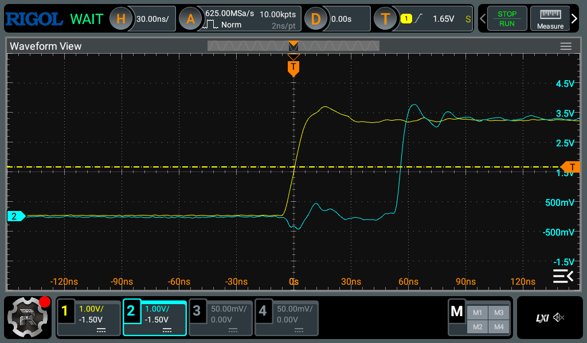

## カウンタのズレはなぜスリップするのか

定期校正でスリップには追従できたが、出どころは分からないままだった。ログには妙な癖も見えている。定期校正が測り直すたびに出るズレ量が、毎回ほぼ同じ −4〜−5 tick (2.5 分あたり −64〜−80 ns) なのだ。1 分あたりに直すと約 26〜32 ns/min で、放置したときにピンがズレていく実測 (+3.8〜+5.3 ns/min) の 5〜8 倍もある。内部が見ているスリップと、ピンに出るスリップは、同じものに見えない。

説明の候補を 3 つ立てた。前提として、定期校正は loopback 側のカウンタを一瞬 GPS-R のピンへ向けて同じエッジを見せ、測り終えたら出力へ戻す、という往復の切替でできている。

- **個体差**: 同じクロックで刻んでいても、カウンタごとに進み方がわずかに違う。
- **波形依存**: 捕捉プログラムの振る舞いは見ているピンの波形に左右されるから、GPS-R の非同期なエッジを見る側と、自分の出力の同期したエッジを見る側で、刻みの抜け方が変わる。
- **校正手続きの見かけ**: カウンタ自体はズレておらず、定期校正の切替そのものが毎回一定のズレを作っている。

切り分けには観測を 1 本足すのが早い。PIO には捕捉プログラムを走らせられる枠が 1 本余っているので、3 本目のカウンタを GPS-R のピンへ常時向け、既存の 2 本と合わせて 3 つの読みを毎秒すべてログしながら 2.4 時間流す。オシロも並走させて、ピンの上の真値と突き合わせる。同じピンを見る 2 本の差が動けば個体差で、動かなければ残りの 2 つに絞れる。

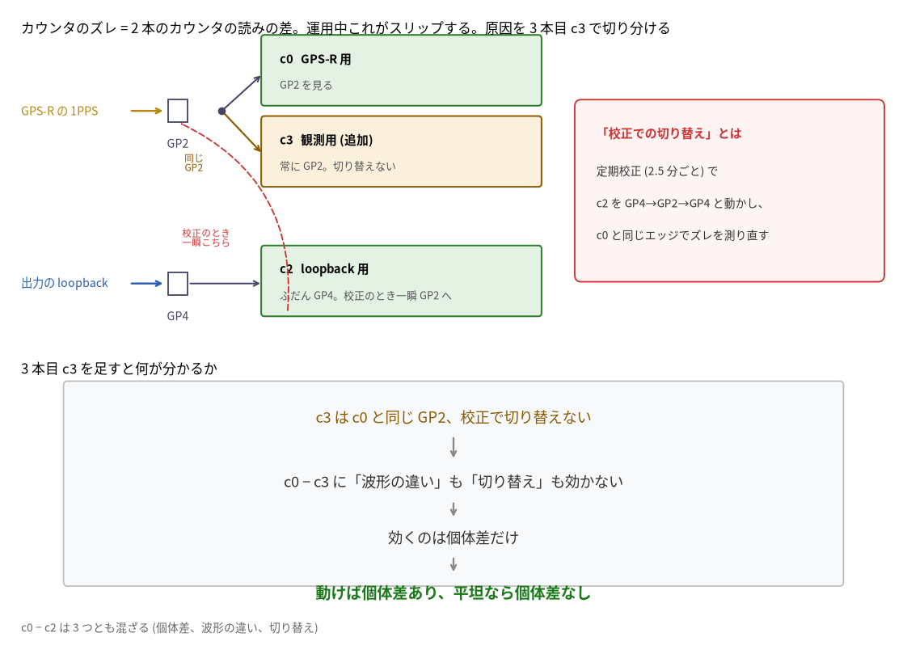

結果は仮説を 1 つに絞った。同じ GPS-R ピンを見る 2 本の差は、2.4 時間で量子化の ±1 tick を残して平坦のまま動かない (傾きは 0.000 ns/min)。個体差は消えた。定期校正が測るズレは 56 回中 42 回がぴったり −4 tick で、温度とは無相関だった。連続してたまるドリフトではなく、校正 1 回につき 1 個ずつ出る固定量ということになる。そして肝心のピンの上は、オシロで見るかぎり 2.4 時間ずっと平坦のまま (傾き −0.006 ns/min)。つまり −4 tick は、切替が自分で作り、次の校正がズレごと測り直して自分で打ち消す、ピンに届かない見かけの量になる。残るのは校正手続きの見かけ、それも切替 1 回あたりの固定量という形だ。

では、切替の何がカウンタを 4 tick 遅らせるのか。切替に使っているのは PIO を操作するライブラリの設定関数で、これはピン番号だけ変えたい場合でも、クロック分周や FIFO などの設定レジスタ一式を毎回書き直す。疑いを直接確かめるため、3 本目のカウンタ (純観測なので、何をしても制御に影響しない) に「値を変えない」書き込みを 1 分おきに打ち分けた。設定関数を丸ごと呼ぶ場合と、設定レジスタを 1 本ずつ同じ値で書き直す場合とで、同じピンを見る 2 本の差に段が出るかを見る。

結果ははっきり割れた。レジスタを 1 本ずつ同じ値で書いても、どのレジスタでも差は動かない。設定関数を丸ごと呼んだときだけ、1 呼び出しにつきカウンタがちょうど 2 tick 遅れる。

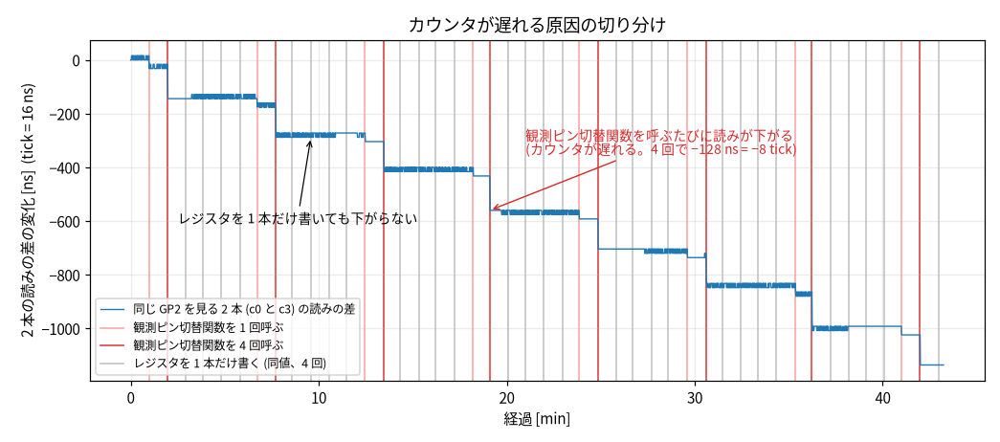

犯人は設定関数の最後の一手だった。この関数はレジスタを書き終えたあと、走行中のプログラムへ「先頭へ跳べ」という命令を割り込ませる。捕捉プログラムの実物は、エッジを FIFO へ積む数命令のあいだ X = X − 1 の減算が止まる作りになっている (擬似コードでは省いた細部だ)。切替はエッジ処理の直後、パルスがまだ high のうちに走るので、先頭へ跳んだプログラムはピンが high なのを見て、偽のエッジ捕捉を 1 回やり直す。強制ジャンプと偽捕捉で合わせて 4 サイクル、減算が止まる。1 tick は 2 サイクルだから、ちょうど −2 tick。定期校正は GPS-R へ向ける切替と出力へ戻す切替で 2 回呼ぶので、1 回の校正あたり −4 tick になる。この機構なら偽のエッジが FIFO に 1 個積まれるはずで、その予言もログでそのまま確認できた。

この機構は、+33 ns の固定のズレの正体でもあった。校正は起動時も定期も、カウンタのズレを測り終えてから出力側のピンへ切り替えて戻る。この戻しの切替で失う 2 tick (32 ns) は、いま測ったばかりのズレには入っていない。次の校正まではそのズレのまま制御し、制御は loopback 位相を 0 に保つから、ズレに入らなかった 32 ns はそのままピンの上へ押し出される。どの校正の直後も同じだけ取りこぼすので、出力は常に +32 ns 側へ座り続ける。配線やプローブの遅れと考えていた +33 ns は、ほぼまるごとこの取りこぼしだった。

直し方は、実験がそのまま教えてくれる。切替のときに設定を丸ごと書き直すのをやめ、どのピンを見るかのレジスタフィールドだけを書き換える (設定関数を通さずレジスタを直接書くだけなら段が出ないことは、上の実験で確認済みだ)。1 時間の検証で、定期校正が測るズレは 23 回中 20 回が −1 tick になり、ぴったり −4 は消えた。ピンの上の中心も、修正直前の計測の +46 ns (中心そのものがゆっくりゆらぐので、窓の取り方で +33〜+46 ns を動く) から +9 ns へ動いた。移動量の約 37 ns は、取りこぼしていた 32 ns と、このゆらぎの誤差の範囲で一致する。ここまでの節で +33 ns と書いてきた中心は、この修正のあとは +9 ns 前後になる。

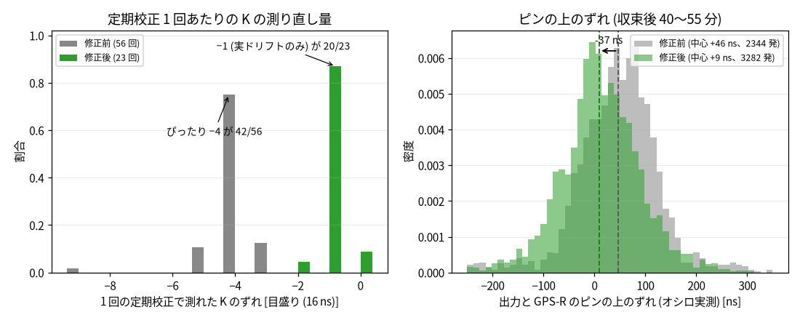

残った −1 tick/2.5 分 (約 6 ns/min) が、起動時校正だけの構成でピンが歩いて見えていた実ドリフトの本体だ。ピンで見えていた +3.8〜+5.3 ns/min とおおむね同じ大きさで、冒頭の食い違いは切替の見かけを差し引くと消える。定期校正はこの実ドリフトを吸収するために残す。出どころはまだ特定していない。同じ GPS-R ピンを見る 2 本のカウンタは 2.4 時間見てもレートで離れなかったので、残る容疑は 3 つの候補のうちの波形依存になる。非同期な GPS-R エッジと同期した出力エッジとで、エッジを捕まえる位置の平均がゆっくり動く筋だ。

## 長時間でのふらつき

ピンの上の中心が安定するところまで来たので、次は全部入り構成のまま 1 時間流す。1 時間ずっと連続で記録できるのは、オシロのスポット計測ではなく firmware が内部で見ている loopback 位相のほうなので、ここではそれを見る。外から熱は加えず、室温が自然に約 1.3℃ 動く環境で、落ち着いたあともロックを保ったまま、1 秒ごとのログを 3597 行残している。

1 時間を通してみると loopback 位相の平均は +1.1 ns とほぼ中心にあり、ばらつきは σ 61.5 ns、全体の 90% は ±96 ns に収まる。窓を短く取るほど数字は締まり、30 秒窓では σ が平均 35.2 ns(最大でも 123.1 ns)まで下がる。逆に 120 秒窓まで広げると平均 57.1 ns に増える。窓が長いほど、ゆっくりした動きを拾うからだ。1 時間全体で ≤100 ns に収まったのは 91.8%(3303/3597)になる。

短い窓では 35 ns 前後まで収まる一方で、1 時間ずっと ≤100 ns に入り続けるわけではない。100 ns を超えた約 8% は、速いジッタではなく、ゆっくりした位相のふらつきの山で出ている。以後、このゆっくりした位相の動きを「遅いふらつき」と呼ぶ。

遅いふらつきの出所を見るため、120 秒窓ごとの loopback 位相 σ を sats、HDOP、温度と比べる。sats は受信している衛星数、HDOP は衛星配置から来る水平位置精度の目安で、どちらも受信状態の代理指標になる。このログで一番相関が強いのは温度で、相関係数は +0.47 ある。受信側は sats +0.20、HDOP −0.24 にとどまる。

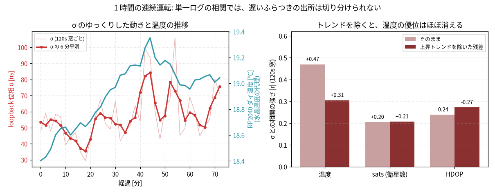

この 1 時間ログでは、遅いふらつきは受信状態より発振器側の温度に寄って見える。ただ、温度は単調に動きやすく、単一ログの相関は強く見えやすい。そこで、仮説を切り分ける実験を重ねる。

まず、制御ループ自身が遅いふらつきを作っていないかを、受信に依らず確かめる。PRBS でループの応答を直接測る。PRBS は既知の擬似ランダム 2 値系列で、これを制御に小さく注入し、loopback 位相に出てくる応答とその系列の相互相関を取る。系列と無相関な受信ノイズは平均で消えるので、ループ自身の応答の形だけが残る。

測った応答は、ループの帯域を 3 通りに変えてもよく減衰していて、共振のピークは出ない。以前はこの遅い揺れを、ループの固有周期の共振を受信ノイズが叩いたものと見ていたが、その説明はこの受信非依存の計測と合わない。潰すべき type-II 共振は、少なくともこの測定では見えていない。実際、帯域、減衰、制御器の形、受信品質での選別のどれを触っても、遅いふらつきの振幅は下がらない。制御の形を整えて削れる成分ではない、という見方が強くなる。

残るのは、制御が水晶に当てている周波数補正(±5〜20 ppb。1 ppb は 1 ns/s にあたる)に現れる低周波のゆらぎで、これは温度と相関係数約 0.8 で相関する。速い側の揺れは約 13〜18 ns が下限で、こちらは受信の質で決まっているように見えるが、遅いふらつきの主成分の 1/10 にすぎない。スペクトルで見ても、揺れの大きさの約 85% は周期 64〜300 秒の帯にあり、1 時間ログで温度との相関係数 +0.47 が出たこととも向きは合っている。遅いふらつきは受信より、発振器や水晶側の温度に寄っているらしい。最終的に確定するには外部の独立基準が要る(この結論は過去に一度反転してもいる)。

## 温度を急に変える

温度の影響が見えてきたので、基板を手で急に温めて確かめる。数秒で 0.7〜1.4℃ 上がる速い外乱で、通常の室温変化よりかなり厳しい。ここで使う温度は RP2040 の内蔵センサで測った温度で、水晶そのものの温度ではなく、同じ基板の上の代理指標になる。

まず、温度の補正を何も持たない構成(定期校正はあり)で加熱する。loopback 位相は温度 1℃ あたり数千 ns 級で振れる。4 回の加熱で peak/℃ の中央値は 4409 ns、最悪は 10166 ns で、定常の 100 ns から 2 桁近く外れる。

温度が効いているなら、温度を測って先回りすればよい。それが温度フィードフォワードで、温度変化から水晶の周波数変化を見積もり、出力周期へ補正を入れる。熱が伝わる遅れに合わせて補正を先行させる成分を matched-lead と呼ぶ。これも全部入り構成に含まれる補正だ。

同じ加熱を、あり(全部入り)となし(定期校正のみ)で繰り返して比べる。

| 指標 | 温度フィードフォワードあり 中央値、n=3 | 温度フィードフォワードなし 中央値、n=4 |
|---|---:|---:|
| peak / ℃ | 1241 ns | 4409 ns |
| ∫\|loopback 位相\|/℃ | 22283 ns·s | 43112 ns·s |

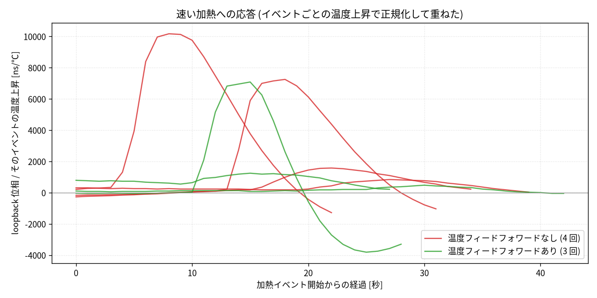

中央値だけを見るとありのほうが小さい。ただし、peak/℃ の範囲は大きく重なり、あり 474〜7079 ns/℃、なし 836〜10166 ns/℃ になる。最悪の速いステップでは、ありでも loopback 位相が +8640 / −4656 ns と正負両方向に振れ、≤100 ns 帯へ戻るまで約 28 秒かかる(このとき温度は数秒で約 +1.3℃ 上がっている)。絶対ピークで見れば、なしの最悪 7856 ns と同程度だ。n も 3 対 4 と小さいので、中央値だけでは温度フィードフォワードが確実に効くとは言えない。

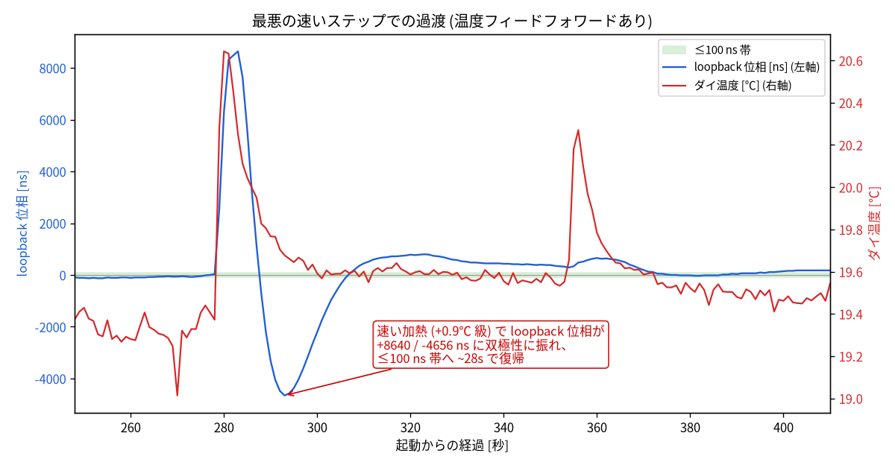

## 過反応を止める

ログを追うと、温度フィードフォワードが実際の水晶変化に対して大きすぎることが見えてくる。速い加熱でフィードフォワードは −1363 ppb まで膨らむが、落ち着いたあとに見える実際の水晶周波数変化は −0.773 ppb になる。比にするとおよそ 1800 倍で、温度の先読みが効きすぎたというより、別の推定器が大きく反応している。

matched-lead だけなら、同じような温度ステップでも約 41 ppb で止まる。−1363 ppb まで膨らむ分は、RP2040 の温度と水晶の温度のモデルのズレを、温度以外の残差を拾う推定器 (observer) が大きな補正として出してしまったものと見られる。

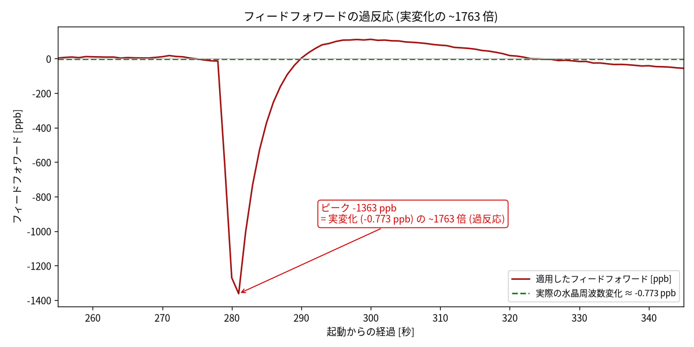

これは firmware 側で抑えられる不具合だ。温度予測と残差推定の和を、出力周期へ渡す直前で ±100 ppb に clamp する。clamp が効くのは出力へ渡す値だけで、holdover の時刻外挿には clamp 前の推定値をそのまま使う。

clamp 版を焼き、加熱レートを約 1.1℃/10s に揃えて A/B を取る。診断ログでも、出力へ渡る値が過渡中に ±100 ppb へ張り付いていて、clamp が効いていることを確認できる。loopback 位相の過渡 peak/℃ は、clamp なしの中央値 1241 ns/℃、最悪値 7079 ns/℃ から、clamp ありの中央値 600 ns/℃、最悪値 764 ns/℃ へ落ちる。

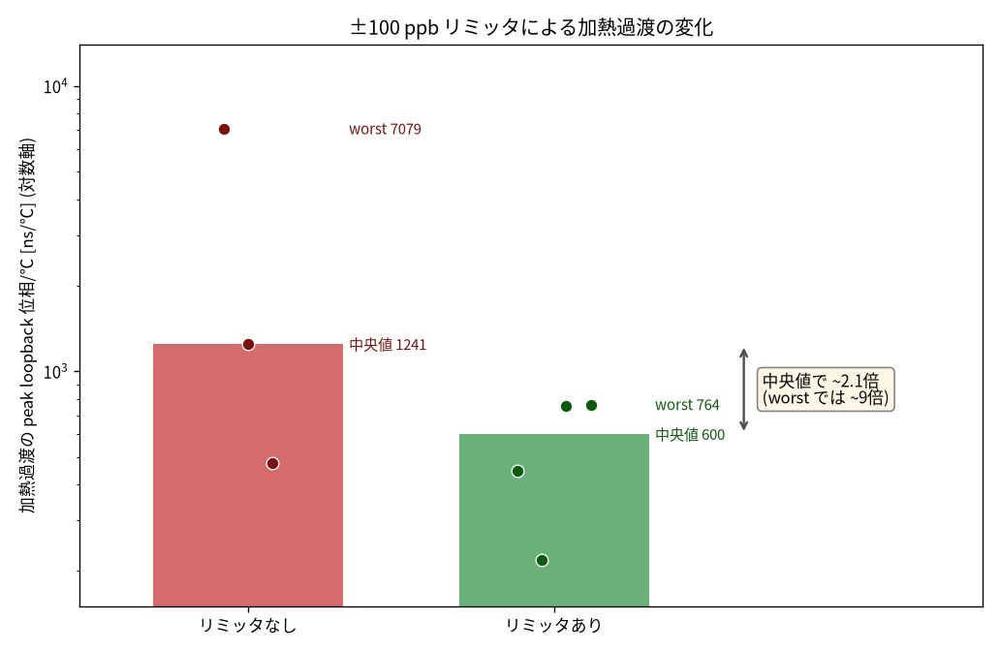

中央値では約 2 倍、最悪値では約 9 倍の改善になる。効きは激しいステップほど明確で、中央値が約 2 倍にとどまるのは、clamp なし側の中央値が穏やかなステップに引かれているためだ。絶対値で見ても、最悪で約 8.6 µs 級のスパイクが約 480 ns に収まる。

それでも、約 500 ns の過渡は残る。これは、フィードフォワードがおよそ 1800 倍に膨らむ不具合とは別物で、有限帯域の PLL が実際の水晶周波数変化に追いつくまでの応答と見るのが自然だ。速い温度外乱をさらに追うには帯域を広げる必要があるが、その方向へ寄せると定常時の遅いふらつきは悪化する。通常運用で ≤100 ns を狙う設計としては、速い熱外乱に対する短い過渡を許し、定常時の静かさを優先するほうが合っている。

## 再起動で戻るか

仕上げに、再起動しても同じあたりへ戻るかを見る。3 回 cold boot し、いずれも落ち着いた直後の同じ時点(起動から約 160 秒)で、オシロで見たピンの上の位相と loopback 位相を測る。

| boot | scope mean | scope std | ≤100 ns 率 | loopback 位相 mean |
|---:|---:|---:|---:|---:|
| 1 | +84.2 ns | 16.3 ns | 84% | 66.1 ns |
| 2 | +72.9 ns | 11.6 ns | 100% | 72.5 ns |
| 3 | +83.3 ns | 19.5 ns | 84% | 80.0 ns |

3 回とも ≤100 ns 帯に戻り、scope mean は +72.9〜+84.2 ns、boot 間の差は約 11 ns になる。loopback 位相も 66〜80 ns に入っている。起動のたびに任意の位置(数百 ms 単位)から始まっていたタイマーだけの頃と比べると、対照的な再現性だ。

ただし、この 3 回は、カウンタのズレのスリップの正体がまだ分かっておらず、ピンの上の中心を 0 の近くへ寄せるために出力へ一定量を足していた頃の測定になる(スリップの機構が分かって取りこぼしを直したいま、この下駄は外してある)。だから絶対の中心は今の全部入り構成とは別の位置にある。ここで見たいのは、boot 間のばらつきが約 11 ns と小さいこと、つまり再起動しても同じ位置へ戻ることだ。この再現性は中心の絶対位置に依らない。なお、この比較は落ち着いた直後の同じ時点を見たもので、長時間運転したあとの中心が boot ごとに同じになるかまでは確かめていない。

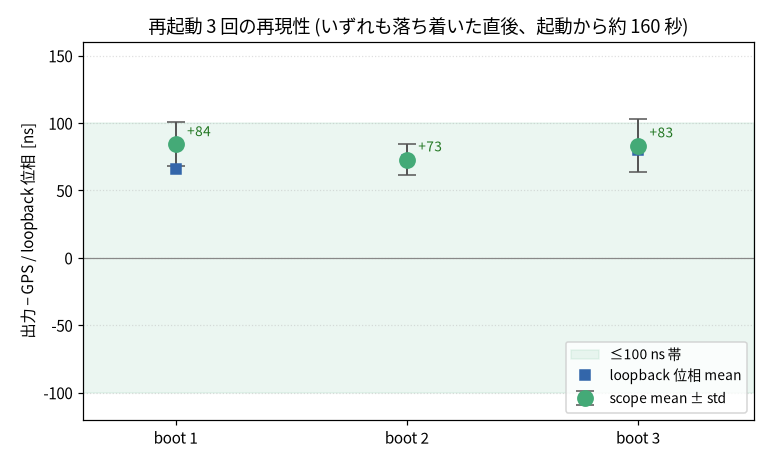

最後に、起動からロックへ収束していく様子を、オシロ波形と firmware の内部値(loopback 位相、水晶の補正量、温度など)を 1 秒ごとに重ねた動画で残しておく。ロックに入るまでは補正が大きく動き、やがてエッジの重なりも内部の値もそろって落ち着いていく。撮影は固定オフセットを入れていた頃のものになっている。

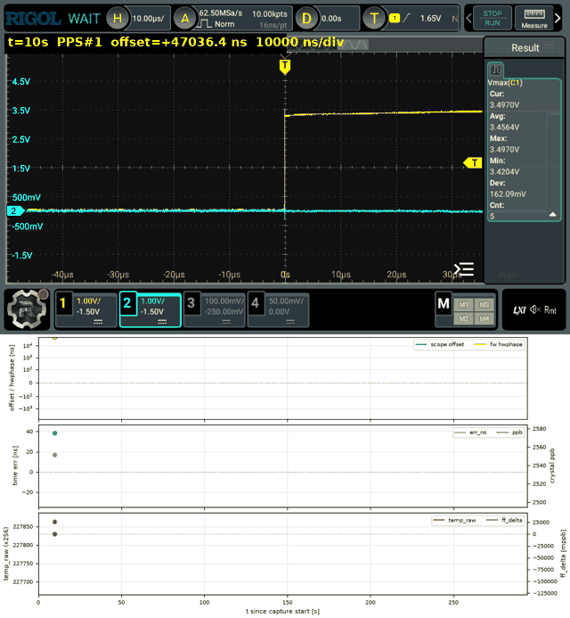

## まだ見ていないこと

ここまでで、同じ GPS-R の 1PPS に対して中心を安定させられること、カウンタのズレのスリップの機構を突き止めてピンの上の中心を +9 ns 前後まで寄せられたこと、温度の速い外乱には clamp が効くことまでは確認できた。残っている宿題もいくつかある。

再起動の再現性は、固定オフセットを入れていた頃に落ち着いた直後だけを見たものだ。今の全部入り構成で、長時間運転したあとの中心が boot ごとに同じ位置へ戻るかは、別の測定として残っている。

温度フィードフォワードの効果量も、手加熱の n=3 対 4 では、まだはっきりとは言えない。固定ヒータと水晶近傍センサを使い、ありなしを交互に十分な回数で取れば、効いている量とばらつきをもう少しきれいに分けられる。

残った実ドリフト (約 6 ns/min) の出どころも特定できていない。切替の見かけが消えた今は、定期校正が測るズレ量がこの実ドリフトだけを映すので、出どころを追うのも、校正間隔を伸ばす検討も、以前よりやりやすくなった。

真の UTC に対する絶対精度も、この測定だけでは言えない。TIC、Rb、2 台目の GPS-R のような独立した外部基準を使っていないからだ。ここで言えるのは、同じ GPS-R の 1PPS に対して、出力ピンの上でどれだけ揃ったか、内部観測とオシロがどれだけ違ったか、温度外乱で何が起きたか、という範囲になる。

どの測定にも共通する注意点は、ロックに入りきる前と、落ち着いたあとを混ぜないことだ。収束途中のオーバーシュートの最中に取ると、全部入り構成でも +216 ns、≤100 ns 率 0% のような値が出るため、mean だけでなく σ と窓別統計を見て、受信条件も一緒に残す必要がある。loopback 位相は便利な内部観測だが、ピンの上の実測ではない。ピンの上の話をするときは GPS-R の PPS を基準にオシロで確かめる。固定のズレは配線とは限らず、今回のように firmware 自身の取りこぼしが正体のこともある。