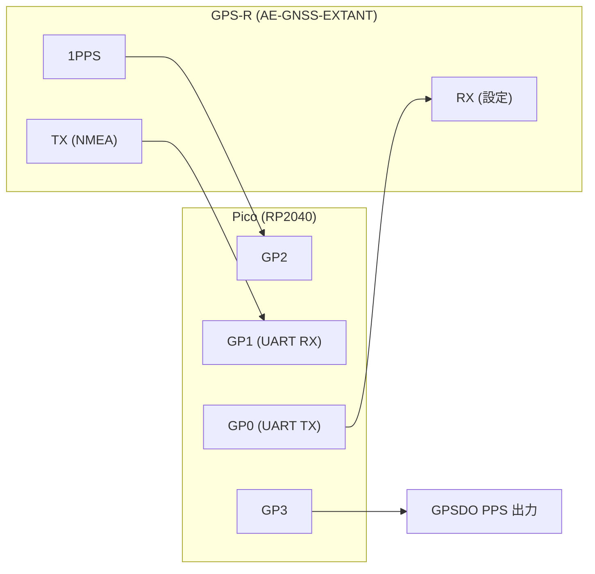
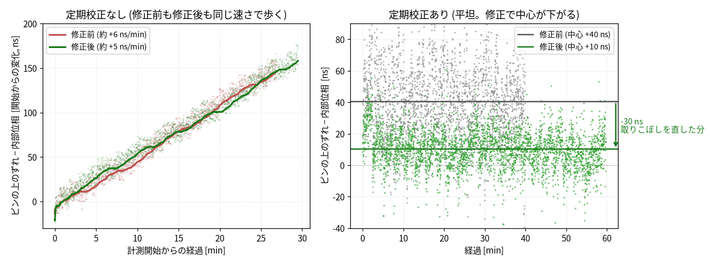
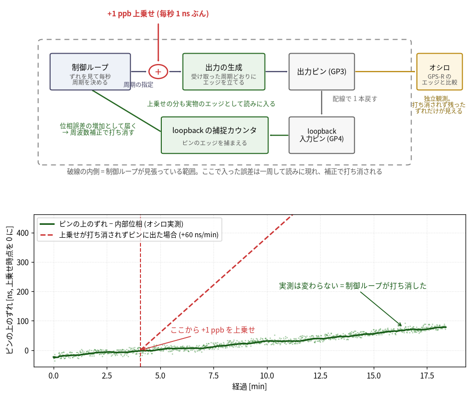
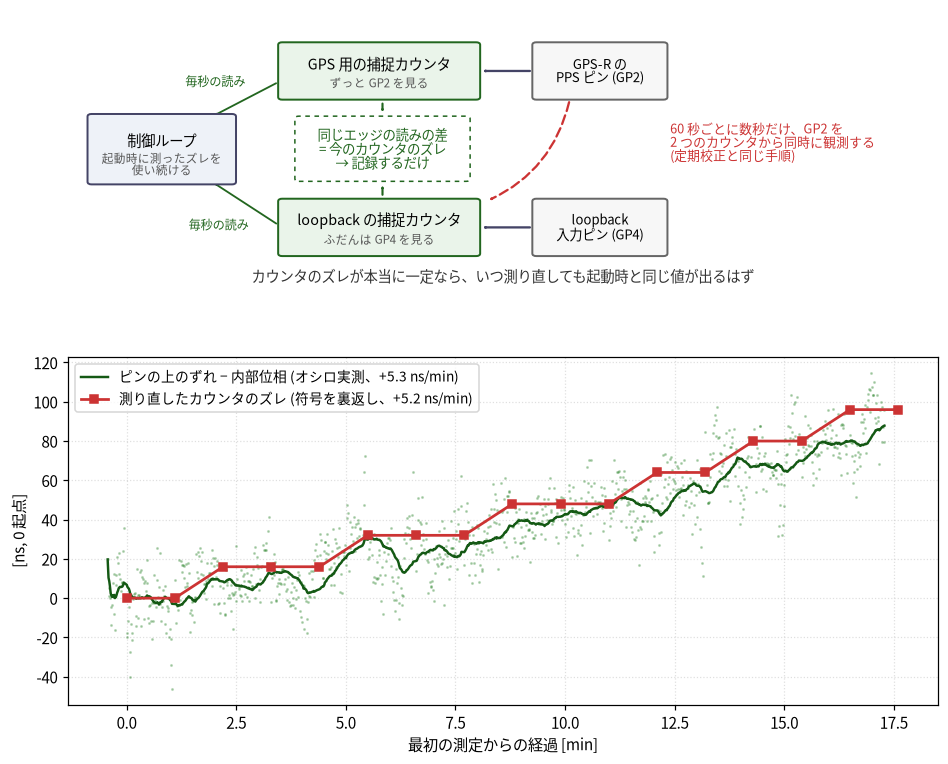
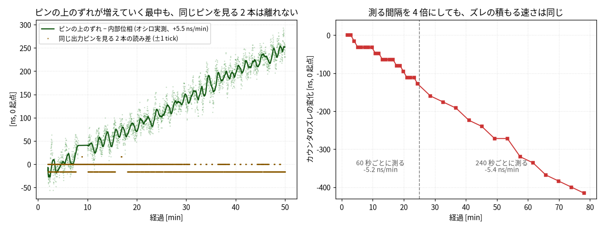
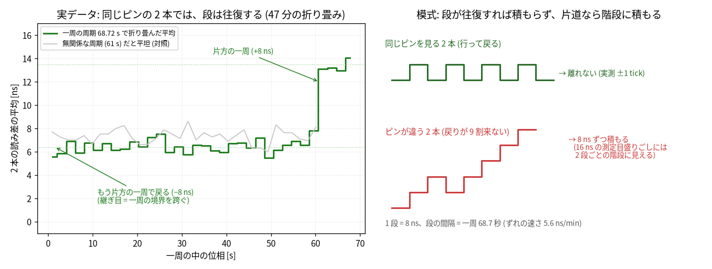
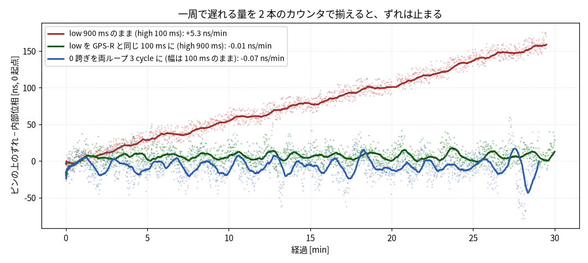
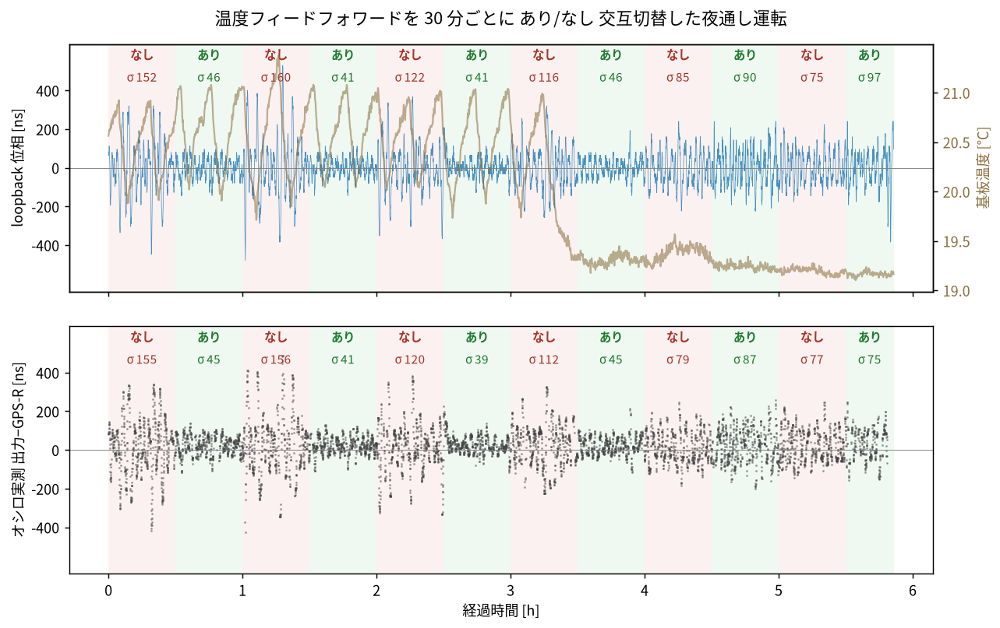

Raspberry Pi Pico に秋月の GNSS 受信モジュール [AE-GNSS-EXTANT](https://akizukidenshi.com/catalog/g/g113849/)(MediaTek MT3333、以下 GPS-R)を接続し、時刻同期の精度を詰めていく。GPS-R が 1 秒ごとに出す 1PPS に合わせて、Pico 側からも同期した 1PPS を出す GPSDO (GPS disciplined oscillator) を作っていく。

1PPS は、立ち上がりエッジが UTC の秒境界を指す基準になる。ただしその精度は GPS-R ごとに違い、MT3333 のデータシートでは PPS の時刻精度は typical ±10 ns とされている。Pico 側をどれだけ詰めても、最後はこの ±10 ns が天井になる。この記録では、GPS-R の 1PPS に対して 100 ns 以内で合い続ける出力を目標にする。
GPS-R からはこの 1PPS のほかに、時刻と測位を載せた NMEA 文字列も UART から出力される。

今回の構成は以下の通り。GPS-R の PPS と UART を Pico の GPIO で受け、別の GPIO から GPSDO PPS を出力する。




## まずは Pico のタイマーで素朴に 1PPS を作って様子を見る

まずは、シンプルに Pico のタイマーで 1PPS を出力するところから始める。Pico の内蔵タイマーは水晶から作ったクロックを刻んでいるので、1 秒ぶん進むたびに出力ピンを上げ下げすれば、1 秒周期のパルス、つまり 1PPS になる。タイミング検知には割り込みを使う。擬似コードで書くと、タイマー割り込みと GPIO 割り込みの 2 つのハンドラになる。

```text
// 起動時: 最初の立ち上がり時刻を予約する
next = timer.now();
schedule_at(next);

// タイマー割り込みハンドラ: 予約した時刻が来ると呼ばれる
on_timer() {
    out_pin.set_high();        // この立ち上がりが 1PPS
    // (パルス幅ぶん後に low へ戻すのも同様に予約する)
    next += 1s;                // 次の立ち上がりは 1 秒後
    schedule_at(next);
}

// GPIO 割り込みハンドラ: GPS-R 1PPS の立ち上がりで呼ばれる
on_gps_edge() {
    t = timer.now();           // 割り込みが上がってからここで読む
    interval = t - t_prev;     // GPS-R の 1 秒がタイマーでどう見えるか
    phase = t - last_out_edge; // 出力との位相差 (±0.5 秒に折り返す)
    t_prev = t;
}
```

その上で、この出力タイミングと GPS-R PPS の入力タイミングを比較すると、Pico のタイマー(の元になる水晶の発振周波数)がどれぐらいズレているかがわかる。比べる量は擬似コードの 2 つ、つまり間隔 `interval` と位相差 `phase` になる。

実際に 8 回起動して、位相差 `phase` を毎秒記録してみる。ズレは 2 つに分かれて見える。まず、起動直後の位相差は毎回バラバラで、1 秒の中のどこにでも落ちる。出力の秒の刻み目は firmware が起動した瞬間で決まり、GPS-R の秒境界とは無関係だからだ。これがオフセットのズレになる。もうひとつ、出力のエッジは GPS-R のエッジに対して、どの起動でも毎秒 2.5〜3 µs ずつ同じ向きに動き続ける。いまの室温では Pico の水晶が GPS-R より約 2.7 ppm 速く、出力の「1 秒」がわずかに短いためだ。これが間隔のズレになる。


エッジが動き続けるのは、測ったズレをまだ出力へ戻していないからだ。ズレを測って戻す前に、この測定自体の質も見ておく。

擬似コードのとおり、どちらのハンドラも CPU が割り込みに反応してから、ソフトウェアで時刻を読んだりピンを叩いたりする。この動き出すまでの遅れがそのまま読み値の揺れになる。さらに firmware には、共有データを守るために割り込みを一時的に止める区間 (critical section) があり、RP2040 の Cortex-M0+ ではこれが全割り込みのマスクになる。エッジがそこに当たると、区間が終わるまでハンドラは待たされる。

実際、8 回の boot で GPS-R 1PPS の間隔の読み値を集めると、92% は ±2 µs に収まる一方、まれに 10〜64 µs まで跳び、全体では σ 約 4 µs になる。大きく跳んだ読み値は、エッジが長めの critical section に当たった回と見られる。これは GPS-R の質ではなく、ソフトで時刻を扱う側の下限だ。


## GPS-R を見て周期を寄せる

水晶のズレが見えたので、次は GPS-R 1PPS が来るたびにその時刻を Pico のタイマーで読み、ズレに合わせて出力周期を少しずつ寄せる。Pico の水晶が速ければ次の周期をわずかに長くし、遅ければ短くする。PPS が届いている間に周波数を学習しておけば、PPS が途切れても推定で時刻を進められる。この状態を holdover と呼ぶ。

タイマーだけのときは、位相差が毎秒 µs 単位で動いていた。周期を寄せて周波数の推定が落ち着くと、位相差はほとんど動かなくなる。水晶のズレの大半は、これで打ち消せている。ただし、この補正で合わせているのは周期(1 秒の長さ)だけで、位相差そのものを 0 へ戻す力はない。だから位相差は成り行きの場所で止まる。この計測では +388 ms で止まり、その周りを σ 3.6 µs で揺れている。位相差を 0 へ寄せるのは、のちの PLL の仕事になる。

その周期合わせにも制約がある。出したい周期は「GPS-R の 1 秒」そのもので、Pico のタイマーで測ると、この計測では平均 1000002.9 µs にあたる。水晶が速いぶんタイマーの 1 µs はわずかに短く、本当の 1 秒を数えるには 1000002.9 個ぶん必要になるからだ(ズレの大きさは温度でも動くので、前の節の 8 回とは少し違う値になっている)。ところが出力周期は、タイマーの 1 µs 単位でしか指定できない。1000002 µs や 1000003 µs は出せても、端数の 0.9 µs は出せない。そこで、ある秒は 1000003 µs、別の秒は 1000002 µs、と混ぜて出し、何秒も平均すると 1000002.9 µs になるようにする。1 回ごとの周期は最大 1 µs 弱ズレるが、平均は狙いに乗る。これが一次 sigma-delta と呼ばれるやり方だ。


実際のログでも、周波数が落ち着くと毎周期 1000002〜1000004 µs を選び分けて、平均は狙いどおりになる。ただ、平均を細かく作れても、GPS-R 1PPS 周期をソフトで計った隣り合う差(連続する 2 回の読み値の差)は σ 3083 ns、約 3.1 µs ある。ソフトで時刻を計っている限り、µs の揺れからは抜けられない。


## PIO にエッジを任せる

測る側の µs の揺れが邪魔になってきたので、次は PIO を使う。PIO は Pico に載っている小さな補助ユニット (プログラマブル I/O) で、数命令の短いプログラムを、CPU とは独立に一定のクロックで回し続けられる。これに 1PPS のエッジ捕捉を任せる。擬似コードで書くとこうなる。

```text
// PIO の中で回り続ける小さなプログラム (CPU から独立、一定クロックで動く)
loop {
    X = X - 1;                // カウンタを刻む (2 クロックごと = 16 ns に 1 目盛り)
    if (rising_edge(gps_pin)) {
        push X to FIFO;       // この瞬間のカウンタ値がエッジのタイムスタンプ
    }
}

// CPU 側: FIFO をあとから読むだけ。読むのが遅れても、タイムスタンプはもう変わらない
```

タイマーと割り込みの構成との違いは、タイムスタンプを決めるのがハードだという点にある。エッジが来た瞬間のカウンタ値は PIO の中で確定していて、CPU がいつ FIFO を読んでも変わらない。critical section の待ちは、もう時刻に乗らない。出力側も同じで、指定した時刻が来た瞬間にピンを上げるところまでをハードがやる。CPU の仕事は、制御値を計算して次の指定時刻を渡すことだけになる。

同じ GPS-R 1PPS 周期を PIO で測ると、隣り合う差は σ 14 ns まで落ちる。ソフトで見えていた µs の揺れから約 200 倍の縮小だ。PIO の目盛りは 16 ns、MT3333 の 1PPS 自身も ±10 ns 相当の揺れを持つ。だからこの σ 14 ns は計測ノイズというより、合わせ込む相手である GPS-R 1PPS そのものの短期ジッタを見ていると考えるほうが近い。以後の数十 ns の議論では、これより下は詰めようのない下限になる。出力周期の揺れも σ 約 10 ns に収まる。ここでようやく、周期を寄せる制御の細かさを、測定系の揺れに埋もれさせずに見られるようになる。


## PLL で位相を閉じる

ここから先は、出力の位相を GPS-R にぴったり合わせにいく。そのためにはまず、GPSDO PPS が GPS-R 1PPS からどれだけズレているかを測らなければならない。そこで出力を一本のワイヤで Pico に戻し(loopback)、GPS-R のエッジと同じように PIO で捕まえて、出力と GPS-R の位相差を内部で測る。この内部で測った位相差を、ここでは loopback 位相と呼ぶ(firmware のログでは hwphase という)。この流れを図にすると、次のようになる。


追加する配線は 1 本だけで、出力の GP3 を GP4 へ戻す。


ただ、PIO だけではまだ開ループだ。開ループというのは、測った位相差を出力へ戻していない状態を指す。周波数を合わせただけのときと同じで、位相差は成り行きの場所に居座ったまま、残った小さな周波数ズレのぶんゆっくり動き続ける。この動きは σ にして約 1866 ns、およそ 1.9 µs ある。

そこで PLL (Phase-Locked Loop) を入れる。ここでは、GPS-R 1PPS と GPSDO PPS の位相差を見ながら出力周期を少しずつ戻す制御ループを指す。出力位相が進んでいれば少し遅らせ、遅れていれば進める。PIO がエッジの測定と生成を安定させ、PLL がゆっくりした位相の流れを戻す、という役割分担になる。

PLL で閉じると、開ループで σ 約 1866 ns だった位相差は、ロック中 σ 185 ns まで縮む。30 秒ごとに区切って σ を取ると平均 62 ns まで下がり、計測時間のうちロックしていた割合は 84.3% になる。直線的に流れていた位相が、GPS-R の近くへ寄っていってロックする様子が見える。


ここまでの結果を並べると、計測の揺れも位相差の揺れも、改良のたびに桁で縮んできた。ただ、位相差はまだ目標の 100 ns の外にいる。


ロックはするので、次は何が σ を決めているかを制御器ごとに切り分ける。制御器は、位相差に比例した補正を返す P (比例)、位相差の変化に反応する D (微分)、たまった差を打ち消しにいく I (積分) の組み合わせでできている。P と PD は I を持たないため、出力に +370〜470 ns のオフセットが残る。σ は P 単体で約 120 ns。D 項が速い揺れを減衰する分、PD では約 30 ns まで締まる。ただし、どちらも中心へ戻し切る力はない。

I を入れた PI と PID では、オフセットは 0 中心へ戻る。その代わり、位相と周波数を同時に戻す type-II ループになり、ループ遅れを含んだ固有の振動が出る。PI は σ 約 370 ns、PID では D 項が振動を減衰して σ 約 300 ns、平均はほぼ 0 になる。中心に戻すために I は必要だが、そのままでは振動が σ を支配してしまう。


この σ 約 300 ns の中身を誤差収支で見ると、16 ns の測定量子化は σ にして約 4.6 ns、GPS-R PPS の揺れは約 10 ns で、合わせても約 11 ns にしかならない。これは分散の 0.13% にすぎず、σ のほとんどは測定の粗さではなく制御のリミットサイクルだ。リミットサイクルは制御が作る小さな持続振動で、この場合は type-II の固有振動として見えていて、周期は約 71 秒、減衰比は約 0.35 になる。PIO を overclock して量子化を 8 ns に細かくしても、ここにはほとんど効かない。詰めるべき相手は測定より制御だと見えてくる。

そこで Smith 予測子を入れる。Smith 予測子は、すでに出力へ指示したのにまだ観測位相に現れていない補正ぶんを、モデルで見積もって先回りで差し引く遅延補償だ。ここでは、前の秒に出したばかりでまだ観測に現れていない補正ぶんを、観測した位相差から差し引いた値で制御する。観測をそのまま見るよりループの遅れが実質的に減るため、高めのゲインでも安定し、σ は約 300 ns から約 35 ns まで締まる。およそ 9 倍の改善だ。以後の構成はこの PID+Smith を使っていて、先に出した 30 秒窓 σ 約 60 ns もこの構成で出した数字になる。


## オシロで答え合わせをする

PLL を入れると内部の loopback 位相は 0 付近に寄る。ただ、内部で合っていることと、ピンの上で合っていることは別の話だ。ピンの上で合っているとは、実際の出力ピンと GPS-R PPS ピンの位相が、外部計器で見て揃っているという意味になる。loopback 経路に固定のズレがあると、内部では合って見えてもピンの上ではズレる。

まず、内部の loopback 位相そのものに校正が要る。出力と GPS-R は別々の PIO カウンタで捕捉していて、2 つのカウンタは数え始めの瞬間が違うから、読みは常に一定量ズレている。この差をここではカウンタのズレと呼ぶ。大きさは 2 つを有効化するコードの間隔で決まり、この firmware では実測でおよそ 5500 tick (1 tick は PIO の 16 ns 目盛りで、88 µs ぶん)、目標 100 ns の 1000 倍ある。

直感的には、これは単なる固定オフセットのはずだ。数え始めの差は一定だし、同じクロックで刻む 2 つのカウンタが勝手に離れていく理由はない。だから起動時に一度だけ測って、差し引くことにする。測り方は単純で、同じエッジを 2 つのカウンタに見せれば、同じ瞬間の読みどうしの差がカウンタのズレそのものになる。


ところが、これで終わらなかった。起動時に校正した構成をオシロで見続けると、内部の loopback 位相は 0 付近のままなのに、ピンの上の位相差は時間とともにまた歩いていく。落ち着いてから約 20 分の時点で +249 ns (30 発平均、σ 18 ns)。つまりカウンタのズレは固定ではなく、動作中に少しずつスリップしていて、firmware は古い値のまま 0 を作り続けている。放置すると数 ns/min で歩く(この日の計測では +3.8 ns/min、以前の計測では +5.3 ns/min)。以前 793 ns の隠れたズレが出たのも、このスリップの放置が原因だった。


スリップの出どころは、この時点では分からない。ただカウンタのズレは測れる量なので、原因を知らなくても、測り直し続ければ追従できる。そこで約 2.5 分ごとにこれを測り直す。これを以後、定期校正と呼ぶ。測り直した値は急に飛ばさず、ゆっくり寄せるようにする。これでズレはほぼ止まり、長い目で見た傾きはほぼ 0 (この計測では −0.1 ns/min、以前の計測では +0.3 ns/min) に抑えられる。


オシロで直接見ても、定期校正ありの出力エッジは GPS-R の +40 ns 前後に居座り続ける。下は上の連続計測中、ズレが走行平均の近傍にいた瞬間の 1 コマだ。


長期の中心を GPS-R 相対で安定させているのはこの仕組みで、ロックが 1 時間保つ下地にもなっている。

| 構成 | scope mean | scope std | ≤100 ns 率 |
|---|---:|---:|---:|
| PLL のみ、定期校正なし | +131.5 ns | 85.5 ns | 35% |
| 全部入り構成 (定期校正あり) | +33 ns | 約 20〜70 ns (窓によって変わる) | 穏やかな窓で 100%、揺れる窓で約 75% |

定期校正なしでは、出力は GPS-R に対して +131.5 ns に寄っていて、オシロの単発測定のうち ≤100 ns に入るのは 35% だけになる。ここまでの改良に、このあと足す温度補正まで入れた構成を、以後まとめて全部入り構成と呼ぶ。この構成ではカウンタのズレのスリップが抑えられ、GPS-R 相対の中心は安定する。一方で、定期校正をかけても、出力ピンと GPS-R PPS ピンの間には、時間で動かない一定のズレが残る。オシロでピンの上を直接見ると、全部入り構成の中心は +33 ns あたりにいて、0 ではない。loopback からは見えないずれなので、この時点では、pad や基板の配線、オシロのプローブを信号が伝わる時間の差だと考えていた。この見立ては次の節で覆る。


この安定は長時間でも保つ。全部入り構成を数時間走らせたあとにオシロで 30 発測っても、中心は +26 ns (σ 41 ns) にいた。

この固定のズレは、オシロの観測結果を制御に使えば消すことができる。ただ、firmware の中で処理を完結させたいので、やらない。オシロ計測にはプローブの遅れの差などのバイアスも入り得るので、それを firmware に焼き込むと計測系の癖まで固定してしまう。オシロは、ピンの上で実際に揃っているかを外から確かめる検証に使い、出力のチューニングには使わない。

なお、以前見えた 793 ns の隠れたズレは定期校正で消えていて、いま残っている +33 ns はそれとは別の固定のズレだ。

性能の数字を取るときは、落ち着くのを待つ。収束の途中で測ると、定常の実力とは別物の数字が出る。実際、最初の測定は収束途中のオーバーシュートの最中に取ってしまっていて、scope mean は +216 ns、≤100 ns 率は 0% だった。このとき loopback 位相も +272〜304 ns に振れている。


オシロ画面で見ると、落ち着いたあとの出力エッジ(青)は GPS-R エッジ(黄)から +33 ns ほど後ろにいる。表示は 30 ns/div、single trigger。定量値としては、上の表の scope mean と scope std を見る。


さらに、この出力エッジは 1 点に止まらず、フレームごとにゆっくりゆらいでいる。同じ設定で連続して撮ると、+33 ns あたりを中心に出力エッジが行ったり来たりする様子が見える。


## カウンタのズレはなぜスリップするのか

定期校正でスリップには追従できたが、出どころは分からないままだった。ログには妙な癖も見えている。定期校正が測り直すたびに出るズレ量が、毎回ほぼ同じ −4〜−5 tick (2.5 分あたり −64〜−80 ns) なのだ。1 分あたりに直すと約 26〜32 ns/min で、放置したときにピンがズレていく実測 (+3.8〜+5.3 ns/min) の 5〜8 倍もある。内部が見ているスリップと、ピンに出るスリップは、同じものに見えない。

説明の候補を 3 つ立てた。前提として、定期校正は loopback 側のカウンタを一瞬 GPS-R のピンへ向けて同じエッジを見せ、測り終えたら出力へ戻す、という往復の切替でできている。

- **カウンタごとの癖**: c0 と c2 は別々のステートマシンだ。同じクロックで動くので進む速さは変わらないが、ステートマシンごとに癖 (たまに 1 つ取りこぼす等) があれば、同じものを見ても 2 本の読みが少しずつ離れうる。
- **波形依存**: 捕捉プログラムの振る舞いは見ているピンの波形に左右されるから、GPS-R の非同期なエッジを見る側と、自分の出力の同期したエッジを見る側で、刻みの抜け方が変わる。
- **校正手続きの見かけ**: カウンタ自体はズレておらず、定期校正の切替そのものが毎回一定のズレを作っている。

切り分けには観測を 1 本足すのが早い。PIO には捕捉プログラムを走らせられる枠が 1 本余っているので、3 本目のカウンタを GPS-R のピンへ常時向け、既存の 2 本と合わせて 3 つの読みを毎秒すべてログしながら 2.4 時間流す。オシロも並走させて、ピンの上の真値と突き合わせる。同じピンを見る 2 本の差が動けばカウンタごとの癖で、動かなければ残りの 2 つに絞れる。


この第一歩は、3 本目をただ足して見張るだけだ。狙いどおりに切り分けられた。同じ GP2 を見る c0 − c3 は、2.4 時間ずっと平坦で (傾き 0.000 ns/min、残るは量子化の ±1 tick だけ)、カウンタごとの癖は無罪になった (同じものを見る 2 本は完全に歩調を合わせたまま)。しかもスリップの本体 c0 − c2 の −4 tick は、オシロで見るピンの上には出ない (2.4 時間平坦、傾き −0.006 ns/min)。ピンに出ないのだから、波形依存のように本物のドリフトが溜まっているのではなく、校正の切り替えが内部の読みにだけ作る見かけだ。実際この −4 tick は毎回ほぼ一定で (56 回中 42 回がぴったり) 温度とも無相関、連続ドリフトではなく校正 1 回ごとの固定量だった。切り替えが作り、次の校正が測り直して自分で打ち消す。こうして犯人は校正の切り替えに絞れた。

犯人が校正の切り替えだと分かっても、それだけでは直せない。切り替えの何が tick を奪うのかが分からないからだ。カウンタ (ステートマシン) がどのピンを見てどう回るかは、いくつかの設定レジスタで決まる。ピンを GP4 から GP2 へ変えるのは、本来そのうち「どのピンを見るか」の 1 つを書き換えるだけでいい。ところが firmware は、これを PIO ライブラリの set_config で行っている。ピンを切り替えるのに呼ぶので、以下これを観測ピン切替関数と呼ぶ。この関数は、ピンだけ変えたいときでも設定レジスタ一式 (クロック分周や FIFO など) を毎回まとめて書き直し、しかも最後に、走行中のプログラムを top へ強制的に跳ばせる。

```text
sm.set_config(cfg_gp2);   // 観測ピン切替 = この 1 行 (c2 を GP2 へ向ける)

// 観測ピン切替関数 (set_config) の中身 (ライブラリ側、簡略化)
fn set_config(cfg) {
    write CLKDIV / EXECCTRL / SHIFTCTRL / PINCTRL;  // 設定レジスタ一式 (見るピンは EXECCTRL の一部)
    exec_jmp(top);  // ← これが怪しい。走行中の SM を top へ強制ジャンプする
}
```

exec_jmp が tick を奪う理由は、捕捉プログラムの中身にある。X は勝手に進まない。プログラムが `X = X - 1` を実行したときだけ 1 tick 進む (これが 16 ns 刻みの正体)。減らす向きなのは、PIO に足し算の命令が無く、「減らして跳ぶ」命令だけがループの戻りとカウンタの刻みを 1 命令で兼ねられるからだ。前に載せた擬似コードでは省いたが、実物はこうなっている。

```text
top:                          // 観測ピン切替関数はここへ強制ジャンプさせる
    jmp capture if pin high   // 立ち上がっていれば捕捉へ
    X = X - 1                 // 立ち上がり待ち。ここで 1 tick 進む
    jmp top
capture:
    push X to FIFO            // 捕捉。← ここに X = X - 1 は無い = 進まない
fall:
    X = X - 1                 // 立ち下がり待ち。ここでも進む
    jmp fall if pin high      // high の間は繰り返す
    jmp top
```

ふだん捕捉に入るのは本物の立ち上がり 1 回だけで、そこで X が進まない数サイクルは全カウンタで同じ、差を取れば消える。ところが校正の切り替えがこのプログラムを top へ飛ばすのは、エッジ処理の直後、パルスがまだ high の最中だ。pin はもう high なので「立ち上がり待ち」を素通りして即「捕捉」に入り、`X = X - 1` の無い捕捉の命令をもう一度走ってしまう (偽の捕捉)。強制ジャンプと余分な捕捉で X が進まない 4 サイクル、1 tick は 2 サイクルだから、切り替え 1 回あたり 2 tick 進み損ねる。これが立てた仮説だ。

この仮説が正しければ、確かめられることが 2 つある。tick を奪うのが観測ピン切替関数の最後の強制ジャンプなら、レジスタを 1 本ずつ同じ値で書くだけでは読みは下がらず、観測ピン切替関数を呼んだときだけ下がるはずだ。もう 1 つ、偽の捕捉のぶん、FIFO に 1 個余分に積まれるはずだ。

確かめ方は第一歩と同じ 3 本目を使う。ただし今度は見張るのではなく、この観測ピン切替関数を、ふだん切り替わらない 3 本目にわざと打ち込む (純観測なので何をしても制御に響かない)。観測ピン切替関数を呼ぶ場合と、レジスタを 1 本だけ同じ値で書く場合とを打ち分けて、c0 − c3 が下がるかを見る。


実際、レジスタを 1 本だけ書いてもどれも下がらず、観測ピン切替関数を呼んだときだけ、1 回につきちょうど 2 tick 下がった。つまり犯人は、レジスタの書き直し (クロック分周も含めて) ではなく、観測ピン切替関数が最後に打つ exec_jmp のほうだ。偽の捕捉で積まれる余分な 1 個も、FIFO にそのまま出ていた。定期校正は GP2 へ向ける切り替えと GP4 へ戻す切り替えで 2 回起きるので、1 回の校正あたり −4 tick になる。

この機構は、+33 ns の固定のズレの正体でもあった。校正は起動時も定期も、カウンタのズレを測り終えてから出力側のピンへ切り替えて戻る。この戻しの切替で失う 2 tick (32 ns) は、いま測ったばかりのズレには入っていない。次の校正まではそのズレのまま制御し、制御は loopback 位相を 0 に保つから、ズレに入らなかった 32 ns はそのままピンの上へ押し出される。どの校正の直後も同じだけ取りこぼすので、出力は常に +32 ns 側へ座り続ける。配線やプローブの遅れと考えていた +33 ns は、ほぼまるごとこの取りこぼしだった。

直し方は、実験がそのまま教えてくれる。切替のときに観測ピン切替関数を呼ぶのをやめ、どのピンを見るかのレジスタフィールドだけを書き換える。

```text
sm.execctrl().modify(|w| w.set_jmp_pin(GP2));  // 見るピン (EXECCTRL の一部) だけ書く。exec_jmp は起きない
```

観測ピン切替関数を通さずレジスタを直接書くだけなら読みは下がらないことは、上の実験で確認済みだ。1 時間の検証で、定期校正が測るズレは 23 回中 20 回が −1 tick になり、ぴったり −4 は消えた。ピンの上の中心も、修正直前の計測の +46 ns (中心そのものがゆっくりゆらぐので、窓の取り方で +33〜+46 ns を動く) から +9 ns へ動いた。移動量の約 37 ns は、取りこぼしていた 32 ns と、このゆらぎの誤差の範囲で一致する。ここまでの節で +33 ns と書いてきた中心は、この修正のあとは +9 ns 前後になる。動いたのは中心 (系統オフセット) だけで、ばらつき (遅いふらつき) は受信律速のまま変わらない。この修正が正すのは精度ではなく、firmware が自分で作っていた 32 ns のかたよりだ。


定期校正なし/あり × 修正前/後 の 4 つを並べると、この修正の位置づけが見えてくる。定期校正なしでは、修正前も修正後もほぼ同じ速さでずれていく (左)。修正は本物のドリフトには効かないからだ。効きめが出るのは定期校正ありのときで、平坦に保たれた中心が +40 ns から +10 ns へ下がる (右)。裏返せば、この修正が意味を持つのは定期校正と組み合わせたときで、定期校正なしではドリフトが大勢を決め、30 ns の違いは埋もれる。全部入り構成は定期校正ありなので、この 30 ns はそのまま効く。図ではピンの上のずれから内部の loopback 位相を引いて、両方に乗る遅いふらつきを消し、中心だけを見ている。



残った −1 tick/2.5 分 (約 6 ns/min) が、定期校正なしだとピンの上に見えていた本物のドリフトの本体だ。以後これを実ドリフトと呼ぶ。ピンで見えていた +3.8〜+5.8 ns/min とおおむね同じ大きさで、節の冒頭で見た 5〜8 倍の食い違いは、切替の見かけを差し引くと消える。だから、修正しても定期校正はやめられない。消えたのは校正の切り替えが取りこぼしていた 32 ns だけで、実ドリフトはそのまま残るので、放置すればやはりピンの上のずれが増えていく (前の図の左)。定期校正はこの実ドリフトを吸収するために続ける。この実ドリフトがどこから来るのかは、次の節で追いかける。

## 残った実ドリフトはどこから来るのか

この実ドリフトは firmware の内部からは見えない。内部の loopback 位相は平坦なまま、ピンの上のずれだけが増えていく。制御ループの仕事は、2 本のカウンタの読みの差を校正で測ったズレと同じに保つことだけだ。それが守られたままピンの上のずれが増えていけるのなら、疑える場所は 2 つに絞られる。制御ループが操っている出力の作る側に、制御ループに見えない誤差が混ざっているか。それとも、制御ループが信じている基準の側が動いているか、だ。

まず、作る側から確かめる。この仮説は人工的に再現できる。出力 1PPS は「次の立ち上がりまでクロックを何個数えるか」という周期の指定で作られていて、制御ループは毎秒この周期を微調整している。そこで、制御ループが決めた周期の値に、毎秒 1 ns ぶん (+1 ppb) を上乗せした。上乗せの場所は次の図の上段のとおり、制御ループが周期を決めてから出力を生成するまでの間で、制御ループの補正計算にはこの上乗せが入らない。制御ループは正しい周期を出しているつもりのまま、出力エッジの物理的な間隔だけが滑り出す。「作る側に制御ループの知らない誤差が混ざる」状況そのものを、実ドリフトの 10 倍の大きさ (放置なら +60 ns/min) で作り出したことになる。

結果、ピンのずれ方は +4.6 → +6.0 ns/min とほぼ変わらなかった。制御ループの目である loopback のカウンタは、制御ループが指定した周期の値ではなく、ピンの上の実物のエッジを捕まえている。だから細工でエッジが滑り出せば位相誤差の増加として見え、周波数補正で巻き戻されてしまう。作る側の誤差は制御ループが握り潰す、が実測の答えだ。それでも実ドリフトは残り続けているのだから、出どころは残ったもう一方、制御ループが信じている基準の側にある。



そこで基準の動きを直接見張る。手順は定期校正と同じで、loopback 側のカウンタを数秒だけ GPS-R のピンへ向け、同じエッジを 2 本のカウンタに見せて読みの差 (= 今のカウンタのズレ) を取る。これを 60 秒ごとに繰り返す。ふだんの定期校正と違うのは 1 点だけで、測った値を制御ループへ渡さない。制御ループは起動時に測ったズレを信じたまま動き続ける。観測するのは 2 本の時系列になる。60 秒ごとに測り直したカウンタのズレと、同時にオシロで実測したピンのずれだ。カウンタのズレが本当に一定なら、いつ測り直しても起動時と同じ値が出るはずだ。実測では、ズレは −2, −2, −3, −3, −3, −4, … tick と階段状に動き続けた。しかも符号を裏返して重ねると、ピンのずれと点ごとに一致する (傾きの大きさの比 0.98)。ズレが 1 tick 下がるたび、ズレに入らなかった 16 ns がピンへ押し出される向きで、+33 ns の取りこぼしと同じ機構だ。ピンのずれの正体は、この「測るたびに変わっていくカウンタのズレ」そのものだった。ただし、なぜ変わっていくのかはまだ言えていない。



カウンタのズレは 2 本のカウンタの読みの差だから、それが変わっていくということは、2 本の読みが少しずつ離れていっている。離れ方の候補は 3 つ考えられる。カウンタごとの癖。取りこぼしのような散発的な事故の積み重ね。見ているピンに何かが依存している。まず、3 本目のカウンタを今度は出力のピンへ常時向け、同じ出力ピンを見る 2 本 (loopback 用と 3 本目) の読み差を 47 分見張った。ピンが +5.5 ns/min でずれていくあいだも、読み差は 1 tick 以内で一致し続けた (次図の左)。カウンタごとの癖ではない。さらにログを全数調べると、余分な捕捉も捕捉の取り逃しも 1 回もなかった。散発的な事故の積み重ねでもない。

残るのは見ているピンへの依存だが、その前に、ここまでの観測自体を疑っておく。あの階段は、ズレを測る行為そのものが作っている見かけかもしれない。数秒とはいえ、測るたびにカウンタの見るピンを切り替えているからだ。それなら、測る頻度を変えれば階段の速さも変わるはずだ。間隔を 60 秒から 240 秒へ 4 倍にしても、傾きは −5.2 → −5.4 ns/min で変わらなかった (次図の右)。階段は測り方によらず時間に比例して積もる、本物の動きだ。



ここまでで、ズレの積もり方は 3 つの性質に絞れた。事故を残さずに、時間に比例して、見ているピンに応じて積もる。ピンがカウンタの刻みに影響できる経路は 1 つしかない。ピンが low の間は立ち上がり待ちのループを、high の間は立ち下がり待ちのループを回る、という実行の行き先だ。そこで 2 つの待ちループのかかり方を比べると、犯人が見つかった。

起きていたことはこうだ。カウンタは 32 bit の下りカウンタで、約 68.7 秒に一度 0 を跨いで折り返す。これをカウンタの**一周**と呼ぶ。立ち上がり待ちのループは、0 を跨ぐ回だけ 1 cycle (8 ns) 余計にかかる。「カウンタを減らして戻る」命令は 0 を跨いだ回だけ跳ばずに下へ抜け、命令の並び上、抜けた先は捕捉のコードになってしまう。エッジが無いのに偽の捕捉をしないよう、ループの先頭へ戻るだけの命令が 1 つ挟んであり、その 1 命令ぶんが余計にかかる。カウンタの時計が 8 ns 止まるのと同じである。前に載せた擬似コードではこの一周の処理を省いていた。実物の PIO アセンブリはこうなっている。

```asm
.wrap_target          ; 末尾まで行ったときの巻き戻し先
low:
    jmp pin rising    ; 立ち上がっていれば rising (捕捉) へ
    jmp x-- low       ; X を 1 減らし、0 以外なら low へ (ふだんはこの 2 命令で 1 tick = 2 cycle)
    jmp low           ; X が 0 だった回だけここを通る (+1 cycle) ← 一周の段の正体
rising:
    in x, 32          ; 捕捉: いまの X の値を
    push noblock      ; FIFO へ送る
high:
    jmp x-- highchk   ; X を 1 減らす。減らすだけの命令が無いので、跳び先をすぐ次の行に
                      ; して跳びを無意味化している。0 でも 0 以外でも行き先は同じ
highchk:
    jmp pin high      ; まだ high なら high へ (この 2 命令で 1 tick = 2 cycle)
.wrap                 ; 立ち下がったら末尾から抜け、ハードが 0 cycle で low へ巻き戻す
```

一方、立ち下がり待ちのループでは、カウンタを減らす命令の跳び先がすぐ次の行になっていて、0 で跳ばなくても行き先が変わらない。だから一周を踏んでも余計な cycle が出ない。この非対称は命令の都合から来ている。ピンを見る跳び命令には「high なら跳ぶ」の向きしかない。high の間まわり続ける立ち下がり待ちでは、この命令が自分でループを閉じられるので、カウンタを減らす命令は跳び先を次の行にできる。立ち上がり待ちでは high は脱出の合図で、ループを閉じる仕事がカウンタを減らす命令に回る。跳び先がループの先頭である以上、0 のときの抜け道が下の行になるのは避けられない。つまり各カウンタの時計は、一周の瞬間にピンが low だった回数 × 8 ns だけ遅れていく。この遅れ方は 3 つの性質をすべて満たす。FIFO には何も出さず、一周は 68.7 秒ごとに必ず来て、どちらのループで踏むかはそのときのピンの high/low で決まる。

ただし、この機構が 2 本のカウンタを離すには、2 つのピンで low にいる時間の割合が大きく違う必要がある。観測されている 5〜6 ns/min を出すには 8 割ほどの差が要る。どちらのパルスも high 100 ms の同じ形のはずだったから、ここで終わる話だった。ところがオシロで波形そのものを測ると、GPS-R の PPS は high が 900 ms、low が 100 ms と、想定と逆の形をしていた (出力は high 100 ms のまま)。一周は毎分 0.87 回 (= 60 秒 ÷ 68.7 秒) 来る。一周の周期は 1 秒の整数倍ではないから、着地する位相は毎周 0.72 秒ずつずれて 1 秒の中をまんべんなく掃き、low を踏む確率はそのピンの low の割合そのものになる。すると出力側のカウンタは 0.87 回/分 × 0.9 × 8 ns ≈ 6.3 ns/min 遅れ、GPS-R 側は 0.87 × 0.1 × 8 ≈ 0.7 ns/min 遅れる。両方に共通の遅れは読みの差から消えるので、ズレに効くのは差の 6.3 − 0.7 ≈ 5.6 ns/min。ピンで実測してきた 5〜6 ns/min の帯のまん中に来る。定期校正が 2.5 分ごとに測り直す量もこの掛け算から −0.9 tick となり、実測の −1 tick と合う。同じピンを見る 2 本が離れないのも、low の時間まで同じだから両方が同じだけ遅れて相殺する、で説明がつく。


この一周の段は、実データにも写っている。同じ出力ピンを見る 2 本の読み差は、片方が一周を踏むと 8 ns (0.5 tick) ずれ、約 8 秒後にもう片方が踏むと戻る。生の時系列では毎秒の細かな揺れに埋もれて見えないが、重ねて平均すると取り出せる。47 分の観測を一周の理論周期 (2 の 32 乗 tick = 68.72 秒) ごとにぶつ切りにし、41 枚の断片を重ねて、一周の中の同じ位置どうしで平均する。毎周同じ位相で起きることは平均しても残り、一周と無関係な揺れは平均で消えるから、この往復がそのまま浮き出る (次図の左)。オシロが波形をトリガに同期して重ね、ノイズだけ消すのと同じ操作だ。無関係な周期で折り畳むと平坦になるから、この構造が 68.72 秒に固有であることも確かめられる。そして積もり方はこの往復で決まる (次図の右)。同じピンの 2 本では段が往復して積もらない。ピンが違う 2 本では戻りが 9 割来ないので、8 ns 刻みの階段になって積もっていく。これが 16 ns の測定目盛りごしには、先ほどの測り直したズレの 1 tick 刻みの階段として見えていた。



最後に、機構ごと検証する。この機構が原因のすべてなら、直し方は 2 つあるはずだ。low の時間を揃えて duty の差をなくすか、0 跨ぎのコストを両ループで揃えて duty を無関係にするか。両方を試した。まず出力パルスの high を 100 ms から 900 ms へ変えて low の割合を GPS-R と揃え (規律しているのは立ち上がりエッジなので、幅を変えても出力時刻は動かない)、定期校正なしで 40 分流すと、ずれの傾きは −0.01 ns/min になった。次に幅は 100 ms のまま、立ち下がり待ちのループにも同じ受け皿の 1 命令を足して、0 跨ぎを両ループ 3 cycle に揃えた捕捉プログラムで流すと、duty の差が残っているのに −0.07 ns/min。どちらの直し方でも、ずれは止まった。



定期校正が黙って吸収し続けていた実ドリフトの正体は、一周のコスト差にピンの low 時間の差を掛けた、ただの数え損ないだった。アナログな揺らぎではないから、温度にも受信にもよらず、一定の速さで積もり続ける。スリップ調査で立てた 3 つの候補でいえば波形依存が当たりだったことになるが、効いていたのはエッジの非同期性ではなく、パルスの high と low の割合という、もっと素朴な性質だった。言い換えれば、時計が入力に感応していた。捕捉カウンタは時計とエッジ待ちを 1 本のプログラムで兼ねていて、どの行を回るかは見ている波形が決める。例外のコストが行によって違えば、時計の速さが波形に引きずられる。同じ波形を見る 2 本が離れず、ピンが違う 2 本だけがずれたのは、この構図の帰結だった。直しはどちらも入れた。運用の既定はパルス幅合わせ (high 900 ms) で、捕捉プログラムも対称版にしてある。対称版は全カウンタを毎周同じだけ遅らせるが、共通の遅れは読みの差から消え、周波数の補正が吸収する。幅合わせだけに頼らないのは、受信機の波形という外部条件に正しさを預けると、受信機や設定が変わったとき痕跡を残さず再発するからで、対称版が入っている限り、幅を機器へ配る一般的な 100 ms へ戻しても系統ドリフトは出ない。定期校正はほかの遅いドリフトの保険として残す。

## 長時間でのふらつき

ピンの上の中心が安定するところまで来たので、次は全部入り構成のまま 1 時間流す。1 時間ずっと連続で記録できるのは、オシロのスポット計測ではなく firmware が内部で見ている loopback 位相のほうなので、ここではそれを見る。外から熱は加えず、室温が自然に約 1.3℃ 動く環境で、落ち着いたあともロックを保ったまま、1 秒ごとのログを 3597 行残している。

1 時間を通してみると loopback 位相の平均は +1.1 ns とほぼ中心にあり、ばらつきは σ 61.5 ns、全体の 90% は ±96 ns に収まる。窓を短く取るほど数字は締まり、30 秒窓では σ が平均 35.2 ns(最大でも 123.1 ns)まで下がる。逆に 120 秒窓まで広げると平均 57.1 ns に増える。窓が長いほど、ゆっくりした動きを拾うからだ。1 時間全体で ≤100 ns に収まったのは 91.8%(3303/3597)になる。

短い窓では 35 ns 前後まで収まる一方で、1 時間ずっと ≤100 ns に入り続けるわけではない。100 ns を超えた約 8% は、速いジッタではなく、ゆっくりした位相のふらつきの山で出ている。以後、このゆっくりした位相の動きを「遅いふらつき」と呼ぶ。

遅いふらつきの出所の候補は、受信の質と温度だ。120 秒窓ごとの loopback 位相 σ を、受信の代理指標 (sats = 受信している衛星数、HDOP = 衛星配置から来る水平位置精度の目安) と温度のそれぞれと比べると、そのままの相関は温度 +0.47、sats +0.20、HDOP −0.24 で、温度が頭ひとつ強く見える。ただし、この数字をそのまま信じてはいけない。この 1 時間は温度がほぼ単調に上がっていて、ゆっくり動く量どうしは中身と無関係でも相関して見える。実際、両方の系列から上昇トレンドを除いて残差どうしを比べると、温度は +0.31 に落ち、受信側 (+0.21、−0.27) との差はほぼ消える (図の右)。


つまりこの 1 時間ログから言えるのは、遅いふらつきが分単位の時間スケールで動くことまでで、出所が温度か受信かは、受け身の相関では切り分けられない。切り分けは能動的な実験で行う。

まず、制御ループ自身が遅いふらつきを作っていないかを、受信に依らず確かめる。PRBS でループの応答を直接測る。PRBS は既知の擬似ランダム 2 値系列で、これを制御に小さく注入し、loopback 位相に出てくる応答とその系列の相互相関を取る。系列と無相関な受信ノイズは平均で消えるので、ループ自身の応答の形だけが残る。

測った応答は、ループの帯域を 3 通りに変えてもよく減衰していて、共振のピークは出ない。以前はこの遅い揺れを、ループの固有周期の共振を受信ノイズが叩いたものと見ていたが、その説明はこの受信非依存の計測と合わない。潰すべき type-II 共振は、少なくともこの測定では見えていない。実際、帯域、減衰、制御器の形、受信品質での選別のどれを触っても、遅いふらつきの振幅は下がらない。制御の形を整えて削れる成分ではない、という見方が強くなる。

残るのは、制御が水晶に当てている周波数補正(±5〜20 ppb。1 ppb は 1 ns/s にあたる)に現れる低周波のゆらぎで、これは温度と相関係数約 0.8 で相関する。速い側の揺れは約 13〜18 ns が下限で、こちらは受信の質で決まっているように見えるが、遅いふらつきの主成分の 1/10 にすぎない。スペクトルで見ても、揺れの大きさの約 85% は周期 64〜300 秒の帯にあり、遅いふらつきが分単位で動くという 1 時間ログの見え方と合う。遅いふらつきは受信より、発振器や水晶側の温度に寄っているらしい。最終的に確定するには外部の独立基準が要る(この結論は過去に一度反転してもいる)。この温度への帰属は、温度の補正だけをあり/なしで交互に切り替える夜通しの介入実験で後段に確かめる。

## 温度を急に変える

温度の影響が見えてきたので、基板を手で急に温めて確かめる。数秒で 0.7〜1.4℃ 上がる速い外乱で、通常の室温変化よりかなり厳しい。ここで使う温度は RP2040 の内蔵センサで測った温度で、水晶そのものの温度ではなく、同じ基板の上の代理指標になる。

まず、温度の補正を何も持たない構成(定期校正はあり)で加熱する。loopback 位相は温度 1℃ あたり数千 ns 級で振れる。4 回の加熱で peak/℃ の中央値は 4409 ns、最悪は 10166 ns で、定常の 100 ns から 2 桁近く外れる。

温度が効いているなら、温度を測って先回りすればよい。それが温度フィードフォワードで、温度変化から水晶の周波数変化を見積もり、出力周期へ補正を入れる。熱が伝わる遅れに合わせて補正を先行させる成分を matched-lead と呼ぶ。これも全部入り構成に含まれる補正だ。

同じ加熱を、あり(全部入り)となし(定期校正のみ)で繰り返して比べる。

| 指標 | 温度フィードフォワードあり 中央値、n=3 | 温度フィードフォワードなし 中央値、n=4 |
|---|---:|---:|
| peak / ℃ | 1241 ns | 4409 ns |
| ∫\|loopback 位相\|/℃ | 22283 ns·s | 43112 ns·s |


中央値だけを見るとありのほうが小さい。ただし、peak/℃ の範囲は大きく重なり、あり 474〜7079 ns/℃、なし 836〜10166 ns/℃ になる。最悪の速いステップでは、ありでも loopback 位相が +8640 / −4656 ns と正負両方向に振れ、≤100 ns 帯へ戻るまで約 28 秒かかる(このとき温度は数秒で約 +1.3℃ 上がっている)。絶対ピークで見れば、なしの最悪 7856 ns と同程度だ。n も 3 対 4 と小さいので、中央値だけでは温度フィードフォワードが確実に効くとは言えない。


## 過反応を止める

ログを追うと、温度フィードフォワードが実際の水晶変化に対して大きすぎることが見えてくる。速い加熱でフィードフォワードは −1363 ppb まで膨らむが、落ち着いたあとに見える実際の水晶周波数変化は −0.773 ppb になる。比にするとおよそ 1800 倍で、温度の先読みが効きすぎたというより、別の推定器が大きく反応している。

matched-lead だけなら、同じような温度ステップでも約 41 ppb で止まる。−1363 ppb まで膨らむ分は、RP2040 の温度と水晶の温度のモデルのズレを、温度以外の残差を拾う推定器 (observer) が大きな補正として出してしまったものと見られる。


これは firmware 側で抑えられる不具合だ。温度予測と残差推定の和を、出力周期へ渡す直前で ±100 ppb に clamp する。clamp が効くのは出力へ渡す値だけで、holdover の時刻外挿には clamp 前の推定値をそのまま使う。

clamp 版を焼き、加熱レートを約 1.1℃/10s に揃えて A/B を取る。診断ログでも、出力へ渡る値が過渡中に ±100 ppb へ張り付いていて、clamp が効いていることを確認できる。loopback 位相の過渡 peak/℃ は、clamp なしの中央値 1241 ns/℃、最悪値 7079 ns/℃ から、clamp ありの中央値 600 ns/℃、最悪値 764 ns/℃ へ落ちる。


中央値では約 2 倍、最悪値では約 9 倍の改善になる。効きは激しいステップほど明確で、中央値が約 2 倍にとどまるのは、clamp なし側の中央値が穏やかなステップに引かれているためだ。絶対値で見ても、最悪で約 8.6 µs 級のスパイクが約 480 ns に収まる。

それでも、約 500 ns の過渡は残る。これは、フィードフォワードがおよそ 1800 倍に膨らむ不具合とは別物で、有限帯域の PLL が実際の水晶周波数変化に追いつくまでの応答と見るのが自然だ。速い温度外乱をさらに追うには帯域を広げる必要があるが、その方向へ寄せると定常時の遅いふらつきは悪化する。通常運用で ≤100 ns を狙う設計としては、速い熱外乱に対する短い過渡を許し、定常時の静かさを優先するほうが合っている。

## 遅いふらつきに温度フィードフォワードは効いているか

速い外乱への過反応は clamp で止めた。残っているのは、長時間運転の節で「温度に寄っているらしい」までしか言えなかった、定常の遅いふらつきへの効き目だ。別の日の長時間ログどうしを比べる手もあるが、日が違えば受信も室温の動きも違うので、差がフィードフォワードのものか日のものかを分けられない。

そこで、同じ夜の中で条件だけを動かす。構成はスリップ修正済みの全部入りから定期校正だけを外して固定し(校正で入る位相の段が比較を汚さないようにする)、温度フィードフォワードの適用だけを 30 分ごとにあり/なしへ交互に切り替えて、約 7 時間 50 分連続で走らせる。交互に何度も繰り返すのは、室温のゆっくりした変化が特定の側にだけ当たる偶然を避けるためだ。記録は firmware の loopback 位相(毎秒)と、オシロでの実測(GPS-R PPS と出力エッジの差)の両方を取り、切り替え直後の 5 分は整定として統計から除く。序盤はオシロ側の取得が復旧作業で欠けているので、図と統計は、その穴のあとの連続した 12 区間(あり/なし各 6)で両方の計器をそろえる。



室温が動いているあいだ、なしの区間だけ σ が 112〜160 ns に暴れ、ありへ戻すたびに 39〜46 ns へ締まる。12 区間をプールすると、loopback 位相で σ 62 ns 対 122 ns、オシロの実測でも σ 57 ns 対 122 ns になり、firmware の自己申告と独立計器が同じ約 2 倍の差を出す。1 発ごとの ≤100 ns 率は、ありの 91〜92% に対し、なしは 66〜68% まで落ちる。一方で中央値のずれはどちらの側も ±10 ns 程度で変わらない(オシロの mean は両側とも +20 ns 前後)。フィードフォワードが変えているのは中心の位置ではなく、ゆっくりしたふらつきの振幅だ。

図の温度トレースには、約 30 分周期で 1℃ 弱の室温の上下(空調の周期とみられる)が写っていて、なしの区間の位相の山は、そのランプの急な区間で出ている。切替周期と空調の周期が近いので、なしの側だけがランプに当たり続けた偶然も疑ったが、室温が動いていた前半で、区間内の温度の振れ幅は、なし側 1.0〜1.8℃、あり側 1.1〜1.2℃ でそろっている。さらに、明け方に空調が止まって室温が約 1℃ 下がりきって平坦になると(図の 3.4 時間あたりから)、なしの σ も 75〜85 ns へ下がり、あり側(75〜97 ns)と区別がつかなくなる。温度外乱が大きいときだけ差が開き、温度が静かなら差がない。遅いふらつきの主因は温度で、その大部分を温度フィードフォワードが吸収している。長時間ログの相関では切り分けられなかった帰属が、介入でここまで言えるようになった。

なお、温度が平坦だった明け方の σ 75〜97 ns は、フィードフォワードでは消えない側の床になる。この床が受信から来るのか、GPS-R の 1PPS 自身のゆらぎなのかは、この測定系では出力も観測も同じ GPS-R を基準にしているため分けられない。ここから先は外部の独立基準の話になる。

## 再起動で戻るか

仕上げに、再起動しても同じあたりへ戻るかを見る。3 回 cold boot し、いずれも落ち着いた直後の同じ時点(起動から約 160 秒)で、オシロで見たピンの上の位相と loopback 位相を測る。

| boot | scope mean | scope std | ≤100 ns 率 | loopback 位相 mean |
|---:|---:|---:|---:|---:|
| 1 | +84.2 ns | 16.3 ns | 84% | 66.1 ns |
| 2 | +72.9 ns | 11.6 ns | 100% | 72.5 ns |
| 3 | +83.3 ns | 19.5 ns | 84% | 80.0 ns |

3 回とも ≤100 ns 帯に戻り、scope mean は +72.9〜+84.2 ns、boot 間の差は約 11 ns になる。loopback 位相も 66〜80 ns に入っている。起動のたびに任意の位置(数百 ms 単位)から始まっていたタイマーだけの頃と比べると、対照的な再現性だ。

ただし、この 3 回は、カウンタのズレのスリップの正体がまだ分かっておらず、ピンの上の中心を 0 の近くへ寄せるために出力へ一定量を足していた頃の測定になる(スリップの機構が分かって取りこぼしを直したいま、この下駄は外してある)。だから絶対の中心は今の全部入り構成とは別の位置にある。ここで見たいのは、boot 間のばらつきが約 11 ns と小さいこと、つまり再起動しても同じ位置へ戻ることだ。この再現性は中心の絶対位置に依らない。なお、この比較は落ち着いた直後の同じ時点を見たもので、長時間運転したあとの中心が boot ごとに同じになるかまでは確かめていない。


最後に、起動からロックへ収束していく様子を、オシロ波形と firmware の内部値(loopback 位相、水晶の補正量、温度など)を毎 PPS 重ねた動画で残しておく。ロックに入るまでは補正が大きく動き、やがてエッジの重なりも内部の値もそろって落ち着いていく。撮影は幅合わせと一周コストの対称化を入れた現行の構成で、下駄はもう入っていない。


## まだ見ていないこと

ここまでで、同じ GPS-R の 1PPS に対して中心を安定させられること、カウンタのズレのスリップの機構を突き止めてピンの上の中心を +9 ns 前後まで寄せられたこと、残った実ドリフトの出どころ (カウンタの一周のコスト差) を突き止めて直したこと、温度の速い外乱には clamp が効くこと、定常の遅いふらつきは温度が主因で、温度フィードフォワードがその大部分を吸収することまでは確認できた。残っている宿題もいくつかある。

再起動の再現性は、固定オフセットを入れていた頃に落ち着いた直後だけを見たものだ。今の全部入り構成で、長時間運転したあとの中心が boot ごとに同じ位置へ戻るかは、別の測定として残っている。

温度フィードフォワードの効果のうち、ゆっくりした室温変化に対する分は、夜通しの交互切替で確かめられた。まだ n が小さいのは速い加熱ステップに対する効果量で、こちらは手加熱の 3 対 4 のままだ。固定ヒータで加熱レートをそろえて回数を取れば、過渡への効きも同じように分けられるはずだ。

実ドリフトの恒久修正 (一周のコストの対称化) で定期校正の主な仕事は消えたはずなので、校正間隔を大きく伸ばせる見込みがある。これはまだ試していない。

真の UTC に対する絶対精度も、この測定だけでは言えない。TIC、Rb、2 台目の GPS-R のような独立した外部基準を使っていないからだ。ここで言えるのは、同じ GPS-R の 1PPS に対して、出力ピンの上でどれだけ揃ったか、内部観測とオシロがどれだけ違ったか、温度外乱で何が起きたか、という範囲になる。

どの測定にも共通する注意点は、ロックに入りきる前と、落ち着いたあとを混ぜないことだ。収束途中のオーバーシュートの最中に取ると、全部入り構成でも +216 ns、≤100 ns 率 0% のような値が出るため、mean だけでなく σ と窓別統計を見て、受信条件も一緒に残す必要がある。loopback 位相は便利な内部観測だが、ピンの上の実測ではない。ピンの上の話をするときは GPS-R の PPS を基準にオシロで確かめる。固定のズレは配線とは限らず、今回のように firmware 自身の取りこぼしが正体のこともある。