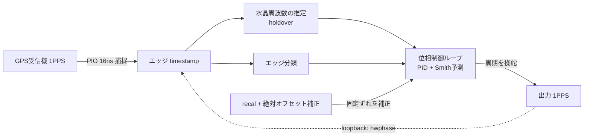

# pico-gnss GPSDO 精度レポート

RP2040 と民生 GNSS 受信機で GPSDO を作った。GPSDO は GPS disciplined oscillator の略で、GPS の時刻に自分の出力を合わせ続けるクロック装置のこと。ここで作ったものは、GNSS 受信機が 1 秒に 1 回出す 1PPS を基準にして、RP2040 側から出す 1PPS をそこへ寄せていく。

使っているのは安い部品だ。RP2040、普通の水晶、民生 GNSS 受信機。高級な OCXO やルビジウム発振器を積んだ話ではない。だから見たいのは、この安い構成で GPS の秒境界にどこまで近づけるのか、どこまでが作り込みで改善できる誤差で、どこからが測定や制御の限界なのか、というところだった。

ただし、この測定には外部の独立した 1PPS 基準がない。TIC も、Rb も、2 台目の受信機も使っていない。なので真の UTC に対する絶対精度を測った話ではない。ここで言えるのは、同じ GNSS 受信機の 1PPS に対して出力がどれだけ揃ったか、firmware 内部の観測とオシロの実測がどこまで合ったか、そして温度などの外乱で何が起きたか、という範囲になる。

全体の信号の流れはこうなっている。GPS 受信機の 1PPS を PIO で捕まえ、その timestamp から水晶の周波数を推定する。位相制御ループはその推定を使って出力 1PPS の周期を少しずつ操舵する。出力は loopback でもう一度内部に戻して見ていて、この内部位相観測をここでは hwphase と呼ぶ。

精度は一発で出たわけではない。素のタイマーで出力を作るところから始めて、ソフトで周波数を規律し、PIO でエッジ捕捉と生成をハード化し、PLL で位相を閉じ、recal とオフセット補正でピン上の固定ずれを詰め、最後に温度フィードフォワードを足した。firmware には `PRECISION_STAGE` という切替ノブがあるが、ここでは番号ではなく中身で追っていく。

最初の素タイマーだけの状態では、RP2040 のタイマーで 1PPS を作るだけだった。GPS に合わせ込む仕組みはないので、水晶の素の周波数ずれがそのまま位相の流れとして出る。hwphase は −3223 ns/s で流れ、隣り合う位相差の 77% が負方向だった。adj-diff、つまり隣接する位相差の変化量の σ は 9834 ns。boot ごとにも 4〜10 µs くらい振れていた。これは GPSDO というより、まず比較対象になる「何もしていないクロック」の姿だ。

次に、ソフトで周波数を規律した。GPS 1PPS を見ながら平均周波数を寄せ、さらに一次 sigma-delta dither で整数 tick の制約をならす。これで定常状態、120 秒を超える窓では slope が +17 ns/s まで落ちた。素の状態では数千 ns/s で流れていたので、平均周波数のずれは大きく減っている。ただし瞬時の adj-diff σ は 3083 ns あり、まだ µs オーダのジッタが残った。平均周波数は寄せられても、ソフトウェアで PPS を出す瞬間の揺れは消えない。

dither はログ上でも直接見える。`dith_ticks` は 999997 から 1000004 tick に散っていて、平均は 1000001.75 tick になっていた。整数周期しか出せないハードでも、長い目で見ると非整数の平均周期を作れている。

そこで PIO を使い、1PPS の捕捉と生成をハード側に移した。ここでソフトタイミング由来の µs ジッタが外れる。出力周期の interval σ は 7.3 ns、adj-diff σ は 10.6 ns、span は 32 ns まで縮んだ。素タイマーだけの adj-diff σ 9834 ns と比べると、およそ 3 桁の改善になる。この時点ではまだ開ループなので、hwphase の wander は σ 約 1866 ns 残っていた。ただし、ここではまだオシロと照合していないので、絶対的なピン上の値としては扱わない。

次に PLL で位相を閉じた。PLL は phase-locked loop のことで、ここでは GPS 1PPS と出力 1PPS の位相差を見ながら、出力周期を少しずつ変えて位相を戻す制御ループのことだ。type-II の位相 servo、PID、Smith 予測を使っている。ロック獲得率は 84.3%、locked 区間では hwphase σ が 185 ns、30 秒窓では 62 ns まで縮んだ。PIO の開ループで見えていた hwphase σ 約 1866 ns から見ると、約 10 倍の改善になる。各構成の受信状態は sats 15〜16、HDOP 0.67〜0.71 と近く、この差を単なる受信条件の違いで説明するのは難しい。

PLL で閉じても、内部観測だけを信じると危ない。ピン上に固定スキューが残るからだ。そこで recal と絶対オフセット補正を入れた。recal は実際のタイミングを取り直して内部の基準を合わせる処理で、絶対オフセット補正はオシロ照合で見えた固定ずれを出力側に反映する補正だ。これで、内部の hwphase がよく見えているだけでなく、ピン上の出力も GPS 1PPS に近づく。

最後に温度フィードフォワードを足した。水晶は温度で周波数が動くので、温度変化を見て先回りで周波数補正を入れる仕組みだ。通常運用ではこれを含めた production 構成を使う。ただし後で出てくるように、速い温度変化ではこの feedforward が過反応する不具合も見つかった。きれいに効いて終わり、ではなかった。

## 水晶と holdover

GPSDO は GPS を見ながら動くが、GPS の PPS が一瞬でも途切れたら何もできない、というわけではない。PPS が来ている間に水晶の周波数オフセットを学習しておき、PPS がない間はその推定値で時刻を外挿する。この動きが holdover だ。

この個体の水晶は +3.19 ppm @18℃ 相当のオフセットを持っていた。素タイマーだけで見た 2 回の boot では +3188 ns/s と +3182 ns/s で、符号も大きさも安定している。これは素の状態で hwphase が −3223 ns/s で流れていたこととも整合する。`DisciplinedClock` はこの ppb 単位のオフセットを学習し、PPS が途切れてもその値から時刻を進める。

もちろん水晶は温度で動く。だから holdover の精度も温度に影響される。この記事では 1PPS を GPS に合わせ続ける精度を中心に見るので、holdover の長さや温度連動の細かい評価は別扱いにしている。

## オシロで照合する

recal とオフセット補正を入れるところで、内部観測だけでなくピン上の信号をオシロで見た。ここで初めて、何をどの順に信じるかが問題になる。順序は GPS-R PPS > オシロ > hwphase だ。GPS 受信機の 1PPS を基準にし、オシロは出力ピン上の位相を測る独立した計器として扱う。hwphase は loopback で見た firmware 内部の相対量なので、単独では一番弱い。

測定には Rigol DHO804 を使った。GPS 受信機の 1PPS は ch1、×1 プローブ。出力 1PPS は ch2、×10 プローブ。同じ受信条件、同じプローブ条件で、recal と絶対オフセット補正を入れる前後を比べた。

| 構成 | scope mean | scope std | ≤100ns 率 | 同時刻 hwphase |
|---|---:|---:|---:|---:|
| PLL のみ、recal/オフセット補正なし | +131.5 ns | 85.5 ns | 35% | 約 −64 ns |
| production、整定後 | +15.3 / +40.5 / −29.0 ns | 26〜54 ns | 83〜100% | −31〜+50 ns |

recal とオフセット補正なしでは、オシロで見た出力は GPS 1PPS に対して +131.5 ns に張り付き、≤100ns に入る shot は 35% だけだった。production では 3 つの測定窓の mean が +15.3 ns、+40.5 ns、−29.0 ns になり、shot 単位の ≤100ns 率は 83〜100% まで上がった。scope std も 85.5 ns から 26〜54 ns へ縮んだ。

整定後であれば、hwphase も短い窓の位相観測としてかなり使える。scope mean が −29.0〜+40.5 ns の範囲にいるとき、同時刻の hwphase は −31〜+50 ns にいて、およそ 35 ns 以内で一緒に動いていた。以前のレポートで出ていた 793 ns の隠れスキュー、つまり内部では合っているように見えるのにピン上では大きくずれている症状は、この測定では出ていない。

ただし整定前に測ると簡単に間違える。最初の測定では、hwphase が +272〜304 ns に振れている overshoot 中に取ってしまい、scope mean +216 ns、≤100ns 率 0% という値になった。時系列で約 +80 ns 近傍へ収束したのを確認してから測り直している。

オシロの画面でも、出力 1PPS と GPS 1PPS の立ち上がりは秒境界で重なって見える。表示は 50 ns/div、single trigger。定量値としては、上の scope mean と scope std を使う。

このオシロ測定は、整定後の短窓、約 30 shot、良受信、single boot の値だ。1 時間連続でオシロ統計を取ったものではない。また ch1 の ×1 と ch2 の ×10 にはプローブ伝搬遅延の固定スキューが乗る。before/after の比較としては有効だが、数 ns 級の絶対 mean を真値として読む測定ではない。

## 再起動しても戻るか

1 回の boot だけで揃っても、再起動のたびに違う場所へ落ちるなら実用上は困る。そこで production 構成を 3 回 cold-boot し、各 boot の整定直後、count≈162 で scope phase と hwphase を測った。

| boot | scope mean | scope std | ≤100ns 率 | hwphase mean |
|---:|---:|---:|---:|---:|
| 1 | +84.2 ns | 16.3 ns | 84% | 66.1 ns |
| 2 | +72.9 ns | 11.6 ns | 100% | 72.5 ns |
| 3 | +83.3 ns | 19.5 ns | 84% | 80.0 ns |

3 回とも ≤100ns 帯に戻った。scope mean は +72.9〜+84.2 ns で、boot 間のばらつきは約 11 ns。hwphase mean も 66〜80 ns で scope に追従している。起動ごとに µs 単位でばらつく症状は再現していない。

ただし、この測定点は整定直後の settling tail、約 +75 ns 付近だ。後で見る 1 時間ログの中心、約 0 ns とは違う。同じ収束途中の位置を boot 間で比べた測定、という読み方になる。

## 1 時間の振る舞いと wander

production 構成を約 1 時間動かした。PPSGEN は 3597 行、整定後は lock 100%。能動的な外乱は与えず、室温の自然ドリフト、約 1.3℃ の中で見ている。ここで使う指標は firmware ログの hwphase で、オシロの 1 時間連続測定ではない。ただし整定後の短窓では、前の節で hwphase とオシロがよく合うことを確認している。

1 時間全体では、hwphase mean は +1.1 ns、σ は 61.5 ns。p05/p50/p95 は −96 / 0 / +96 ns だった。30 秒窓の σ は平均 35.2 ns、最大 123.1 ns。120 秒窓の σ は平均 57.1 ns。≤100ns に入ったのは 3303/3597、つまり 91.8% だった。

短い窓で見れば、σ 35〜50 ns くらいという感触は 30 秒窓 σ 35.2 ns として再現する。一方で、1 時間を通して常に ≤100ns とは言えない。100 ns を超える約 8% は、低周波の wander の山で出ている。

wander の出所を見るため、120 秒窓ごとの hwphase σ を sats、HDOP、温度と比べた。一番相関が強かったのは温度で、corr +0.47。受信との相関は弱く、sats +0.20、HDOP −0.24 だった。σ が最大の窓、94〜106 ns ではむしろ sats 12〜13 と受信がよく、σ が最小の静かな窓で sats 9 と受信が悪いこともあった。

この 1 時間ログでは、wander は受信劣化より発振器側の温度に寄って見える。ただし温度ドリフトは単調なので、見かけの相関が強まりやすい。単一ログでもある。出所を完全に確定するには、外部基準を使った測定が必要になる。

## 速い温度外乱と feedforward の過反応

自然な室温変化だけでは温度フィードフォワードの効き方が見えにくいので、基板を手で加熱した。数秒で 0.7〜1.4℃ 上がる、かなり速い熱外乱だ。温度フィードフォワードありは production。なしは recal とオフセット補正を残し、温度フィードフォワードだけ切った構成。受信は sats 約 11 で安定していた。

温度フィードフォワードありのまま速く加熱すると、hwphase は +5000/−6000 ns の双極性過渡を起こし、約 40 秒かけて ≤100ns 帯へ戻った。

加熱イベントごとに、温度フィードフォワードあり/なしを比べた。整定後、mispair を除外し、ΔT で正規化している。

| 指標 | 温度FFあり 中央値、n=3 | 温度FFなし 中央値、n=4 |
|---|---:|---:|
| peak / ℃ | 2482 ns | 3743 ns |
| ∫\|hwphase\| / ℃ | 32492 ns·s | 53873 ns·s |
| 復帰時間 | 30 s | 31 s |

中央値だけ見ると、温度フィードフォワードありのほうが peak/℃ と ∫|hwphase|/℃ は 30〜40% 小さい。過渡を緩和する傾向はある。ただし n は 3 対 4 と小さく、手加熱なので熱量もレートもばらつく。範囲は重なり、全ペア比較では温度フィードフォワードありのほうが小さいのは半数強にとどまる。復帰時間も 30 秒と 31 秒でほぼ同じだった。ここから「温度フィードフォワードで確実に 30〜40% 改善する」とまでは言えない。

中身を追うと、問題は温度センサが遅いことではなかった。むしろ feedforward が過反応していた。温度フィードフォワード有効時、出力周期へ渡す予測周波数 `predicted_freq_mppb` は、matched-lead 温度予測 `temp_ff_mppb(tcrys_hat)` と、非熱残差 observer `r_resid` の和になる。速い加熱でダイ温度が跳ねると、この feedforward が −1300 ppb まで膨らんだ。ところが整定後に見える実際の水晶周波数変化は −0.773 ppb しかない。約 1700 倍の過反応だ。

host モデルで切り分けると、matched-lead feedforward は同じような温度ステップでも約 41 ppb で止まる。−1300 ppb までは行かない。大半は matched-lead ではなく、die と crystal のモデル不整合に対して `r_resid` observer が大きな innovation を出した分と見られる。

温度フィードフォワードだけ切った構成では、予測偏差は α-β の `slope_max·pred_lead` = 5 ppb 上限にとどまり、−1300 ppb には届かない。こちらの過渡は feedforward の過反応ではなく、水晶周波数が実際に動き、それをループが追う応答だ。on/off が近い大きさに見えたのは、別の機構がたまたま似た大きさで出ていたためと考えられる。

これは hardware の限界ではなく、firmware で抑えられる不具合だった。出力操舵へ渡す feedforward 偏差を ±100 ppb に clamp する `steering_freq_mppb` を入れた。matched-lead と `r_resid` の和をまとめて bound する。ただし holdover の時刻外挿には raw の `freq_mppb` と `freq_slope_mppb` を使い続けるので、holdover には影響させない。host でも holdover 無回帰を確認している。

clamp 版を焼き、加熱レートをそろえた約 1.1℃/10s の加熱を複数回かけた。診断ログ `steer_ff` が過渡中に ±100 ppb に張り付き、clamp が実際に効いていることも確認できた。hwphase の過渡ピークは、unclamped の中央値 3085 ns/℃、worst 5573 ns/℃ から、clamped の中央値 400 ns/℃ へ落ちた。clamped の個別値は 397 / 400 / 558 ns/℃ で、ばらつきも小さい。

過反応スパイクは、絶対値で約 6 µs から、加熱をまたいでも一貫した約 500 ns 級へ抑えられた。中央値で約 8 倍、worst-case で約 14 倍の改善になる。boot 収束でも同じ機構が効き、raw feedforward が −1621 ppb まで振れる局面で、overshoot は −2992 ns から −1264 ns へ約 2.4 倍縮んだ。

ここまでの加熱 A/B は firmware の hwphase での比較だ。加熱過渡は約 40 秒と速く、オシロの位相統計に乗せにくい。整定状態で hwphase とオシロが合うことは確認しているが、加熱中の過渡そのものをオシロで直接 A/B したわけではない。

clamp 後にも約 500 ns 級の過渡は残る。これは feedforward が実周波数変化の約 1700 倍に膨らむ不具合ではなく、有限帯域の制御ループが実際の水晶周波数ステップに整定するまでの応答だ。速い外乱への整定が遅れること自体は、制御として残る。帯域を広げれば速い外乱には追いやすくなるが、定常時の wander は悪化する。本機は狭帯域で通常運用の ≤100ns を取りに行く設計なので、速い熱外乱で過渡が残るのはそのコストになる。

## 未確認事項

長時間 baseline の boot 再現性はまだ取れていない。3 boot の再現性は整定直後、count≈162 で見たが、長時間 wander の中心、約 0 ns に揃えた複数 boot の検証はしていない。各 boot の long-term σ がどこまで再現するかも未確認だ。

温度フィードフォワードの効果量も確定していない。速い温度外乱への応答は測ったが、on/off の差は手加熱の熱量、レート、サンプル数の小ささに埋もれる。確定するには on/off 交互で各 10 回以上、固定ヒータと水晶近傍センサを使い、加熱レートをそろえて測る必要がある。

旧 firmware build を焼いての再確認も未実施だ。

絶対精度も未測定だ。真の UTC に対して出力がどれだけ近いかは、この構成だけでは原理的に測れない。外部の独立した 1PPS 基準が必要になる。

## 測るときの注意

構成を比べるときは、受信条件も一緒に見る。今回も sats と HDOP を併記し、改善が単なる受信差で説明できないかを確認した。

単発の shot だけでは判断しない。mean、σ、窓別統計を見る。引き込み中やアンロック中を代表値に混ぜない。production の overshoot 中測定のように、整定前の値を読むと簡単に誤る。

hwphase とオシロも混同しない。hwphase は便利な内部観測だが、外部実測ではない。ピン上のアライメントを言うときは、GPS-R PPS、オシロ、hwphase の順に戻って確認する。整定後は hwphase が scope とよく一致したので短窓の位相観測として使えるが、その前提を外した場所では別に照合が要る。