# pico-gnss GPSDO 精度レポート

RP2040 と民生 GNSS 受信機で GPSDO を作った。GPSDO は GPS disciplined oscillator の略で、GPS から来る正確な秒パルスに自分のクロック出力を合わせ続ける装置だ。ここで作ったものは、GNSS 受信機の 1PPS、つまり 1 秒に 1 回出る時刻基準のパルスを見ながら、RP2040 側の出力 1PPS をそこへ寄せていく。

使っている部品は安い。RP2040 の内蔵タイマーと PIO、普通の水晶、民生 GNSS 受信機。最初から高級な基準発振器が載っているわけではない。だから最初の関心は単純で、この構成で作った 1PPS は GPS の秒境界にどこまで合うのか、どこから先が測り方の限界で、どこから先が制御の限界なのか、だった。

外部の独立した 1PPS 基準、たとえば TIC、Rb、2 台目の受信機は使っていない。なので真の UTC に対する絶対精度は測れていない。ここで言えるのは、受信機 1PPS に対して出力がどれだけ揃ったか、firmware の内部観測とオシロの実測がどこまで一致したか、そして外乱を与えたときにどの誤差がどの機構から出たか、という範囲になる。

規律の信号は次のように流れる。GPS 受信機の 1PPS を PIO で捕まえ、その時刻から水晶の周波数を推定し、位相制御ループで出力周期を少しずつ操舵する。出力 1PPS は loopback で戻して内部でも位相を見ている。この内部観測を hwphase と呼ぶ。

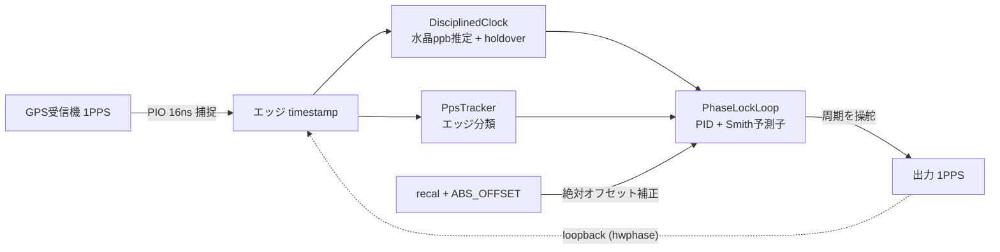

## 段を足していく

精度は一気に出たわけではなく、規律の層を 1 つずつ足して測った。firmware では `PRECISION_STAGE` という 0 から 5 の段で切り替えられる。最初は素のタイマーで PPS を作るだけ。そこへソフト周波数規律、PIO によるハード捕捉と生成、PLL、オシロ照合にもとづく補正、温度フィードフォワードを順に足した。

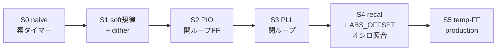

S0 から S3 までは、出力を作る足場を固める段階だ。ここでは主に firmware ログを見る。adj-diff は隣り合う位相差の変化量、interval は出力 1PPS の周期を表す。S2 と S3 は引き込み中を混ぜたくないので、warmup を切った定常側で見ている。

| 段 | 足した層 | 潰した誤差 | 代表指標 | 受信 |
|---|---|---|---|---|
| **S0** naive | 素のタイマーで PPS 生成 | 基準点 | adj-diff σ 9834 ns、hwphase slope −3223 ns/s | sats 16.2、HDOP 0.67 |
| **S1** soft 規律 + dither | ソフト周波数規律と一次 sigma-delta dither | 周波数ドリフト | 定常、窓>120s で slope +17 ns/s、瞬時 adj-diff σ 3083 ns | sats 15.6、HDOP 0.69 |
| **S2** PIO 開ループ FF | PIO で 1PPS をハード捕捉と生成、周波数 FF | ソフトタイミングの µs ジッタ | interval σ 7.3 ns、adj-diff σ 10.6 ns、span 32 ns | sats 15.1、HDOP 0.71 |
| **S3** PLL 閉ループ | type-II 位相 servo、PID と Smith | 開ループの位相ドリフト | 獲得率 84.3%、locked で hwphase σ 185 ns、30s 窓 62 ns | sats 16.0、HDOP 0.69 |

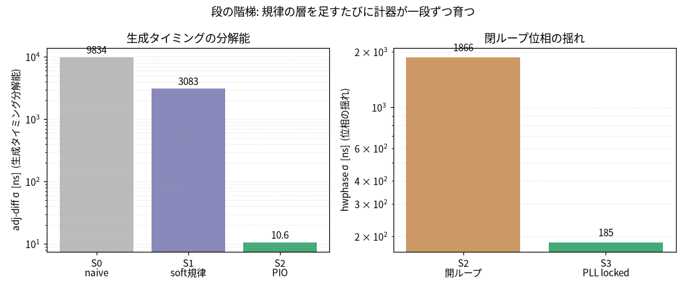

S0 は何も規律していない。hwphase は −3223 ns/s で流れ、隣接ステップの 77% が負になる。水晶の素の周波数オフセットが、そのまま位相ドリフトとして見えている。adj-diff σ は µs オーダで、boot ごとにも 4〜10 µs ほど振れる。

S1 ではソフトで周波数を寄せる。定常、窓>120s の slope は +17 ns/s まで落ちる。ただし瞬時の adj-diff σ は 3083 ns のままだ。平均周波数は寄せられても、ソフトで PPS を出す瞬間のジッタは消えない。

dither の効き方は `dith_ticks` に出ている。整数 tick は 999997 から 1000004 まで散り、平均は 1000001.75 tick になる。整数周期しか出せなくても、一次 sigma-delta で非整数の平均周期を作れている。

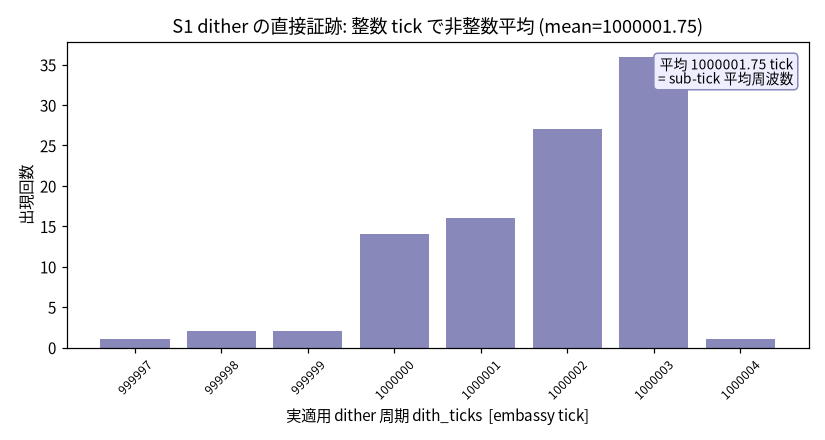

S2 では PIO で捕捉と生成をハード化する。ここでソフト由来の µs ジッタが外れ、interval σ は 7.3 ns、adj-diff σ は 10.6 ns、span は 32 ns まで縮む。S0 の adj-diff σ 9834 ns から見ると、約 3 桁の改善になる。S2 の開ループ hwphase wander は σ 約 1866 ns だったが、この時点ではオシロと照合していないので、絶対値の扱いは保留する。

S3 では PLL を閉じる。ロック獲得率は 84.3%、lk=1 が 280 行中 236 行。locked 区間では hwphase σ 185 ns、30s 窓で 62 ns まで縮む。開ループ hwphase σ 約 1866 ns から約 10 倍の改善だ。受信条件は各段で sats 15〜16、HDOP 0.67〜0.71 と近く、この差だけで改善を説明するのは難しい。

## 水晶と holdover

GPSDO は GPS を見ながら動くが、GPS の PPS が途切れた瞬間に何もできなくなるわけではない。PPS が来ている間に水晶の周波数オフセットを推定しておき、途切れたときにはその推定値で秒を外挿する。この動きが holdover だ。

この個体の水晶は +3.19 ppm @18℃ 相当のオフセットを持っていた。S0 の 2 boot では +3188 ns/s と +3182 ns/s で、符号も大きさも安定している。これは S0 の hwphase slope −3223 ns/s と整合する。`DisciplinedClock` はこの ppb 単位のオフセットを学習し、PPS がない間もそこから時刻を進める。

水晶は温度で周波数が動く。だから holdover の精度も温度の影響を受ける。ここでは 1PPS の規律精度を中心に見るので、holdover の長さと到達誤差、温度連動の細部は `wander.md` 側の話に分ける。

## オシロで見る

S4 では、内部観測だけでなくピン上の出力をオシロで見る。ここで初めて、何をどの順で信じるかが効いてくる。順序は GPS-R PPS > オシロ > hwphase だ。GPS 受信機の 1PPS を基準にし、オシロは出力ピン上の位相を測る独立計器として扱う。hwphase は loopback で見た firmware 内部の相対量なので、単独では一番弱い。

scope mean はオシロで測った GPS 1PPS と出力 1PPS のエッジ時間差の平均、scope std はその標準偏差だ。mean には固定スキューも含まれる。旧 `REPORT.md` にあった 793 ns の隠れスキューは、内部測定だけを信じてピン上のずれを見落とした失敗の典型だ。

測定には Rigol DHO804 を使った。出力 1PPS は ch2、×10 プローブ。GPS 受信機 1PPS は ch1、×1 プローブ。同一受信、同一プローブ条件で、recal と ABS_OFFSET の before/after を比べる。recal なしの S3 と、recal、ABS_OFFSET、temp-FF を入れた production、つまり S5 の比較になる。

| 構成 | scope mean | scope std | ≤100ns 率 | 同時刻 hwphase |
|---|---|---|---|---|
| S3、PLL のみ、recal/ABS_OFFSET なし | +131.5 ns | 85.5 ns | 35% | 約 −64 ns |
| production、S5、整定後 | +15.3/+40.5/−29.0 ns | 26〜54 ns | 83〜100% | −31〜+50 ns |

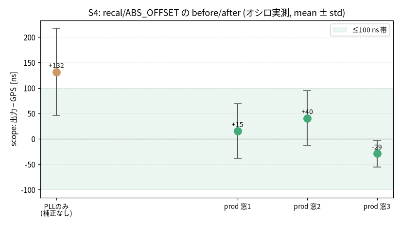

recal と ABS_OFFSET を入れると、オシロで見た出力と GPS のオフセットが 0 付近へ寄る。recal なしの S3 は +131.5 ns に張り付き、≤100ns に入る shot は 35% だけだった。production では 3 窓の mean が +15.3 ns、+40.5 ns、−29.0 ns になり、shot 単位の ≤100ns 率も 83〜100% へ上がる。scope std も 85.5 ns から 26〜54 ns へ縮む。

整定後なら hwphase も短窓の位相観測として使える。scope mean が −29.0〜+40.5 ns の範囲にいるとき、同時刻の hwphase は −31〜+50 ns にいて、約 35 ns 以内で一緒に動いている。旧 `REPORT.md` のように、hwphase は 0 付近なのにピン上が大きくずれる症状は出ていない。

ただし整定前に測ると簡単に間違える。最初の測定では、hwphase が +272〜304 ns へ振れていた overshoot 中に取ってしまい、scope mean +216 ns、≤100ns 率 0% という値になった。時系列で約 +80 ns 近傍へ収束したことを確認してから測り直している。

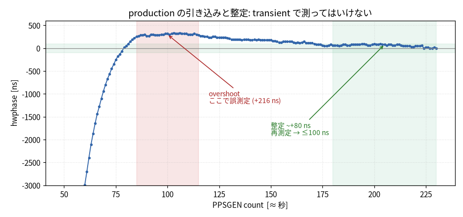

オシロの画面でも、出力 1PPS、ch2、青と、GPS 1PPS、ch1、黄の立ち上がりが秒境界で重なる。表示は 50 ns/div、single trigger。定量値は上の表の scope mean と scope std を使う。

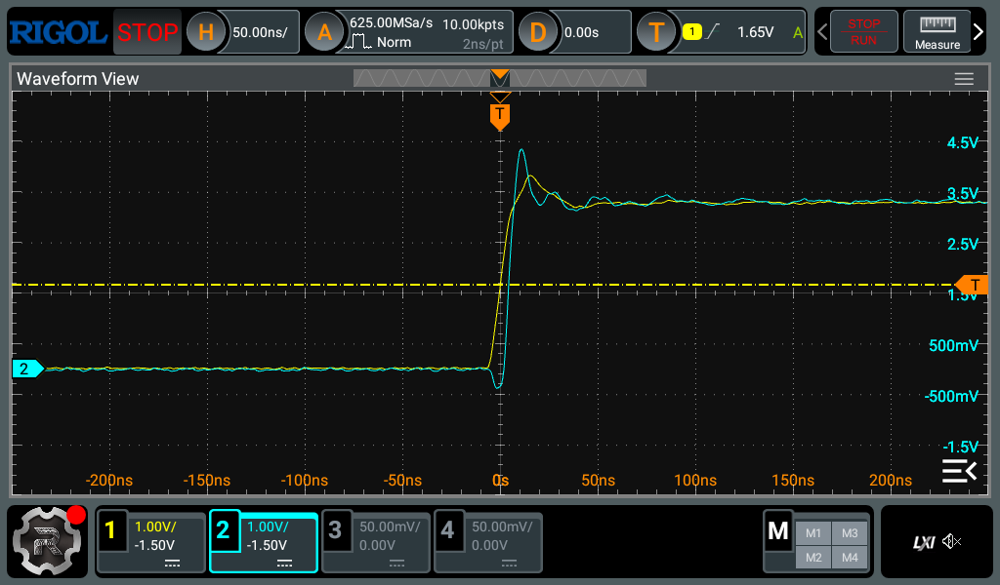

この測定は短窓、約 30 shot、整定後、良受信、single boot の値だ。1 時間の連続オシロ実測ではない。さらに ch1 の ×1 と ch2 の ×10 にはプローブ伝搬遅延スキューが固定成分として乗る。before/after の差は有効だが、数 ns 級の絶対 mean を真値として読む測定ではない。

## 再起動で戻るか

1 回の boot で揃っても、再起動のたびに違う場所へ落ちるなら使いにくい。production を 3 回 cold-boot し、各 boot の整定直後、count≈162 で scope phase と hwphase を測った。

| boot | scope mean | scope std | ≤100ns 率 | hwphase mean |
|---|---|---|---|---|
| 1 | +84.2 ns | 16.3 ns | 84% | 66.1 ns |
| 2 | +72.9 ns | 11.6 ns | 100% | 72.5 ns |
| 3 | +83.3 ns | 19.5 ns | 84% | 80.0 ns |

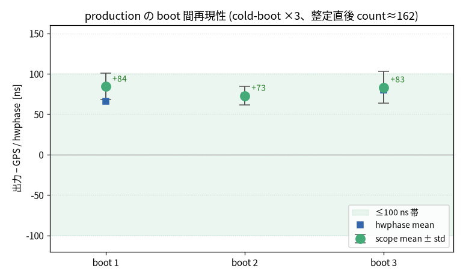

3 boot とも ≤100ns 帯に戻った。scope mean の範囲は +72.9〜+84.2 ns で、boot 間のばらつきは約 11 ns。hwphase mean も 66〜80 ns で scope に追従している。旧 `REPORT.md` のように起動ごとに µs 単位でばらつく症状は再現していない。

ここで測っている count≈162 は整定直後の settling tail、約 +75 ns 付近だ。次に見る長時間 wander の中心、約 0 ns とは違う。同じ収束点を boot 間で比べるための測定になる。

## 1 時間の振る舞い

production を約 1 時間、3597 PPSGEN 行、整定後、lock 100% で動かした。能動的な外乱は与えず、室温の自然ドリフト、約 1.3℃ の下で見る。ここでの指標は firmware ログの hwphase で、オシロの 1 時間連続測定ではない。ただし整定状態の短窓では、前の節で hwphase とオシロがよく合うことを確認している。

hwphase mean は +1.1 ns、σ は 61.5 ns。p05/p50/p95 は −96 / 0 / +96 ns だった。30s 窓 σ は平均 35.2 ns、最大 123.1 ns。120s 窓 σ は平均 57.1 ns。≤100ns に入ったのは 3303/3597、つまり 91.8% だった。

短い窓で見ると、旧 `REPORT.md` の「σ 35〜50 ns」という感触は 30s 窓 σ 35.2 ns として再現する。一方、1 時間を通して「常に ≤100ns」とは言えない。100 ns を超える約 8% は低周波 wander の山で出ている。

wander の出所を探るため、120s 窓ごとの hwphase σ を sats、HDOP、温度と比べた。相関が一番強かったのは温度で、corr +0.47。受信との相関は弱く、sats +0.20、HDOP −0.24 だった。σ が最大の窓、94〜106 ns ではむしろ sats 12〜13 と受信が良く、σ が最小の静かな窓で sats 9 と受信が悪いこともあった。

この 1 時間では、wander は受信劣化より発振器側の温度に寄って見える。ただし温度ドリフトは単調なので、相関が見かけ上強まりうる。単一の 1 時間ログでもある。出所を完全に確定するには外部基準が要る。

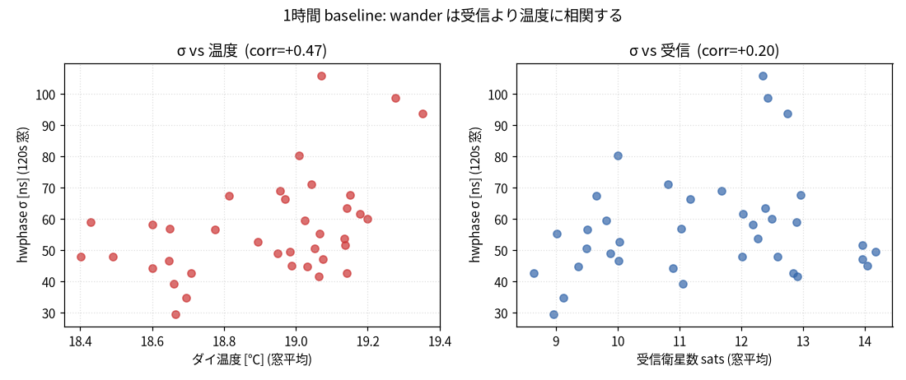

## 速い温度外乱

自然な室温変化だけでは temp-FF の効き方が見えにくいので、基板を手で加熱した。数秒で 0.7〜1.4℃ 上がる速い熱外乱だ。ON は production、stage 5。OFF は stage 4 で、recal と ABS_OFFSET は両方 on、temp-FF だけ off。受信は sats 約 11 で安定していた。

ON のまま速く加熱すると、hwphase は +5000/−6000 ns の双極性過渡を起こし、約 40s かけて ≤100ns 帯へ戻る。

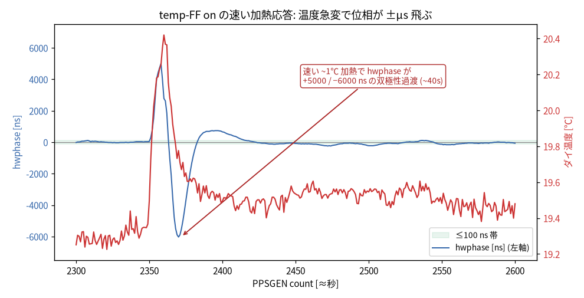

on/off を加熱イベントごとに比べた。整定後、mispair を除外し、ΔT で正規化している。

| 指標 | ON 中央値、n=3 | OFF 中央値、n=4 |
|---|---|---|
| peak / ℃ | 2482 ns | 3743 ns |
| ∫\|hwphase\| / ℃ | 32492 ns·s | 53873 ns·s |
| 復帰時間 | 30 s | 31 s |

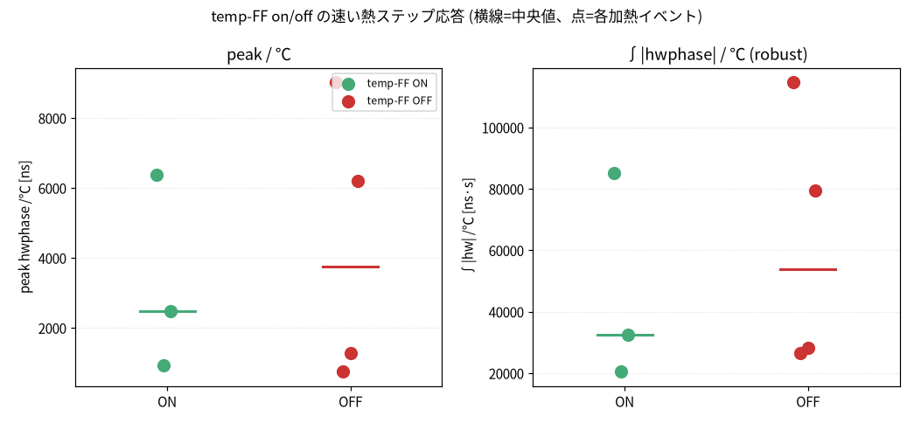

ON のほうが peak/℃ と ∫|hwphase|/℃ の中央値は 30〜40% 小さい。過渡を緩和する傾向はある。ただし n は 3 対 4 と小さく、手加熱なので熱量とレートもばらつく。範囲は重なり、全ペア比較では ON が小さいのは半数強にとどまる。復帰時間は ON 30 s、OFF 31 s でほぼ同じだ。ここから「temp-FF が確実に 30〜40% 改善する」とは言えない。

機構を追うと、問題は温度センサが遅いことではなかった。むしろ feedforward が過反応していた。temp-FF 有効時、出力周期へ渡す予測周波数 `predicted_freq_mppb` は、matched-lead 温度予測 `temp_ff_mppb(tcrys_hat)` と、非熱残差 observer `r_resid` の和になる。速い加熱でダイ温度が跳ねると、この feedforward が −1300 ppb まで膨らんだ。ところが整定後に見える実際の水晶周波数変化は −0.773 ppb しかない。約 1700 倍の過反応だ。

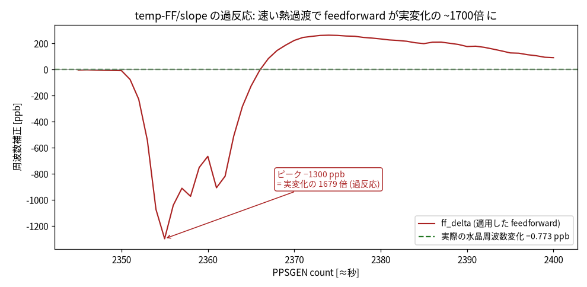

host モデルで切り分けると、matched-lead FF は同等の温度ステップでも約 41 ppb で止まる。−1300 ppb には届かない。大半は matched-lead ではなく、die↔crystal のモデル不整合に対して `r_resid` observer が大きな innovation を出した分と見られる。

temp-FF を切った OFF、stage 4 では、予測偏差は α-β の `slope_max·pred_lead` = 5 ppb 上限にとどまり、−1300 ppb には届かない。OFF の過渡は feedforward の過反応ではなく、水晶周波数が実際に動き、それをループが追う応答だ。ON と OFF が近い大きさに見えたのは、別の機構がたまたま似た大きさで出たためと考えられる。

これは hardware の限界ではなく、firmware で抑えられる不具合だった。出力操舵へ渡す feedforward 偏差を ±100 ppb に clamp する `steering_freq_mppb` を入れた。matched-lead と `r_resid` の和をまとめて bound する。ただし holdover の時刻外挿には raw の `freq_mppb` と `freq_slope_mppb` を使い続けるので、holdover には影響させない。host でも holdover 無回帰を確認している。

clamp 版を焼き、加熱レートをそろえた約 1.1℃/10s の加熱を複数回かけた。診断ログ `steer_ff` が過渡中に ±100 ppb に張り付き、clamp が実際に発火していることも確認できた。hwphase の過渡ピークは、unclamped の中央値 3085 ns/℃、worst 5573 ns/℃ から、clamped の中央値 400 ns/℃ へ落ちた。clamped の個別値は 397 / 400 / 558 ns/℃ で、ばらつきも小さい。

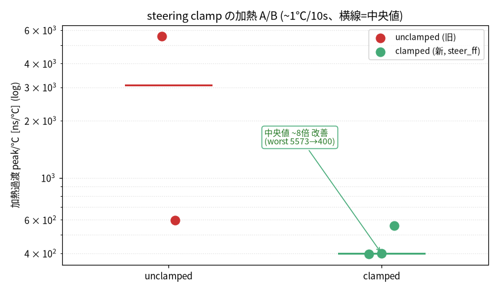

過反応スパイクは絶対値で約 6 µs から、加熱を跨いで一貫した約 500 ns 級へ抑えられた。中央値で約 8 倍、worst-case で約 14 倍の改善になる。boot 収束でも同じ機構が効き、raw feedforward が −1621 ppb まで振れる局面で、overshoot は −2992 ns から −1264 ns へ約 2.4 倍縮んだ。

ここまでの加熱 A/B は firmware の hwphase での比較だ。加熱過渡は約 40s と速く、オシロの位相統計に乗せにくい。整定状態で hwphase とオシロが合うことは S4 で確認しているが、加熱中の過渡そのものをオシロで直接 A/B したわけではない。

clamp 後にも約 500 ns 級の過渡は残る。これは feedforward が実周波数変化の約 1700 倍に膨らむ不具合ではなく、有限帯域の制御ループが実際の水晶周波数ステップに整定するまでの応答だ。速い外乱への整定が遅れること自体は、制御として残る。帯域を広げれば速い外乱には追いやすくなるが、定常時の wander は悪化する。本機は狭帯域で通常運用の ≤100ns を取りに行く設計なので、速い熱外乱の整定過渡はその設計のコストになる。

## 残っている未確認

長時間 baseline の boot 再現性はまだ取れていない。3 boot の再現性は整定直後、count≈162 で見たが、長時間 wander の中心、約 0 ns に揃えた複数 boot の検証はしていない。各 boot の long-term σ がどこまで再現するかも未確認だ。

temp-FF の効果量も確定していない。速い温度外乱への応答は測ったが、on/off の差は手加熱の熱量、レート、n の小ささに埋もれる。確定するには on/off 交互で各 10 回以上、固定ヒータと水晶近傍センサを使い、加熱レートをそろえて測る必要がある。

S3 の旧 build R1、つまり旧 firmware build を焼いての再確認も未実施だ。

絶対精度も未測定だ。真の UTC に対して出力がどれだけ近いかは、この構成だけでは原理的に測れない。外部の独立 1PPS 基準が必要になる。

## 測るときの注意

段比較では、受信条件を一緒に見る。今回も sats と HDOP を併記し、段の改善が単なる受信差で説明できないかを確認した。

単発の shot だけで判断しない。mean、σ、窓別統計を見る。引き込み中やアンロック中を代表値に混ぜない。S4 の overshoot 中測定のように、整定前の値を読むと簡単に誤る。

hwphase とオシロを混同しない。hwphase は便利な内部観測だが、外部実測ではない。ピン上のアライメントを言うときは、GPS-R PPS、オシロ、hwphase の順に戻って確認する。整定後は hwphase が scope とよく一致したので短窓の位相観測として使えるが、その前提を外した場所では別に照合が要る。