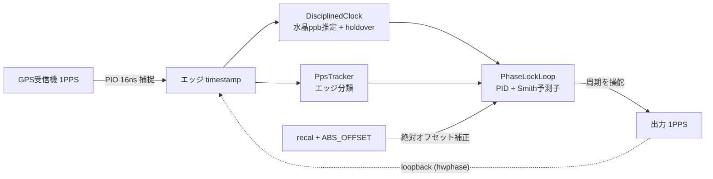
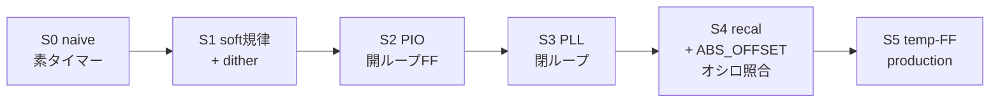

# pico-gnss 精度向上レポート

> 本稿は精度向上の中心レポートである。
> 旧 `REPORT.md` を後で置き換える。
> 結論を先に置かず、規律の層を一つずつ足したときに「測れる精度」がどう変わるかを、実機で確かめた順に述べる。
> 旧 `REPORT.md` の数値 (σ35ns、20000倍、+2.40ppm、793ns など) は裏取りし直し、再現しなかったものは持ち越さない。
> 確かめていない事項は確かめていないと明記する。
> ループ整形の詳細や長時間 wander の分光といった脇道は、別稿 `loopshape.md` と `wander.md` に分ける。

## 何を測り、どれを信じるか

このプロジェクトは、出力 1PPS を GNSS 受信機の 1PPS に合わせる装置 (GPSDO) を作る。
受信機の 1PPS が UTC 秒境界を刻むので、出力をこのエッジに tight に追従させる。
さらに水晶の周波数を規律することで、PPS が切れているあいだも holdover で外挿し続ける。
本稿が扱うのは、その追従精度をどう測るか、そして規律の層を足すたびに測れる精度がどう変わるかである。

測定値には信頼の順序がある。

- **GPS-R の PPS**：基準。受信機の 1PPS が UTC 秒境界を刻む。
- **オシロ (scope)**：独立計器。出力位相をピン上で実測したものが真に近い。
- **hwphase**：firmware がループ内部で見た相対量。最も弱い。

firmware のループ自身の測定 (`hwphase`) は K 較正の基準に対する相対量にすぎず、ピン上の絶対アライメントやバグを隠しうる。
したがって firmware のログだけを信じてはならない。
本稿で hwphase と書いた値は、第 4 節でオシロと照合するまで、絶対値の物理的解釈を保留する。

用語を初出で定義する。

- **hwphase**：出力 1PPS と受信機 1PPS の位相差を firmware がループ内部で見た値 [ns]。
- **interval σ**：出力 1PPS の周期 (隣接エッジ間隔) の標準偏差 [ns]。hwphase に依存しない。
- **adj-diff σ**：隣接秒の周期の差の標準偏差 [ns]。生成や規律の分解能下限を映す、hwphase 非依存の指標。
- **scope mean / σ**：オシロで実測した GPS 1PPS と出力 1PPS のエッジ時間差の平均と標準偏差。mean は固定スキューを含む絶対オフセット、σ は揺れ。

この構成は外部独立基準を持たない。
出力が真の UTC にどれだけ近いか (絶対精度) を測る TIC や Rb や 2 台目の独立受信機がない。
hwphase もオシロも同じ受信機を基準にするため、絶対精度はこの構成では原理的に測れない。
本稿が確定できるのは、受信機 1PPS への追従が段を足すたびに実機で一段良くなること、そしてオシロで見た出力のピン上アライメントまでである。

規律の信号の流れを次に示す。

## 段の階梯

精度向上は、規律の層を一段ずつ足す 6 段の構成で測り直した。
各段は firmware の単一ノブ `PRECISION_STAGE` (0..=5) で選べる。
内部観測 (hwphase) を一次に進め、内部観測だけでは限界が見えた段でオシロを持ち出す。

S0 から S3 までの実測を次の表にまとめる。
代表値の算出窓は各行に明記する (S2 と S3 は引き込み後の定常を見るため warmup を切る)。

| 段 | 足した層 | 潰した誤差 | 代表指標 (実測、窓を明記) | 受信 (sats / HDOP) |
|---|---|---|---|---|
| **S0** naive | 素のタイマーで PPS 生成 | (基準点) | adj-diff σ 9834 ns、hwphase slope −3223 ns/s | 16.2 / 0.67 |
| **S1** soft 規律 + dither | ソフト周波数規律と一次 sigma-delta dither | 周波数ドリフト | 定常 (窓>120s) slope +17 ns/s、瞬時 adj-diff σ 3083 ns | 15.6 / 0.69 |
| **S2** PIO 開ループ FF | PIO で 1PPS をハード捕捉と生成、周波数 FF | ソフトタイミングの µs ジッタ | interval σ 7.3 ns、adj-diff σ 10.6 ns、span 32 ns | 15.1 / 0.71 |
| **S3** PLL 閉ループ | type-II 位相 servo (PID と Smith) | 開ループの位相ドリフト | 獲得率 84.3%、locked で hwphase σ 185 ns、30s 窓 62 ns | 16.0 / 0.69 |

各段を順に見る。

S0 は規律が一切ないので、hwphase は −3223 ns/s で一方向に流れる (隣接ステップの 77% が負で、単調ドリフトを示す)。
水晶の素の周波数オフセットがそのまま位相ドリフトになる。
adj-diff σ は µs オーダ (boot で 4〜10 µs と振れる) で、ソフトの生成分解能が µs 下限にあることを示す。

S1 はソフト規律でドリフトを畳む。
定常 (窓>120s) の slope は +17 ns/s まで落ち、0 近傍なので符号は不定である (約 120s までは引き込み中)。
瞬時の adj-diff σ は soft jitter が律速で約 3 µs にとどまる (周期の平均を細かくする dither と、瞬時のジッタは別物である)。

dither が実機で動いている証拠は、実適用した dither 周期 `dith_ticks` に直接出る。
整数 tick の値が 999997 から 1000004 まで散らばり、その平均が非整数の 1000001.75 tick になる。
これは一次 sigma-delta が整数周期を打ちながら sub-tick の平均周波数を作っていることを意味する。

S2 は PIO で捕捉と生成をハード化し、ソフトの µs ジッタを除く。
interval σ は窓>120s で 7.3 ns、adj-diff σ は約 10.6 ns で、span は 32 ns (PIO 数グリッドぶん) に収まる。
この改善 (S0 の adj-diff σ 9834 ns から S2 の 10.6 ns へ、約 3 桁) は hwphase 非依存に、出力タイミングそのものの指標で確かめた。
一方、S2 の開ループ hwphase wander (σ 約 1866 ns) はオシロと未照合なので、絶対値の解釈は保留する。

S3 は位相 servo を閉じて開ループの位相ドリフトを潰す。
ロック獲得率は 84.3% (lk=1 が 280 行中 236 行)、locked 区間に限れば hwphase σ 185 ns、30s 窓で 62 ns である。
分布は単峰で、開ループ hwphase σ (約 1866 ns) から locked σ (185 ns) へ約 10 倍縮む (いずれも hwphase で、オシロ照合は第 4 節)。

受信は段を跨いでほぼ同等である (sats 15〜16、HDOP 0.67〜0.71)。
段の比較は別時刻の single-boot 計測を跨ぐので、改善が受信状況の違いでないことを受信プロキシで裏取りした。
したがって段ごとの改善は、少なくとも sats と HDOP の差では説明しにくい。

## 水晶のオフセットと holdover の土台

規律と holdover の土台は、水晶の周波数オフセットを整数 ppb で推定して保持することである。
素の水晶は +3.19 ppm @18℃ 相当のオフセットを持つ (S0 の 2 boot で +3188 と +3182 ns/s、符号と大きさが安定)。
この値が S0 で観測した hwphase slope −3223 ns/s と整合する。

`DisciplinedClock` はこのオフセットを学習し、PPS が切れているあいだも外挿する。
水晶は温度で周波数が変わるので、推定値は温度とともにゆっくり動く。
holdover の長さと到達誤差の関係や温度連動の扱いは `wander.md` に回す。

## 出力と GPS PPS のオフセット (S4、オシロ実測)

ここまでの hwphase は firmware の内部測定だった。
S4 ではオシロ (Rigol DHO804) を一次計器にして、出力 1PPS (ch2、×10) と GPS 受信機 1PPS (ch1、×1) のエッジ時間差を実測し、hwphase と照合する。
これが「hwphase だけを信じない」を実行する段である。

recal と ABS_OFFSET の効果を、整定後の同一受信と同一プローブで before/after に測る。
ここで比べるのは、recal なしの S3 構成と、recal を足した production (S5) 構成である。

| 構成 | scope mean | scope std | ≤100ns 率 | 同時刻 hwphase |
|---|---|---|---|---|
| S3 (PLL のみ、recal/ABS_OFFSET なし) | +131.5 ns | 85.5 ns | 35% | 約 −64 ns |
| production (S5、recal と ABS_OFFSET と temp-FF、整定後) | 3 窓で −29 / +15 / +41 ns | 26〜54 ns | 83〜100% | −31〜+50 ns |

recal と ABS_OFFSET は、同一プローブ条件で見た出力と GPS のオフセットを中心化する。
recal なし (S3) ではオシロ上で +131.5 ns に張り付き、≤100ns に入る shot は 35% にとどまる。
production では 0 付近へ寄り、3 窓とも mean が ±100ns 帯に入る (shot 単位の ≤100ns 率は 83〜100%)。
ジッタも scope std で 85.5 ns から 26〜54 ns へ締まる。

絶対オフセットは固定値ではなく、±40 ns 程度で wander する (3 窓で mean が −29、+15、+41 ns と動いた)。
これは既知の低周波位相変動で、≤100ns の内側で揺れている。
このとき scope mean は hwphase と一緒に動き (scope −29〜+41 ns に対し hwphase −31〜+50 ns、両者が約 35 ns 以内で一致)、hwphase がこの整定状態では忠実であることを示す。
旧 `REPORT.md` の 793 ns のような「hwphase が 0 近くなのにピンは大きくずれる」隠れスキューは、現状では存在しない。

整定前に測ると誤った値が出る。
最初は引き込みの overshoot 中 (hwphase が +272〜304 ns に振れていた区間) で測ってしまい、scope mean +216 ns、≤100ns 率 0% という値が出た。
hwphase の時系列で整定 (約 +80 ns 近傍への収束) を確認してから測り直した。

オシロのスクリーンショットでも、出力 (ch2、青) と GPS (ch1、黄) の立ち上がりが秒境界で重なる (50 ns/div、single trigger、定量値は前掲の表による)。

この節の限界を挙げる。

- 短窓 (約 30 shot)、整定後、良受信、single boot の値であり、長時間の wander は次節と `wander.md` で扱う。
- scope mean には ch1 (×1) と ch2 (×10) のプローブ伝搬遅延スキューが固定成分として乗るので、before/after の差は有効でも、絶対 mean の数 ns 級の真値はプローブスキューの分だけ不定である。
- S4 が照合したのは production (S3 に recal を足した整定状態) で、S2 の開ループ hwphase wander は依然オシロ未照合である。

## boot をまたいだ再現性

S4 は 1 boot で ≤100ns を示した。
再起動を跨いでも同じ位置へ戻るかを、production を 3 回 cold-boot して確かめた。
各 boot で整定直後 (count≈162) に scope phase と hwphase を測る。

| boot | scope mean | scope std | ≤100ns 率 | hwphase mean |
|---|---|---|---|---|
| 1 | +84.2 ns | 16.3 ns | 84% | 66.1 ns |
| 2 | +72.9 ns | 11.6 ns | 100% | 72.5 ns |
| 3 | +83.3 ns | 19.5 ns | 84% | 80.0 ns |

boot 間の mean のばらつきは約 11 ns (72.9〜84.2 ns) で、3 boot とも ≤100ns 帯に収まる。
hwphase は各 boot で scope に追従する (mean で 66〜80 ns)。
production は再起動を跨いで一貫した位置へ再収束し、旧 `REPORT.md` の「起動ごとに µs 単位でばらつく」症状は再現しない。

ここで測った count≈162 は整定直後の settling tail (約 +75 ns) で、長時間の wander の中心 (次節の約 0 ns) ではない。
boot 間の比較として、同じ収束点で揃えた値である。

## 1 時間の production baseline

production を約 1 時間 (3597 PPSGEN 行、整定後、lock 100%) 連続で回した。
これは能動的な外乱を与えず、室温の自然ドリフト (約 1.3℃) の下で回した運用状態にあたる。
この節の指標は firmware ログ (hwphase) で、オシロの 1 時間連続実測ではない (整定状態で hwphase がオシロと一致することは前節で確かめた)。

- hwphase mean +1.1 ns、σ 61.5 ns、p05/p50/p95 = −96 / 0 / +96 ns。
- 30s 窓 σ は平均 35.2 ns (最大 123.1 ns)、120s 窓 σ は平均 57.1 ns。
- ≤100ns に入るのは 3303/3597 = 91.8%。

整定後は mean が +1.1 ns に中心化し、30s 窓 σ は約 35 ns に収まる。
旧 `REPORT.md` の「短窓で σ35〜50ns」は、この 30s 窓 σ として再現する。
一方で「安定して ≤100ns」は、1 時間を通すと 91.8% であって 100% ではない。
100ns を超える約 8% は低周波 wander の山で出る。

100ns を超える wander の出所を、この 1 時間で相関の範囲だけ当たった。
120s 窓ごとの hwphase σ を受信 (sats / HDOP) と温度に相関させると、温度との相関が最も強い (corr +0.47、温度が高い窓ほど σ が大きい)。
受信との相関は弱い (sats +0.20、HDOP −0.24)。
実際、σ が最大の窓 (94〜106 ns) はむしろ受信が良く (sats 12〜13)、σ が最小の静かな窓は受信が悪い (sats 9) こともあった。
したがってこの 1 時間の wander は、受信劣化よりも温度 (発振器側) に寄っている。
ただし温度ドリフトが単調なので相関は見かけ上強まりうること、単一の 1 時間であること、絶対的な出所の確定には外部基準が要ることに注意する。
この温度依存は temp-FF が wander を抑える余地を示唆し、その能動検証 (後述) の動機になる。

## まだ確かめていないこと

本稿で確かめていないことを明示する。

- 長時間 baseline の boot 再現性：boot 間再現性は整定直後 (count≈162) で 3 boot 確かめたが、長時間の wander 中心 (約 0 ns) を同じ late 点で複数 boot 揃える検証は未実施である。各 boot の long-term σ の再現性はまだ取れていない。
- temp-FF の能動検証：温度フィードフォワード (temp-FF) を能動的な熱外乱で検証する作業は未実施で、1 時間の baseline では温度ドリフトが約 1.3℃ と小さく temp-FF の有無の差を出すには検出力が足りない。
- S3 の旧 build R1：旧 firmware build を焼いての再確認 (R1) は行っていない。
- 絶対精度：出力が真の UTC にどれだけ近いかは外部独立 1PPS 基準を持たない本構成では原理的に測れず、本稿が確定したのは段間改善とオシロで見たオフセットまでである。

### 高速温度外乱への応答 (temp-FF、後日追記)

> 高速な熱外乱を能動的に与え、temp-FF が位相変動をどれだけ抑えるかをオシロと firmware で測る。
> 後日の joint session でここに追記する。
> 自然ドリフト下の baseline (前節) と能動外乱への応答の関係を、計測前に整理してから臨む。

### 計測トラップ

本稿が避けたこと、そして今後も避けることを最後に置く。

- 受信交絡：段比較には受信プロキシを併記し、同等性を確認する。
- 単発スナップショット：揺れる量は密な多 shot と統計 (mean、σ、窓別) で見る。
- 過渡の混入：引き込みやアンロックの区間を代表値に混ぜず、窓を明示する (S4 の overshoot 誤測定がこの罠だった)。
- hwphase とオシロの混同：内部測定を外部実測として書かない (信頼順は GPS-R PPS、オシロ、hwphase の順)。
