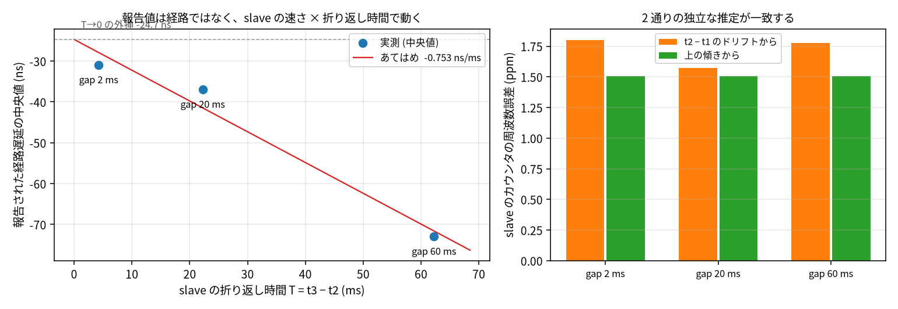
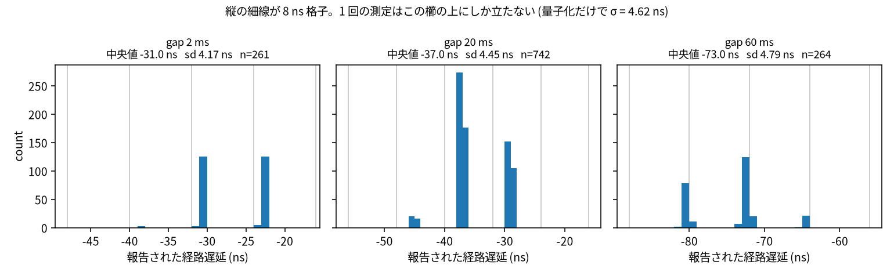
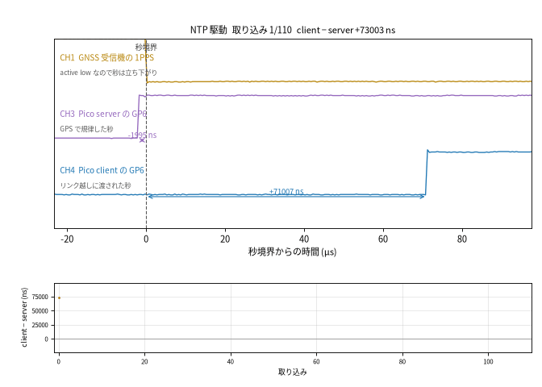
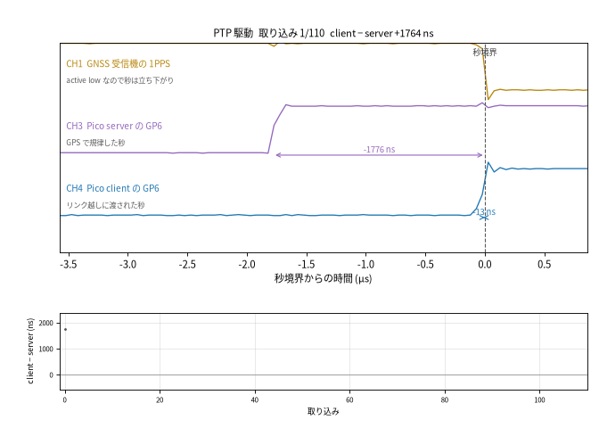

# PTP でリンク越しに時刻を渡す

**GPSDO を持つ Pico から、持たない Pico へ、擬似 Ethernet のリンク越しに PTP で時刻を渡し、
どこまで正確に渡せたのかを測る。**
その回の記録である。
生データは repo top の `logs/20260822-ptp-sync/` にあり、gitignore 配下なのでコミットしない。

## 目的

前回まで、この 2 枚の板は NTP で同期していた。
NTP のタイムスタンプは、firmware が「これから出す」と思った時刻をフレームに書き込んだものである。
今回は同じ配線、同じ板、同じ測り方のまま、時刻をピンが実際に動いた瞬間から作る PTP に載せ替える。

答えたい問いは 2 つある。
リンクを跨いで渡せる時刻はどこまで細かくなるか。
そして、その細かさのうちどこまでが本当にリンクの性質で、どこからが計器の性質か。

## これまで: NTP で渡していたもの

この節の PC 側の数値は、Pico からギガビットスイッチへ抵抗 3 本で送っていた頃の記録である。
その配線はこの回のあとで外したので、同じリグでは測り直せない。
Pico 2 枚のジャンパはそれとは別で、以下の測定はすべてそちらで取っている。

NTP でこのリンクを渡していたときの構成と数字は
[Pico 間擬似 Ethernet 接続での NTP 時刻同期](../pico-link-ntp/) にある。
その前の、スイッチと PC を挟んでいた段階は
[GPSDO の時刻を NTP で配る](../ntp-stratum1/) にある。

比較のために、今回と同じ手順 (落ち着き 240 秒、90 取り込み、同じ server バイナリ) で NTP 駆動の
run を取り直した。
client の 1PPS は server の 1PPS から **+70595.2 ns、1 回ごとの揺れ 1733.1 ns** (n=90) 離れている。
run ごとに平均が動くことは前回のレポートに記録がある。

経路の扱いも違う。
NTP 側がこの配線について持っていたのは −140 µs というソフトウェアの定数で、リンクを跨いで測った
値ではない。
同じリンクをタイムスタンプで実測すると +592 ns だった
([フレームの時刻を PIO で記録する](../pico-link-ptp/))。
定数と実測が 2 桁以上離れたまま、その定数の上に時刻が乗っていた。

## 構成

### 配線

Pico 2 枚を GPIO で直結する。
10BASE-T の論理だけを使い、物理層は省いた擬似 Ethernet である。
server の GP16/GP17 (TX−/TX+) を client の GP18/GP19 (RX−/RX+) へ、逆向きも同様に繋ぎ、GND を
共通にする。
GNSS 受信機は server にだけ繋ぐ。
両方の板が GP6 に 1PPS を出す。

オシロ (Rigol DHO800) で、受信機の 1PPS と server の GP6 と client の GP6 を同じトリガで取る。

### 4 本の state machine と、共通のゼロ

タイムスタンプを付けるのはソフトウェアではなく、PIO0 の state machine である。
4 本走っていて、内訳は 1PPS の捕捉、1PPS の出力、リンクの入口 (GP18)、リンクの出口 (GP16) である。

4 本は `start_in_sync` の **1 回の書き込み**で動き出す。
この関数は分周器のリセット (`CLKDIV_RESTART`) と起動 (`SM_ENABLE`) を同じ `CTRL` への書き込みに
入れる。
起動の前に、数え上げに使う `X` レジスタへ `mov x, null` を注入して 0 にしてある
(`SMx_INSTR` へ書いた命令は state machine が止まっていても即座に実行される)。
プログラムは `X` を数えるだけで読み込まないので、注入しなければ数えはじめが不定になる。
その書き込みの瞬間が、4 つのカウンタに共通のゼロになる。

4 本とも同じ `event_capture_program` を走らせる。
`X` は 2 system cycle で 1 減る。
125 MHz なので **1 tick = 16 ns** で、これがこの計器の目盛りそのものである。

### 捕捉が止める時間と、見ない時間

カウンタは push しているあいだ減れない。
`event_capture_program` は `nop` で詰めてあり、1 回の捕捉で失うのはちょうど 2 tick である
(`EVENT_CAPTURE_TOLL_TICKS`)。
失う量が固定で既知だから、あとから足し戻せる。
足し戻さずに放っておくと、捕捉の多いカウンタが少ないカウンタから離れていく。
これは誤差ではなく、時計が遅れているように見える。

捕捉のあとは `event_blank_counts(FRAME_BLANK_NS)` のあいだ、ピンを見ない。
`FRAME_BLANK_NS = 95 µs` は、94 byte のフレームが線を占める 81.6 µs とその後の 9.6 µs より長い。
1 つのフレームには 800 ほどのエッジがあるが、残るのは先頭ビットの立ち上がり 1 つだけになる。
blanking はフレーム全体ではなくパルスより長くなければならない。
短いと、まだ高いままのピンに戻ってきて同じフレームをもう一度捕らえる。

### カウンタの値が UTC になるまで

master (server) 側では、1PPS 捕捉の state machine が毎秒、生のカウンタ値と自分の捕捉回数を
`PPS_ANCHOR` に置く。
フレームの時刻は、その直近の 1PPS エッジからの距離として言う。

```rust
let since_edge = ticks_between(
    anchor.raw, anchor.captures,   // 直近の 1PPS エッジ
    raw, captures,                 // フレームの先頭ビット
    EVENT_CAPTURE_TOLL_TICKS,
);
```

`ticks_between` は 2 つの生の値の差を取り、そのあいだに 2 つのカウンタが止まった回数の差ぶんを
引く。
こうして 1PPS カウンタの目盛りに直した値を `now_from_capture_ns` に渡すと、GPSDO が推定した
周波数の上で UTC になる。

リンクのカウンタを 1PPS とは独立な時間軸として扱うと、捕捉回数が違うぶんだけ 2 つが離れていく。
このリンクでは毎秒 112 ns で、測ろうとしている量の百倍にあたる。
だからフレームの時刻は、自分のカウンタの絶対値ではなく、常に直近の 1PPS エッジからの
`ticks_between` で言う。

**ソフトウェアの時計はこの経路のどこにも入らない。**
カウンタはビットが着く前から走っていて、読み出しは後から行われるので、パッドとここのあいだに
DMA の完了も割込みも executor も乗らない。

### slave がローカル時刻のままでいる理由

slave (client) は 1PPS 捕捉を持たない。
持っているのは、カウンタを起動した次の行で読んだローカル時刻 `COUNTER_ORIGIN_NS` だけである。
`start_in_sync` の書き込みと `now_ns()` の読み出しのあいだに await を挟まないので、両者は数命令ぶん
しか離れていない。
ピンが捕らえた tick は `ticks_to_ns` でナノ秒に直し、この原点に足す。
出てくるのは「この板のローカル ns」で、t2 と t3 はそのまま PTP に渡される。

**規律した時計を通していない。**
2 つの時計の差を数にするのは PTP の算術そのものなので、その手前に時計のモデルを置くと、測るのは
モデルになる。
それに、t2 は `Sync` が着いたときに、t3 は `Delay_Req` が出るときに変換される。
そのあいだに時計が step すると、その step は経路が伸びたのと区別がつかない形で経路遅延に化ける。

### two-step

t1 と t4 は master が `Follow_Up` と `Delay_Resp` に UTC で載せる。
`Sync` 自身が運ぶタイムスタンプは placeholder で、`two_step` フラグがそう宣言している。

これが NTP との違いである。
送信時刻をフレームに書いてから符号化するのは、まだ起きていない瞬間についての主張であって、
測定ではない。
その主張を当てるには、書き込みから最初のビットが線に出るまでの時間を定数で持っておくしかなく、
前節の −140 µs はその定数である。
two-step では、フレームは自分がいつ出たかについて何も言わない。
言うのはピンで、ピンが言った時刻はあとから別のメッセージで運ばれる。

## 測り方

測るものは 2 つある。

**PTP のやりとりそのもの**は client の RTT ログから読む。
4 つのタイムスタンプ t1 (master 送信)、t2 (slave 受信)、t3 (slave 送信)、t4 (master 受信) から、
片道の所要時間 (**latency**) の平均と、2 つの時計の差 (**offset**) が出る。

- `to_slave` = t2 − t1、`to_master` = t4 − t3
- `mean_path_delay` = (`to_slave` + `to_master`) / 2
- `offset_from_master` = (`to_slave` − `to_master`) / 2 = [(t2 + t3) − (t1 + t4)] / 2

**出力の 1PPS** はオシロで測る。
受信機の 1PPS と 2 枚の GP6 を同じトリガで取り、CH1 との差がその板の時刻差になる。
受信機の 1PPS は active low なので、秒を指すのは立ち下がりである。

どちらについても、統計は 2 つの組で言う。
相加平均が「ふだんどれだけずれているか」、標本標準偏差が「1 回ごとにどれだけ揺れるか」
(**jitter**) である。
片方だけでは足りない。
平均は測り方の癖で動き、jitter はその癖では動かない。

オシロの run はどれも落ち着き 240 秒、90 取り込みである。
server のバイナリは NTP 駆動の run と PTP 駆動の run で同一で、焼き直していない。

## 分解能

数字を読む前に、この計器が何を分けられて何を分けられないかを先に置く。

t1 から t4 まで、4 つとも 16 ns の格子の上にある。
`to_slave` も `to_master` も、格子上の値の差なのでやはり 16 ns 格子である。
`mean_path_delay` と `offset_from_master` はその半和と半差なので、**8 ns 格子**になる。

実際、現行の firmware が報告する `mean_path_delay` は 3 つのクラスタに分かれ、その間隔は 8 ns
である。

雑音床も同じところから出る。
独立な一様量子化の分散は 1 つあたり 16² / 12 で、4 つ足して半分にすると

```
σ = √(4 × 16² / 12) / 2 = 4.62 ns
```

になる。
実測は σ = 4.61 ns、MAD 2.0 ns (n=541) で、これと一致する。

つまり、**MAD が数 ns という値はリンクではなく tick を測っている。**
1 回の測定の分解能は 8 ns 格子、±8 ns である。
多数の標本の中央値は格子より細かい値を取りうるが、量子化の dither が一様かつ独立とは言えないので、
標本数の平方根で縮む形式的な標準誤差 (σ/√n、n=147 なら 0.4 ns) を分解能として使うことはできない。
run をまたぐと中央値は ±18 ns 動いている。
以下、ns 未満の分解能も確度も主張しない。

## 結果

### やりとりが報告する経路遅延

現行設計での `mean_path_delay` の中央値は **+1.0 ns** (n=541) である。

これは偶然の相殺であって、精度ではない。
報告値は次の形をしている。

```
path = d − δ·T/2
```

- `d` は固定の残差で、4 つの run が **+18.2 ± 0.3 ns** で一致する
- `δ` は slave のカウンタの周波数誤差
- `T` は slave の折り返し時間 (t3 − t2) で、その大半は `PTP_GAP_MS` が占める

`PTP_GAP_MS` を 3 通りに振って、この形が実際に成り立つかを測った。
master のバイナリだけを建て直し、client と配線と落ち着き時間は同じにしてある。



| gap | n | 報告値 (中央値) | sd | 折り返し T | slave の周波数誤差 | 残差 `d` |
|---:|---:|---:|---:|---:|---:|---:|
| 2 ms | 261 | −31.0 ns | 4.17 | 4.265 ms | +1.801 ppm | −27.8 ns |
| 20 ms | 742 | −37.0 ns | 4.45 | 22.262 ms | +1.573 ppm | −20.2 ns |
| 60 ms | 264 | −73.0 ns | 4.79 | 62.261 ms | +1.777 ppm | −26.1 ns |

**あてはめた傾きは −0.753 ns/ms で、そこから出る `δ` は 1.507 ppm。**
同じ run の t2 − t1 のドリフトから独立に出した `δ` は 1.717 ppm (3 run の平均) で、両者は 12% で
一致する。
報告値が gap で動いているのは経路が伸びたからではなく、**slave のカウンタが master より 1.5 ppm
速く、その差が折り返し時間のあいだ積もるから**である。

残差 `d` は 3 通りの gap で −27.8 / −20.2 / −26.1 ns にとどまり、幅は 8 ns 格子の 1 目盛りほどで
ある。gap を 30 倍にしても動かないので、これは折り返し時間に比例する量ではない。

### 残差はカウンタの初期化で動いた

上の `d` は、リンクを見る 2 つの state machine が **同じ値から数え始めている前提**で出ている。
その前提はコードが保証しておらず、PIO ブロックがリセット直後であることに依存していた
(「見つけて直したもの」参照)。

起動前に `X` を 0 にする注入を入れて測り直すと、報告値は次のようになった。

| | n | 報告値 (中央値) | slave の周波数誤差 | 折り返し | 周波数項 | 残差 `d` |
|---|---:|---:|---:|---:|---:|---:|
| 注入なし | 541 | +1.0 ns | 1.73 ppm | 22.19 ms | −19.2 ns | **+18.2 ns** |
| 注入あり | 742 | −37.0 ns | 1.573 ppm | 22.26 ms | −17.5 ns | **−19.5 ns** |

**残差は消えず、符号が変わった。**
つまり `d` はリンクの性質ではなく、カウンタの組の性質である。
どちらの run でも報告値は 8 ns 間隔の櫛の上にしか立たず、1 回の測定が格子より細かく読めている
わけではない。



3 つの run のどれも、値は 8 ns おきに数本立つだけである。
横軸の刻みは 1 ns なので、格子のあいだが空いているのがそのまま見える。

残る ±20 ns 前後が何であるかは分かっていない。
候補と、それぞれがどこまで説明できるかは「何が残っているか」に挙げた。

**ただし gap は配る時刻には効かない。**
`offset_from_master` は exchange の中点での時計差で、そこでは path が恒等的に相殺する。
時刻を進めるときに使っている `(t2 + t3) / 2` も同じである。
gap が動かすのは、報告される経路遅延の値だけである。

### 出力の 1PPS

同じ配線、同じ server バイナリ、同じ落ち着き時間で、client の時計を NTP 駆動と PTP 駆動に
差し替えて比べた。差し替わるのは `ptp-client` feature だけで、どちらのビルドでも 2 つの測定は
走り続けている — 変わるのは、時計がどちらを信じてよいかだけである。

| client の時計 | client GP6 − 受信機の 1PPS | client GP6 − server GP6 | 時間軸 |
|---|---:|---:|---:|
| NTP 駆動 | +69497.3 ± 1009.1 ns | +71543.9 ± 1007.6 ns | 50 µs/div |
| PTP 駆動 | −2940.2 ± 121.7 ns | **−499.3 ± 72.7 ns** | 5 µs/div |

値は「offset ± jitter」、いずれも n=40。
server 自身の GP6 は受信機に対して NTP 駆動で −2046.7 ± 7.3 ns、PTP 駆動で −2440.8 ± 70.6 ns
だった。server のバイナリは両方で同一なので、これは server が動いていないことの確認になる。

**2 枚の板の 1PPS の差は 71.5 µs から 0.50 µs へ、jitter は 1008 ns から 73 ns へ縮んだ。**
offset で 143 倍、jitter で 14 倍である。

同じ 3 本を、連続した 110 取り込みぶん並べたのが次の 2 つである。
上段が波形と 2 本の矢印、下段がそのコマまでの client − server の推移で、1 コマが 1 取り込みに
あたる。横軸の幅が 2 つで違うことに注意する — NTP のほうは 100 µs、PTP のほうは 4 µs である。





同じ描き方で、client の青が受信機の秒からどれだけ離れたところに立つかが変わる。

### offset は run をまたぐと動く。jitter は動かない

GIF の 2 つは、上の表とは別の run である。
PTP 駆動のこの run では client − server が **+1746 ± 71.3 ns** で、表の −499 ± 72.7 ns とは
2.2 µs 違う。

**jitter はどちらも 71〜73 ns で変わらない。**
動いているのは offset のほうで、その出どころは server 自身の出力である。同じ server バイナリの
GP6 が、受信機の秒に対して run ごとに −2046 / −2195 / −2440 / −2546 ns と 0.5 µs 動いている。
client は PTP でその server に追随するので、2 枚の差にはそれぞれの出力チェーンの座り方の違いが
そのまま出る。

つまり **PTP が渡した時刻の再現性は jitter のほうに現れていて、offset のほうには両端の出力
チェーンが乗っている。** 前者は 70 ns、後者は run をまたぐと µs で動く。

時間軸が違うのは、NTP 駆動の 71 µs が 5 µs/div の窓 (50 µs) に入らないためである。
50 µs/div は 1 sample が 500 ns なので、同じ PTP 駆動を両方で測って確かめた:
50 µs/div では −979.8 ± 111.0 ns、5 µs/div では −499.3 ± 72.7 ns で、差はちょうど 1 sample ぶんに
あたる。細かいほうが正しい。
NTP 駆動の 71 µs はその 140 倍あるので、粗いほうの分解能でも結論は動かない。

**−2940.2 ns を PTP の転送誤差として読むことはできない。**
この値は転送誤差と client の出力チェーンのオフセットの和で、この run では分けられない。
client の `PpsSchedule` は PTP のタイムラインではなく、`Instant` (粒度 1 µs) で読んだ起動時刻を
原点に持つ別の PIO ブロックで駆動されている。

jitter のほうも、そのすべてが PTP のものではない。
server 自身の GP6 も同じ run で 70.6 ns 揺れていて、client の 121.7 ns とは 2 倍しか違わない。
2 枚の差の jitter が 72.7 ns とそのどちらよりも小さいので、揺れの一部は 2 枚に共通の出力チェーン
のものである。

それでも、**やりとりが分解する 8 ns と、ピンに出てくる 73 ns のあいだには 1 桁の開きがある。**
PTP が測れる細かさで時刻を配れているわけではない。

## 何が残っているか

**固定残差 −20 ns 前後の正体が分かっていない。**
gap を 30 倍に振っても −27.8 / −20.2 / −26.1 ns にとどまり、幅は 8 ns 格子の 1 目盛りほどである。
折り返し時間に比例しないので周波数項ではなく、カウンタの初期化で符号が変わったのでリンクの
性質でもない。計器の固定オフセットとして扱うのが自然な量になっている。
ジャンパ 2 本の伝搬時間だけでこの大きさになるとは考えにくいが、この測定は伝搬時間と 2 枚の板の
捕捉チェーンの差を分けられない。

### 2 本のリンクカウンタは、ずれていない

配線を組み替えなくても、その一部は切り出せる。
state machine はピンを所有しなくても番号で見られる (`set_jmp_pin_unclaimed`) ので、リンクの
2 本を同じ 1 本のピンに向ければ、同じ物理エッジについて何と何を報告するかが分かる。

`tsbase` を、リンクと同じ `event_capture_program` で走らせた (`--features event-program`)。
GP2 の 1PPS を 3 つの state machine が見て、1 つはピンを所有し、2 つは番号で見る。
179 秒、179 エッジ。

**リンクの 2 本の差は、報告されたすべてのエッジで 0 ticks だった。**
基準に対する差は 1 秒あたり 1 tick ずつ動くが、これは基準が別のプログラムを走らせているぶんで、
2 本は最後まで揃って動く。

同じ板の上の 2 本のカウンタは、同じエッジについて同じことを言う。
**だから残る −20 ns は、この対の静的なずれではない。**
4 本とも同じプログラムを走らせているので、捕捉ごとの toll の違いでもない。

残るのは板をまたぐ経路の非対称である。
一方の板の出力ドライバと他方の入力同期回路を通る向きと、その逆向きとで、同じ時間がかかる保証は
ない。PTP の E2E はこれを経路と offset に分けられない — 分けるには外から測るしかない。
それでも、量子化のバイアスが説明できるのは最大でも 8 ns なので、残りは実在する非対称である。

**周波数項は、メッセージの間隔を短くすれば小さくなる。**
`PTP_GAP_MS = 20` は「相手の受信機が 1 フレームを復号し終わるまで次を送らない」ための定数で、
この HW 構成に依存する。
`δ ≈ 1.7 ppm` は slave の水晶そのものなので消えないが、`T` を短くすれば効きは比例して減る。
`Delay_Req` を `Follow_Up` の直後に送るのがいちばん単純である。
あるいは slave の raw tick を master の時間単位へ周波数変換する
(時刻は step させず rate ratio だけを当てる) と、t2 と t3 が離れたときの ppm 誤差を抑えられる。

gap が**配る時刻**に効かないことは恒等式からの帰結で、ピンの上ではまだ確かめていない。
gap を振りながら client の GP6 を測れば直接見えるはずである。

**出力チェーンが、やりとりより 1 桁粗い。**
exchange が分けられるのは 8 ns で、ピンに出てくる jitter は 73 ns である。
このレポートの前半と後半を続けて読むと ns 級で時刻を配れているように見えるが、そうではない。
ns 級で決まっているのは 2 枚の板がやりとりで測り合う量までで、その時刻をピンに出すところで
2 桁落ちる。

**非対称性は PTP では分けられない。**
往復の 2 方向で所要時間が違うとき、その差が経路遅延と offset のどちらに入ったのかは、この 4 つの
タイムスタンプからは決められない。
E2E の機構そのものの限界で、実装で消せるものではない。

## 見つけて直したもの

### `ticks_between` が負を返せなかった

`u32` の `wrapping_sub` の結果をそのまま `i64` へ広げると、値は常に [0, 2³²) に入る。
カウンタの 1 周は 2³² tick、つまり 68.7 秒である。

1PPS エッジの直前に捕らえたフレームは、あとからそのエッジを基準に測られると「68.7 秒後」になる。
164 exchange のうち 2 回起きていて、`to_master` が 67 719 630 592 ns (= 1 周 − 999.85 ms) として
記録されていた。

`i32` へ符号拡張してから `i64` に広げる。

### 打ち消し合う off-by-one が 2 つあった

`PpsEdgeTimeline` が最初の capture にも toll を課していて、`pps_task` は tally を 1 多く保存して
いた。

2 つが逆向きに効いて打ち消し合っていたので、経路遅延には出ない。
どちらか一方だけを直すと悪化する。

両方を直した。
正味の効果は offset に定数 32 ns (2 tick) で、経路遅延では相殺する。

### `EventCapture` が `X` を 0 にしていなかった

`PpsCapture` は起動前に `mov x, null` を注入するが、`EventCapture` はしていなかった。
「4 本に共通のゼロ」は、PIO ブロックがリセット直後であることに依存した仮定で、コードが保証して
いなかった。

リンクの入口と出口の 2 本のカウンタが 1 tick ずれれば、経路遅延に 8 ns が乗る。
この run でずれていたかどうかは、ログからは特定できない。

注入を追加して測り直したところ、固定残差は消えずに +18.2 ns から −19.5 ns へ動いた
(「残差はカウンタの初期化で動いた」)。
リセット状態への依存が結果を担いでいたことの確認であり、同時に、残る ±20 ns がリンクではなく
カウンタの組の性質であることの証拠でもある。

### server 自身の到着診断が `observe()` のままだった

フレームの残りのエッジを drain しながら、1 回の読みにつき toll を 1 つしか課していなかった。
`observe_with_captures` はまさにこれを防ぐためのもので、そのメソッドが存在する理由になっている
失敗そのものである。

診断値がフレームごとに遅れていく。
誤差には見えず、時計が遅れているように見える。
t4 は `ticks_between` を通るので、配る時刻には入っていない。

`observe_with_captures` に統一した。

### 同時に直した小さいもの

- 1PPS 境界の race に範囲検査がなかった。直近の 1PPS エッジから −100 ms 〜 +2 s の外は拒否する
- FIFO 溢れが見えなかった (`missed_captures()` が dead code だった)。ログに出す
- `Slave::on_message` が `Sync` に `Reject::NotForUs` を返していた。`AwaitingFollowUp` を追加した
- `Delay_Resp` (54 byte) が NTP 用の 48 byte バッファに入らず、黙って送られていなかった。
  両プロトコルの最大長でバッファを取る
- client が 1 つのタイムラインを 2 つのタスクから進めていて、同じ値を二度観測していた。
  受信タスク 1 箇所で、到着順に進める

## スクリプト

生データは repo top の `logs/20260822-ptp-sync/` にある。
その回限りの計測スクリプトも同じところに置いてある。

```sh
# 1 回の PTP run: 両方の板を焼き、両方をログに取り、2 本の 1PPS をオシロで測る
logs/20260822-ptp-sync/ptp_run.sh <tag> <gap_ms> <client-features> [shots] [settle_s]

# PTP_GAP_MS を振る
logs/20260822-ptp-sync/gap_sweep.sh <gap_ms> [shots] [settle_s]

# client の時計だけを差し替えて、受信機の秒に対して測る
logs/20260822-ptp-sync/measure_mode.sh <tag> [client-features] [shots] [settle_s] [us_per_div]

# gap を振って、報告値のモデルを確かめる (オシロを使わない)
logs/20260822-ptp-sync/gap_model.sh <gap_ms> [seconds]

# リンクの 2 本のカウンタが同じエッジについて同じことを言うか (配線はそのまま)
cd pico-ntp && cargo build --release --bin tsbase --features event-program
probe-rs run --chip RP2040 target/thumbv6m-none-eabi/release/tsbase --probe <server>
```

オシロは `RIGOL_HOST` で指す。
波形の取り込みは前回と同じ `logs/20260820-pico-link/scope_pair.py` を呼んでいる。

図と本文の数値は、どちらも同じスクリプトが同じ生ログから出す。

```sh
uv run docs/report/ptp-sync/logs/plot_ptp.py
```

`fig-quantisation.png` は 3 つの gap の報告値のヒストグラムで、8 ns 格子を細線で重ねてある。
`fig-gap.png` は報告値と折り返し時間の関係、および `δ` の 2 通りの推定である。
`fig-scope-ntp.gif` と `fig-scope-ptp.gif` は、連続した 110 取り込みを 1 コマずつ並べたもので、
`measure_pair.py trace` が書き出した生サンプルから描いている。

オシロの取り込みはこの回から `measure_pair.py` を使う。

```sh
RIGOL_HOST=<ip> uv run --with python-vxi11 logs/20260822-ptp-sync/measure_pair.py <shots> <us_per_div> <out.csv>
```

前回までの `scope_pair.py` と測っているものは同じだが、raw socket ではなく **VXI-11** で話す。
raw socket のセッションは「1 応答ずれ」に落ちることがあり、その状態では text query は答えるのに
波形ブロックだけが返らない。VXI-11 には device clear があってプロトコルの層で戻せるが、
raw socket 側には戻す手が見つからなかった。
