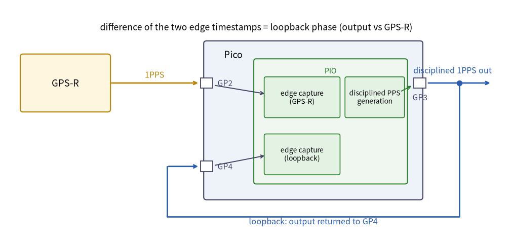

# pico-gnss (firmware)

[](https://crates.io/crates/pico-gnss)
[](https://github.com/sksat/pico-gnss/blob/main/LICENSE)

RP2040 **GPSDO/GNSSDO firmware** (embassy): the reference application that wires
[`gnssdo`](https://crates.io/crates/gnssdo) (HAL-agnostic discipline core) and
[`rp-pps`](https://crates.io/crates/rp-pps) (PIO 1PPS capture / steered output +
NMEA ingestion) into a working disciplined clock.

- PIO **hardware timestamping** of both the receiver's PPS edge and the output's
  loopback edge (~16 ns, no software-interrupt jitter), with a wrap-cost-symmetric
  capture program.
- Crystal frequency estimation (ppb) with **holdover** while the PPS is lost.
- A steered 1PPS output **phase-locked to the receiver's PPS** (type-II servo with
  a Smith predictor); on hardware it tracks at the tens-of-ns level.
- Temperature feed-forward for the crystal (with a ±100 ppb output limiter), which
  absorbs most of the slow, room-temperature-driven wander.
- defmt/RTT diagnostics that feed the repository's real-time web dashboard.



## Running it

This is embedded-only firmware — it is **not** `cargo install`-able (it builds for
`thumbv6m-none-eabi` and flashes via a probe). Clone the
[repository](https://github.com/sksat/pico-gnss) and run from this directory:

```sh
cd pico-gnss
cargo build --release && cargo run --release   # flashes via probe-rs, streams defmt logs
```

Wiring (Raspberry Pi Pico + a GNSS module with NMEA + 1PPS, e.g. MT3333): UART0
RX = GP1 (module TX), UART0 TX = GP0 (module RX), PPS in = GP2, disciplined 1PPS
out = GP3, loopback wire GP3 → GP4. Common ground required.

## Measured on hardware


RP2040 @ 125 MHz + MT3333: PPS jitter within a few 16 ns capture-quantization
steps, disciplined output tracking the receiver's PPS at σ ≈ tens of ns in
good-reception windows, ≤100 ns absolute centering reproducible across reboots.
Full methodology:
[repository report](https://github.com/sksat/pico-gnss/blob/main/docs/report/precision-ladder/README.md) (Japanese).
