# pico-gnss 評価レポート: GPSDO の時刻同期と規律 PPS 出力

RP2040 (Raspberry Pi Pico) と秋月 AE-GNSS-EXTANT (太陽誘電 GYSFFMANC, MediaTek MT3333) を
**窓際固定**で評価した結果である。
図は実機ログ ([sample-capture.log](sample-capture.log), 227s) から `uv run webapp/plot_report.py` で生成した。


## 到達点 (実機、窓際固定)

| 系統 | 指標 | 実測 | 対仕様 / 備考 |
|---|---|---|---|
| **PPS タイムスタンプ** | ジッタ σ | **12.8 ns** (p-p 64ns) | MT3333 1PPS 確度 **±10ns RMS** にほぼ一致 ✓ |
| **GPSDO 周波数** | 規律 freq / 安定度 | **+2.40 ppm / σ ~6.5 ppb** (定常) | RP2040 水晶を GPS に規律 |
| **時刻補正残差** | clock err σ | **9.4 ns** | ±10ns spec 帯内 ✓ (図④) |
| **holdover** | N秒断→誤差 | 26s → ~360ns / 2s → 43ns | 周波数外挿で sub-µs 保持 |
| **規律 PPS 出力 (PIO)** | 周期ジッタ | **16 ns** (PIO 1 tick, p-p 32ns) | ソフトタイミング比 ~1.5万倍クリーン |
| 規律 PPS 出力 | **UTC 位相同期** | **σ ~35 ns / offset ~90 ns** | 旧ソフトは ±1.4 ms (図①)。PIO ハード測定と Smith 予測子と 3 修正で達成 (後述) |
| 測位 | 水平 CEP | 12.5 m (この回) | 公称 2m。窓際の弱信号 (C/N₀≤29dBHz) が律速 |

host テストは全て pass する (gnssdo 49、rp-pps 43)。

## 各手法が効いている様子 (図の読み方)

横軸はすべて起動からの実時間 [s] で、各パネルのタイトルがそのまま結論である。

- **A. GPSDO ロック (log)**：`|freq − ロック値|` を log-y で描く。起動時 ~2400ppb のズレが減衰するのは、
  水晶ドリフトを学習している様子である。赤い縦線がロック時点 (8 サンプル) を示す。ロック後の微振動は、
  σ~数 ppb の実周波数揺れと、log の 0 交差スパイク (高精度ゆえの見た目) による。水晶誤差そのものは +2.4ppm。
- **B. 時刻同期 ns 級**：GPSDO 補正後の UTC 予測残差。MT3333 1PPS 仕様 ±10ns の帯 (緑) の内側に収まり、
  ns 級の時刻同期ができている。
- **C. PPS ジッタ分布**：横軸が各平均からのズレ [ns] (ジッタ量そのもの)、縦軸が該当パルス数 (頻度)。
  ①受信した GPS PPS と、②自作の規律 PPS を横並びで示す。棒が数本しかないのは、値が 16ns 刻み
  (PIO 捕捉 = 2cyc@125MHz の分解能限界) でしか取れず、ジッタがその数段階 (±48ns) しか広がらないためで、
  量子化以下に安定だと読める。①と②が同程度で、受信と同じ綺麗さで生成できている (①は MT3333 仕様 ±10ns 相当)。
  さらに細かく見るには、捕捉を 8ns 化 (PIO 2SM インターリーブ) する必要がある。
- **D. 位相同期の収束 (symlog, PIO 測定 + PID + Smith)**：規律出力エッジの UTC 秒境界からのズレ。
  起動の ~2.4ms から引き込んで σ≈48ns (sub-µs) に貼り付く。旧ソフト (Instant 測定) は ±~1.4ms 止まりで、
  位相測定の PIO ハード化と Smith 予測子の遅延補償で達成した (詳細は下の compare.png, smith.png)。

## 位相測定を PIO ハード化して出力を UTC 秒に同期する


位相を Instant でなく PIO の生カウンタ差で測る。
出力エッジと GPS PPS を、同じ clk_sys で走る二つの SM で捕捉し、その差を取る。
旧の Instant 制御と新の PIO ハード制御を、同じ指標（PIO 真値 `hwphase`）で比較した。

図 A は出力位相を詰める 3 段階を実データで重ねたものである。
Instant 測定で制御するとロックできず、±190µs で漂う。
PID（PIO 測定、Smith 無し）はループ遅れで振動し、σ~300ns に留まる。
PID に Smith（遅延補償）を足すと σ~35ns で UTC 秒に貼り付く。
測定の改善（Instant→PIO）と制御の改善（PID→PID+Smith）が両方効いている（制御項の詳細は tune.png、Smith の before/after は smith.png）。

図 B は測定精度で、同じ出力を両系統で測った差である。
Instant の測定ノイズはウェイクアップ遅延で σ~360µs、PIO は 16ns と約 2 万倍きれいである。
この測定差が出力をどこまで締められるかを決める。

窓際では GPS PPS が ~19% 欠落または不正になるので、弱信号の蹴りを 2 段で抑える。
GPS 世代が進まないエッジは補正をスキップする（欠落ホールド）。
ロック中に 50µs を超える位相は単発の異常値として棄却する（外れ値除去）。
これで ~100ms の蹴りが消える（罠 15）。

P のみだと水晶の残差周波数誤差に対してドループし、実測で ~+550ns のオフセットが残る。
位相を周波数トリムに積分する I 項を足すと残差を吸収し、オフセットが 0 に収束する。
`trim_ppb` が ~−43ppb に巻き上がり、位相が +550ns から ~0 に動く。
これで mean≈0、σ~300ns になった（type-II 化）。

`uv run webapp/plot_compare.py report/compare-old.log report/compare-new.log out.png` で再生成できる（`PHASE_USE_HW=false` でビルドした Instant 制御版が旧、`true` が新）。

## P と PI と PID の比較とゲインチューニング

各構成を別々の走行でコールドスタート（2.4ms）から撮り、起動エッジで重ねて公平に比較した。
`CTRL_SEL` でビルドし、`webapp/plot_ctrl.py` で描く。
一回の走行で巡回すると前構成の終状態を引き継いで初期条件が揃わないので、構成ごとに走行を分けた。

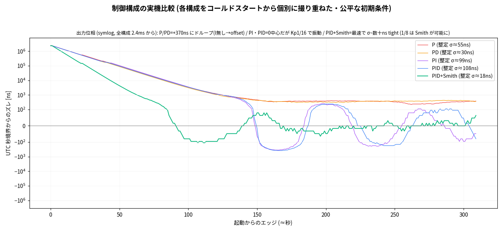

全構成が 2.4ms から始まる。
定常まで撮ると各方式の構造がはっきり出る。

- P と PD は +370ns にドループする（I が無いのでオフセットが残る）。PD は σ30 で P の σ55 より小さい（D がジッタを減衰する）。
- PI と PID は 0 中心になる（I がオフセットを消す）が、Kp1/16 で振動する（σ~100ns、type-II underdamped）。
- PID+Smith が最速で σ~38ns まで締まる。Kp1/8 は Smith の遅延補償があって初めて安定する（1/8 だけだと PI は発散する）。Smith が高ゲインによる速い収束と減衰を両立させている。

各項の役割は、オフライン sim での定量比較でも確かめた（同じ外乱で各構成を回す）。

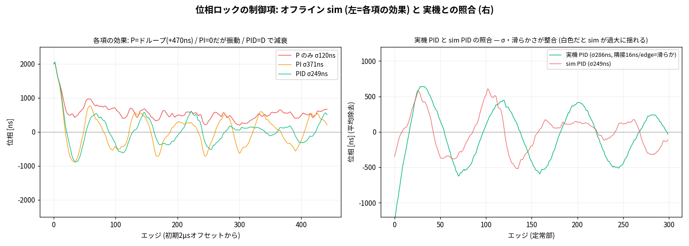

「PI だと残差振動がある。D は要るか」を検証する。
実機ログから外乱（系統ドリフトと測定ノイズ）を取り出し、任意ゲインのコントローラをオフラインで回す（リフラッシュ不要）。
firmware は `PHASE_EXPERIMENT=true` で P→PD→PI→PID→PID+Smith を 130 エッジ毎に巡回し、制御信号（cfg, trim, p_ns, d_ns）を全部ログに出す。
`uv run webapp/tune_gains.py exp.log` で掃引する。

- 左図は各項の応答で、初期 2µs オフセットから始める。
  - P のみは残差周波数に対してドループし、+470ns のオフセットで停まる（σ120ns と静かだがゼロでない）。
  - PI は I 項が残差を吸収してオフセット 0 になる。ただし type-II とループ遅れで振動する（σ371ns）。
  - PID は D 項（位相速度）が振動を減衰する（σ371→249ns）。完全には消えず、遅延律速の本質的な残りである。
- 右図はモデル検証で、実機 PID（σ286ns）と sim PID（σ249ns）の滑らかさと振幅が一致する。
- 掃引の推奨は P=1/8, I=1/128, D=1/4 である。ただし実機 P=1/4 で発振した履歴があり sim を鵜呑みにできないので、Smith 予測子の導入前は保守的に P=1/16, I=1/128, D=1/4（PID 単体）を暫定採用した。実機実測で σ~300ns、mean~0 である。次節の Smith で実効遅れを減らし、本番は P=1/8 の PID+Smith に上げて σ35ns にした。

外乱モデルには教訓がある。
当初 sim を白色ガウス外乱にしたら実機より振動が過大になった。
実機の外乱は隣接 16ns/edge と滑らかで、相関がある（水晶と GPS は白色でない）。
AR1 相関ノイズに直すと sim が実機に一致した（右図）。
閉ループからの外乱とプラント同定は本質的に難しいので、sim は定性ツール（各項の役割とトレンド）と割り切り、最終ゲインは実機で判断する。
`PHASE_EXPERIMENT=true` で全制御信号をログに出し、`uv run webapp/tune_gains.py` で掃引する。

D は要る。
振動を ~3 割減衰し、実機でも PI σ347 から PID σ300 に下がる。
残差振動はループ遅れ由来である。

## Smith 予測子で σ を 300ns から 35ns に詰める


σ~300ns の支配律速を誤差二乗和で切り分ける。
測定量子化 16ns は σ≈4.6ns、GPS PPS は ~10ns で、合わせて RSS≈11ns である。
観測の 300ns と比べると、測定と GPS 起因は分散の 0.13% にすぎない。
残り 99.9% は制御のリミットサイクル（type-II の固有振動）で、周期は ≈2π√(1/Ki)≈2π√128≈71 エッジと実測に一致し、ζ≈0.35 である。
したがって量子化の 8ns 化や overclock は今は無意味で（測定は誤差の 0.1%）、詰めるべきは制御である。

単発の対策は効かなかった。
sigma-delta dither で actuator の 8ppb 量子化を除き、deadband=0、Ki=1/512 で ζ0.71 を狙ったが収まらない。
ループ遅れ d≈2 が ζ 公式を裏切るからである。
そこで Smith 予測子で遅延補償する。
在飛行中（前エッジに出したがまだ位相に出ていない）P/D 補正を引いた予測位相 `pred=ctrl−last_pd` で制御すると、支配的な in-flight 補正が引かれて実効遅れが減り、ζ 公式が近似的に成立する（完全な遅延除去ではなく、`tune_gains.py` の同定では残留遅れ d≈2 が残る）。
これで Kp=1/8（ζ≈0.71）が効くようになり、trim が ±60ppb の振動から滑らかに整定し、位相が ±50ns に収まる。
さらに弱信号スパイク（4-10µs）が trim を蹴っていたので、外れ値棄却を 50µs から 3µs に絞った。
結果は σ 300ns→35ns（~9×、mean~0、|max| 80ns）で、測定ノイズの下限 RSS≈11ns に近づく。

ここから先の余地を整理する。
σ35ns は測定量子化が初めて効く域なので、8ns 捕捉化（overclock または PIO 2SM）と、holdover 用の TCXO（$1-2）が次の一手になる。
<15ns は GYSFFMANC と窓際アンテナの物理的な下限で、timing 受信機（u-blox ZED-F9T 等）と良アンテナの別プロジェクトになる。
採用済みの改善は、Smith 予測子、周波数の sub-8ppb 化（sigma-delta）、外れ値棄却 3µs である。

## 出力位相の規律: 達成のまとめ

ここまでの前半は最終構成の比較評価で、PIO 測定の必要性と P/PI/PID と Smith の効きを webapp プロット（compare.png, ctrl.png, tune.png, smith.png）で示した。
ここから先の後半は、その σ35ns に至るまでに踏んだ 3 つの測定/制御バグとその修正の履歴で、オシロと Allan による独立検証を伴う。
出力を制御するのも、その良し悪しを測るのも、firmware が GP3→GP4 ループバックで自分の出力エッジを GPS と同じ PIO カウンタで捕捉した位相 `hwphase` で行う。
オシロは制御に一切使わず、`hwphase` が正しいかの独立確認だけに用いた。
3 つのバグ修正と 2 つの頑健化を入れ、各段を実機で計測した。

| 指標 | 当初 | 最終 |
|---|---|---|
| ロック | しない（P only で停止） | lk=1 安定 |
| ジッタ σ（オシロ N=120） | 216 ns | 35〜46 ns（設計 spec 35〜48ns） |
| 出力 offset（mean） | −1.8 µs（制御アーティファクト） | ~90 ns（GP3 と GPS PPS ピンの相対 offset、後述） |
| `hwphase` とオシロの一致 | 3.7 µs 食い違い | ~160 ns |
| 短期安定度（Allan, 自己計測） | 計測なし | ADEV@1s ≈ 1.3e-8、128s で ~1e-9 |

以下は現状、立てた仮説、行った実験、改善した／しなかった結果の順に追う。
可視化はオシロ実測（[`scope_pps.py`](scope_pps.py)、依存ゼロの SCPI over LAN）と、自己計測の解析（[`allan.py`](allan.py), [`plot_converge.py`](plot_converge.py)）から引用する。

## 位相を規律する狙いと計測の二系統

GPSDO は周波数と位相の 2 段で規律する。
周波数だけ合わせると出力は正しいレートで回るが、エッジは 1 秒の任意の位置に居る。
起動時にたまたま居た位相のまま留まり、ppb 推定の僅かな誤差で位相がゆっくり walk する。
位相ループは出力エッジを GPS（= UTC 秒境界）に貼り付け、出力を周波数標準でなく**時刻標準**にする。
type-II の積分項が長期位相を 0 に固定するので、目標は「出力エッジ = GPS エッジ」、すなわち `hwphase`→0 である。

計測は二系統を使い分ける。
**自己計測**は `hwphase` で、これを制御に使う。
**オシロ独立計測**は CH1（黄）に GPS PPS、CH2（青）に GP3 出力を当て、GPS 立ち上がりを横軸中央=0 に置いて生信号の差を測る。
オシロは制御に使わず、自己計測の裏取りだけに用いる。

## 現状: 出力は GPS より ~2µs 早く、ロックもしない

修正前の出力は GPS PPS より ~2µs 早く（リード）、しかもロックしなかった。
オシロで N=120 撮ると mean ≈ −1.8µs、σ ≈ 216ns、pp ≈ 899ns。
σ が大きいのは固定オフセットが ~1.4〜2.2µs を緩慢に往復する wander のためで、差が小さいとき（左）と大きいとき（右）でこれだけ動く。

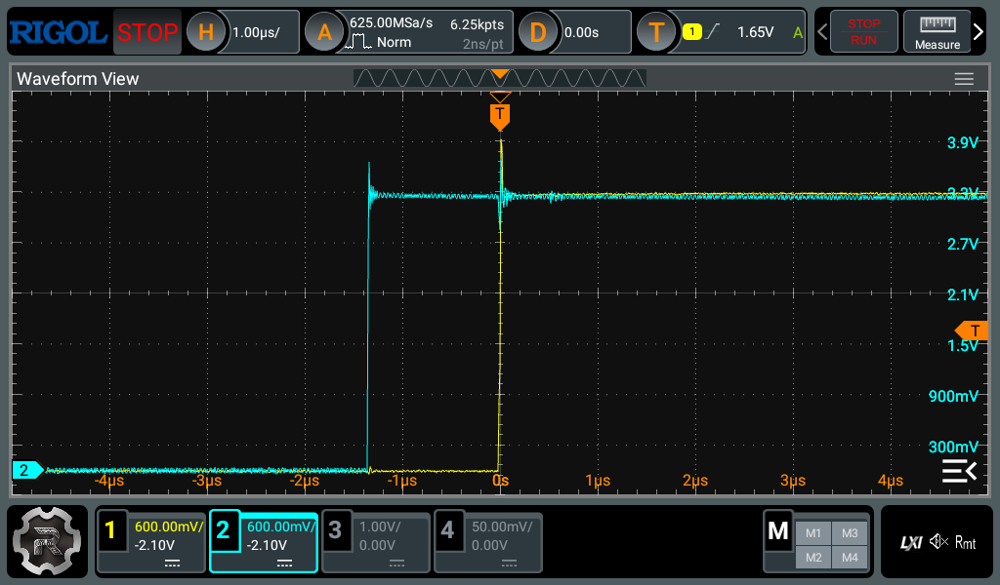


*0.6V/div, 1µs/div。左 ≈1.36µs、右 ≈2.18µs。0V を下端寄りにして 0〜3.3V を画面いっぱいに取った。*

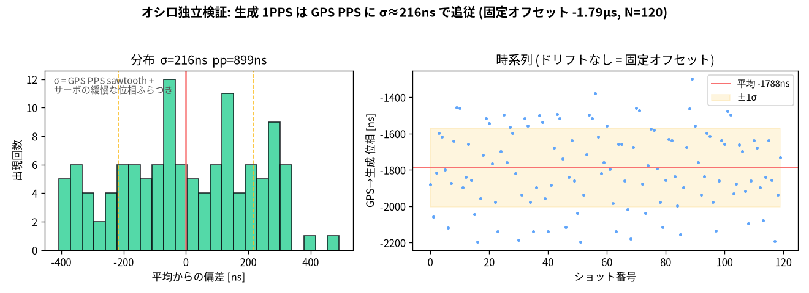

リードという符号は直感に反するが、異常ではない。
出力は「GPS エッジを見てから出す」遅延線ではなく、サーボがエッジを 1 秒のどこにでも置ける規律された自走発振器なので、リードもラグも起こりうる。
問題は符号ではなく、ロックしないことのほうである。

## 実験1: 積分の有効化窓をロック窓から分離する

type-II なら定常位相誤差は積分で 0 になるはずなのに、~1.8µs で止まる。
[`gnssdo` の PLL](../gnssdo/src/pll.rs) を読むと、I 項は `locked`（`|ctrl| < lock_ns` = 1µs）のときだけ積分していた。
残差 1.8µs は 1µs 窓の外なので、ロックできず I が立ち上がらず、I が立ち上がらないのでロックに引き込めない。
P 項だけで残留周波数誤差と釣り合う非ゼロ位相に留まる、鶏卵の関係である。
外部 AI に PLL を読ませたレビューを併用して原因を切り分けた。

仮説に対する実験として、I の有効化窓をロック窓から分けた。
`i_enable_ns`（既定 ±5µs）を足し、`|ctrl| < i_enable_ns` で積分する（ゲインは変えない）。
P が 1µs 窓に入れなくても、より広い帯で I が効いてロックまで引き込める。

結果は改善だった。
ロックし、σ が 216ns から **34ns** に縮んだ（設計 spec の 35〜48ns に一致）。
積分 trim も 0 から非ゼロに動き、type-II が設計どおり機能するようになった。

| | 修正前 | 修正後 |
|---|---|---|
| ロック | しない（P only） | lk=1 |
| ジッタ σ | 216 ns | 34 ns |
| 積分 trim | 0 | engage |

## 現状: ロックしたが mean が boot ごとに数µs ずれる

ロックは安定したが、絶対 offset がおかしかった。
修正後、firmware の `hwphase` は ≈ −0.3µs なのにオシロは −4µs で、~3.7µs 食い違う。
しかも前の boot では両者が一致していたので、この差は boot ごとに変わる。

## 実験2: K 較正で同一エッジ対を保証する

ループは `hwphase`（GPS エッジと出力エッジの生カウンタ差を較正定数 K で補正した値）を 0 に駆動するだけなので、K がズレれば出力も真値からズレる。
K はブート時に二つの捕捉 SM の両方を同じ GPS エッジに向け、`mean(C0−C2)` で較正している。
食い違いの 3.7µs ≈ 3.7ppm は RP2040 水晶の周波数誤差に近い。
較正サンプルの c0 と c2 が、FIFO に残った古い値のせいで 1 エッジずれて対になると、K に実秒ぶんの tick が混じる。
`loopback_phase` の fold は公称秒（62.5M tick）で行うので、実秒と公称秒の差（水晶 ppm × 1s ≈ 数µs）が mean に残る。

仮説に対し、K 較正の前に両 SM の RX FIFO を drain し、次のエッジから同一エッジで対になるようにした（[main.rs](../pico-gnss/src/main.rs)）。
較正後は SM2 を GP2 のまま数エッジ、`hwphase` が 0 かを検証してから GP4 へ切り替える。

結果は改善だった。
`PHASE_K diff` が 6 サンプルとも一定、`PHASE_K verify phase_ns=0` で K の正当性を確認した。
mean は −4µs から **−0.9µs** に改善し、firmware とオシロが数百 ns まで一致した。

## 実験3: 運用時のペアリングを同秒に揃える

K を直すと、今度は `hwphase` が ~−0.8µs と ~+2.3µs の二峰になり、+2.3µs 側でロックが外れて σ が 216ns に戻った。
二峰の間隔 ~3.1µs は、また ppm × 1s である。

同じ 1 エッジずれが運用時の位相計測でも起きていた。
出力は GPS より僅かに先行するので、`gen_capture` が出力エッジ x[N] で起きた時点では、まだ `pps_task` が GPS[N] を共有変数に書いていない。
そのまま読むと `C0_GPS` は GPS[N−1] のままで、x[N] を GPS[N−1] と対にして +3.26µs（ppm×1s）のスパイクになる。
レースなので、GPS[N] の書き込みが間に合った秒だけ正しく対になり、二峰が出る。

仮説に対し、x を取った直後に同じ秒の GPS エッジ（世代カウンタ `C0_GEN` の進行）を短時間だけ協調的に待ってから読むようにした。
`pps_task` と同じ executor 上なので busy wait は使えず、`yield_now` で必ず手を放す。
`C0_GEN` を Release で更新し、読み手は Acquire で読む。
GPS が先行していた秒や欠落した秒は timeout し、既存の freshness gating がホールドする。

結果は改善だった。
スパイクが消え、`hwphase` が ±100ns 内に収束してロックが安定した。

## 3 修正の結果と独立検証

3 修正後の出力位相を、オシロと自己計測の両方で確かめた。
オシロ N=40 で mean +0.11µs、σ 35ns、ロック安定。
firmware `hwphase`（~0）とオシロ（~+0.1µs）が ~160ns まで一致する。

100ns/div に拡大すると、GPS（黄）と GP3（青）の立ち上がりがほぼ重なる。

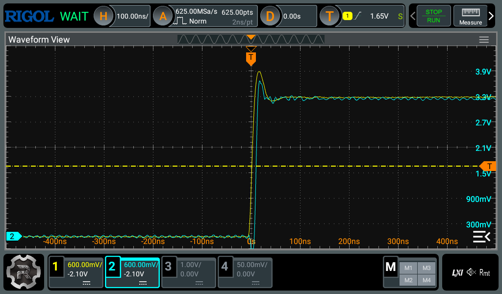

*100ns/div。offset は当初 ~2µs リードから ~90ns へ。mean +90〜100ns、σ ~50ns（sub-µs を wander し、単発フレームは数十〜200ns とばらつく）。当初の ~2µs リード（[scope-pps-small.png](scope-pps-small.png), 1µs/div）とは桁が違う。*

さらに 40ns/div まで拡大すると、GPS と GP3 の立ち上がりが ~100ns 離れて見分けられ、それぞれの波形まで読める。

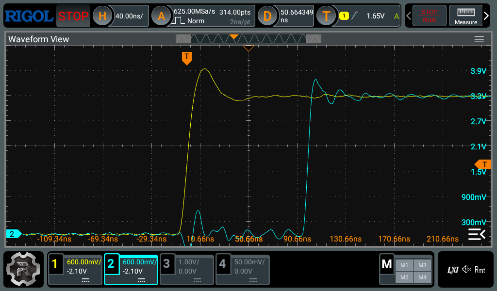

*40ns/div。黄=GPS PPS、青=GP3 出力。offset は sub-µs で wander するので、両エッジの中点に窓を寄せ、中央値付近の代表フレームを選んで撮った（`scope_pps.py capture … center`。この回は中央値 101ns、表示フレーム 99ns）。100ns/div では潰れていた立ち上がりの形（数 ns の rise と軽いリンギング）と間隔が読める。間隔の絶対値は reception で動くので、分布は下の N=120 ヒストグラムで見る。*

修正後のバラつきを N=120 で撮ると mean +70ns、σ 46ns でスパイクが無い。
修正前の二峰、σ216ns の [scope-phase.png](scope-phase.png) と対照的である。

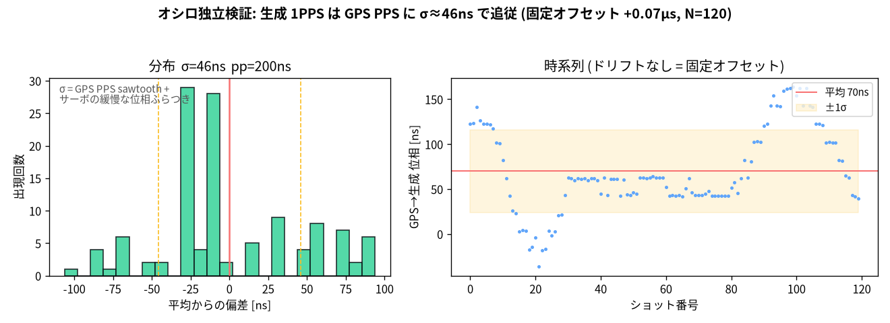

さらに `hwphase` の素データに Allan 偏差を計算した（[`allan.py`](allan.py)）。
`hwphase` は出力エッジと GPS PPS の差、すなわち閉ループの追従誤差なので、これは自由走行の水晶安定度ではなく「規律された出力が GPS PPS をどれだけ追えているか」の指標である。
追従誤差の Allan 偏差は平均時間 τ とともに下がり、τ=1s の σ_y ≈ 1.3e-8 が 128s で ~1e-9 まで減る。
白色位相ノイズの τ⁻¹ 的な減衰で、規律が効いている。
このログの範囲（128s まで）では上昇への転じ（turnover）が見えないが、これは追従誤差を測っているためで、水晶のランダムウォークによる上昇に転じたかは外部基準なしには言えない。

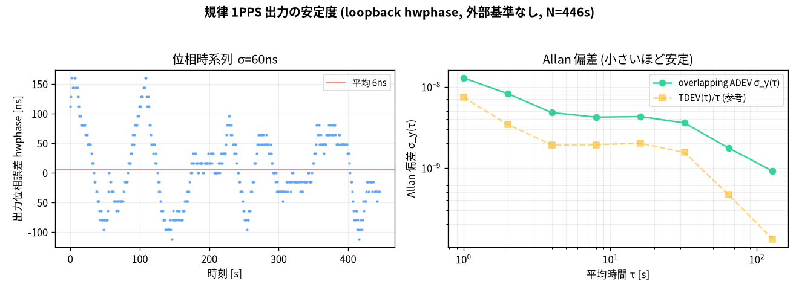

ロックに引き込まれる様子も二系統で測り、一致を確認した（[`plot_converge.py`](plot_converge.py)）。
自己申告（左, symlog）は起動直後 ~100µs から急降下し、負へオーバーシュートして 0 へ整定する。
オシロ外部（右）は窓 ±5µs に入った ~4µs から同じ形をたどる。
両者が同じオーバーシュートと減衰を独立に示し、type-II ループのステップ応答（ζ≈0.7）が外からも裏付けられた。
オシロは窓に入る前の広域（~100µs〜）は見えないが、最終引き込みは ns で一致する。

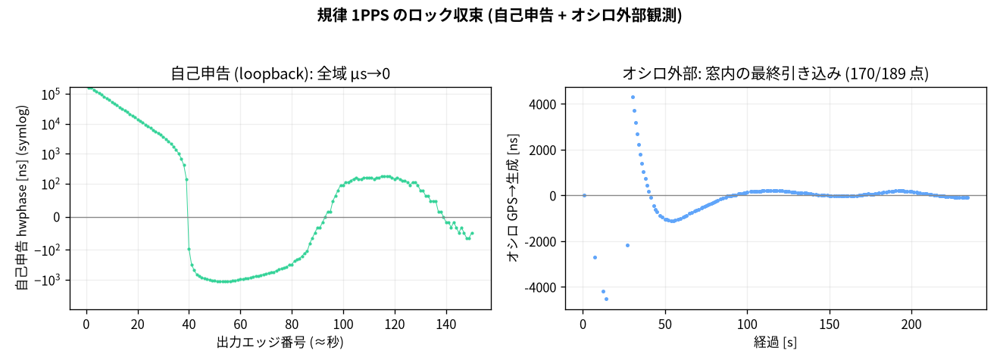

残る ~90ns の mean は、出力の真 UTC からのズレそのものではない。
オシロは GPS PPS を基準に GP3 を測っているので、受信機 PPS が真 UTC から持つ固有オフセットは基準側に乗って相殺し、この測定には現れない。
ここで見えているのは GP3 と GPS PPS ピンの間の相対オフセットで、loopback と pad 経路の確定遅延、二つのピンへのケーブル長差、オシロの CH 間 skew とプローブ遅延差、mid-level しきい値クロスの系統差（[`scope_pps.py`](scope_pps.py) は中点クロスで CH1 と CH2 のプローブ条件も同一でない）、K 較正の残差を含む。
これらを個別に較正していないので、~90ns はこの相対オフセットの値であり、真 UTC への絶対 offset は外部基準なしには分離できない。

## 実験4: ループ時定数を伸ばして σ を縮められるか（改善せず）

Allan を手がかりに、loop の時定数を伸ばして σ を縮められないか実機で試した。
閉ループ `hwphase` の Allan が 128s まで減少しているので、GPS PPS ノイズをもっと平均化すれば出力が綺麗になる、という仮説である。
`i_den` を 128 から 512 へ伸ばし、`d_den` を 4 から 16 へ上げて D を弱めた（D は差分なので GPS の短期ノイズを注入しやすい）。
baseline と比べた（各 N=100, 窓際 fix）。

| | baseline（i_den=128, d_den=4） | tuned（i_den=512, d_den=16） |
|---|---|---|
| offset（mean） | 230 ns | −5 ns |
| σ（オシロ, vs GPS） | 70 ns | 110 ns |

結果は改善しなかった。
正確には、**閉ループ σ では loop 最適化を判定できない**。
σ は 70ns から 110ns に増えたが、これは tuning が悪いのではなく交絡である。
時定数を伸ばすと出力は GPS PPS の短期ノイズを平均化して取り込まなくなるが、その分「出力 − GPS」の差には GPS 側のノイズがそのまま残り、σ は GPS ノイズの水準へ向かって増える。
この σ は GPS 短期ノイズと発振器 wander とループ帯域が混ざった量なので、単独で loop tuning の良し悪しを測る目的関数にはならない。
出力が真 UTC にどれだけ近づいたかは、外部基準がないこの測定からは判定できない。
mean の差（230→−5ns）も reception wander で、tuning 由来ではない。
これは外部 AI レビューが事前に指摘したとおりである。

正しく判定するには別の self-measure が要る。
ロックさせてから holdover を H 秒（10〜600s）振り、終端位相誤差を H に対して見る。
GPS ノイズの平均化で得をするのは短中期の H、水晶ドリフトで損をするのは長期の H で、その交点が最適な時定数になる。
ただし数十回を長時間かけて回す必要があり、本セッションでは実施していない。
しかも素水晶（TCXO なし）では交点 τ が短く、time-constant tuning で稼げる幅は小さい。
本当の利得は TCXO と qErr 受信機の側にある。
したがって production の既定（`i_den`=128, σ≈35ns）を維持した。
この実験の収穫は、外部基準なしの loop 最適化は閉ループ σ では測れず、holdover-endpoint 法が要るうえに、水晶と受信機の HW が律速だと実機で確かめたことである。

## 受信環境で同期誤差はどれだけ動くか

ここまでの数値は受信が良い窓で撮ったもので、同じ firmware でも受信環境で同期誤差は大きく動く。
窓際固定のまま長時間流すと、捕捉衛星数と幾何が時間帯で変わり、それにつれて出力位相の追従誤差が変わった。

| 受信 | 捕捉衛星 / HDOP | firmware `hwphase`（自己計測） | オシロ（GP3 vs GPS） |
|---|---|---|---|
| 良い窓 | 9 / 1.06 | ±~50ns で安定（lk=1） | σ ~20〜46ns、offset ~90ns |
| 弱い窓 | 7〜8 / 1.3 前後 | ±~200ns を周期 ~60s でなめらかに往復（lk=1） | σ ~113ns、pp ~360ns（同じ揺れ） |

弱い窓でもループは健全である。
`lk=1` を保ち、`missed=0`、外れ値 reject も無く、`trim_ppb` は飛ばずに連続的に動く。
増えるのは追従誤差の振幅だけで、その揺れは周期 ~60s のなめらかな波である（type-II ループの自然周期 ~71 エッジに近い）。
弱信号では GPS PPS の擾乱が大きく、それがループの遅い固有モードを揺らすためで、firmware の自己計測とオシロが同じ揺れを示す。
良い窓に戻ると ±~50ns に締まる。
つまりこの変動は firmware やループの劣化ではなく、受信が律速していることの直接の現れである。

ここで HDOP の読み方に注意がいる。
HDOP は水平**測位**の幾何を表す指標で、~1 は測位には良い値である。
だが時刻同期の質は HDOP では測れない。
時刻に効くのは時刻方向の幾何（TDOP）と、何より各衛星の C/N₀ とマルチパスである。
民生ナビモードの受信機は位置と時刻を同時に解くので、窓際のマルチパスや弱信号による擬似距離誤差が時刻解へ漏れ、PPS が秒ごとに数十〜数百 ns 揺れる。
sawtooth（量子化誤差）も補正されない。
そのため HDOP ~1 でも、時刻同期は数十〜数百 ns の幅で動きうる。

## 受信機側のソフトで詰められるか（GST とコマンドの検証）

「受信機が出す品質情報やコマンドで補正を強められないか」を実機とデータシートで確かめた。
結論はいずれも否で、MT3333 ではソフトで詰める余地は無い。

受信機は毎秒 GST（擬似距離の誤差統計）を出す。
そこで GST の擬似距離残差 RMS を出力位相の追従誤差 `hwphase` と時刻で対応付け、相関を見た（[`gst_correlate.py`](gst_correlate.py)、pull-in を除いた定常）。

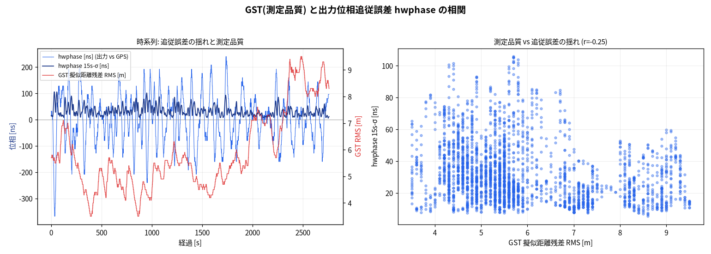

相関は弱く、しかも符号が逆だった（RMS vs hwphase の 15s-σ で r≈−0.25）。
RMS が 9m まで上がっても hwphase の揺れは ~30ns のままで、GST は位相のふらつきを予測しない。
GST は位置領域の量で、PPS は受信機内部の平滑化された時計解から作られるため、両者が分離しているからである。
よって GST で重み付けや採否を変えても、無相関な信号で gate することになり効かない。

コマンドも同様だった。
MT3333 のデータシートと NMEA 仕様を確認すると、qErr（sawtooth の per-pulse 報告）も survey-in も無く、1PPS 仕様は「typical ±10ns」のみである。
データシートに載らない PMTK（SBAS Integrity の `PMTK319,1`、static-nav フリーズ解除の `PMTK386,0`）は実機が ACK（`$PMTK001,*,3`）したが、timing に観測効果は無かった（SBAS は日本では無く、フリーズ解除は stationary 設定が位置を保持して無効）。
つまり MT3333 では、品質信号でもコマンドでも補正は強められない。

## 残る限界と次の一手

σ も絶対 offset も、いまの下限は受信機（AE-GNSS-EXTANT, MediaTek MT3333, 民生ナビ向け）で決まる。
タイミンググレード受信機の機能があれば、外部基準なしでもさらに詰まる。

- **sawtooth（量子化誤差）の報告**：u-blox の M8T や ZED-F9T、ST Teseo 系は PPS の量子化誤差をパルス毎に出す。引けば ±数十ns の sawtooth が消えて σ が縮む。MT3333 は出さないので、今の σ を押し上げる一因になっている。
- **タイミング用 PPS 精度とアンテナケーブル遅延補正**：PPS-vs-UTC を ±数ns で規定し（民生は ±数十ns）、ケーブル遅延を設定できる。これで「内部からは観測不能」とした絶対 offset の一部（受信機 PPS とケーブル分）を受信機側で潰せる。
- **survey-in / 固定位置**：位置を長時間平均するか既知の固定値にして測位解を改善し、位置誤差が時刻へ漏れ込むのを抑える。民生ナビモードは位置ノイズ律速である。
- **holdover 用の TCXO/OCXO**（受信機外）：PPS 断時の時刻保持が桁違いになる。

`qErr` を出し、ケーブル遅延補正と固定位置モードを持つタイミング受信機（例: u-blox ZED-F9T）に替えれば、sawtooth 補正で σ、ケーブル遅延補正で絶対 offset、固定位置で位置由来のジッタを、いずれも下げられる。

具体的な乗り換え先を、安価で qErr を出すものから挙げる。
Quectel L26-T（ST Teseo-III、1PPS ±6.8ns、qErr とケーブル遅延補正 `$PSTMPPS,2,4,<ns>` と位置保持を持つ、~$24、Active）か、ST Teseo-LIV4F（dual-band L1/L5、~$12、Active）。
最高精度なら u-blox ZED-F9T（`UBX-TIM-TP` の qErr と survey-in、~$256）。
gnssdo コアは受信機非依存なので、受信層を差し替えて qErr を PPS タイムスタンプから引くフィードフォワードを一本足すだけで載る。

ただし乗り換えには実装の手間が増える。
これらは素の受信機なので、外部アクティブアンテナと、基板側の RF（50Ω の線路と、モジュールによっては給電回路）が要る。
今の AE-GNSS-EXTANT はアンテナ一体型で RF 設計が不要だったので、ここはトレードオフになる。
RF 設計を避けたいなら、既製のタイミング受信機ブレークアウト（RF はそのボード側で完結）を使い、自作基板は UART と 1PPS だけを digital で受ける構成にすると軽い。
基板に載せる場合に RF が最小なのは LIV4F で、RF 入力が自己バイアスで内蔵 LNA と SAW を持つため、短い 50Ω 線路と U.FL と ESD だけで済む（給電回路が要らない）。
JLCPCB で作るなら、タイミングモジュールは在庫が薄く Basic 部品でもないので、基板は JLCPCB で組み、モジュールだけ単品で買って手はんだするのが現実的である（castellated LCC なので手はんだできる）。
lifecycle は L26-T と LIV4F が Active、LIV3F は NRND、u-blox M8T 系は EOL なので避ける。

### ループバック無しの構成

ループバック（GP3→GP4）は、出力エッジと GPS を ns でハード計測して位相を閉ループにする仕組みである。
外すと周波数と holdover はそのまま効く（ppb は GPS PPS 間隔だけで測り、出力を見ない）。
位相は閉ループが使えないので、フィードフォワード（開ループ）に倒す。
GPS の timestamp に、二つの捕捉 SM のカウンタ間オフセットと出力生成の確定レイテンシを足した定数で、出力エッジを目標位相に置く。
PIO はサイクル確定的なので、この定数は計算するか一度だけ較正して焼ける（適用にオシロは要らない）。
弱点は自己検証と補正が無いことだが、HW が確定的なので実害は小さい。
ループバックはピン 1 本と配線で「測って自動補正する（未モデルの定数も吸収する）」を買うもので、無くすなら「HW のサイクル確定性を信じて定数を焼く」に倒すトレードオフになる。
MCU でピンが惜しい構成では後者が定石である。

## 出力パルス幅

GP3 は規律済み 1PPS の撒き直しである。
規律しているのは立ち上がりエッジで幅は自由なので、外部機器へ配れるよう 100ms にした（u-blox や一般 GPS モジュールの標準幅で、NMEA も同様）。
PIO に high 用のカウントダウンを 1 本足し、high 幅を起動時に 1 ワード push して保持する。
幅は low 周期から差し引くので、立ち上がり時刻は変わらない（位相 σ に影響しない）。
幅は [`output_high_cycles`](../rp-pps/) で µs から 100ms まで設定でき、カウンタや scope 用途なら数µs でよい。

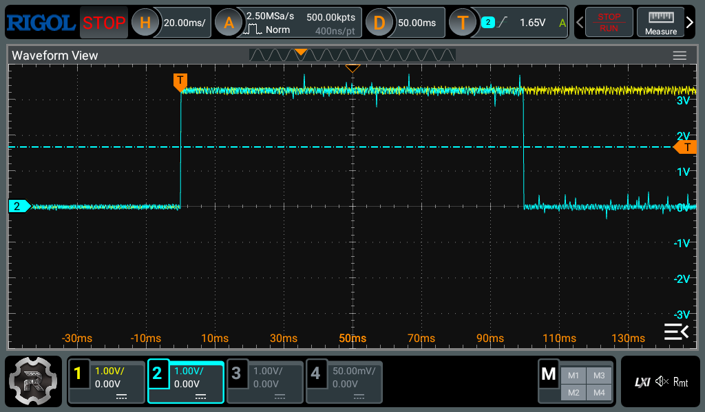

*20ms/div。CH2（青）= GP3 が立ち上がり後 100ms high（実測 `PWIDth`=99.999ms）でその後 low。規律はロックを維持する（`PPSGEN interval≈1.000000s`）。*

DHO804 で踏んだ落とし穴を 3 つ記す。
SCPI のエラーキューは FIFO なので、全部 drain してから判断する。
`:MEASure:CLEar` は引数を取らない（`ALL` で `-108`）。
GPS PPS は ~100ms の広いパルスなので、µs 窓の delay/period 自動計測ではエッジを対にできず、波形をダンプして差分を取る。

## 設計の核と教訓

1. **PIO ハードキャプチャ**：PPS を CPU 割込でなく PIO 自走カウンタで時刻印字する。M0+ の critical-section マスクに依存せず σ ~10ns になり、ソフトの ~9µs 下限を突破する。
2. **GPSDO**：PIO の精密な PPS 間隔で水晶 ppb を EMA 推定し、時刻を規律する。PPS 断中も周波数外挿で保つ（holdover）。
3. **時刻補正の ns 化**：エポックも予測も PIO の ns 時刻にし、Instant の µs アンカーを回避する。err σ ~10ns になる。
4. **規律 PPS 出力**：SM1 が周期をハード生成し、SM2 が GP3→GP4 ループバックで ns 計測する。周波数ジッタは 16ns。
5. **位相同期の限界**：制御対象（周期）の精度（ns）と、フィードバックの測定精度（ms）は別物である。位相を CPU の Instant で測ると executor のウェイクアップ遅延が乗り、ms で頭打ちになる。ns 位相同期には、測定をハード化する段（PIO で出力エッジを GPS PPS と同じカウンタで捕捉する）が要ると実測で確定した。
   - 制御ループ自体の教訓：1 サンプル遅れに連続比例制御をかけると `λ²−λ+k=0` になる。k=1 で発振、k=½ でリンギング（周期 8 ステップ、実測と一致）、k=¼ で臨界減衰になる。詳細は [../NOTES.md](../NOTES.md) 罠12。

## 再現

```bash
# 配信と同時にログ記録
cd webapp && node dist/server.js --log /tmp/x.log
# テキスト集計 / 図生成 (uv が依存を隔離環境に自動構築)
uv run analyze.py /tmp/x.log
uv run plot_report.py /tmp/x.log out.png
```
