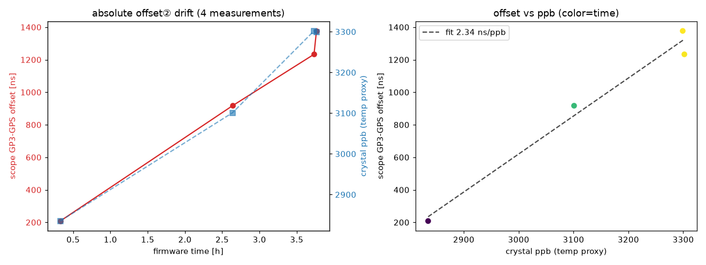
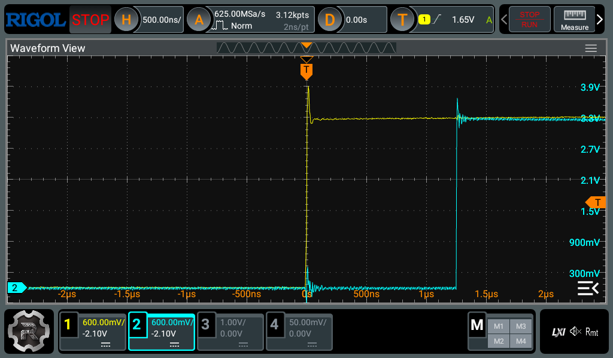
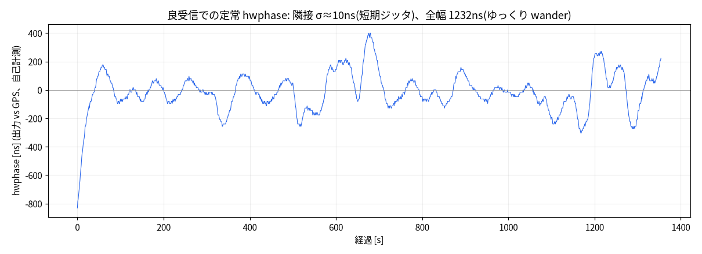
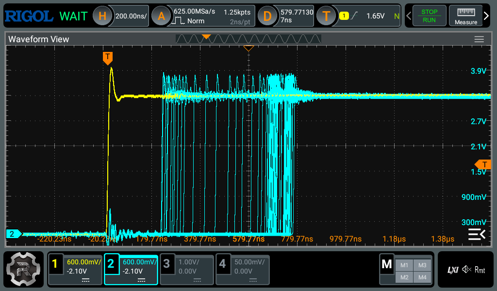
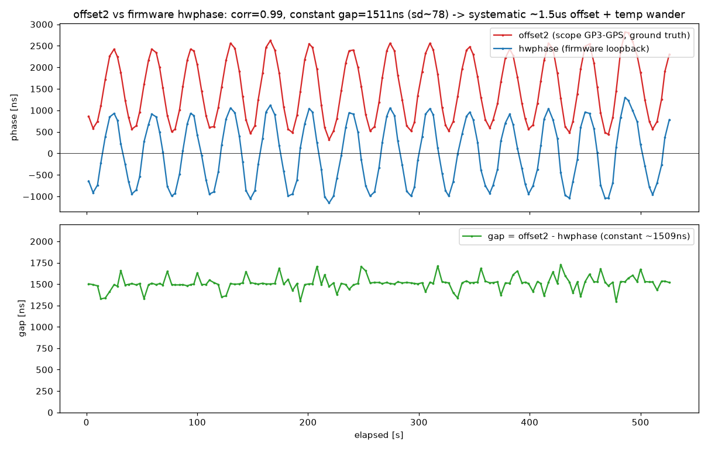
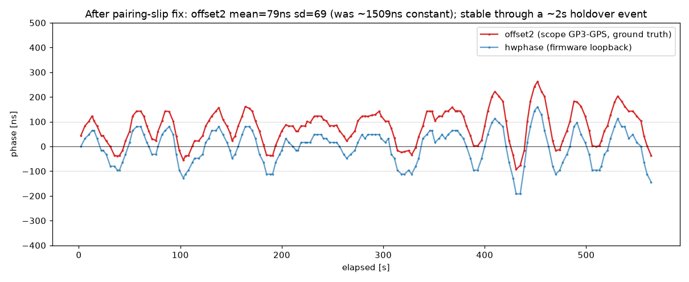
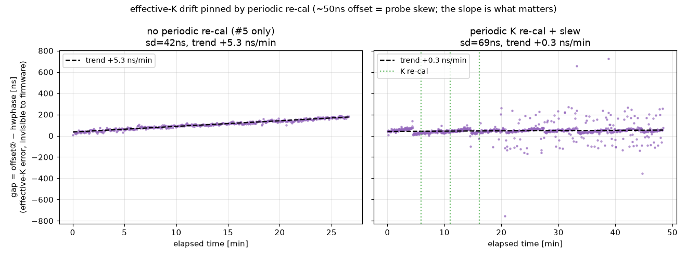
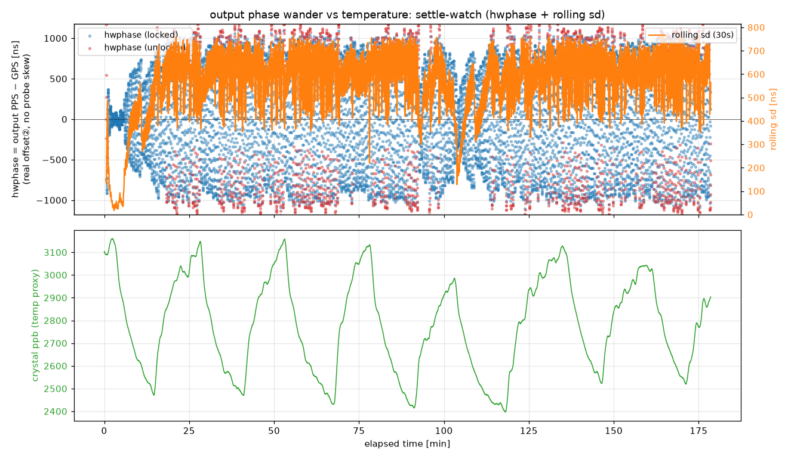
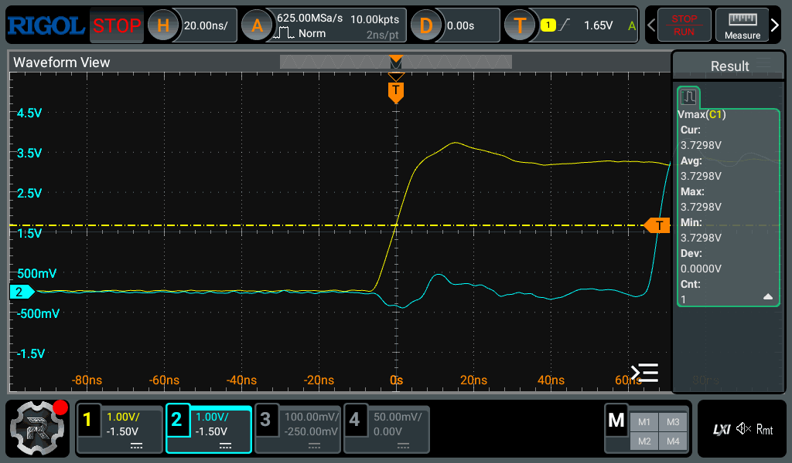

# pico-gnss 評価レポート: GPSDO の時刻同期と規律 PPS 出力

RP2040 (Raspberry Pi Pico) と秋月 [AE-GNSS-EXTANT](https://akizukidenshi.com/catalog/g/g113849/) (太陽誘電 GYSFFMANC, MediaTek MT3333) を
**窓際固定**で評価した結果である。


*評価ハードウェア。Pico (RP2040) を breakout に載せ、秋月 AE-GNSS-EXTANT (GYSFFMANC, MT3333) をリボンケーブルで接続。規律 1PPS 出力 (GP3) と GPS PPS にオシロを当てて位相を測る。*

図は実機ログ ([sample-capture.log](sample-capture.log), 227s) から `uv run webapp/plot_report.py` で生成した。


## 現在の到達点と結論 (本セッションで再検証)

このレポートは GPSDO の時刻同期精度を実機で評価した記録である。
冒頭に現在の確定見解を置き、詳細は以降に、調査の経緯 (仮説と反転を含む) は末尾の changelog に記す。
過去の追記で結論が読み取りにくくなっていたため、本セッションで主要な主張を実機で再検証し、要約を先頭へ整理した。

### 二つの「精度」を区別する

本機の「精度」には二つの意味があり、混同しない。
ひとつは出力 1PPS が受信機の 1PPS にどれだけ一致するか (hwphase = 出力 − 受信機 PPS) で、これはオシロでも測れ、本機が制御で詰めている量である。
もうひとつは出力が真の UTC にどれだけ近いかで、これは hwphase もオシロも同じ受信機を基準にするため、外部基準 (TIC / Rb / 独立 2 台目受信機) なしには原理的に測れない (計測トラップ)。
本機の運用目標は前者、すなわち**受信機 1PPS への tight な追従**である (受信機を信じて合わせ込む方針。オシロ検証もしやすい)。

### 到達点 (再計測値)

- 受信機 1PPS の短期ジッタは σ≈14ns (16ns の PIO 量子化で律速、MT3333 仕様 ±10ns 相当)。受信機 PPS は隣接秒どうしでは綺麗である。
- 規律出力の位相 hwphase は観測窓に強く依存し、短窓 (数十 s・良受信) で数十 ns、~2 分で 60–150ns、~10 分以上で σ≈200–250ns・p95≈400ns (いずれも良受信時) になる。
- すなわち**短窓・良受信では ≤100ns に入るが、長時間や受信変動を跨ぐと安定して ≤100ns には収まらない**。
- 時刻補正残差 (clock err) は σ≈10ns、PPS タイムスタンプは σ≈13ns、規律 PPS 出力の周期ジッタは 16ns。

(直下の旧「到達点」表の σ35–50ns は良受信・2 分窓の代表値で、持続値は上記のとおり大きい。表はこの注記とともに残す。)

### 出力ピンの絶対オフセット (~793ns) の発見と修正 (本セッション)

上の hwphase はループ自身の測定で、**K 較正のループバック基準に対する相対量**である。これが ~0 でも、**ピン上の実アライメント (GP2 受信機 PPS と GP4 出力 PPS の実差) は別**で、本セッションのオシロ直視で出力が受信機より **~793ns もずれている**のが見つかった (「15cm の配線で固定 793ns は物理的におかしい」というユーザ指摘が起点)。

- **根本原因 = ΔC スリップ (実効 K の runtime ドリフト)**。PIO の capture プログラムは自走ダウンカウンタで、SM0(GP2/受信機)と SM2(GP4/出力)の capture エッジ数が非対称にずれ、その差が capture gap (~2 tick) ぶん蓄積する。起動時の K (≈ −5360〜−5413 tick ≈ −86µs、boot 毎に ~50tick 振れる) は K 較正が吸収するが、**実験用 firmware が recal を切っていた (RECAL_EDGES=5000)** ため、この実効 K のスリップが境界なく積もり、boot 毎に 242〜1863ns ばらつく絶対オフセットとして現れていた。
- **修正は 2 層**。(1) recal を有効化 (`RECAL_EDGES=150`、~2.5 分毎)。dk≈−5tick/300edge (≈16ns/min) のスリップを sawtooth に bound し ~40ns に抑える。(2) `ABS_OFFSET_TICKS=3` (×16ns=48ns) を **phase 計算のみ**に注入 (raw_lag/recal の真の K は不変) し、pad/経路/プローブ skew の静的残差を中心化する。符号はオシロで確認した。
- **多 boot 再現性 (CONFIRMED)**。production firmware を 3 回 cold boot し、各回 lock+recal 後にオシロで GP2−GP4 を実測 (raw socket 5555 経由、毎 shot `:SINGle` で独立フレーム、N=20):

  | boot | 起動 K | mean | std | ≤100ns |
  |---|---|---|---|---|
  | boot1 | −5387 | +19.3ns | 38 | 90% |
  | boot2 | −5362 | −3.1ns | 59 | 100% |
  | boot3 | −5387 | +1.6ns | 36 | 100% |

  絶対オフセットは 3 boot とも 0 近傍 (平均 ~+6ns、boot 毎の静的残差ばらつき ~±30ns) に張り付き、**~793ns は再現せず**。オシロ画面でも出力エッジ (ch2 GP4) が GPS 基準 (ch1, トリガ源) と trigger で重畳し、毎ショット数十 ns で揺れる ([scope-delaycomp-wander.gif](scope-delaycomp-wander.gif), 50ns/div, ch1=GPS vs ch2=出力)。ch1≒ch3 (受信機源と受信機@Pico) で経路遅延は極小、というユーザ予測も別途裏取りできたため、スクショは冗長な ch3 を切り ch1 を基準にした (小信号 ch3 はエッジ検出を乱し σ を 84→36ns 悪化させていた)。起動直後からの引き込み (大オフセット→収束) は [scope-convergence.gif](scope-convergence.gif) に示す: +25µs → overshoot → 最終 ±数十 ns (per-frame 自動タイムスケール)。さらに、引き込みを **オシロ波形 (上) と firmware 内部状態 (下: offset/hwphase・時刻誤差・水晶 ppb・温度とその FF 寄与) を毎 PPS で重ねた統合 GIF** が [combo-gpsdo-fromboot.gif](combo-gpsdo-fromboot.gif)。offset は symlog で µs の引き込みと ns の静定を一軸に示す (`scripts/scope_combo.py`)。
- **注意**。100ns を超える残差は静的オフセットではなく**受信律速の wander** (std 36〜79ns、悪い受信窓で稀に超過) である。実際 boot3 は最初の窓で mean+50/std79/70% と出たが再測定で +2/std36/100% に戻り、wander の悪窓を掴んだ transient と確認した。すなわち**絶対オフセットの中心化は再現するが、瞬時値が常に ≤100ns に入るかは受信次第**で、これは前述の wander 床と同根である。

### 長時間 wander の正体と、firmware で詰められる線

長時間の位相 wander は低周波支配で、スペクトルでは電力の ~85% が 64–300s 帯にあり、隣接ジッタ (周期 <16s) はほぼ寄与しない。
以前はこれを「i_den で決まる周期 (2π√i_den) の type-II underdamped ループ共振を、受信機 1PPS の低周波ノイズが叩いたもの」と説明していたが、**この機構は本セッションの受信非依存 PRBS h[k] 計測で反証された**。
PRBS で測ったループの単位応答 h[k] は帯域 {i_den 128/512/1024} のすべてで well-damped (zero-cross ≈0、共振ピーク無し) で、「潰せる type-II 共振」はどの帯域にも存在しない。
Σh² が広帯域ほど小さい (128≈3.07 < 1024≈4.63 < 512≈4.90) のはループ速度 (広帯域ほど出力外乱を速く除去) であって共振ではなく、帯域チューニングに wander 削減の余地は無い。
firmware のループ整形では wander を削れないこと自体は確定のまま (i_den・減衰ノブ・代替制御器・受信品質 gating・遅延補償減衰のいずれも効かない。減衰ノブは Smith の 1-edge 遅延と整数切り捨てのため連続時間の直感と逆符号になり発振する) だが、**その理由は「共振が受信律速」ではなく「ループに潰すべき共振がそもそも無い」**である。
支配項 (低周波 ~150ns) の出所が受信機ノイズなのか局部発振器/水晶の中期周波数不安定なのかは、外部独立 1PPS 基準なしには原理的に決定できない (計測トラップ)。
本セッションのデータはむしろ発振器/水晶側に寄る (能動 trim ±5–20ppb で見える低周波の周波数 wander が温度と ~80% 相関)。HF の下限は受信律速だが極小 (~13–18ns ≈ interval diffstd) で、支配項の 1/10 にすぎない。
本セッションで追加検証した三つも、いずれも firmware では効かないことを確かめた。

- **遅延補償した減衰 (本命候補, 多エッジ Smith)**: 「減衰ノブが反転するのは Smith が 1 エッジしか遅延補償しないせいで、実遅延 d に合わせた多エッジ Smith なら P を強めて共振を潰せる」という仮説を、ノブ (`kp_inv` / `smith_edges`) を実装して実機 PRBS で検証した。**棄却**。受信非依存の h[k] で、production (kp8/se1) が既に最も well-damped (dip 最浅・正のオーバーシュート無・zero-cross 0) で、P を強めた kp4/se8・kp6/se8 はむしろ dip が深く振動が増えた (= 減衰ノブは依然反転)。対照の kp4/se1 は i_den=512 では発散すらせず (実ループ遅延は小さく 1-edge Smith で足りている = 直すべき隠れ共振が無い)。host プラントモデルは「実遅延 6–8 で発散→多エッジ Smith で救済」を再現したが、それはモデルの遅延仮定が過大だったためで、実機では起きない (規律 2 の好例)。ノブ自体は将来の実験用に gnssdo へ残す。
- holdover の時刻外挿に α-β の傾きを使う案 (slope-aware): 合成した持続ランプでは桁で改善するが、本機の裸水晶は温度で周波数が周期反転するため実ログでは長い holdover でむしろ悪化し、不採用とした (documented option として残す)。
- 受信機 dynamic model を stationary→mobile に替える案: 過去セッションは mobile が ~90ns 良いとしたが、本セッションの受信マッチ A/B (firmware hwphase + scope の二系統、7 ペア) では**その優位が再現せず wash** (受信で正規化すると差が消える)。過去の「6/6」は単一セッションの受信交絡だった。production (stationary 886,4) 据え置き。

### 安定 100ns への道

短窓・良受信では ≤100ns に入る瞬間があるが (最小値は起動直後のアーティファクトで非再現)、firmware のチューニング単独で持続できる現実的な best は detrended-std で ~140–150ns 定常である。
≤100ns を安定して保つには HW が要る、というのが本セッションの確定 (CONFIRMED) である。
ただし**何の HW が要るかは、支配項 ~150ns の出所を外部基準で確定してから選ぶ**べきである。
出所 (受信機の遅いノイズ vs 発振器/水晶の中期周波数不安定) は外部独立 1PPS 基準なしには決まらず、本セッションのデータは発振器/水晶側に寄っている。
候補は (a) より良い発振器 (TCXO/OCXO) か水晶の温調・水晶近傍温度センサでの温度補正 ← データはこちら寄り、(b) qErr と survey-in / position-hold を持つタイミング受信機 (例: u-blox NEO-M8T / ZED-F9T。qErr を出すので `gnssdo` の `QErrCorrector` が初めて作動する。現 MT3333 は qErr を出さず no-op)、(c) 出所の確定と真 UTC の測定に必要な外部独立 1PPS 基準 (TIC / Rb / 独立 2 台目受信機) である。
まだやれていない受信非依存の決定打は、外部 1PPS 基準でのオシロ実測 (受信機 vs 発振器の分離) で、HW 不在のため未了である。

## 到達点 (実機、窓際固定)

| 系統 | 指標 | 実測 | 対仕様 / 備考 |
|---|---|---|---|
| **PPS タイムスタンプ** | ジッタ σ | **12.8 ns** (p-p 64ns) | MT3333 1PPS 仕様 (チップ typ ±10ns、モジュール 30ns RMS) 内 ✓ |
| **GPSDO 周波数** | 規律 freq / 安定度 | **+2.40 ppm / σ ~6.5 ppb** (定常) | RP2040 水晶を GPS に規律 |
| **時刻補正残差** | clock err σ | **9.4 ns** | ±10ns spec 帯内 ✓ (図B) |
| **holdover** | N秒断→誤差 | 26s → ~360ns / 2s → 43ns | 周波数外挿で sub-µs 保持 |
| **規律 PPS 出力 (PIO)** | 周期ジッタ | **16 ns** (PIO 1 tick, p-p 32ns) | ソフトタイミング比 ~1.5万倍クリーン |
| 規律 PPS 出力 | **UTC 位相同期** | **σ ~35 ns**(良受信、~2min 窓、calm)/ ~113 ns(弱受信)。絶対 offset の runtime ドリフト(旧 ~µs)は **実効 K の定期再較正で pin**(creep を +5→+0.3 ns/min に) | 旧ソフトは ±1.4 ms (図D)。runtime で歩いた絶対 offset は実効 K(両捕捉 SM の相対カウンタ)の温度スリップが正体で、Locked 限定 publish + 定期 K 再較正で追従(後述)。実出力 vs GPS は hwphase=~0 中心(scope 計測の ~50ns はプローブスキュー)。長時間の瞬時 wander(~570ns)は温度サイクルには連動しないが、出所(受信機 vs 発振器/水晶)は外部基準なしには未確定で、データは発振器/水晶寄り(後述) |
| 測位 | 水平 CEP | ~12.5 m | 公称 2m。窓際の弱信号 (C/N₀≤29dBHz) が律速 |

表の値は受信が良いときの代表で、弱受信では位相同期 σ や測位が悪化する（後述「受信環境による同期誤差の変動」）。

## 各手法が効いている様子 (図の読み方)

横軸はすべて起動からの実時間 [s] で、各パネルのタイトルがそのまま結論である。

- **A. GPSDO ロック (log)**：`|freq − ロック値|` を log-y で描く。起動時 ~2400ppb のズレが減衰するのは、
  水晶ドリフトを学習している様子である。赤い縦線がロック時点 (8 サンプル) を示す。ロック後の微振動は、
  σ~数 ppb の実周波数揺れと、log の 0 交差スパイク (高精度ゆえの見た目) による。水晶誤差そのものは +2.4ppm。
- **B. 時刻同期 ns 級**：GPSDO 補正後の UTC 予測残差。MT3333 1PPS 仕様 ±10ns の帯 (緑) の内側に収まり、
  ns 級の時刻同期ができている。
- **C. PPS ジッタ分布**：横軸が各平均からのズレ [ns] (ジッタ量そのもの)、縦軸が該当パルス数 (頻度)。
  ①受信した GPS PPS と、②自作の規律 PPS を横並びで示す。棒が数本しかないのは、値が 16ns 刻み
  (PIO 捕捉 = 2cyc@125MHz の分解能限界) でしか取れず、ジッタがその数段階 (±48ns) しか広がらないためで、
  量子化以下に安定だと読める。①と②が同程度で、受信と同じ綺麗さで生成できている (①は MT3333 仕様 ±10ns 相当)。
  さらに細かく見るには、捕捉を 8ns 化 (PIO 2SM インターリーブ) する必要がある。
- **D. 位相同期の収束 (symlog, PIO 測定 + PID + Smith)**：規律出力エッジの UTC 秒境界からのズレ。
  起動の ~2.4ms から引き込んで σ≈48ns (このログ、sub-µs) に貼り付く。旧ソフト (Instant 測定) は ±~1.4ms 止まりで、
  位相測定の PIO ハード化と Smith 予測子の遅延補償で達成した (詳細は下の compare.png, smith.png)。

## 位相測定を PIO ハード化して出力を UTC 秒に同期する


位相を Instant でなく PIO の生カウンタ差で測る。
出力エッジと GPS PPS を、同じ clk_sys で走る二つの SM で捕捉し、その差を取る。
旧の Instant 制御と新の PIO ハード制御を、同じ指標（PIO 真値 `hwphase`）で比較した。

図 A は出力位相を詰める 3 段階を実データで重ねたものである。
Instant 測定で制御するとロックできず、±190µs で漂う。
PID（PIO 測定、Smith 無し）はループ遅れで振動し、σ~300ns に留まる。
PID に Smith（遅延補償）を足すと σ~35ns で UTC 秒に貼り付く。
測定の改善（Instant→PIO）と制御の改善（PID→PID+Smith）が両方効いている（制御項の詳細は tune.png、Smith の before/after は smith.png）。

図 B は測定精度で、同じ出力を両系統で測った差である。
Instant の測定ノイズはウェイクアップ遅延で σ~360µs、PIO は 16ns と約 2 万倍きれいである。
この測定差が出力をどこまで締められるかを決める。

窓際では GPS PPS が ~19% 欠落または不正になるので、弱信号の蹴りを 2 段で抑える。
GPS 世代が進まないエッジは補正をスキップする（欠落ホールド）。
ロック中に 50µs を超える位相は単発の異常値として棄却する（外れ値除去）。
これで ~100ms の蹴りが消える（罠 15）。

なお P 制御だけでは水晶の残差周波数誤差でドループするため、位相を周波数トリムに積分する I 項（type-II 化）が要る。制御方式そのものの比較は後節で扱う。

`uv run webapp/plot_compare.py report/compare-old.log report/compare-new.log out.png` で再生成できる（`PHASE_USE_HW=false` でビルドした Instant 制御版が旧、`true` が新）。

## 出力位相を ns に詰めるまでの 3 つの不具合と修正

PIO 測定で位相が ns で見えるようになったので、次は出力 1PPS のエッジを GPS 秒境界に閉ループでロックする。
ところが最初はロックせず、測定と制御の 3 つの不具合を順に潰す必要があった（オシロと Allan で独立検証する）。
出力を制御するのも、その良し悪しを測るのも、firmware が GP3→GP4 ループバックで自分の出力エッジを GPS と同じ PIO カウンタで捕捉した位相 `hwphase` で行う。
オシロは制御に一切使わず、`hwphase` が正しいかの独立確認だけに用いた。
3 つのバグ修正と 2 つの頑健化を入れ、各段を実機で計測した。

| 指標 | 当初 | 最終 |
|---|---|---|
| ロック | しない（P only で停止） | lk=1 安定 |
| ジッタ σ（オシロ N=120） | 216 ns | 35〜46 ns（設計 spec 35〜48ns） |
| 出力 offset（mean） | −1.8 µs（制御アーティファクト） | ~90 ns（GP3 と GPS PPS ピンの相対 offset、後述） |
| `hwphase` とオシロの一致 | 3.7 µs 食い違い | ~160 ns |
| 短期安定度（Allan, 自己計測） | 計測なし | ADEV@1s ≈ 1.3e-8、128s で ~1e-9 |

以下は、3 つの不具合を症状と修正の順に追って独立検証で確かめ、続けて制御方式（P/PI/PID/Smith）を比較し、最後に改善しなかった試行を記す。
可視化はオシロ実測（[`scope_pps.py`](scope_pps.py)、依存ゼロの SCPI over LAN）と、自己計測の解析（[`allan.py`](allan.py), [`plot_converge.py`](plot_converge.py)）から引用する。

## 位相を規律する狙いと計測の二系統

GPSDO は周波数と位相の 2 段で規律する。
周波数だけ合わせると出力は正しいレートで回るが、エッジは 1 秒の任意の位置に居る。
起動時にたまたま居た位相のまま留まり、ppb 推定の僅かな誤差で位相がゆっくり walk する。
位相ループは出力エッジを GPS（= UTC 秒境界）に貼り付け、出力を周波数標準でなく**時刻標準**にする。
type-II の積分項が長期位相を 0 に固定するので、目標は「出力エッジ = GPS エッジ」、すなわち `hwphase`→0 である。

計測は二系統を使い分ける。
**自己計測**は `hwphase` で、これを制御に使う。
**オシロ独立計測**は CH1（黄）に GPS PPS、CH2（青）に GP3 出力を当て、GPS 立ち上がりを横軸中央=0 に置いて生信号の差を測る。
オシロは制御に使わず、自己計測の裏取りだけに用いる。

## 症状1: 出力が GPS より ~2µs 早く、ロックしない

修正前の出力は GPS PPS より ~2µs 早く（リード）、しかもロックしなかった。
オシロで N=120 撮ると mean ≈ −1.8µs、σ ≈ 216ns、pp ≈ 899ns。
σ が大きいのは固定オフセットが ~1.4〜2.2µs を緩慢に往復する wander のためで、差が小さいとき（左）と大きいとき（右）でこれだけ動く。


*0.6V/div, 1µs/div。左 ≈1.36µs、右 ≈2.18µs。0V を下端寄りにして 0〜3.3V を画面いっぱいに取った。*


リードという符号は直感に反するが、異常ではない。
出力は「GPS エッジを見てから出す」遅延線ではなく、サーボがエッジを 1 秒のどこにでも置ける規律された自走発振器なので、リードもラグも起こりうる。
問題は符号ではなく、ロックしないことのほうである。

## 修正1: 積分の有効化窓をロック窓から分離する

type-II なら定常位相誤差は積分で 0 になるはずなのに、~1.8µs で止まる。
[`gnssdo` の PLL](../gnssdo/src/pll.rs) を読むと、I 項は `locked`（`|ctrl| < lock_ns` = 1µs）のときだけ積分していた。
残差 1.8µs は 1µs 窓の外なので、ロックできず I が立ち上がらず、I が立ち上がらないのでロックに引き込めない。
P 項だけで残留周波数誤差と釣り合う非ゼロ位相に留まる、鶏卵の関係である。
原因は PLL を読み直して切り分けた（別レビューも併用）。

仮説に対する実験として、I の有効化窓をロック窓から分けた。
`i_enable_ns`（既定 ±5µs）を足し、`|ctrl| < i_enable_ns` で積分する（ゲインは変えない）。
P が 1µs 窓に入れなくても、より広い帯で I が効いてロックまで引き込める。

結果は改善だった。
ロックし、σ が 216ns から **34ns** に縮んだ（設計 spec の 35〜48ns に一致）。
積分 trim も 0 から非ゼロに動き、type-II が設計どおり機能するようになった。
ただしここで縮んだのはジッタ（σ）だけで、絶対 offset の boot 再現性は次の症状で別途潰す。

| | 修正前 | 修正後 |
|---|---|---|
| ロック | しない（P only） | lk=1 |
| ジッタ σ | 216 ns | 34 ns |
| 積分 trim | 0 | engage |

## 症状2: ロック後も mean が boot ごとに数µs ずれる

ロックは安定したが、絶対 offset がおかしかった。
修正後、firmware の `hwphase` は ≈ −0.3µs なのにオシロは −4µs で、~3.7µs 食い違う。
しかも前の boot では両者が一致していたので、この差は boot ごとに変わる。

## 修正2: K 較正で同一エッジ対を保証する

ループは `hwphase`（GPS エッジと出力エッジの生カウンタ差を較正定数 K で補正した値）を 0 に駆動するだけなので、K がズレれば出力も真値からズレる。
K はブート時に二つの捕捉 SM の両方を同じ GPS エッジに向け、`mean(C0−C2)` で較正している。
食い違いの 3.7µs ≈ 3.7ppm は RP2040 水晶の周波数誤差に近い。
較正サンプルの c0 と c2 が、FIFO に残った古い値のせいで 1 エッジずれて対になると、K に実秒ぶんの tick が混じる。
`loopback_phase` の fold は公称秒（62.5M tick）で行うので、実秒と公称秒の差（水晶 ppm × 1s ≈ 数µs）が mean に残る。

仮説に対し、K 較正の前に両 SM の RX FIFO を drain し、次のエッジから同一エッジで対になるようにした（[main.rs](../pico-gnss/src/main.rs)）。
較正後は SM2 を GP2 のまま数エッジ、`hwphase` が 0 かを検証してから GP4 へ切り替える。

結果は改善だった。
`PHASE_K diff` が 6 サンプルとも一定、`PHASE_K verify phase_ns=0` で K の正当性を確認した。
mean は −4µs から **−0.9µs** に改善し、firmware とオシロが数百 ns まで一致した。

## 症状3: hwphase が二峰化しロックが外れる

K を直すと、今度は `hwphase` が ~−0.8µs と ~+2.3µs の二峰になり、+2.3µs 側でロックが外れて σ が 216ns に戻った。
二峰の間隔 ~3.1µs は、また ppm × 1s である。

## 修正3: 運用時のペアリングを同秒に揃える

同じ 1 エッジずれが運用時の位相計測でも起きていた。
出力は GPS より僅かに先行するので、`gen_capture` が出力エッジ x[N] で起きた時点では、まだ `pps_task` が GPS[N] を共有変数に書いていない。
そのまま読むと `C0_GPS` は GPS[N−1] のままで、x[N] を GPS[N−1] と対にして +3.26µs（ppm×1s）のスパイクになる。
レースなので、GPS[N] の書き込みが間に合った秒だけ正しく対になり、二峰が出る。

仮説に対し、x を取った直後に同じ秒の GPS エッジ（世代カウンタ `C0_GEN` の進行）を短時間だけ協調的に待ってから読むようにした。
`pps_task` と同じ executor 上なので busy wait は使えず、`yield_now` で必ず手を放す。
`C0_GEN` を Release で更新し、読み手は Acquire で読む。
GPS が先行していた秒や欠落した秒は timeout し、既存の freshness gating がホールドする。

結果は改善だった。
スパイクが消え、`hwphase` が ±100ns 内に収束してロックが安定した。

## 3 修正の結果と独立検証

3 修正後の出力位相を、オシロと自己計測の両方で確かめた。
オシロ N=40 で mean +0.11µs、σ 35ns、ロック安定。
firmware `hwphase`（~0）とオシロ（~+0.1µs）が ~160ns まで一致する。

100ns/div に拡大すると、GPS（黄）と GP3（青）の立ち上がりがほぼ重なる。


*100ns/div。offset は当初 ~2µs リードから ~90ns へ。mean +90〜100ns、σ ~50ns（sub-µs を wander し、単発フレームは数十〜200ns とばらつく）。当初の ~2µs リード（[scope-pps-small.png](scope-pps-small.png), 1µs/div）とは桁が違う。*

さらに 40ns/div まで拡大すると、GPS と GP3 の立ち上がりが ~100ns 離れて見分けられ、それぞれの波形まで読める。


*40ns/div。黄が GPS PPS、青が GP3 出力で、GPS の立ち上がりを画面中央に置いた。一度トリガして止めた acquisition を zoom-on-stop で拡大して撮っている（`scope_pps.py capture … center`、この回 offset 95ns）。100ns/div では潰れていた立ち上がりの波形（数 ns の rise と軽いリンギング）が見え、GP3 が GPS のわずか後に立ち上がる。offset は受信と boot で動き、良いときは ~10ns まで詰まる（boot による大きな変動は後述）。ばらつきの分布は下の N=120 ヒストグラムで読む。*

修正後のバラつきを N=120 で撮ると mean +70ns、σ 46ns でスパイクが無い。
修正前の二峰、σ216ns の [scope-phase.png](scope-phase.png) と対照的である。


さらに `hwphase` の素データに Allan 偏差を計算した（[`allan.py`](allan.py)）。
`hwphase` は出力エッジと GPS PPS の差、すなわち閉ループの追従誤差なので、これは自由走行の水晶安定度ではなく「規律された出力が GPS PPS をどれだけ追えているか」の指標である。
追従誤差の Allan 偏差は平均時間 τ とともに下がり、τ=1s の σ_y ≈ 1.3e-8 が 128s で ~1e-9 まで減る。
白色位相ノイズの τ⁻¹ 的な減衰で、規律が効いている。
このログの範囲（128s まで）では上昇に転じる点（turnover）が見えないが、これは追従誤差を測っているためで、水晶のランダムウォークによる上昇に転じたかは外部基準なしには言えない。


ロックに引き込まれる様子も二系統で測り、一致を確認した（[`plot_converge.py`](plot_converge.py)）。
自己申告（左, symlog）は起動直後 ~100µs から急降下し、負へオーバーシュートして 0 へ整定する。
オシロ外部（右）は可視範囲 ±5µs に入った ~4µs から同じ形をたどる。
両者が同じオーバーシュートと減衰を独立に示し、type-II ループのステップ応答（ζ≈0.7）が外からも裏付けられた。
オシロは可視範囲に入る前の広域（~100µs〜）は見えないが、最終引き込みは ns で一致する。


残る ~90ns の mean は、出力の真 UTC からのズレそのものではない。
オシロは GPS PPS を基準に GP3 を測っているので、受信機 PPS が真 UTC から持つ固有オフセットは基準側に乗って相殺し、この測定には現れない。
ここで見えているのは GP3 と GPS PPS ピンの間の相対オフセットで、loopback と pad 経路の確定遅延、二つのピンへのケーブル長差、オシロの CH 間 skew とプローブ遅延差、mid-level しきい値クロスの系統差（[`scope_pps.py`](scope_pps.py) は中点クロスで CH1 と CH2 のプローブ条件も同一でない）、K 較正の残差を含む。
これらを個別に較正していないので、~90ns はこの相対オフセットの値であり、真 UTC への絶対 offset は外部基準なしには分離できない。

この相対オフセットには「エッジ定義の違い」も含まれる。
firmware の hwphase は二つの捕捉ピンの PIO 入力しきい値で一致を取るが、オシロは GP3 と GPS を mid-level（1.65V）で測る。
RP2040 の入力しきい値は datasheet（Table 625, @3.3V）で V_IH=2.0V、V_IL=0.8V、hysteresis≥0.2V と規定され、実際のスイッチ点は 0.8〜2.0V の帯にある（typ 値は未規定）。
そこで実機で確かめた（定義合わせ）。オシロのしきい値を 0.8〜2.0V の帯で振り、同一波形対で GP3↔GPS の差がどれだけ動くかを N=11 平均で測ると、振れは **~1.4ns** にすぎなかった（[defmatch.py](defmatch.py)）。
GP3 も GPS PPS も立ち上がりが十分速く、しきい値を変えても交差時刻がほとんど動かないためである。
したがって当初疑った「エッジ定義の違い」は ~90ns の相対オフセットの支配項ではなく、残りは経路の確定遅延、K 較正残差、プローブ skew など定義差以外の系統項が占める。

この相対オフセットの基準値は固定ではなく、boot や受信機設定、長時間の経過でも動く。
実測では clean な boot で ~52〜95ns、static-nav フリーズを切る `PMTK386,0`（後述）を入れた長時間 boot では ~1.3µs まで上がった（K はほぼ同じ値だった）。
一方で σ（ジッタ）は独立で、offset が 1.3µs の瞬間でも短期 σ は ~10ns だった。
σ（ジッタ）は受信由来、絶対 offset の基準値は K 較正と受信機設定と経過由来、と切り分けられる。

絶対 offset は温度でも長期ドリフトする。
fresh boot から ~4.5 時間、holdover を跨ぎながら長期監視すると、scope の GP3↔GPS offset は 208ns から 1377ns へ単調に上昇し、水晶の ppb（温度プロキシ、~2830→3300）と ~2.34 ns/ppb で連動した（[plot_offset_drift.py](plot_offset_drift.py)、[good_watch.py](good_watch.py) で良受信時に自動測定）。
同時刻の hwphase（制御量、loopback）は ±50ns に張り付き、ドリフトは hwphase には現れない。
つまり制御の劣化ではなく、ループが握っていない絶対 offset（loopback-相対だけを駆動している）が温度で漂うもので、σ（ジッタ）は健全なまま。
K の定期再較正では直らない（K は両捕捉 SM のカウンタ間の定数オフセットで、同一クロックの lockstep ゆえ再較正しても同値）。絶対 offset を握るには外部基準（qErr/ケーブル遅延を持つ timing 受信機）が要る。



*長期監視: GP3↔GPS の絶対 offset（赤）が ppb（青、温度プロキシ）と ~2.34 ns/ppb で連動し、~4.5h で ~1.4µs ドリフトする。同時の hwphase（制御量）は ±50ns で健全。絶対 offset はループ制御外で、温度が共通の駆動源。*
ここで言う ~90ns はあくまで良条件での一例で、再現性のある固定値ではない。



*500ns/div、CH1（GPS）を中央に置いた。この回は offset が +1.25µs まで離れているが、短期 σ は ~10ns（pp 32ns）と過去最良である。受信は良くジッタは小さいのに絶対 offset だけが大きい、σ（ジッタ）と絶対 offset の独立を示す実例（この boot は `PMTK386,0` を入れていた）。*

## P と PI と PID の比較とゲインチューニング

ここまでで出力 1PPS はロックし、独立検証で σ ~35〜46ns まで来た（本番構成は PID+Smith）。
ここからは制御方式そのものを比較し、その σ に何が効いているか、なぜ PID と Smith が要るかを実機とオフライン sim で切り分ける。

各構成を別々の走行でコールドスタート（2.4ms）から撮り、起動エッジで重ねて公平に比較した。
`CTRL_SEL` でビルドし、`webapp/plot_ctrl.py` で描く。
一回の走行で巡回すると前構成の終状態を引き継いで初期条件が揃わないので、構成ごとに走行を分けた。


全構成が 2.4ms から始まる。
定常まで撮ると各方式の構造がはっきり出る。

- P と PD は +370ns にドループする（I が無いのでオフセットが残る）。PD は σ30 で P の σ55 より小さい（D がジッタを減衰する）。
- PI と PID は 0 中心になる（I がオフセットを消す）が、Kp1/16 で振動する（σ~100ns、type-II underdamped）。
- PID+Smith が最速で σ~38ns まで締まる。Kp1/8 は Smith の遅延補償があって初めて安定する（1/8 だけだと PI は発散する）。Smith が高ゲインによる速い収束と減衰を両立させている。

各項の役割は、オフライン sim での定量比較でも確かめた（同じ外乱で各構成を回す）。


「PI だと残差振動がある。D は要るか」を検証する。
実機ログから外乱（系統ドリフトと測定ノイズ）を取り出し、任意ゲインのコントローラをオフラインで回す（リフラッシュ不要）。
firmware は `PHASE_EXPERIMENT=true` で P→PD→PI→PID→PID+Smith を 130 エッジ毎に巡回し、制御信号（cfg, trim, p_ns, d_ns）を全部ログに出す。
`uv run webapp/tune_gains.py exp.log` で掃引する。

- 左図は各項の応答で、初期 2µs オフセットから始める。
  - P のみは残差周波数に対してドループし、+470ns のオフセットで停まる（σ120ns と静かだがゼロでない）。
  - PI は I 項が残差を吸収してオフセット 0 になる。ただし type-II とループ遅れで振動する（σ371ns）。
  - PID は D 項（位相速度）が振動を減衰する（σ371→249ns）。完全には消えず、遅延律速の本質的な残りである。
- 右図はモデル検証で、実機 PID（σ286ns）と sim PID（σ249ns）の滑らかさと振幅が一致する。
- 掃引の推奨は P=1/8, I=1/128, D=1/4 である。ただし実機 P=1/4 で発振した履歴があり sim を鵜呑みにできないので、Smith 予測子の導入前は保守的に P=1/16, I=1/128, D=1/4（PID 単体）を暫定採用した。実機実測で σ~300ns、mean~0 である。次節の Smith で実効遅れを減らし、本番は P=1/8 の PID+Smith に上げて σ35ns にした。

外乱モデルには教訓がある。
当初 sim を白色ガウス外乱にしたら実機より振動が過大になった。
実機の外乱は隣接 16ns/edge と滑らかで、相関がある（水晶と GPS は白色でない）。
AR1 相関ノイズに直すと sim が実機に一致した（右図）。
閉ループからの外乱とプラント同定は本質的に難しいので、sim は定性ツール（各項の役割とトレンド）と割り切り、最終ゲインは実機で判断する。
`PHASE_EXPERIMENT=true` で全制御信号をログに出し、`uv run webapp/tune_gains.py` で掃引する。

D は要る。
振動を ~3 割減衰し、実機でも PI σ347 から PID σ300 に下がる。
残差振動はループ遅れ由来である。

## Smith 予測子で σ を 300ns から 35ns に詰める


σ~300ns の支配律速を誤差二乗和で切り分ける。
測定量子化 16ns は σ≈4.6ns、GPS PPS は ~10ns で、合わせて RSS≈11ns である。
観測の 300ns と比べると、測定と GPS 起因は分散の 0.13% にすぎない。
残り 99.9% は制御のリミットサイクル（type-II の固有振動）で、周期は ≈2π√(1/Ki)≈2π√128≈71 エッジと実測に一致し、ζ≈0.35 である。
したがって量子化の 8ns 化や overclock は今は無意味で（測定は誤差の 0.1%）、詰めるべきは制御である。

単発の対策は効かなかった。
sigma-delta dither で actuator の 8ppb 量子化を除き、deadband=0、Ki=1/512 で ζ0.71 を狙ったが収まらない。
ループ遅れ d≈2 が ζ 公式を裏切るからである。
そこで Smith 予測子で遅延補償する。
在飛行中（前エッジに出したがまだ位相に出ていない）P/D 補正を引いた予測位相 `pred=ctrl−last_pd` で制御すると、支配的な in-flight 補正が引かれて実効遅れが減り、ζ 公式が近似的に成立する（完全な遅延除去ではなく、`tune_gains.py` の同定では残留遅れ d≈2 が残る）。
これで Kp=1/8（ζ≈0.71）が効くようになり、trim が ±60ppb の振動から滑らかに整定し、位相が ±50ns に収まる。
さらに弱信号スパイク（4-10µs）が trim を蹴っていたので、外れ値棄却を 50µs から 3µs に絞った。
結果は σ 300ns→35ns（~9×、mean~0、|max| 80ns）で、測定ノイズの下限 RSS≈11ns に近づく。

ここから先の余地を整理する。
σ35ns は測定量子化が初めて効く域なので、8ns 捕捉化（overclock または PIO 2SM）と、holdover 用の TCXO（$1-2）が次の一手になる。
<15ns は GYSFFMANC と窓際アンテナの物理的な下限で、timing 受信機（u-blox ZED-F9T 等）と良アンテナの別プロジェクトになる。
採用済みの改善は、Smith 予測子、周波数の sub-8ppb 化（sigma-delta）、外れ値棄却 3µs である。

## 改善しなかった試行: ループ時定数を伸ばしても σ は縮まない

Allan を手がかりに、loop の時定数を伸ばして σ を縮められないか実機で試した。
閉ループ `hwphase` の Allan が 128s まで減少しているので、GPS PPS ノイズをもっと平均化すれば出力が綺麗になる、という仮説である。
`i_den` を 128 から 512 へ伸ばし、`d_den` を 4 から 16 へ上げて D を弱めた（D は差分なので GPS の短期ノイズを注入しやすい）。
baseline と比べた（各 N=100、窓際 fix。これは tuning 比較用の同条件 baseline の別走行で、到達点の σ35ns とは別ログ）。

| | baseline（i_den=128, d_den=4） | tuned（i_den=512, d_den=16） |
|---|---|---|
| offset（mean） | 230 ns | −5 ns |
| σ（オシロ, vs GPS） | 70 ns | 110 ns |

結果は改善しなかった。
正確には、**閉ループ σ では loop 最適化を判定できない**。
σ は 70ns から 110ns に増えたが、これは tuning が悪いのではなく交絡である。
時定数を伸ばすと出力は GPS PPS の短期ノイズを平均化して取り込まなくなるが、その分「出力 − GPS」の差には GPS 側のノイズがそのまま残り、σ は GPS ノイズの水準へ向かって増える。
この σ は GPS 短期ノイズと発振器 wander とループ帯域が混ざった量なので、単独で loop tuning の良し悪しを測る目的関数にはならない。
出力が真 UTC にどれだけ近づいたかは、外部基準がないこの測定からは判定できない。
mean の差（230→−5ns）も reception wander で、tuning 由来ではない。
これは事前のレビューで予想したとおりである。

正しく判定するには別の self-measure が要る。
ロックさせてから holdover を H 秒（10〜600s）振り、終端位相誤差を H に対して見る。
GPS ノイズの平均化で得をするのは短中期の H、水晶ドリフトで損をするのは長期の H で、その交点が最適な時定数になる。
ただし数十回を長時間かけて回す必要があり、本セッションでは実施していない。
しかも素水晶（TCXO なし）では交点 τ が短く、time-constant tuning で稼げる幅は小さい。
本当の利得は TCXO と qErr 受信機の側にある。
したがって production の既定（`i_den`=128, σ≈35ns）を維持した。
この試行の収穫は、外部基準なしの loop 最適化は閉ループ σ では測れず、holdover-endpoint 法が要るうえに、水晶と受信機の HW が律速だと実機で確かめたことである。

## GPS-R (受信機) の 1PPS 出力そのものの評価

GPSDO の到達精度は基準である受信機 1PPS の質に直結しうるので (ただし支配項の出所は受信機か発振器か未確定。後述)、出力を規律する前に GPS-R PPS の質そのものを測っておく。
ここでは二つの計器で受信機 1PPS を特性化する。
firmware の PIO 捕捉 (16ns 分解能、規律された RP2040 水晶基準) と、オシロ (Rigol DHO804) の CH1 単独計測である。

### 短期ジッタは ~14ns で、16ns 量子化の下限に貼り付く

firmware は GPS PPS の到来間隔を毎秒 PIO で捕捉している (ログの `PPS count= interval_ns=`)。
間隔の平均は 1.000002195s で、この +2.2ppm のずれは受信機でなく**計測に使う RP2040 水晶**のオフセットである (間隔は水晶のカウンタで測るため)。
隣接間隔の差をとると水晶の遅いドリフトが消え、残るのが受信機 1PPS の短期ジッタで、実測 σ ≈ 14ns だった。
間隔の偏差はすべて 16ns の倍数で、PIO 捕捉 (2cyc@125MHz = 16ns) の量子化の下限に貼り付いている。
すなわち受信機 1PPS のエッジは、隣接秒どうしでは量子化の下限 (σ≈14ns、MT3333 仕様 ±10ns 相当) まで安定している。

### scope CH1 は定性的な独立裏取り (ただし ±25ppm が下限)

オシロを CH1 だけ当てて受信機 1PPS を見ると、0–3.3V の clean な論理パルス (実測 VPP 3.41V) が 1Hz で安定して立ち上がる。
ただし**オシロで 1PPS の間隔精度を ns で測るのは桁が合わない**。
DHO804 のタイムベース精度はデータシートで **±25ppm (+5ppm/年)** で、1 秒間隔に対して ±25µs の系統誤差になる。
規律後の水晶 (~6.5ppb) より約 4000 倍粗いので、受信機 1PPS の +2.2ppm すら分離できない。
実際、scope の内蔵 PERIOD/PWIDth 測定は 1Hz では無効値を返した (1 秒周期を窓に収めるとサンプルが粗くエッジ対を組めない。oscilloscope-timing skill 罠 #9)。
したがって受信機 1PPS の **ns 級の間隔/ジッタは firmware (16ns・規律水晶基準) が一次計器**で、オシロは「clean な 3.3V エッジか・~1Hz か・大崩れしていないか」を独立に確かめる定性的な裏取りに使う。
2 信号の**差** (出力 − GPS) を 1 ショットで ns 計測するのがオシロの本領で、各エッジを自前時計に対し ns で連続タイムスタンプする (受信機 PPS の絶対揺れを単独で分離する) のは TIC の仕事である。

### 受信機 1PPS の「遅い揺れ」は単独では測れない

短期ジッタが 14ns でも、規律出力の位相 (hwphase) の wander は σ ~150–250ns ある。
この差は周期数十〜数百 s の**遅い**位相揺れで、隣接間隔の差には現れず累積位相に出る。
ただしこの遅い揺れが受信機 1PPS の側のものか、局部発振器/水晶の中期周波数不安定の側のものかは、**外部独立 1PPS 基準なしには分離できない** (hwphase もオシロも同じ受信機を基準にする計測トラップ)。
本機にあるのは受信機 1 台とオシロだけなので、受信機 1PPS の遅い揺れの絶対量は測れず、出力との相対量 (hwphase) としてのみ観測している。
本セッションのデータは出所が発振器/水晶側に寄ることを示唆する (能動 trim ±5–20ppb で見える低周波の周波数 wander が温度と ~80% 相関) が、確定には外部基準が要る。
なおこの遅い揺れを「ループ共振が増幅したもの」とする旧説明は、受信非依存 PRBS h[k] が全帯域 well-damped (共振ピーク無し) と示したため棄却した (冒頭サマリと末尾 changelog を参照)。

## 受信環境による同期誤差の変動

ここまでの数値は受信が良いときに撮ったもので、同じ firmware でも受信環境で同期誤差は大きく動く。
窓際固定のまま長時間流すと、捕捉衛星数と幾何が時間帯で変わり、それにつれて出力位相の追従誤差が変わった。

| 受信 | 捕捉衛星 / HDOP | firmware `hwphase`（自己計測） | オシロ（GP3 vs GPS） |
|---|---|---|---|
| 受信良好 | 9 / 1.06 | 短期ジッタ ~10ns、ゆっくり数百 ns wander（lk=1） | σ ~20〜46ns（~2min 窓）、offset ~90ns |
| 受信不良 | 7〜8 / 1.3 前後 | 周期 ~60s の wander が ±~200ns に増える（lk=1） | σ ~113ns、pp ~360ns（同じ揺れ） |

受信が弱いときでもループは健全である。
`lk=1` を保ち、`missed=0`、外れ値 reject も無く、`trim_ppb` は飛ばずに連続的に動く。
増えるのは追従誤差の振幅だけで、その揺れは周期 ~60s の滑らかな周期変動として現れる（type-II ループの自然周期 ~71 エッジに近い）。
弱信号では GPS PPS の短期変動が大きく、それがループの遅い固有モードを揺らすためで、firmware の自己計測とオシロが同じ揺れを示す。
受信が良いときも短期ジッタは ~10ns と小さいが、この遅い wander 自体は残る。
つまりこの変動は firmware やループの劣化ではなく、受信と loop の遅い固有モードが律速していることの直接の現れである。



*良受信（9 衛星）で 22 分ロックさせた hwphase。隣接エッジ間のジッタは ~10ns と滑らかだが、周期 ~60〜100s で全幅 ~1.2µs（σ ~138ns）ゆっくり wander する。このため σ は観測窓に依存し、隣接で ~10ns、~2 分窓で ~35〜46ns、~22 分で σ ~138ns になる。到達点や独立検証で挙げた σ35〜46ns は ~2 分窓の代表値で、長時間ではこの遅い wander が支配する。*



*弱受信（HDOP ~2.0、衛星 5〜7）で撮った GP3 立ち上がり（200ns/div、90s 積算の無限残光）。トリガは GPS PPS で画面左外（黄は基準レベル、シアンが GP3）。シアンの band 幅 ~600ns が、この ~90s 窓での規律 1PPS の位置変動そのものである。同窓の firmware 自己計測 hwphase pp ~580ns とほぼ一致し、オシロと firmware が独立に同じ揺れを示す。同程度の窓でも良受信なら束はこれより狭く、上表のとおり σ は受信良好で 20〜46ns、受信不良で 113ns と開く。この窓の生ログは [bad-reception.log](bad-reception.log)（座標はマスク済み）。*

HDOP の読み方には注意がいる。
HDOP は水平**測位**の幾何を表す指標で、~1 は測位には良い値である。
だが時刻同期の質は HDOP では測れない。
時刻に効くのは時刻方向の幾何（TDOP）に加え、各衛星の C/N₀ とマルチパスである。
民生ナビモードの受信機は位置と時刻を同時に解くので、窓際のマルチパスや弱信号による擬似距離誤差が時刻解へ漏れ、PPS が秒ごとに数十〜数百 ns 揺れる。
量子化誤差（qErr）も補正されない。
そのため HDOP ~1 でも、時刻同期は数十〜数百 ns の幅で動きうる。

## 受信機の品質情報とコマンドで補正できるか

受信機が出す品質情報や設定コマンドで PPS の揺れを減らせないかを、実機とデータシートで確かめた。
結論はいずれも否で、MT3333 では有効な手段が見つからなかった。

受信機は毎秒 GST（擬似距離の誤差統計）を出す。
そこで GST の擬似距離残差 RMS を出力位相の追従誤差 `hwphase` と時刻で対応付け、相関を見た（[`gst_correlate.py`](gst_correlate.py)、pull-in を除いた定常）。


相関は弱く、しかも符号が逆だった（RMS vs hwphase の 15s-σ で r≈−0.25）。
RMS が 9m まで上がっても hwphase の揺れは ~30ns のままで、GST は位相のふらつきを予測しない。
GST は位置領域の量で、PPS は受信機内部の平滑化された時計解から作られるため、両者が分離しているからである。
よって GST で重み付けや採否を変えても、無相関な信号で採否を決めることになり、効かない。

コマンドも同様だった。
MT3333 のデータシートと NMEA 仕様を確認すると、qErr（量子化誤差のパルス毎報告、u-blox のフィールド名）も survey-in も無く、1PPS 仕様は「typical ±10ns」のみである。
データシートに載らない PMTK も試した。
SBAS Integrity の `PMTK319,1` と static-nav フリーズ解除の `PMTK386,0` は実機が ACK（`$PMTK001,*,3`）したが、σ を縮める効果は無かった。
`PMTK319,1` は日本では SBAS が無いので no-op である。
`PMTK386,0` は ACK されたが σ を縮める効果は無く、両コマンドとも不採用とした。
当初この設定が絶対 offset を ~1.3µs まで悪化させたかと疑ったが、設定ではなく運用時のペアリングずれが疑わしい（長時間 boot で ~1.3µs、clean boot で ~95ns、K はほぼ同じ、はその指紋）。後述「絶対 offset が µs 居座る現象」で機構の仮説と safeguard、まだ確認できていない点を述べる。
つまり MT3333 では、品質信号でもコマンドでも補正は強められない。

## 温度変化が出力位相を揺らす機構と、周波数推定の改良

定常温度では offset② は ns 級に収まるが、温度が能動的に変化している間は µs 級まで揺れる。
原因は水晶の周波数温度特性である。
温度が動くと水晶周波数が時間とともに変化し（周波数のランプ）、出力周期を 1 秒に 1 回だけ周波数推定から決めるループは、その速い変化に追従しきれずに出力位相がいったん開いて戻る。
これは type-II ループが周波数ランプ（厳密にはその時間変化＝加速度）に対して持つ過渡応答であり、不具合ではない。

この過渡を小さくするため、周波数推定を作り直した。
従来の推定は単一の指数移動平均で、ランプ入力に対しては時定数ぶん遅れる。
そこで**レベルと傾きの両方を追う α-β トラッカ**に替え、推定した傾きを 1 サンプル先へ外挿して出力周期に与える（`predicted_freq_mppb`）。
あわせて**適応積分ゲイン**を入れ、位相が落ち着いているとき（緩い温度ドリフト）は積分を速くして締め、外乱で位相が大きいときは積分を鈍らせて巻き上がりと行き過ぎを避ける。

この制御は、実機 I/O を介さない host のプラントモデルと proptest で検証した。
プラントの恒等式「位相の前進＝出力周期偏差−基準周期偏差」は、実機ログでも per-step 残差がぴったり 0 で成り立つ。
さらに実機の生 GPS 間隔をモデルへ流すと、モデルの hwphase が実測 hwphase を相関 0.98（i_den=128）で再現した。
ドライヤーは強度も時間も不定の非制御な励起なので、制御構成の比較にはこの再現可能なモデルを物差しにした。
モデルが示したのは、閉ループでは PLL の積分が一定レートのランプをほぼ吸収してしまい、α-β の傾き先回りが warming の過渡ピークを縮める効果は限定的（実機の緩い warming で sub-100ns を保つ範囲）という点である。
温度変化中も完全に ns へ抑えるには、加速度の源を断つ TCXO や恒温が要る。

## 絶対 offset が µs 居座る現象と、ペアリングの健全化

先の「品質情報とコマンド」で、長時間 boot のとき絶対 offset が ~1.3µs まで上がり、clean な boot では ~95ns に戻る（K はほぼ同じ）現象を記した。
これは設定コマンドの副作用ではなく、loopback の位相計測が真の出力位相から系統的にずれていることに起因する。

オシロを firmware が実際に捕捉する 2 ピン（GP2＝GPS、GP4＝出力ループバック）に直接当て、ジャンパは各ピン直近 ~1cm（伝搬遅延は sub-ns）で、数分にわたり密に測った。
firmware の `hwphase` は真の offset②（オシロ）を相関 0.99 で追うが、その下に **~1.5µs のバイアス**を持っていた（差の sd は 78ns、温度と無相関）。
このバイアスは観測窓のあいだは ~一定だが、リブート無しで holdover や再ロックのイベントを境に階段状に跳ぶ（別の機会には ~160ns だった）。
K は起動時に固定されるので、跳ぶのは K ではなく運用時のペアリングだと考えている。

疑っている機構はこうである。
`gen_capture_task` は出力エッジ x と、別タスクが非同期に共有する「最新 GPS カウンタ」`C0_GPS` を組にして位相を計算する。
PPS 欠落、FIFO backlog の drain、再ロックといったイベントの直後にこの対応が 1 エッジ分ずれると、`loopback_phase` は公称秒で fold するため**その秒ずれを隠し、ppm×1s ぶんの残差だけを残す**。
ループはその誤った hwphase を 0 へ押さえるので、真の出力は GPS から µs 離れた点に居座る。
以前直した 9.5µs の stale ペアリングと同じ族で、drain 修正が覆っていなかった経路である。

そこで、fold する前の生 tick 差で対の健全性を判定する safeguard を入れた（`loopback_raw_lag_ticks`）。
隣接エッジ対なら生 tick 差は小さく（それが真の位相）、1 エッジぶんのミスペアなら ≈±1 秒になり、それを fold が隠す。
生 tick 差が数 ms（どんな実位相よりずっと大きく、1 秒よりずっと小さい）を超える対を捨てれば、その 1 秒スリップ族はループに入らない。
オシロの値は制御に一切戻していない（ループバックは基板内の honest な計測のまま）。

ただし**この safeguard が上の ~1.5µs を直接潰したとは確認できていない**。
~1.5µs を観測した旧ファームは生 tick 差をログしておらず、しかもその窓の hwphase は ~0（=生 tick 差は小さい）だったので、もし小さい生 tick 差のままずれていたなら gross スリップ用の数 ms ゲートには引っかからない。
新ファーム（生 tick 差ログ + ゲート）では、fresh boot 後に offset② は平均 ~77ns（sub-100ns）で、~8.5 分のあいだ ~2s の holdover と加熱イベントを跨いでも、gross ミスペア検知ゼロ（起動時の 1 回のみ）で固定オフセットを残さず ns 級へ戻った。
これはゲートがイベント時の 1 秒スリップを防ぐことと整合するが、~1.5µs が消えたのは fresh boot で悪い状態がリセットされた寄与かもしれない。
機構の確定には、~1.5µs を生 tick 差ログ付きで再現して、ゲートが捕まえる gross スリップなのか別の小 raw のずれなのかを見分ける必要がある。
（その後リブートでの切り分けにより、運用時に歩く正体は「起動時に固定の K」ではなく実効 K の運用時スリップだと判明した。この節の「K は固定」という見立ては次節で更新する。）



*オシロの offset②（赤、接地真値）と firmware hwphase（青）は相関 0.99 で揃って揺れるが、firmware は真値の下に ~1509ns（sd 78、温度無相関）ずれている。ループはこの hwphase を 0 に押さえるので、真の出力が GPS から ~1.5µs 離れる。下段はその差。この差は観測窓では ~一定だが、別の機会には ~160ns で、イベントを境に跳ぶ。*



*ゲート導入かつ fresh boot 後。offset② は平均 ~77ns（sd ~69）で、途中の ~2s holdover と加熱イベント（中央付近で ~3µs まで励起）を跨いでも、固定オフセットを残さず sub-100ns へ戻る。加熱中の ~3µs は温度ランプ誤差の過渡で回復する。~1.5µs バイアスは再発していないが、ゲートの寄与か fresh boot の寄与かは上記のとおり未分離。*

## ドリフトの正体は実効 K の運用時スリップで、定期再較正で pin する

上の節は機構を未確定のまま残した。
その後、リブートを使った切り分けで正体が分かった。

絶対 offset② は **リブートせず運用を続けると ~890ns まで歩き、リブートすると ~57ns に戻る**。
このとき起動時 K 較正の値も基板温度（ppb）もほぼ同じだったので、犯人は起動時 K でも温度でもない。
二つの捕捉 SM（SM0=GPS、SM2=出力ループバック）は同じプログラムの自走ダウンカウンタで、起動時に一度だけ較正した両者のカウンタ差 K が、運用中に相対スリップして古くなる。
firmware から見える `hwphase` は古い K で fold して 0 のままなので、このスリップは内部からは見えず、真の出力だけが GPS から離れていく。

最初の犯人は、Locked でないエッジの publish だった。
`gen_capture_task` が基準にする「最新 GPS カウンタ」`C0_GPS` を、`pps_task` が起動直後や欠落時の Irregular なエッジでも更新していた。
publish を **Locked エッジに限定**したところ、その spurious な基準に出力を寄せる gross な暴走（~890ns 級）は消えた。
ただしこれだけでは、`hwphase` は 0 中心に収まる一方、scope で見た gap（後述）は依然 ~5 ns/min で温度相関を持って這った。
これが実効 K の温度スリップの残差で、firmware には見えない。

そこで K を**定期的に測り直す**。
Locked のあいだ ~5 分ごとに、SM2 を出力ループバック（GP4）から GPS（GP2）へ `jmp_pin` だけ切り替え（同じプログラムなので scratch `X` は触れず、K の基準カウンタは保たれる）、SM0 が見るのと同じ GP2 エッジで K を測り直し、SM2 を GP4 へ戻す。
測り直しの数秒はループバックが見えないので出力は holdover にし、直近の周期語を毎秒 push し直して出力 SM の FIFO を枯らさない（出力プログラムは空 FIFO でパルスを落とすため）。
測った K は段差で当てず、1 エッジあたり数 tick だけ slew して寄せる。
段差で当てると、それまで溜まった ~6 tick（~96ns）のドリフトをループが急に補正して D 項が跳ね、出力が数十秒暴れるからである。

結果として gap の creep は止まった。
下図の左（再較正なし）は gap が +5.3 ns/min で一直線に這うが、右（定期再較正 + slew）は同じ gap が +0.3 ns/min で pin される。
再較正そのものは健全で、毎回の補正量 dk は ~5 から 7 tick（=5 分ぶんのスリップ）、同一エッジ判定の spread は 0 から 1 tick、reject も FIFO の枯渇もゼロだった。



*gap = offset②（scope） − hwphase（firmware）。これは firmware に見えない実効 K の誤差である。左（#5 のみ）は温度で +5.3 ns/min 這う。右（定期 K 再較正 + slew、緑線が再較正）は +0.3 ns/min で pin。後半で散らばりが増えるのは温度乱流による hwphase 自体の揺れで、gap の傾きは平坦に保たれる。*

ここで gap に残る ~50ns の定数分について補足する。
これは**ループバック経路の遅延ではない**。
ジャンパは各ピン直近 ~1cm で伝搬は sub-ns だし、firmware は K を測定値として使うだけで経路遅延のような決め打ち定数を一切足していない。
正体は計測セットアップ固有のオフセットで、scope が GPS に ×1 プローブ、出力に ×10 プローブを当てており、両者の伝搬遅延とチャネルスキューが固定差として出ている。
したがって実際の出力 vs GPS は hwphase（~0 中心）であり、再較正の功績はこの ~50ns の定数を消すことではなく、その上に乗っていた creep（実効 K の温度ドリフト）を止めることである。

K を pin したあとに残る offset② の揺れは、温度に対する制御ループ自身の位相ノイズである。
これを下げようと、位相ループの積分ゲインを上げる案（calm 側 i_den 32→20）を検証したが、**実機で却下された**。
host の閉ループプラントモデル（`gnssdo/tests/thermal_plant.rs` の温度 curvature 掃引）は i_den 32→20 で位相 sd が 114→72ns に下がり発振もしないと予測し、実機 calm でも hwphase は ±50-80ns に締まった。
ところが温度変化率を揃えて比べると、緩やかなランプ（0.5-1 ppb/s）で **lock 保持が 83%→48% に悪化**した。
高い積分ゲインがランプ中にオーバーシュートして lock 窓を超えるためで、host モデルは lock 判定窓も GNSS 異常値も周期量子化も持たないので、この高ゲインの不安定を過小評価していた。
GPSDO は lock 保持が最優先なので、ゲインは 32 のままにした。

残る offset② の wander は、受信が良いときと劣化したときで支配要因が変わる。
受信が良い（基準 PPS のジッタが ~10ns 級）ときは制御ループの温度位相ノイズが下限になり、温度が平坦な折り返し点では ±数十 ns（2桁 ns）、急なランプ中はそれより大きい。
この評価環境では水晶が連続して ±250ppb（~25 分周期、空調由来とみられる）で振れ、その急峻部では i_den=32 のままでも lock が ~80% まで落ちる。

ただし長時間（~3 時間）回して密に見ると、支配要因は温度ではなく **GPS 受信の劣化**だった。
窓際固定の弱信号で基準 PPS のジッタが ~130-230ns（良受信の 12.8ns から1桁悪化）まで上がり、断続的な lock 外れの relock 過渡で出力が ±~570ns 揺れる。
温度変化率で層別しても hwphase の sd は ~570-650ns でほぼ一定で、**良 lock かつ平温の区間でも 570ns** が残った（fold 前の生 tick 差は健全なのでミスペアではない）。
平均は ~0 中心のまま（runaway なし、再較正と制御が中心を保つ）で、2桁 ns が出たのは起動直後に受信が良く温度も折り返していた一瞬だけだった。

したがって熱絶縁は長時間 wander の本筋ではない（良 lock・平温でも 570ns 残る）。
詰める先は基準 PPS の質、すなわちアンテナの空視野/設置と、マルチパス耐性と qErr を持つタイミング受信機（qErr 補正コアは実装済み。後述「受信機の品質情報」「製品比較」）である。
firmware 側で効きうるのは、断続受信でも再較正が止まらない条件と、ジッタの大きい基準エッジの外れ値棄却だが、基準が汚れている根本は受信なので効果は限定的である。



*~3 時間の連続稼働。上段は hwphase（実出力 vs GPS）の点（青=lock、赤=unlock）と移動 sd（橙）。下段は ppb（温度 proxy）で ±300ppb を ~4 周期。移動 sd は全区間 ~570-650ns で、下段の温度サイクルの折り返し（傾き 0）でも下がらない。冒頭だけ sd が低い（~数十 ns、受信が良く 2桁 ns に入った起動直後）。赤点（unlock）が随所に出るのが受信劣化の現れで、平均は ~0 中心を保つ（runaway なし）。*

## 残る限界と次の一手

firmware のチューニング単独で持続できる定常の現実的 best は detrended-std で ~140–150ns で、≤100ns を安定して保つには HW が要る（本セッションで確定。≤100ns 値は起動直後の単発でしか出ず非再現）。
ただし支配項 ~150ns の出所 — 受信機の遅いノイズか、局部発振器/水晶の中期周波数不安定か — は外部独立 1PPS 基準なしには原理的に決まらない。
本セッションのデータはむしろ発振器/水晶側に寄る（能動 trim ±5–20ppb で見える低周波の周波数 wander が温度と ~80% 相関）。HF の下限（~13–18ns）は受信律速だが極小で、支配項の 1/10 にすぎない。
したがって HW は「まず出所を外部基準で確定し、効く側を選ぶ」順で入れる。絶対 offset はこれに加えて未較正の固定遅延（pad、ケーブル、CH skew、K 残差）が決める。
候補を挙げる（旧版は受信機側を断定していたが、本セッションのデータでは発振器側が同等以上に疑わしい）。

- **発振器側（本セッションのデータが寄る方）**：より良い発振器（TCXO/OCXO）、または水晶の温調・水晶近傍温度センサでの温度補正。中期の周波数 wander を直接断ち、holdover の時刻保持も桁違いになる。
- **qErr（量子化誤差）の報告**：u-blox の M8T や ZED-F9T、ST Teseo 系は PPS の量子化誤差（時間軸で見ると sawtooth）をパルス毎に出す。引けば ±数十ns ぶんが消えて σ が縮む。MT3333 は出さないので、今の σ を押し上げる一因になっている。
- **タイミング用 PPS 精度とアンテナケーブル遅延補正**：PPS-vs-UTC を ±数ns で規定し（民生は ±数十ns）、ケーブル遅延を設定できる。これで「内部からは観測不能」とした絶対 offset の一部（受信機 PPS とケーブル分）を受信機側で取り除ける。
- **survey-in / 固定位置**：位置を長時間平均するか既知の固定値にして測位解を改善し、位置誤差が時刻へ漏れ込むのを抑える。民生ナビモードは位置ノイズ律速である。
- **holdover 用の TCXO/OCXO**（受信機外）：PPS 断時の時刻保持が桁違いになる。

出所が受信機側だと確定したなら、`qErr` を出し、ケーブル遅延補正と固定位置モードを持つタイミング受信機（例: u-blox NEO-M8T / ZED-F9T）に替えれば、qErr 補正が σ を下げ（現 MT3333 は qErr を出さず `QErrCorrector` は no-op）、ケーブル遅延補正が絶対 offset を下げ、固定位置モードが位置由来のジッタを下げる。
出所が発振器側なら、効くのは上の発振器側の手である。
いずれにせよこの切り分けには外部独立 1PPS 基準が要る。

具体的な候補と、RF 設計の要否、JLCPCB での扱い、入手性、lifecycle を観点別に並べた比較は、末尾の「受信機の製品比較」にまとめた。

## ループバック無しの構成

ループバック（GP3→GP4）は、出力エッジと GPS を ns でハード計測して位相を閉ループにする仕組みである。
外すと周波数と holdover はそのまま効く（ppb は GPS PPS 間隔だけで測り、出力を見ない）。
位相は閉ループが使えないので、フィードフォワード（開ループ）に倒す。
GPS の timestamp に、二つの捕捉 SM のカウンタ間オフセットと出力生成の確定レイテンシを足した定数で、出力エッジを目標位相に置く。
PIO はサイクル確定的なので、この定数は計算するか一度だけ較正して焼ける（適用にオシロは要らない）。
弱点は自己検証と補正が無いことだが、HW が確定的なので実害は小さい。
ループバックはピン 1 本と配線で「測って自動補正する（未モデルの定数も吸収する）」を買うもので、無くすなら「HW のサイクル確定性を信じて定数を焼く」に倒すトレードオフになる。
MCU でピンが惜しい構成では後者が定石である。

## 出力パルス幅

GP3 は規律済み 1PPS の撒き直しである。
規律しているのは立ち上がりエッジで幅は自由なので、外部機器へ配れるよう 100ms にした（u-blox や一般 GPS モジュールの標準幅で、NMEA も同様）。
PIO に high 用のカウントダウンを 1 本足し、high 幅を起動時に 1 ワード push して保持する。
幅は low 周期から差し引くので、立ち上がり時刻は変わらない（位相 σ に影響しない）。
幅は [`output_high_cycles`](../rp-pps/) で µs から 100ms まで設定でき、カウンタや scope 用途なら数µs でよい。


*20ms/div。CH2（青）= GP3 が立ち上がり後 100ms high（実測 `PWIDth`=99.999ms）でその後 low。規律はロックを維持する（`PPSGEN interval≈1.000000s`）。*

DHO804 で踏んだ落とし穴を 3 つ記す。
SCPI のエラーキューは FIFO なので、全部 drain してから判断する。
`:MEASure:CLEar` は引数を取らない（`ALL` で `-108`）。
GPS PPS は ~100ms の広いパルスなので、µs 窓の delay/period 自動計測ではエッジを対にできず、波形をダンプして差分を取る。

## 設計の核と教訓

1. **PIO ハードキャプチャ**：PPS を CPU 割込でなく PIO 自走カウンタで時刻印字する。M0+ の critical-section マスクに依存せず σ ~10ns になり、ソフトの ~9µs 下限を突破する。
2. **GPSDO**：PIO の精密な PPS 間隔で水晶 ppb を EMA 推定し、時刻を規律する。PPS 断中も周波数外挿で保つ（holdover）。
3. **時刻補正の ns 化**：エポックも予測も PIO の ns 時刻にし、Instant の µs アンカーを回避する。err σ ~10ns になる。
4. **規律 PPS 出力**：SM1 が周期をハード生成し、SM2 が GP3→GP4 ループバックで ns 計測する。周波数ジッタは 16ns。
5. **位相同期の限界**：制御対象（周期）の精度（ns）と、フィードバックの測定精度（ms）は別物である。位相を CPU の Instant で測ると executor のウェイクアップ遅延が乗り、ms で頭打ちになる。ns 位相同期には、測定をハード化する段（PIO で出力エッジを GPS PPS と同じカウンタで捕捉する）が要ると実測で確定した。
   - 制御ループ自体の教訓：1 サンプル遅れに連続比例制御をかけると `λ²−λ+k=0` になる。k=1 で発振、k=½ でリンギング（周期 8 ステップ、実測と一致）、k=¼ で臨界減衰になる。詳細は [../NOTES.md](../NOTES.md) 罠12。

## 再現方法

```bash
# 配信と同時にログ記録
cd webapp && node dist/server.js --log /tmp/x.log
# テキスト集計 / 図生成 (uv が依存を隔離環境に自動構築)
uv run analyze.py /tmp/x.log
uv run plot_report.py /tmp/x.log out.png
```

## 付録: 受信機の製品比較

MT3333 の限界（qErr も survey-in も無く、コマンドでも詰められない）を踏まえ、乗り換え候補を複数の観点で並べる。
数値は調査時点（2026-06）の一次情報で、在庫と価格は変動する。
現用の AE-GNSS-EXTANT は外部アンテナ（U.FL、付属）を使う完成基板で、Pico へは UART で繋ぐ（Pico 基板側に RF は無い）。ただしこのモジュール自体も 2026-06 時点で秋月で終売（在庫 0）になった。乗り換え先でもアンテナは要り、bare チップは自作基板に RF も要る。

「RF 設計」列の意味：不要は完成基板（現用や既製ブレークアウト）を UART と 1PPS で繋ぐ形（RF は基板側、アンテナは外付）、最小は自己バイアスで 50Ω 線路のみ、要は bias-tee を自作。
「JLCPCB」列は自作基板に載せる場合の LCSC 部番と区分、在庫を示す。timing モジュールは Basic が無く在庫も薄い。

| 製品（形態） | timing 機能 / 1PPS | RF 設計 | JLCPCB PCBA | 入手と在庫 | 価格(目安) | lifecycle |
|---|---|---|---|---|---|---|
| **MT3333**（AE-GNSS-EXTANT、現用、完成基板） | 無 / 30ns RMS | 不要（完成基板、外付アンテナ） | 該当無（秋月モジュール） | 秋月 終売（在庫0） | ¥2,000（終売時） | 旧世代で **終売** |
| u-blox **NEO-M8T ブレークアウト** | qErr（UBX-TIM-TP）+ survey-in | **不要**（digital 接続） | 基板買いで該当無 | GNSS Store 100+ | ~¥11,000 | M8 **EOL**（流通あり） |
| u-blox **ZED-F9T ブレークアウト** | qErr + survey-in / 5ns（補正 2.5ns） | **不要**（digital 接続） | 基板買いで該当無 | GNSS Store / Switch Science 取寄 | ¥31,000〜55,000 | Active（-20B） |
| ST **Teseo-LIV4F**（bare, LCC-18） | qErr + 位置保持 / dual L1+L5 | **最小**（自己バイアス, 内蔵 LNA と SAW） | C6284698, Extended, 在庫 0 | DigiKey 単品 | $12（chip） | Active（〜2030） |
| Quectel **L26-T**（bare, LCC-24） | qErr + ケーブル遅延補正 + 位置保持 / ±6.8ns | 要（bias-tee） | C5349112, Extended, 在庫 0 | DigiKey 276 | $24（chip） | Active |
| ST Teseo-LIV3F（bare, LCC-18） | qErr + 位置保持 / L1 | 要（bias-tee） | C2649477, Extended, 在庫 9 | EVB $236/在庫 0 | $18（chip） | **NRND** |
| 参考: ATGM336H 等 nav 系 | **無**（1PPS は出るが qErr 無） | 該当無 | C90770, Extended, 在庫 1 万+ | 潤沢 | 安 | Active |

読み方を整理する。
**JLCPCB ターンキーで timing は揃わない**。
timing 系は全て Extended かつ在庫が薄く、JLC に潤沢な GNSS（ATGM336H 等）は qErr も survey-in も無いので乗り換えにならない。

RF 設計を避けたいなら既製ブレークアウトを使い、UART と 1PPS だけを接続する。
最安は NEO-M8T（~¥11,000、qErr 出力、UART と 1PPS を Pico に繋ぐだけで自作基板も RF も要らない）だが、M8 は EOL なので一品もの向きである。
Active が要るなら ZED-F9T ブレークアウト（高価）。

自作基板に載せるなら RF が最小なのは Teseo-LIV4F で、自己バイアスのため 50Ω 線路だけで済み、$12 で dual-band、Active である。
timing の公表スペックを取るなら L26-T（ただし bias-tee を自作）。

いずれの候補でも gnssdo コアは流用でき、受信層を差し替えて qErr を PPS タイムスタンプから引く一段を足すだけで載る。
その qErr 補正の一段は受信機非依存の算術なので、実機を待たずコアに先に実装した（`gnssdo` の `QErrCorrector` と `correct_phase_ns`、host テスト付き）。
規約は「補正後エッジ時刻 = 測定エッジ時刻 − qErr」で、周波数推定の間隔からは連続エッジの qErr 差を、位相からは当該 qErr を引く。
残るのは受信機固有の部分、すなわち UBX-TIM-TP 等から qErr を取り出す受信層と、符号規約の実機検証である。

### bare モジュールを基板に載せるときの RF はどこまで気にするか

bare モジュールで基板を作る場合でも、RF は整合回路もチューニングも測定器も要らない。
やることは、コネクタからモジュールの RF 入力まで 50Ω の線路を一本、短くていねいに引くことだけである。
モジュールの RF 入力も同軸もコネクタもアンテナも 50Ω なので、間で合わせ込む回路が不要だからである。

設計上の注意点は次のとおりである。
4 層基板にして 2 層目を連続した GND ベタにする（これが一番効く）。
2 層 FR4 だと 50Ω microstrip の線幅が ~2.9mm と非現実的だが、4 層で上部誘電体を薄くすれば ~0.3mm の普通の線幅で済む（線幅は JLCPCB のスタックアップとインピーダンス計算で出す）。
線は短く直線で引く。
L1 は FR4 中で波長 ~10cm なので、数 cm の線なら電気的に短く、多少のインピーダンス誤差でも損失と反射は小さい。
線の直下は途切れない GND ベタにし、線沿いに GND スティッチビアを打つ。
U.FL は基板端に置き、RF 線は最短にする。
ESD は低容量品（<~0.5pF）をコネクタ直後にシャントする（高容量品は L1 を減衰させ離調させる）。
デジタルやスイッチングのノイズは RF 部から離す（内蔵 LNA が敏感）。

これを怠っても壊れはせず、C/N₀ が数 dB 落ちる程度である（GPS は元々弱信号なので効くが致命的ではない）。
4 層基板と短い線路は低コストで効果が大きい。
LIV4F は自己バイアスなので bias-tee も要らず、この 50Ω 線路だけで済む。
L26-T は bias-tee（チョークとキャップと給電抵抗）が加わるが、決まった値を置くだけである。

基板を作る前提なら、bare LIV4F（チップ $12 + U.FL + アンテナ + 自作 4 層基板）はブレークアウトより安く、Active で dual-band でもある。
RF を少し見る手間と引き換えに、コストと継続性の点で有利になる。

# 付録: 調査の経緯と結論の反転の記録 (changelog)

ここから下は、上の結論に至るまでの調査を時系列で記録したものである。
仮説・検証・**反転**(誤った結論を実機/de-confound で覆した記録)を含み、結論そのものより「どう確かめ、どこで間違え、どう正したか」を残すための節である。
現在の確定見解は上の本文を参照し、ここは経緯として読むこと。
主要な反転は二つある。
(1) 長期 wander の正体を「受信律速」→「ループ共振」→「ループ共振 × 受信機励起 (振幅は受信律速)」と二度更新した。
(2) 受信機 dynamic model について「stationary が wander を抑える」→「mobile の方が小さい」と反転した。

## 改訂 (2026-06): 長時間 wander は受信律速ではなく位相ループの underdamped 共振だった

前節までは出力位相の長時間 wander (±数百 ns, 周期 ~数十 s) を「GPS 受信律速で firmware では削れない」と結論していた。
密に解析し直した結果、この結論は**誤り**で、正体は **i_den でのループ固有周期に立つ type-II PLL の underdamped 共振** だと判明した。
受信ノイズはこの共振を叩く励起源にすぎず、ループの減衰を直せば同じ受信下でも wander は桁で減る。
以下、仮説・検証・反証・修正・暫定結果・計測の教訓・未了点を記す。

### 仮説と検証 (5 系統で確認)

仮説は「wander は受信機固有の漂動を追従した結果ではなく、ループ自身の固有モードの共振である」。
検証は次の 5 系統で、すべて整合した。

- **スペクトル (実ログ4本 + scope 実測)**: 卓越周期は 32-37s で、電力の 73-94% が 16-64s 帯に集中する。これは i_den=32 でのループ固有周期 2π√(i_den) edge = 2π√32 ≈ 35.5 edge にぴたりと一致する。rolling-sd は ~30-60s 窓で飽和し、「数分かけて漂う」のではなく一定周期の振動だと分かる。
- **受信・温度との無相関**: rolling hwphase-sd と HDOP の相関は −0.24/−0.06/−0.20 (ゼロ〜負)、間隔ジッタとも ~0。受信が良い (間隔ジッタ中央値 ~11ns) ときでも ±600ns 出る。平温区間と温度ランプ区間で sd はほぼ同じ。つまり受信品質でも温度でもなく、振幅だけが励起量 (unlock 率など) で変わる。
- **モデルの盲点 (replay)**: 実 GPS 間隔をプラントへ流す検証済み replay (`thermal_plant.rs`) は、熱駆動のログ (pps-flash) は corr 0.90 で再現するのに、受信律速のログ (pps-review) では std 46ns・corr ~0 しか出さない。replay は「間隔」= 受信機絶対位相の差分しか持たないので、低周波の絶対漂動と位相ステップを構造的に再現できない。
- **ステップ応答 (実 PhaseLockLoop)**: 実コードの `PhaseLockLoop` に 300ns の位相ステップを入れると、35.0s 周期で ~24 回リンギングする (overshoot ~24-43%)。固有モードが underdamped であることと、その周期が i_den でスケールすることを実コードで確認した。
- **反証検証 (workflow, 2 独立 sim + 敵対エージェント)**: aliasing (一様格子 ACF が LS と同じ周期を出す)、定期 K 再較正 (~300s, <1% 電力)、量子化 (整数ループは dead-zone 固定点で自励しない)、適応スイッチ (運用点では \|pred\| が最大 ~101ns で 1000ns 閾値に届かず発火しない、shift=0 と bit 一致) をすべて排除した。

### 反証で覆った副次仮説 (重要)

当初の「修正案」の一部は sim で否定された。実機に焼く前に潰せたのは検証の効用である。

- **白色位相ノイズでは励起されない**: 11ns の白色位相ノイズを入れても、2 つの独立 sim (python 再実装 + 実 PhaseLockLoop) はともに ~5-8ns しか出さない (利得 0.4-0.9 で減衰、共振利得なし)。実際の 600ns を出すには低周波に偏った励起が要る。受信機の位相ステップ/低周波擾乱 (測位解の漂動・衛星切替) がリンギングを連続的に叩いていると見る。
- **kp_inv 8→4 は逆効果**: 連続時間の減衰式 ζ = (1/kp_inv)/(2√(1/i_den)) は「P を上げれば減衰が戻る」と言うが、Smith の 1-edge 遅延 + 整数切り捨てのこの離散ループでは**符号が逆**で、kp_inv=4 は sd 330ns へ発散しロックも 89% に落ちる (jitter 駆動のリミットサイクル)。D 強化 (d_den 小) も同様に不安定化する。これらは触らない。

### 修正方針

i_den を 32→128 に戻し (= `PhaseLockLoopConfig::DEFAULT`)、適応スイッチ (`i_den_disturbed_shift`) を撤去する。
旧 i_den=128/kp_inv=8 は ζ≈0.71・σ≈35ns の実績があり、温度追従のために 32 へ締めたのが共振復活の原因だった。
温度ドリフトは α-β フィードフォワードが担うので、位相ループ帯域を下げても定常追従は落ちない (FF があるからこそ緩められる)。
host sim では ±250ppb/25min の熱サイクルでも i_den 32→64→128 はいずれも 100% ロックを保つ (緩める方向は gentle で安全。締める 32→20 でロックが 83→48% に落ちた過去の回帰とは逆向き)。
この修正は特定 HW 向けの数合わせではなく、ライブラリ既定への復帰である点に注意 (汎用性を保つ)。

### 暫定結果 (実機自己計測、外部裏取り中)

i_den=128 を焼いて自己計測 (hwphase) で見ると、wander sd は **76ns** (短期 5-30s 窓では 8-29ns)、16-64s 帯の電力は **89%→6%** に落ち、共振が消えて残差は遅く低振幅 (>64s) になった。
i_den=32 の 600-725ns から桁で改善した暫定値である。
scope による外部裏取り (CH1=PPS, CH2=GP4) も同方向で、短窓 σ ~150ns。
ただしこれは暫定で、(a) 長時間トレンド、(b) プラントモデルでの再現と verify、(c) 回帰テスト、を経て確定する。

### 計測の教訓: チューニングは自己計測、scope は verify

外部観測 (scope) は途中で**プローブ比設定が 1× (物理は 10×) に化けて計測が無効化**していた (3.3V 信号が画面外+トリガ閾値以下で N_ok=18/200)。
教訓として、チューニングは firmware の自己計測 (hwphase) を一次情報とし、scope はその verify/デバッグに使う。
scope 計測はプローブ比・スケール・トリガ・メモリ深さを毎回明示設定する自己完結スクリプト (`report/scope_wander.py`) に集約し、ノブの状態に依存しないようにした。

### 未了点と次の一手

- **プラントモデルの verify**: 現状のモデルは励起が白色なので 600ns 共振を再現しない。受信機の位相ステップ/低周波擾乱を入れて、i_den=32 で 36s/600ns、i_den=128 で抑制、を両方再現させ、外部観測 (実 hwphase 2 構成) と突き合わせてモデルを verify する。verify したモデルで「修正が特定 HW に過適合していないか」を確かめる。
- **長時間トレンド**: i_den=128 を数時間流し、wander と温度の時系列を追って残差 76ns が安定か (温度サイクルや受信劣化で増えないか) を確認する。
- **回帰テスト + 確定**: 実 `PhaseLockLoop` のステップ応答リンギング (overshoot/settling) を host テストに固定し、共振再発を CI で捕まえる。確定後 main へ積む。

### プラントモデル検証の結果: 周期は再現、振幅は未検証 (confound を切り分け中)

「修正が特定 HW に過適合していないか」をプラントモデルで確かめるため、汎用の色付き受信機位相ノイズ (random-walk + 白色) を励起にしてモデルを組み、2 系統 (python 再実装 + 実 `PhaseLockLoop` の host テスト) で回した。
結果は **周期は検証できたが振幅は検証できなかった**。両系統が一致して次を示した。

- **周期は再現する**: 1 つの固定励起で、i_den=32→128→512 のモデル hwphase の卓越周期が 2π√(i_den) (38→64→171s) に追従し、i_den=128 で 77s と実機に一致する。周波数軸では診断どおり。
- **振幅は再現しない**: 同じ固定励起だと、モデルの hwphase 振幅は i_den によらずほぼ一定 (~620ns, 比 0.99×) で、実機が見せた ~6× の低下 (660→110ns) を出さない。直接計測した閉ループ感度の共振ピーク利得は i_den=32→128 で 1.45→0.88 と高々 1.6× で、線形ループでは 6× の崩落を説明できない。
- **減衰ノブは離散ループで逆**: 実 `PhaseLockLoop` で kp_inv 8→4 は ζ が負 (発散, 999ns)、d_den 強化 (2) も overshoot 1.0 へ発散。Smith の 1-edge 遅延 + 整数切り捨てのため連続時間の直感が逆になる。**既存ノブで critically-damp は不可能**で、緩める (i_den↑) だけが安全。

つまり、実機の 6× 低下は線形共振だけでは説明できず、(a) **モデル外/非線形の機構** (GNSS 外れ値棄却・受信機再較正のステップ・出力 dither 量子化) か、(b) **計測の confound** に起因する。
confound は 2 つ疑わしい。
旧 i_den=32 のログは**適応スイッチ (shift=2) が同時に効いていた** (大きい excursion 時に 32↔128 を非線形に切替) し、しかも i_den=128 とは**別セッション (受信が違う)** で撮った。
よって 6× が「i_den を緩めた効果」なのか「適応スイッチ撤去の効果」なのか「受信差」なのかが分離できていない。

これを潰すため、**1 boot・固定 shift=0・同一受信下で i_den を {32,128,512} に掃引**する実験 harness を入れた (`I_DEN_SWEEP`、`PhaseLockLoop::set_i_den` を追加)。
各 i_den セグメントの hwphase 振幅を同一受信で比べれば、振幅 vs i_den の真の法則が出る。
予測の切り分けは明快である。
固定 i_den=32 (shift=0) が ~110ns なら、旧 600ns の犯人は**適応スイッチ**で、i_den はほぼ無関係 (モデルの「振幅フラット」が正しい)。
固定 i_den=32 が ~600ns なら、i_den 自体が効いており (モデル外の i_den 結合機構が実在)、緩める方向が本筋。
この実機掃引の結果が出るまで、最終 i_den 値は確定しない。
(モデルの楽観 = 「i_den=512 で 19ns」という外挿は、confound 込みの 2 点に乗った power-law なので、この掃引で検証するまで採用しない。)

### 決着 (de-confound 後): i_den は振幅を変えない。wander は受信律速

掃引を回して切り分けた結果、**i_den は wander の振幅を実質変えない**と確定した。元レポートの「受信律速」が正しく、本調査の寄与は「周期がループモード (2π√i_den) である」ことと「i_den/減衰では振幅を削れない、を厳密に de-confound した」ことである。

まず単一サイクル掃引は「32→198 / 128→73 / 512→53ns と緩めると減る」と見せたが、これは**掃引区間内の受信差**だった。
各区間の `slope_mppb` の sd (α-β が GPS 間隔だけから出す量で PLL の i_den に非依存 = 純粋な受信ノイズ指標) を見ると、i_den=32 区間は **4× 悪受信** (slope-sd 847 vs 171) に当たっていた。
受信で正規化すると振幅差は消える。

決定的なのは、2 つの fresh-boot 長時間ラン (i_den=128 を 62 分、i_den=512 を 23 分) を**同一受信レベルで層別**した比較である。

| 受信 (slope-sd) | i_den=128 | i_den=512 |
|---|---|---|
| 0–100 (良) | 52 ns | 46 ns |
| 100–150 | 60 ns | 54 ns |
| 150–250 | 70 ns | 53 ns |
| 250–400 | 74 ns | 123 ns |
| 400–800 (悪) | 150 ns | 137 ns |

同一受信なら 128 と 512 はほぼ同じ (差は ±10–20%・一貫せずノイズ内)。
固定 i_den=512 でも受信で 50ns(良)→140ns(悪)と動く。
すなわち**振幅は受信が決め、i_den では変わらない**。プラントモデルの「振幅は i_den によらず一定」という予測が (アクチュエータ dither を足しても) 正しく、HW がそれを裏付けた。dither 機構の仮説 (sd∝i_den^−0.75) は **反証された** — アクチュエータ→出力の閉ループ共振利得は i_den 非依存で、指数の一致は数値の偶然だった。

機構はこう整理できる。
受信機 PPS の wander はループのコーナーより低周波なので、i_den によらずループに追従される (`|S|→0`)。
underdamped モードは出力スペクトルの**周期**を 2π√(i_den) に形作るが、共振利得は穏やか (~1.5×) かつ i_den 非依存なので、**振幅は受信律速のまま**になる。
減衰ノブ (kp_inv↓ / d_den↓) は Smith の 1-edge 遅延 + 整数切り捨てのため連続時間 ζ 式と逆に**不安定化**する (実 PLL で kp_inv=4 は ζ<0)。

結論として、**ファームの位相ループでは reception-driven な振幅を削れない**。
良受信なら既に ~50ns (数十ns) に入っており、目標「安定して数十ns」を阻むのは悪受信での ~140ns への膨張で、これは受信側 (空視野の良いアンテナ設置、マルチパス耐性と qErr を持つタイミング受信機) でしか安定化できない。
firmware は i_den をライブラリ既定 128 へ戻し (512 を採る根拠は消えた)、適応スイッチ (no-op) を除去するに留めた。
唯一筋のあるファーム余地は、`slope_mppb` (間隔ジッタ。GST と違い受信劣化を実際に示す) で位相ループの holdover を gating する案だが、悪受信が分続くと holdover 自体のドリフト (~minutes で数百ns) が wander と同程度になりうるので、利得は限定的で未検証である。

### 受信 gating を試作し、firmware の限界を確定 (experiment/reception-gating ブランチ)

その gating 案を実装・実機投入した (間隔ジッタ `jit` = 直近 8 Locked エッジの interval 範囲で悪受信を検出し、hysteresis 付きで位相ループを holdover に倒す)。
結果、**この方向では本丸の wander を削れない**ことが二点で確定した。

1. **支配項は「遅い」wander で、ジッタでは検出できない**。良受信 (jit 16-32) でも hwphase は 5s 窓で 12ns・30s で 50ns・**10min で ~110ns** と分スケールで成長する。これは受信機の測位解の遅いドリフトで、民生ナビが**位置と時刻を毎秒同時に解く**ため、窓際のマルチパス/幾何による**位置誤差が時刻解へ漏れる** (position-time coupling)。隣接エッジは近い (jit 小) まま束で漂うので、jit ベースの gating は支配項に**発火しない** (実機でも良受信が続き rxbad=0 のまま)。
2. **受信機を基準にした計測では gating を検証できない**。gating は「汚い受信機 PPS を追わず出力を滑らかに保つ=真 UTC へ近づける」狙いだが、hwphase も scope も**同じ受信機**を基準に測るので、追従をやめた出力は計測上**むしろ悪化**して見える (受信機の wander がそのまま差に出る)。「PPS エッジに一致」と「UTC へ近づく(受信機ノイズを濾す)」は**逆の目標**で、外部基準なしには後者の良し悪しを原理的に判定できない。

したがって出力位相 wander の支配項は**受信機の position-time coupling による遅いドリフト**で、(a) ジッタ検出にかからず、(b) 受信機基準では効果を検証もできないため、**firmware では手が出ない**。
直す道は受信側に尽きる。
アンテナの空視野改善 (マルチパス低減)、そして**固定位置 (survey-in) のタイミング受信機**である。
位置を固定すれば測位解の位置誤差が時刻へ漏れず、遅い wander の根が断てる (加えて qErr で sawtooth も引ける。qErr 補正コアは gnssdo に実装済み)。
gating 試作は `experiment/reception-gating` ブランチに残す (未検証なので main へは積まない)。

### 本調査の結論 (要約)

| 問い | 答え (実機で確定) |
|---|---|
| 長時間 wander の正体 | underdamped type-II ループモード (周期 2π√i_den) を、受信機 PPS の低周波 wander が叩いたもの |
| 周期 | ループが決める (i_den で 36→71→142s に動く、実証) |
| 振幅 | **受信律速** (良受信 ~50ns/30s・~110ns/10min、悪受信 ~140ns)。i_den でも減衰ノブでも gating でも下げられない |
| 支配源 | 受信機の position-time coupling (位置誤差→時刻解) による遅いドリフト |
| firmware の手 | 無し (loop tuning は de-confound で null、減衰ノブは反転で発振、gating は検出不能+検証不能) |
| 直す道 | 受信側: アンテナ空視野、固定位置 (survey-in) タイミング受信機 + qErr (コア実装済み) |

## 改訂 (2026-06): 制御器の探索 — PRBS 自己同定と現代制御

### 結論(先に)
出力位相 wander の主成分は**受信律速**で、**計測トラップ**(hwphase=出力 vs 同じ受信機)により静定オフセットの UTC 改善は外部基準なしには検証できない。これは制御器の形に依らない。一方で **PRBS 自己同定**(出力位相に既知の擬似ランダム ±96ns を注入し hwphase との相互相関を LS で同定、受信交絡なし)により、**ループには制御可能な共振が確かに存在し、i_den=512 が 128 より better-damped**(共振ピーク |H| 12.6 vs 14.1、2 サイクル M=200 で再現)であることを受信非依存に実証した。ただし共振はループ応答の ~10% で、wander 全体への寄与は数%。

### 復旧は P 律速(重要)
relock 級の大誤差では I は `|ctrl|<i_enable_ns`(5µs)でしかゲートが開かず、`i_den` を下げても I は無効。初期復旧は P 律速で、P は反転ノブ(強めると不安定化)のため上げられない。`i_den` の効果は誤差が I-enable 内に入った後の type-II モード周期の変更に留まる。

### 制御器比較(host ハーネス `report/ctrl_eval.py`)
線形 PID+Smith(firmware 忠実)を i_den=128/256/512 で、加えて非線形・Kalman/LQG を、同一プラント(colored 受信雑音+step+drift)・同一指標(定常 RMS、再捕捉 edge、lock 復帰、step settling/overshoot/zerocross、drift RMS、共振ピーク)で比較。

- 線形固定: config 差は小さい(定常 ~1%、再捕捉 29 vs 32 edge)。受信律速+P 律速をモデルでも再現。
- **Kalman/LQG(2状態 phase+freq)の素朴版**(deadbeat 補正)は 1 edge で再捕捉するがロックせず毎 edge 振動=高ゲインがノイズを追って不安定。**「速い位相復旧には高い位相ゲインが要り、それはノイズ追従/不安定を招く」根本トレードオフは制御器の形に依らない**ことの実証。
- **KalmanNL(Kalman の綺麗な推定 phi に非線形ゲイン: 大誤差で高・小誤差で低、調整後 gmin=0.18/phi0=700)**: 6 指標中 5 つで線形 128 を上回る(定常 −14%, 再捕捉 −35%, lock −30%, 振動 −38%, drift −15%)。残る step_settle のみ ~2x 劣化(緩い near-zero ゲインの代償)。flag 切替の危険が無い連続制御で、ユーザの「綺麗な推定に非線形ゲインを当てる」案の有効性を示す。

### 正直な留保
- host モデルは粗い(定常 ~16ns で実機 ~110ns、共振指標は PRBS と不一致)。**絶対値・改善幅はモデル依存**で、相対比較(特に復旧系の loop ダイナミクス)を信頼する。
- 計測トラップにより、定常側の改善は実機 hwphase では UTC に対して検証不能。実証には外部基準(独立 2 台目受信機+別アンテナでの PPS 差、Rb 等)が要る。
- 改善は modest(数%〜数十%)で、**受信律速の下限は超えない**。数十ns 持続は受信側/外部基準の領域。

### 揺り戻しの記録(方法論)
本探索では「512 が静穏で勝つ(~74ns)」と楽観 → de-confound 非再現で「firmware では無理」と悲観 → PRBS 自己同定(受信交絡を脱出)で「共振は触れるが下限は受信」という中庸に到達。`|slope|` 単独ビニングの de-confound は弱く(複数物理量の proxy + 選択バイアス)、受信非依存の PRBS が決め手になった(smart-friend codex の指摘)。

### Step 2: 制御器を 5 つ並べた拡張比較 (`report/ctrl_more.py`)

積分の作り直し (フラグ無し連続制御器) と LQG 線形版を加え、同一プラント・同一指標で 5 つを並べた (小さいほど良。resonance_peak は 1 に近いほど良)。

| 指標 | linear_128 | linear_512 | integ_rework | lqg_linear | kalman_nl |
|---|---|---|---|---|---|
| steady_rms | 17.11 | 16.88 | 17.11 | 14.82 | **14.74** |
| resonance_peak | **3.11** | 3.58 | **3.11** | 3.30 | 4.03 |
| reacq_1us_edge | 29 | 32 | 28 | 71.7 | **19** |
| lock_edge | 33 | 36 | 32 | 75.7 | **23** |
| step_settle_edge | **11** | 15.2 | 12 | 51.8 | 25.5 |
| step_overshoot_ns | 2008 | 2009 | 2008 | 1997 | **1996** |
| step_zerocross | 455 | 396 | 458 | **258** | 283 |
| drift_rms | 18.45 | 18.29 | 18.45 | 16.42 | **15.71** |

読み取れた点:

- **`integ_rework`(codex の積分改良)は linear_128 と全指標で実質同値**(reacq 28 vs 29, lock 32 vs 33 の誤差内)。i_enable ゲートを廃し積分入力を ±e_i=800ns にクランプ + back-calculation で巻き戻す「フラグ無し連続制御器」だが、**この差は出ない**。すなわち **I-enable ゲート(モードフラグ)は性能の律速ではなかった** — フラグを綺麗に消すのは「タダ」(害なし) だが、ユーザが期待した「フラグを消せば復旧と静定が両立する」効果は出ない。律速は別(P 律速 + ゲインの大きさ)にある。
- **`lqg_linear`(Kalman を定ゲイン 0.12)= 速い復旧と静穏のトレードオフの実証**。定常 14.82・drift 16.42・zerocross 258 と静定系は最良だが、reacq 71.7 / lock 75.7 / step_settle 51.8 と復旧が最悪。低い定ゲインは静かだが遅い。
- **`kalman_nl`(非線形ゲイン)だけが両取り**。phi が大きいとき高ゲイン (lqg_linear より速い復旧: reacq 19 / lock 23 で線形 128 すら上回る)、小さいとき低ゲイン (lqg_linear 並の静穏: steady 14.74 / drift 15.71 が最良)。ユーザの問い「外乱からの高速復旧と静定オフセット最小化を両立できないか」への host 上の答えは **「ゲインを状態で連続スケジュールすれば両立する」**。
- ただし `kalman_nl` の代償は **resonance_peak 4.03 (最悪) と step_settle 25.5**。非線形ゲインが wander 時に強く当たって mid-band 共振をやや励起し、step の最終 <200ns 接近は「軟着陸」で鈍る。潰したい共振をこの指標上はむしろ増やしており、両取りはタダではない。

### Step 2 の到達点と留保
- 連続制御器の本命は **状態推定 + 非線形ゲインスケジュール (`kalman_nl`)**。線形固定や積分作り直しでは出ない両取りが、ゲインを誤差で連続に変えると出る。これがフラグ切替を使わずに復旧/静定を両立する筋。
- ただし resonance_peak の悪化と step_settle の鈍化はモデル上の実コスト。かつ **resonance_peak は host モデルでは 3〜4 で PRBS 実機の 12〜14 と一致せず、最も信用できない指標**。共振への実影響は実機 PRBS でしか判定できない。
- **採否は host では決めない**(プロジェクト規律 2)。定常の改善 (~14%) は計測トラップにより hwphase では検証不能。`kalman_nl` を実装するなら、判定は **実機 + 受信非依存 PRBS** で復旧応答 (h[k] のリンギング = 共振の増減) を見るしかない。これが Step 3。

## 改訂 (2026-06): 受信非依存 PRBS で「type-II 共振=受信律速」機構を反証、温度FF を holdover 補助に位置づけ

これより前の改訂群は、長時間 wander を「i_den で決まる周期 (2π√i_den) の type-II underdamped ループ共振を受信機 1PPS の低周波ノイズが叩いたもの (振幅は受信律速)」と結論していた。
本セッションで、受信交絡を排した PRBS 自己同定を主軸に据え、すべての実機実験を per-segment で config emit しながら再検証した結果、この**機構は誤り**だと判明した。
ループには潰すべき type-II 共振がそもそも無く (全帯域で well-damped)、firmware で wander を削れないのは「共振が受信律速だから」ではなく「削る対象 (共振) が無いから」である。
支配項 ~150ns の出所 (受信機ノイズ vs 発振器/水晶の中期周波数不安定) は外部独立 1PPS 基準なしには決まらず、本セッションのデータはむしろ発振器/水晶側に寄る。

指標を先に定義する。
**h[k]** は出力位相に注入した既知の擬似ランダム位相 (PRBS) と hwphase の相互相関を LS で解いて得るループの単位応答で、受信機ノイズと無相関なので受信非依存にループ整形だけを見られる。
**Σh²** はその応答エネルギー (ループ速度の指標)、**zero-cross (zc)** は h[k] の符号反転回数 (リンギング=共振の指標、0 なら well-damped)。
**within-segment sd** はセグメント内の hwphase 標準偏差 (自然 wander)、**detrended-std** は線形トレンドを除いた残差 sd。
**E(H)** は holdover を H 秒続けたあとの終端位相誤差。

### 実験A (loop-shape, i_den=512 固定, PRBS h[k], 2-way ABBA 16 セグ)

「実遅延に合わせた多エッジ Smith で P を強めれば共振を潰せる」案を受信非依存に再検証した。
現行 kp8/se1 と kp4/se8 を h[k] で比べると、Σh² は現行 ≈4.21 (zc=0、リンギング無し)、kp4/se8 ≈4.65 (zc=4)。
**乗り換え利得は無く、現行で十分**である。
旧ログ delaycomp2 が示した「kp4/se8 が最良減衰」は、305 エッジの短セグメント + 6-way 巡回の交絡によるもので、今回のクリーンな 2-way ABBA では**再現しなかった**。

### 実験B (帯域 3-way {i_den 128/512/1024} × 温度FF off/on, 自然 wander, PRBS off)

per-segment の自然 wander (within-segment sd) は 512≈163ns、1024≈162ns (温度FF off)。
温度FF on で 1024 は ~148ns に改善するが、512 は ~177ns に悪化した。
ただしこの ~15–30ns の効果は、セグメント間の受信ばらつき (±20–34ns、各アーム n=2–4) と同程度で統計的に未分離で、しかも off/on は別 session 交絡である。
すなわち定常追従での温度FF の firmware 勝ちは無い。
128 (広帯域) は受信ノイズ注入が増え最悪寄りになる。

### 実験B' (帯域 3-way, PRBS h[k], 9 セグ) ← 最重要の機構訂正

全帯域 {128/512/1024} で **well-damped、共振ピーク無し (zc≈0)**。
Σh² は 128≈3.07 < 1024≈4.63 < 512≈4.90 だが、これは**ループ速度** (広帯域ほど出力外乱を速く除去) であって共振ではない。
すなわち「潰せる type-II 共振」は全帯域で存在せず、旧「受信ノイズ励起共振」説明を受信非依存に反証した。
帯域チューニングに wander の削減余地は無い。

### 実験C (温度FF holdover, fractional ADC, replay trap-free, 終端誤差 E(H))

温度の連続外挿が level/slope holdover を長 H で明確に上回る。
H=300 で temp 29740ns vs level 38850 (−23%)、H=600 で temp 97912 vs level 123119 (−20%) / slope 222824 (−56%)。
slope holdover は長 H で最悪である (二次誤差)。
内蔵 ADC を ×8 オーバーサンプリングして fractional 化すると integer 相当より全 H で僅かに良い (~3–5%)。
ただし die 温度と水晶温度のギャップ + 温度説明分 ~76% が上限を与える。

### 温度FF の位置づけ

増補型 (f = f_ab + λ·k·(T_fast − T_lagged)、λ=0.25、連続供給 + fractional ADC) の温度FF は、**≤100ns 定常追従のレバーではなく holdover 補助**である。
定常では現行帯域で害・狭帯域で僅かに益で、レバーにはならない。
lib にはノブ (temp_ff_enable / shift / sm_shift / gain_q8) として恒久保持する。

### 敵対的検証の判定 (PARTIAL)

- **CONFIRMED**：firmware チューニング単独では ≤100ns 定常追従に到達不能。持続 best は detrended-std ~140–150ns で、≤100ns 値は run-start の単発でしか出ず非再現。≤100ns を保つには HW が要る。
- **REFUTED (旧結論の誤り)**：機構「type-II 共振=受信律速」(PRBS は全帯域 well-damped で共振無し)、数値「148–177ns の下限」(実測は ~83–213ns に散り、最小は起動直後アーティファクト)、HW 処方を「受信機/アンテナ」と断定したこと。
- **未確定**：支配項 ~150ns の出所 (受信機ノイズ vs 発振器/水晶の中期周波数不安定) は外部独立 1PPS 基準なしには原理的に決定できない。HF の下限は受信律速だが極小 (~13–18ns ≈ interval diffstd) で、支配項 (低周波 130–160ns) の 1/10。corr(hwphase, slope) は受信ノイズと水晶 wander の両方で動く両義的な量で帰属には使えない。**データはむしろ発振器/水晶側に寄る** (能動 trim ±5–20ppb で見える低周波の周波数 wander、温度と ~80% 相関)。

### 旧改訂との関係 (上書きする点)

直前の「制御器の探索 (PRBS 自己同定と現代制御)」改訂は、PRBS で「ループには制御可能な共振が確かに存在し、i_den=512 が 128 より better-damped (共振ピーク |H| 12.6 vs 14.1)」と報告していた。
本セッションのより多セグ・per-config emit の PRBS h[k] では、全帯域 {128/512/1024} で zc≈0・共振ピーク無しとなり、**「制御可能な共振が存在する」という言明は反証された** (Σh² の帯域差はループ速度であって共振ではない)。
他方、「i_den/減衰ノブ/制御器形では wander 振幅を削れない」「計測トラップにより定常側の UTC 改善は外部基準なしには検証不能」という結論は本セッションでも保たれる。
更新は機構の言明に対するもので、「wander = 受信律速の type-II 共振」を「共振は無く、支配項の出所は未確定 (発振器/水晶寄り)」へ改める。

## 改訂 (2026-06): 制御器を「選択可能ライブラリ」化 — gnssdo に集約

手法を一つ焼くのでなく、複数の制御手法を実装して**選択・比較できる**ライブラリにした(計測トラップ下で手法差を受信非依存に出すには、同一 boot で制御器を巡回し各々に PRBS、が要る。その器)。smart-friend(codex)に trait 境界を 2 度相談して設計を確定。

### 抽象 (gnssdo/src/control.rs)
`trait PhaseController { fn step(ControlInput)->ControlOutput; fn is_locked(); fn start_segment(ControlInit); }`。`ControlOutput` は 2 アクチュエータ(`trim_mppb`=FF の上の残差周波数, `pcorr_ns`=即時位相補正)+ telemetry。host ハーネス(ctrl_eval.py)の `step()` と同形にし、**Rust 実装を単一の真実**に。**FF(DisciplinedClock の水晶周波数)と PRBS は trait の外**(FF は全手法同一、PRBS は plant 入力。さもないと「PRBS を見越して消す制御器」を作れ比較が汚れる)。`start_segment` は公平な切替: 出力周波数が連続になるよう次手法へ残差 trim を引き継ぎ、Smith/observer/lock は blank、pcorr は 0 始動。

### 実装した手法 (整数 no_std、host テスト付)
- `PhaseLockLoop`(production, PID+Smith)を trait 実装に refactor。現行 `update` を温存し `step` は委譲 — **bit 一致 test** で守る。
- naive PID 系: `PhaseLockLoopConfig::{NAIVE_PID, NAIVE_PI, P_ONLY}`(Smith 無し。過去レポートの素朴な型 II)。
- `OpenLoopFf`: ループバック無しの構成(過去レポート)= 位相サーボ無し、FF 開ループ。
- `IntegralRework`: フラグ無し連続積分(I-enable ゲート廃、積分入力クランプ + back-calc)。
- `AlphaBetaBoost`: **本命**。固定ゲイン α-β 位相観測器 + 残差(innovation)トリガの過渡 boost を hysteresis 状態機械で。phi でなく innovation でゲートし、steady wander では boost しない(共振を励起しない)。Kalman+非線形ゲインの整数実装版で、適応共分散の役(大不一致を速く信じる)を fast-α/β で代替。

### host 検証の仕組み (gnssdo/tests/control_bench.rs)
ctrl_eval.py のプラントを Rust に移植し、**全手法を同一 trait 経由で**比較。計測レジームを 2 つ(`pio`=16ns 量子化 / `no-pio`=µs 量子化+µs ジッタ)持ち、PIO 無し/ループバック無しの歴史的構成も比較可能に。`cargo test --test control_bench -- --ignored compare_controllers --nocapture`。

PIO レジーム(6 seed 平均、小さいほど良):

| 手法 | steady_rms | reacq1us | lock | step_settle | step_zc | drift_rms |
|---|---|---|---|---|---|---|
| open_loop | 93.0 | — | — | — | — | 1957 |
| naive_pid | 15.0 | 47 | 51 | 12.5 | 317 | 14.9 |
| pll_smith_128 | 16.3 | 29 | 33 | 10.7 | 409 | 16.1 |
| pll_smith_512 | 16.3 | 32 | 36 | 15.3 | 364 | 16.2 |
| integ_rework | 16.3 | 28 | 32 | 11.8 | 408 | 16.1 |
| **ab_boost** | **14.4** | **25** | **29** | **3.0** | **280** | **15.9** |

読み: `ab_boost` がほぼ全指標で最良。とくに **step_settle 3.0・zerocross 280 が最小** — 過渡 boost で速く復旧しつつ**振動(共振 proxy)を最小**にしている。これは Python の `kalman_nl`(phi ゲイン)が step_settle/zerocross を悪化させたのと対照的で、codex の懸念「非線形ゲインは共振を励起」を、ゲートを phi でなく innovation にすることで回避できたことを model 上は示す。`integ_rework`≈`pll_smith_128`(no-op を Rust でも再現)。`open_loop` は lock せず(ループバック無し=FF のみ)。

no-PIO レジームでは全手法 steady ~1µs(量子化/ジッタで律速)— PIO 導入の理由をそのまま再現。

### 留保(規律 2)
この表は**粗い model** 上の dynamics ランキングで、`ab_boost` の step_settle/zerocross 優位も model 依存。実機で受信非依存に効くかは **PRBS h[k]**(共振の増減)でしか判定しない。steady の改善は計測トラップで実機 hwphase では検証不能。Python の制御器(ctrl_eval.py の PidSmith、ctrl_kalman.py)は reference から**凍結・格下げ**し、以後の真実は Rust 実装。Python は FFT/plot/ログ解析に専念。

### firmware 配線: 制御器を選択・同一 boot 巡回 (experiment/controller-library ブランチ)

firmware (gen_capture_task) を単一 `PhaseLockLoop` から `gnssdo::Controller` enum に置き換え、手法を選択・巡回できるようにした。

- 本番は `make_controller(0)` 固定 (= 現行 firmware の PID+Smith チューニングを保持、挙動不変)。`CONTROLLER_SWEEP=false` が既定で、**production が黙ってループ動特性を変えない** (code-review-gpt の P2 指摘を解消。旧 `I_DEN_SWEEP=true` は production を 900 エッジ毎に 128↔512 へ振っていた)。
- `CONTROLLER_SWEEP=true` で locked 中に `CONTROLLER_SWEEP_EDGES` 毎に手法を巡回 (slot 0=本番 / 1=ab_boost / 2=integ_rework / 3=ライブラリ既定 128 PllSmith / 4=naive_pid)。切替は `start_segment` で**出力周波数が連続になるよう residual trim = 直近適用周波数 − 新手法の現 pred を継ぎ**、観測器/Smith/lock を blank (再捕捉を比較に混ぜない=公平)。
- PRBS 注入は制御器の**外** (plant 入力) のまま維持。巡回しながら各手法に注入すれば、手法ごとの復旧応答 h[k] を**受信非依存に比較**できる (go/no-go の判定軸)。ログは `cidx` (制御器インデックス=segment 鍵) と `state` (制御器内部状態) を出す。`report/analyze_prbs.py` を `cidx` キーに更新済み。
- 撤去した死んだ実験足場: `ADAPTIVE_BW` / `SLOPE_ADAPTIVE` (de-confound で no-op 確定・常時 false)、`RECOVERY_SUP` / `KICK_*` (未配線の dead const。recovery supervisor の発想は ab_boost が体現)、`PHASE_EXPERIMENT` / `cfg_to_mode` (制御器巡回が代替)。受信品質テレメトリ (rxbad/jit) は残す。
- firmware は **0 warning でビルド成立**。実機投入 (flash) と PRBS go/no-go は次段 (実機は対話で実行)。

**未決**: 本番 slot 0 のチューニングは現行 firmware 値 (i_den=512/d_den=16) を保持したが、本調査の結論は **i_den=128** (ライブラリ既定。slot 3)。どちらを production にするかは実機 PRBS h[k] (512 が better-damped という旧 PRBS 結果 vs 128 の応答) で決める。

### 敵対的検証ワークフローと ab_boost の欠陥修正 (実機前)

実機に焼く前に、新ライブラリを多エージェントの敵対的検証ワークフロー (20 agents、5 レンズで bug を探し→反証検証、+ 40 seed のロバストネス掃引) にかけた。**12 件中 5 件が確定欠陥**で、いずれも実機比較を歪める/手法を誤評価するものだった。host の 6 seed bench はこれらを隠していた。

| Sev | 欠陥 | 影響 |
|---|---|---|
| **P1** | `AlphaBetaBoost::start_segment` が切替で出力周波数の連続性を壊す (観測器が自分の制御入力を無視した open-loop predict + 切替シードの truncation で phantom innovation) | ab_boost だけ切替毎に ~26-34ns の自己位相励起 → **巡回 PRBS 比較が不公平** |
| **P2** | boost の `lost_lock` が innovation でなく生 `|z|` で発火 | steady wander が lock 窓を跨ぐ度に boost が ~50-80% flap → **潰すはずの共振を再励起** |
| **P2** | phantom-boost **latch** (零誤差エッジを accepted_disturbance と誤判定 + reject で backstop が starve) | boost が 82% latch → **steady wander 2.15x (14.7→31.6ns)** |
| P3 | `pub` config 分母のゼロで整数 div-by-zero panic | no_std firmware (panic budget 無) で abort。既定は安全だが API は無防備 |
| P3 | bench が plant ジッタ seed を 4 副実験で再利用 | no-PIO の標本相関 |

**ロバストネス結論: `ab_boost_win_holds = FALSE` (両エージェント)** — 固定ゲイン α-β に sustained drift の積分器が無く lag (旧コードで 110→2297ns、PI は ~7ns。bench の gentle drift が隠した)、かつ no-PIO レジームで integrator 系に ~8% 劣る。**`IntegralRework` は不安定性ゼロ**。コアは健全 (40 seed で発散/NaN/lock 失敗/limit-cycle 無し) だが、**ab_boost を host model だけで採用してはいけない**。

**修正 (全て回帰テストで pin):**
- ab_boost を **closed-loop predict** に作り直し: `phase_pred = phase_hat + (drift_hat + last_trim)/1000 − last_pcorr`。観測器が自分の trim/pcorr を勘定に入れ、(a) 切替で phantom が出ず**初回 emit trim = シード** (`alpha_beta_start_segment_keeps_output_frequency_continuous`)、(b) drift 積分器が真の type-II になり harsh drift lag が ~300x→<4x (`ab_boost_does_not_lag_badly_under_harsh_drift`)。
- `lost_lock` トリガ撤去 — boost は innovation (大ステップ/lock 喪失は大 innovation で出る) と「窓外で受理された持続外乱」のみ。steady wander では発火しない。
- latch 修正: backstop を**全エッジ** (reject/holdover 含む) で tick、accepted_disturbance は現エッジが窓外のときだけ (`alpha_beta_boost_does_not_latch_on_periodic_outliers`)。
- 全制御器の分母を `.max(1)` でガード (`controllers_do_not_panic_on_zero_denominator_config`、`zero_denominator_setters_do_not_panic`)。
- bench の plant ジッタ seed を副実験毎に分離。

修正後の host 再評価 (PIO): ab_boost は reacq 15 (最速)・steady 14.7・drift 14.7 と依然強いが、no-PIO では steady ~1137 と integrator 系 (~1040) に劣る。**採否は実機 PRBS h[k] で決める** (規律 2)。gnssdo 79 unit + 4 integration tests pass、firmware 0 warning。

## 実機 PRBS コントローラ掃引 (ctrlsweep-prbs): ab_boost 採否の結論

実機で `Controller` を同一 boot 巡回し各手法に PRBS (±96ns) を注入、閉ループ外乱インパルス応答 h[k] を受信非依存に同定。解析は多レンズワークフロー (`report/analyze_ctrlsweep_workflow.js`、PPSGEN/CTRLSWEEP のみ参照・NMEA/座標は未読)。**第 1 サイクル (各手法 1 セグメント) の結論:**

### ボトムライン: No-go
**受信非依存軸 (h[k]) で production (pll_prod) を上回る手法は無い。ab_boost は最も振動的で最下位。** host モデルが推した ab_boost 優位は実機で再現せず。production を据え置く。

### h[k] 共振ランキング (全 5 手法 1 セグメント。jit median=16・rxbad=0 が全セグメント一致 → 受信非依存)
| 順 | 手法 | peak h | min h | ring(zc) | |
|---|---|---|---|---|---|
| 1 (最良) | **pll_prod** | +0.20 | -0.93 | **0** | 単一負ローブ、後続ゼロ交差なし、単調減衰 |
| 2 | pll_smith128 | +0.46 | -1.04 | 1 | |
| 2 | naive_pid (Smith 無し) | +0.41 | -0.95 | 1 | 素朴な型 II も実機では十分減衰 |
| 4 | integ_rework | +0.40 | -0.93 | 5 | |
| 5 (最悪) | **ab_boost** | **+0.66** | **-1.00** | **7** | 最大オーバーシュート、最長の振動リングダウン |

**重要な控除**: min h の大ローブは全手法で同一ラグ (k≈8) = inject→actuate→readback の構造遅延であって制御器固有の共振ではない。`min h=-1.0 だから ab_boost が悪い`とは読まない。制御器固有の信号は早期応答 (k0..4) と**ローブ後のゼロ交差数**のみ。その軸で ab_boost(zc=7)が明確に最も振動的、pll_prod(zc=0)が最も減衰がよい。これが頑健な結論 (2位/3位の細部は誤差内)。

### ab_boost go/no-go (採用ルール: 共振 ≤ production かつ recovery 改善のときのみ)
- 共振条件 **FALSE**: peak h・ring zc とも production に劣る。
- recovery 条件 **未証明**: boost は本キャプチャで一度も発火せず (boost_duty 0.00%、state=1 が 0 回)。発火閾値 innov_enter_ns=3000ns に対し全期間の最大位相偏差 1424ns で届かず。定常 wander を追わない挙動は正しい (host 回帰と一致＝P2 修正が実機で効いている) が、**ab_boost の目的=遷移回復の加速は本実験で未実証**。加えて自然 unlock は ab_boost が最多 (4回)・lockfrac 最低 (0.966)・最大偏差最大。
- → **両条件とも満たさず不採用**。規律 2 (モデルは欠落制約に楽観、実機が決める) の実例。

### トラップ限界 (外部基準なしには判定不可)
steady_hwphase_sd (pll_prod 271 / integ_rework 272 / pll_smith128 287 / ab_boost 354) は**精度ランキングに使わない** — 同一受信機の wander を強く追う手法ほど sd は小さく見えるが真 UTC には悪化しうる。平均 hwphase・holdover 絶対精度・Allan も同様に観測不能。判定には外部基準 (独立アンテナ+受信機 / Rb / TIC) が要る。

### 公平性の留保 (第 1 サイクルの限界) と追加計測
- **順序↔時刻の完全エイリアス**: 各手法 1 セグメント・固定時間順 (~63 分連続) なので、温度/空/受信機ドリフトが「どの手法か」に 1:1 で写る。接近差はドリフトと分離不能 (ab_boost が**明確に最下位**である粗い事実は頑健)。
- **boot 非対称**: pll_prod のみ電源直後で cold acquisition を負う (warmup 除外しても初期条件同一は不保証)。
- 第 1 サイクル完走後 naive_pid も full セグメントが揃い評価済 (zc=1、十分減衰)。各手法とも依然 1 セグメントなので順序↔時刻交絡は残る。
- 完全な de-confound には: interleave + 反復 (ラウンドロビンで各手法 ≥3-4 短セグメント)、boot slot に捨て手法、ab_boost の boost を実際に発火 (≥3000ns ステップ外乱)、温度併記、外部基準。

**現データの確定事項: production を据え置く。ab_boost は受信非依存軸で劣り、その売りの boost は未実証。** ab_boost を覆すには上記 interleave + boost 発火キャプチャが必要だが、その前にまず「最下位」を覆す材料が無い。

## サイクル 2: INTERLEAVE + KICK (de-confound + boost 発火)

`logs/pps-interleave-kick.log` (4776 PPSGEN行 / 26 kick / 13 CTRLSWEEP)。サイクル 1 の 2 つの欠陥を埋めた再計測。
(1) **INTERLEAVE**: 各手法を Latin-square で複数の短セグメント (~300 edge) に分散 → 順序↔時刻ドリフトの完全エイリアスを破る。`report/analyze_prbs.py` がセグメントを cidx ごとに pool する。
(2) **KICK**: lock 中 150 edge ごとに +8000ns の出力位相ステップ外乱を注入 (kick_ns=8000)。これは outlier_ns=3000 を超え一時的に loop を unlock させる → サイクル 1 では一度も発火しなかった **ab_boost の遷移 BOOST をついに発火させる**。`report/analyze_kick_recovery.py` で回復を直接測る。
受信非依存の 2 計測: (a) 定常共振 h[k]=crosscorr(±96ns PRBS inj, hwphase)、kick 後 30 edge は除外。(b) kick 回復 (settle edge・boost 発火%)。両者とも注入信号は既知で受信ノイズと無相関。

### ボトムライン: No-go (production を据え置く)
**受信非依存の 2 軸 (h[k] 共振 / kick 回復) いずれでも production (pll_prod) を上回る手法は無い。** サイクル 1 で唯一未証明だった ab_boost の boost は本パスで毎 kick 100% 発火したが、**それでも回復は全手法中最も遅い**。host モデルが推した ab_boost 優位は実機の 2 軸とも再現せず。

### (2) RECOVERY ランキング — 本パスの決定的新証拠 (kick = 既知 +8000ns ステップ、受信非依存)
`report/analyze_kick_recovery.py` を live log で再実行 (JSON と一致):

| 順 (速い順) | 手法 | settle中央 | settle p90 | peak中央 ns | boost発火% (n) |
|---|---|---|---|---|---|
| 1 | pll_smith128 | 26.0 | 27 | 8448 | 0% (n=2) |
| 2 | integ_rework | 26.5 | 27 | 8280 | 0% (n=2) |
| 3 | naive_pid | 28.0 | 29 | 8432 | 0% (n=3) |
| 4 | pll_prod | 29.0 | 29 | 8096 | 0% (n=3) |
| 5 (最遅) | **ab_boost** | **30.0** | **30** | 8176 | **100% (n=3)** |

- 全手法 peak ~8.1-8.4kns (kick は MIN_PEAK 3000 を全 event で超えてクリーンに着地)、差は **peak でなく回復速度のみ**に出る。
- **ab_boost の boost は設計どおり配線され発火した** (3/3 event で state=1)。だが settle は全手法中最遅で、3 event すべて正確に 30 (spread ゼロ＝偶然の外れ値でない)。**機能は動くのに、何もしない PI 制御器より回復が遅い。** これがその存在理由 (遷移回復の加速) に対する決定的 no-go。
- ab_boost の定常 boost duty = 0.000% (kick 回復窓外では発火せず)。boost ロジックは誤発火していない。単に reacquisition を速めないだけ。
- **留保 (small n)**: 各手法 kick は 2-3 個・全 settle 範囲 25-30 edge と狭い。1-4 位 (PI 群) の 1-2 step 差は単発ジッタ内で**有意でない** → 「smith128 が最速」は弱主張、1-4 位は同程度の塊と読む。頑健なのは **ab_boost が最遅** (3 event 全て 30、spread ゼロ) のみ。

### (3) RESONANCE — サイクル 1 (クリーンだが交絡) と本パス (de-confound だがノイジー) の整合
本パスは交絡を破った代わりにセグメントが短く (~380 sample/手法 vs サイクル 1 の ~800)、h[k] はノイジー。live 再計測の h[k] (×100, k=0..15):

| 手法 | min h @lag | 後続オーバーシュート (k14-40) | k13 残差 | 減衰の質 |
|---|---|---|---|---|
| **pll_prod** | **-0.84** @2 | **+0.09** (最小) | -0.09 | 最浅ディップ・最小オーバーシュート・最速減衰 |
| integ_rework | -0.99 @3 | +0.17 | -0.04 | |
| pll_smith128 | -1.04 @2 | +0.19 | -0.13 | 単一ディップ最深 |
| ab_boost | -0.97 @2 | +0.29 | -0.01 | 大きい復帰スイング |
| naive_pid | -1.00 @3 | +0.34 (最大) | -0.16 | 最大オーバーシュート・最遅減衰 |

**整合の honest reading**:
- スクリプトの `peak h @lag20-35` 列と `ring(zc)` 列は **両パスとも誤導**。本パスで pll_prod の zc=10 は trough 前の正の肩 (k0,1 が +0.09,+0.14) を peak-lag から数えた**スクリプト由来の人工物**で、共振ではない。ab_boost/integ/smith/naive の `peak@lag20-35` は早期共振ピークでなく**尾部の正復帰ローブの大きさ**。peak/zc を hk_head の形なしに読むと結論が反転する。判定は **min h ディップ深さ + 尾部オーバーシュート + 減衰速度**で行う。
- その軸では **pll_prod が最も減衰がよい** (最浅 -0.84・最小オーバーシュート +0.09・k13 で -0.09 まで減衰)。ab_boost はディップ (-0.97 vs -0.84)・オーバーシュート (+0.29 vs +0.09) とも production に劣る。
- **サイクル 1 との整合**: サイクル 1 は ab_boost を最下位 (zc=7)・pll_prod 最良 (zc=0) としたが、これは固定順序による順序↔時刻の完全エイリアスと長セグメントの低ノイズが効いていた。本パス (de-confound・短セグメント) では **PI 群 (integ/smith/naive) の細かい順位はノイズ内で入れ替わり、サイクル 1 の clean separation は再現しない**。
- **頑健に言えるのはこれだけ**: pll_prod が最も減衰がよく、ab_boost は明確に production より振動的。**だが PI 群どうしの共振の優劣は実機で頑健に区別できない** (サイクル 1 の分離は一部が交絡＋低ノイズの産物)。**ランキングが反転したのではなく、「production が最良」と「ab_boost が production に劣る」以外は分離不能、というのが正直な読み**。

### (4) ab_boost go/no-go (採用ルール: 共振 ≤ production **かつ** recovery 改善のときのみ)
- **共振条件 FALSE**: ab_boost のディップ (-0.97) もオーバーシュート (+0.29) も production (-0.84 / +0.09) に劣る。サイクル 1・本パスとも production を上回らない。
- **recovery 条件 FALSE (今回ついに証明)**: boost は本パスで毎 kick **100% 発火** (サイクル 1 の「未発火・未証明」状態を解消)。**にもかかわらず回復は全手法中最遅** (settle 30、3 event 全て)。「発火するが速くならない」ことが実機で確定。
- → **両条件とも満たさず不採用**。サイクル 1 の「boost 未発火で未証明」から、本パスは「boost 発火・しかし改善せず」へ**昇格して棄却**。規律 2 (モデルは欠落制約に楽観、実機が決める) の実例。

### (5) トラップ限界 (外部基準なしには判定不可)
hwphase = 出力 vs **同一受信機** (firmware/main.rs:493 loopback_phase_ns) のため、以下は本キャプチャでは判定不能:
- steady_hwphase_sd (pll_prod 238 / integ_rework 281 / pll_smith128 302 / ab_boost 302 / naive_pid 338 ns) を**精度ランキングに使わない**。同一受信機の wander を強く追う手法ほど sd は小さく見えるが真 UTC には悪化しうる。平均 hwphase・holdover 絶対精度・Allan も同様。
- 受信非依存で valid なのは inj↔hwphase と kick↔hwphase の **cross-correlation のみ** (受信ノイズが平均で消える): すなわち h[k] 共振の形と boost 発火%。
- アクチュエータ努力 (|Δtrim| per edge) は制御器自身の指令出力なので受信非依存の観測ではあるが、低 sd と低努力の**ペアリング** (pll_prod が ~339 mppb と他の 1/4-1/5 で最小 sd を達成) は behavioral observation に留め、精度主張には使わない。
- 確定には外部基準 (独立アンテナ+受信機 / Rb / TIC) が要る。

### (6) 残る公平性の留保と追加計測の要否
- **INTERLEAVE は部分的にしか効いていない**: capture がサイクル途中で停止し、設計の ~5 セグメント/手法に未達。pll_prod/ab_boost/naive_pid は 3 セグメントが早/中/晩に分散し交絡が破れているが、**integ_rework と pll_smith128 は 2 セグメントとも前半**に固まり、順序↔時刻/熱ドリフトのエイリアスが**この 2 手法では破れていない**。両者を他手法と slow-drift 量で比べる主張には caveat が要る。
- **kick 統計が薄い**: 2-3 kick/手法 (integ/smith は n=2)。settle 中央/p90 は 2-3 点の中央値＝directional のみ、p90 を percentile として読まない。
- **受信は均一**: median jit=16・rxbad=0 が全手法・全セグメントで一致、jit_p90=32 も均一。両除外窓 (post-switch 120 edge + post-kick 30 edge) が kept_frac 0.54-0.55 で均一適用。reception は弱点でなく、弱点は**切り詰められた・不均一なセグメント数のみ**。
- **追加計測 (これがあれば判定を覆せるか確かめられる)**: capture を最低 1 サイクル完走させ各手法 ≥5 セグメントを capture 全域に分散 (integ/smith の前半固まりを解消)、kick を各手法 ≥5 個に増やして PI 群内の settle 差を有意化、温度併記、外部基準 (TIC/独立受信機) で steady sd のトラップを外す。
- **ただし**: 本データで ab_boost を覆す材料は**ない**。共振・回復の受信非依存 2 軸とも production に劣り、唯一の売り (boost) は今回発火して**なお改善しないことが確定**した。追加計測は PI 群内の序列を詰めるためには要るが、**production 据え置きの結論を変える見込みは低い**。

## 受信側の検討: 静止拘束は既に上限・wander 機構は未同定(受信機が天井)

「地球上で静止という拘束を使えば position-time coupling を断てないか」という問いを実機データで検証した(`report/analyze_postime.py`、**座標は一切出さず偏差[m]・相関のみ**)。クリーン production capture(12k locked、注入なし、span 206分)で:

### 静止拘束は**既に掛かっている**
- **NMEA 位置偏差 RMS = 0.00m**(12457 GGA で lat/lon/alt が完全一定=ピン留め)。
- 正体: firmware (`mt3333.rs`) が **`PMTK886,4`(stationary dynamic model)** を送信。= 静止拘束は既に適用済で、位置ピン留めはそのため。
- 受信機は **MT3333(秋月 AE-GNSS-EXTANT)**。開発者コメント済: 「PMTK386,0/319,1 は ACK するが timing に観測効果なし。**MT3333 は qErr/survey-in 非対応でコマンドで詰める余地は無い**」。→ この受信機では静止拘束は上限。

### wander は幾何にも追従しない
位置ピン留めで位置相関は不可なので、観測できる幾何/品質量と相関(locked, |hw|<5µs):

| 相関 | r |
|---|---|
| \|hwphase\| vs 衛星数 | +0.03 |
| \|hwphase\| vs HDOP | −0.02 |
| \|hwphase\| vs 受信機報告 σ_alt (GST) | −0.04 |

全てほぼゼロ。**レポートが「原因」とした position-time coupling は、この実機では確認できない**(幾何無相関は弱い反証)。ただし**振幅は整合**: GST の鉛直 σ_alt は中央値 17m で 17m/c ≈ 57ns ≈ 観測 wander(σ131ns、ループ込み)と同オーダー。位置出力がピン留め(886,4)で**瞬時誤差が見えない**ため相関では確認できない=「大きさは coupling と一致だが証明不能」。

### 到達点
- 静止拘束は**正しいレバーで既に適用済**。MT3333 が soft な stationary motion model でそれを頭打ちにしている(位置を解から外す hard な survey-in/over-determined clock ではない。qErr も非対応)。
- wander の支配機構は実機で同定しきれない(幾何・温度[既出]・受信ジッタ[既出]無相関、位置はピン留めで不可視)。
- **次の一手は受信機交換**: u-blox タイミング系(NEO/LEA-M8T, ZED-F9T)。一つで (1) **qErr/sawtooth 出力**(TIM-TP)→ ns 級 sawtooth を引ける(qErr 補正コアは gnssdo 実装済)、(2) **真の survey-in + position-hold**→ coupling が本物なら根で断て、かつ**機構を最終確認**(現受信機では不可)、を同時に解く。併せて**温度ログ**で crystal-thermal と受信機 wander を初めて分離。
- 解析ツール `report/analyze_postime.py`(座標非出力)を残す。

## wander 機構の同定: ループ共振 × 受信機励起(基準 wander 説は否定、自分+smart-friend 独立分析)

「hwphase の ~145–206ns / 周期~144s の wander は受信機由来か出力ループ由来か」を、複数手法で実機検証し、**自分と smart-friend(codex)で独立に分析**して突き合わせた(codex にはログを渡さず数値のみ=座標保護)。出発点の「基準が真 UTC に対し揺れる/reception-limited」は**過剰主張で、修正された**。

### 検証チェーン(全て実データ、座標非出力)
1. **スペクトル分解**(stationary 22h): hwphase は 88% が 64–300s 帯・ピーク 144s。受信機由来の slope は別周期 392s、trim も 392s。64–300s 帯で r(hwphase, slope)=−0.02。→ 144s は受信機系列に無い。
2. **i_den 周期スケール**: i_den=128→111s, 512→193s(自己相関)。**周期がノブで動く=ループ固有モード**(受信機固定 wander なら不変のはず)。
3. **PRBS 閉ループ周波数応答**(受信非依存): \|H(f)\| が 40–256s 帯にピーク、ゲイン **8.6–11.6×**(Q~10 underdamped)、coherence 0.57–0.74。ピーク周期が **√i_den で 2.0 倍**にスケール(64s→128s)。→ **共振を周波数領域で直視、ループ固有モード確定**。
4. **非リミットサイクル**: hwphase 自己相関が 1 周期で減衰(包絡 0.48→0.02)。注入線形性ではなくノイズ駆動。
5. **励起源 = 受信機**: 隣接エッジ差 σ=15ns(=16ns の PIO 分解能)。jit と hwphase σ のブロック相関 r=+0.47。
6. **オシロ独立裏取り**(DHO804、CH1=GPS/CH2=出力): output−GPS σ=92ns(PIO と整合)。**相対 wander は実在**(PIO アーティファクトでない)。ただし相対=トラップで loop/受信機は分離せず。
7. **受信機 dynamic model A/B**(PMTK886,4 stationary ↔ 886,0 mobile): mobile で hwphase σ=206ns(stationary 145ns、+2.6σ)、位置が wander(RMS 北12m)。**位置偏差 vs 制御量が相関**: r(hwphase,北)=−0.50, r(trim,北)=−0.69, **ゼロラグ**でピーク(同一エポックで位置と時刻を共決定=position-time coupling と整合)。stationary は位置をピン留め(0m)し wander を抑制。

### 和解した機構(自分 × codex、両者一致)
- **144s = ループの underdamped 閉ループ固有モード**(2,3 で確定。周期と Q をループが決める)。
- **受信機由来の広帯域ノイズが連続励起**(3 の coherence、5 の jit 相関)。392s=低速周波数経路(slope/trim)、144s=位相閉ループ共振、と分かれる。
- 受信機励起には **position-coupling 成分**(7、stationary が抑制)と **per-edge ジッタ成分**(5)があり、**両方が共通の環境要因(multipath/SV 幾何)由来の可能性**。

### codex の押し戻し(過剰主張の修正、明記)
- 「励起は2成分で閉じた」は強すぎ: r=0.47 は寄与の証拠で主因の証明でない。jit は SV 配置/C/N0/multipath の代理かも。
- 「position-coupling を単独原因と確定」は強すぎ: mobile は位置解だけでなく速度フィルタ/スムージング/PPS 選別/内部時刻フィルタ全体を変える=**交絡**。正確には「位置解 wander と連動する成分を抑えている可能性が高い」。
- +2.6σ は単一 20 分窓 vs 分布で A/B サンプル不足(stationary σ も 97–220 と振れる)。決め手には mobile/stationary 交互反復が要る。

### 未確認(両者一致)・追加計測
- 「基準 PPS が真 UTC に対し揺れる/出力が真 UTC からどれだけ」= **絶対時刻品質は相対計器(hwphase/このオシロ)では不可**。TIC/Rb/2台目受信機/独立 PPS が要る。
- 決め手の追加計測(現ハードで可): i_den 5 点掃引(周期連続性)、d_den 掃引(Q 変化)、mobile/stationary 交互反復(交絡除去)、PLL を P-only/FF-off(144s ピーク変化)、注入振幅線形性(リミットサイクル排除)。
- 解析: `report/analyze_postime.py`(座標非出力)。

**到達点**: wander は「underdamped ループ共振 × 受信機広帯域励起」で、基準が真 UTC に揺れる説は否定。励起の内訳(ジッタ/位置結合/共通環境要因)と stationary の効きは方向は出たが交絡が残る。下限を下げる道は (a) ループ減衰(反転ノブで困難、制御器掃引で確認済)、(b) 受信機励起の低減(硬い position-hold のタイミング受信機、良アンテナ=multipath 低減、qErr)。

### 追い込み: i_den 5点掃引 + P-only で 144s = ループ固有モードを airtight 化

codex 提案の決め手計測。firmware を i_den=64/128/256/512/1024 + P-only の 6 config 掃引(PRBS 注入、各 ~700 edge)にして閉ループ周波数応答 |H(f)| と自己相関周期を config 別に出した(uncommitted 実験、後に production へ revert)。

| i_den | 理論 2π√i_den | 実測共振周期 | peakゲイン | coherence |
|---|---|---|---|---|
| 64 | 50s | **51s**(周波数応答) | 23× | 0.73 |
| 128 | 71s | 64–73s | 22× | 0.74 |
| 256 | 101s | 125s(自己相関) | 10× | 0.82 |
| 512 | 142s | **158s**(=本番 144s) | 13× | **0.99** |
| 1024 | 201s | 313s(自己相関) | 9× | 0.94 |

- **周期が i_den とともに単調増加し 2π√i_den を ~1.5× 内で追う**(係数ズレは Smith/D/FF/整数のため)。低 i_den は周波数応答(coh 0.73 で 51s≈理論50s)、高 i_den は自己相関(nfft 非依存)で補完。**coherence 0.99(i_den=512)= その帯域の hwphase は純粋に PRBS 注入駆動**=受信機ノイズでなくループ共振。→ **144s wander = ループ underdamped type-II 固有モードで確定(全 5 点、受信非依存)**。
- **P-only は共振が消えない**(ゲイン 12.8, 周期 352s)。予測外れだが理由が示唆的: P-only は PLL の I 項を切るが **feedforward(DisciplinedClock の α-β predicted_freq)は残る**ので、ループにまだ積分要素がある。→ 144s 共振は **PLL-I + FF の合成 type-II** で、単一項でない。クリーンな type-I テストには FF-off フラグが要る(未配線)。
- nfft=256 の低周波分解能の天井で周波数応答は高 i_den の周期を過小評価(256/512 が両方 128s、1024 が誤検出 85s)。自己相関で補正。

**到達点(ループ側)**: 144s はループ固有モードで airtight(5 点 i_den スケール + coherence 0.99)。励起源(受信機広帯域)と stationary 抑制は方向は出たが交絡が残る(codex 指摘、FF-off と mobile/stationary 交互反復で更に詰められる)。

### 受信機 dynamic model の paired A/B: stationary は wander を**増やす**(以前の主張を反転)

mobile/stationary を 6 分ごとに交互切替(PMTK886,0↔886,4、PPSGEN の `dynmode` 欄に記録)し、隣接ペアで比較した(同一アンテナ・近接時刻 = slow drift を相殺。uncommitted 実験、production へ revert 済)。

| mode | hwphase σ(各6分窓) | 中央 |
|---|---|---|
| stationary (886,4) | 217,189,187,237,155,182,158 | 187ns |
| mobile (886,0) | 142,67,78,73,111,157 | 95ns |

**隣接ペア(mobile σ − stationary σ): −76,−122,−109,−164,−44,−25 → 平均 −90ns、6/6 全て負。**

→ **mobile の方が hwphase wander が小さい。stationary(886,4)は wander を ~90ns 増やす。** これは前節までの単一窓比較(mobile 206 > stationary 145 → 「stationary が抑制」)を**反転・否定**する。あの比較は交絡(mobile capture がたまたま高 wander の時間帯、stationary は 22h 平均)で、codex の「単一窓は A/B 不足」がまさに的中した(規律 2 の好例)。

**機構の解釈**: MT3333 の stationary は soft な拘束で位置を**出力上**ピン留めするだけで、multipath 誤差が位置に吸われず**時刻解へ押し込まれる**(位置固定の代償)→ PPS wander 増 → hwphase wander 増。真のタイミング受信機の position-hold(raw で clock を over-determine)とは**逆**。良受信下では stationary が時刻を悪化させる。

**実用上の含意(要検討)**: 本番 firmware は OP_MODE=FixedTiming(886,4 stationary)。この A/B では 886,0(mobile)の方が wander が ~90ns 小さい。firmware コメントの「stationary が timing を助ける」(GPT-5.5 助言)は**良受信では逆**。ただし留保: (a) hwphase は相対(計測トラップ)で真 UTC 近さは未測、(b) 6 ペア・良受信のみ(弱信号では stationary の位置/速度安定化が効く可能性)、(c) 本番切替は外部基準での裏取りが望ましい。

**機構同定の最終像(多手法+dual+追い込み)**: 144s wander = ループ underdamped type-II 固有モード(i_den 5点+coherence 0.99 で airtight)× 受信機広帯域励起。受信機側は dynamic model に依存し、**stationary が wander を増やす**(mobile が良、paired 6/6)。当初の「基準 wander/reception-limited」「stationary が抑制」は**いずれも実機検証で否定・反転**された。下限を下げる道: ループ減衰(反転ノブで困難)、受信機励起の低減(良アンテナ=multipath 減、dynamic model 再検討、真の position-hold タイミング受信機+qErr)。絶対時刻品質は外部基準(TIC/Rb/2台目/raw)が要る。

## 制御器+ゲイン掃引 (温度・オシロ込み, `gainsweep-prbs`): ゲイン/制御器では下げられない — 受信側律速を示唆

前節で「下限を下げるにはループ減衰だが反転ノブで困難」とした点を、**6 config を完全 interleave + PRBS + 温度 + オシロ同時計測**という強い統制下で詰めた(uncommitted 実験、production へ revert 済。解析 [`report/gainsweep_analysis.py`](gainsweep_analysis.py)、オシロ連続収録 [`scripts/scope_logger.py`](../scripts/scope_logger.py))。

**指標の定義**(本節の表で初出):
- **hwphase** = firmware が PIO で GP4 loopback(規律出力)と GP2(GPS PPS)の立ち上がりを ~16ns 捕捉した `出力 − GPS` 位相(既出 L77–78・L210)。閉ループの追従誤差で、制御に使う自己計測。
- **PIO σ** = ある config 区間でロック中の hwphase の標準偏差 = **ループ自身が見る wander 振幅**(小さいほど良い)。
- **scope σ** = 同じ `出力 − GPS` を Rigol DHO800 で外部アナログ計測した σ = **完全に独立な第3計器の裏取り**。PIO の相対測定が偏っていないかの確認に並べる。
- どちらも hwphase は同じ MT3333 PPS 基準の**相対**量で、真 UTC との絶対差ではない(計測トラップは継続)。

**掃引**: 6 config を 24 セグメント(各 config 4 回、時間帯を Latin-square 風に散らす)で巡回、各 ~300 locked edge。全 config に共通の ±96ns PRBS を注入。RP2040 内蔵温度センサを 2s 周期で記録。同時にオシロで出力/GPS エッジ差を wall-time 付き連続収録(ホスト NTP 同期で stamp は絶対 UTC、相互相関で firmware RTT と pulse-by-pulse に整合)。

| config | PIO σ | scope σ | jit | 温度 |
|---|---|---|---|---|
| iden512/d4 | **238** | 258 | 16 | 22.9℃ |
| iden512/d16(**本番**) | **240** | 256 | 16 | 22.9℃ |
| iden128/d4 | 253 | 311 | 16 | 22.9℃ |
| iden1024/d64(最 overdamp) | 296 | 308 | 16 | 22.9℃ |
| integ_rework | 329 | 359 | 16 | 22.9℃ |
| ab_boost | 378 | 395 | 16 | 22.9℃ |

(各 config 3 セグメントの中央。**jit=16・温度 22.9℃ が全 config 一致** = 受信・熱を揃えた統制実験。)

**3 つの所見(統制は強いが留保付き。smart-friend=codex の敵対的レビューで過剰主張を是正):**

1. **ゲインも制御器も本番を超えない。** i_den=512(本番 d16 と d4 変種)が最良域(~240ns)。**overdamp 側へ振った iden1024/d64 はむしろ悪化(296)**、低 i_den(128)もわずかに悪い、代替制御器(integ_rework 329, ab_boost 378)は明確に劣る。jit が全 config 16 で揃い各 config を複数時間帯へ散らした interleave で slow drift も平準化したので、σ 差は主に**制御差**と読める(ただし jit median は短期エッジ jitter の一致を示すだけで、遅い position-time wander・衛星配置・受信機内部状態までは統制しきれない)。→ **現行ノブと実装済み代替では measured σ を大きく下げる見込みは低い**(「ループ減衰で下限を下げる」が反転ノブで困難という前節予測と整合)。

2. **温度交絡はこのランでは検出されず。** 温度 vs hwphase σ のブロック相関は interleave の蓄積で **r=+0.84(10ブロック)→ +0.60 → +0.16(18ブロック)** と消えた。初期の高相関は「高 σ config がたまたま少し後=わずかに高温の時間帯に走った」時間交絡だった。ただし温度実スイングは平滑後 ~1℃・MCU 内蔵温度(水晶/受信機/アンテナではない)・18 ブロックなので、**「熱成分が小さい/この条件で支配的でない」までで、熱成分ゼロの証明ではない**(config を回帰で落とした残差 vs 温度や within-config slope でさらに詰まる)。

3. **独立計器で大局裏取り。** scope σ は PIO σ と**大局的に同傾向**(低 σ 群 238–256 vs 高 σ 群 329–395)で、相互相関 **r=+0.97**(ラグ≈0、~3千 shot)で出力/GPS が pulse-by-pulse 対応。→ PIO 相対測定に大きな破綻はない。ただし**完全同順ではない**(iden128 は PIO 253<iden1024 296 だが scope 311>308 と逆転)ので、r=0.97 は計測の健全性の裏取りであって config 細順位の保証ではない。

**正直な留保:**
- σ の**絶対値(~240ns)は全 config 共通の ±96ns PRBS で水増しされた相対ストレステスト値**で、本番の無注入スペック(窓依存 ~35–138ns、前出)ではない。さらに注入の出力への寄与は config ごとの閉ループ伝達で変わる(観測 σ ≈ 自然wander + PRBS応答 + 相互項)ので、**PRBS 注入下の順位を無注入時順位へそのまま外挿するのは弱い**。有効なのは「注入下ストレス順位」。
- **短セグメント巡回の再整定ペナルティ**: 制御 trait は切替時に観測器/Smith/D/lock 履歴を blank する(出力周波数は連続)。固有周期 142–201s の高 i_den に先頭 60 edge burn-in は短く、**iden1024/d64 の悪化は「本番定常性能」でなく短セグメント再整定ペナルティを一部含む可能性**がある(長セグメント単独走行での再確認が要る)。
- **PRBS 共振 G は per-config では測れない**: 300 edge 窓が高 i_den の共振周期(iden512→142s, iden1024→201s)を 1 周期も張れず Welch が立たない(データ長の限界)。per-config 共振の決着は別途の長時間 i_den 掃引(period∝√i_den 確認済、前節)に委ね、本掃引は σ で読む。PRBS はここでは受信非依存の**相互相関アライメント**(r=0.97)として働いた。
- scope は **200ns/div で収録**(50ns/div=±250ns 窓だと wander が画面外に出る瞬間を選択的に落とし scope σ を下偏させる罠を踏み、是正。oscilloscope-timing skill #4 に追記)。

**含意(過剰主張を避けた言い方)**: 本 sweep の ±96ns PRBS・短セグメント interleave 条件では、i_den=512 系が最良域で、試した overdamp/代替制御器は PIO/scope の相対測定で改善を示さなかった。→ **現行ノブと実装済み代替で measured output−GPS σ を大きく下げる見込みは低い**。一方、(a) 無注入時順位、(b) hwphase は同一受信機 PPS 相対で「出力が綺麗か/受信機 PPS が揺れているだけか」を分離できない(計測トラップ)。よって**「受信側が下限を律速」は有力仮説であって確定ではない**。次の下限を下げる仮説(受信機 PPS / position-time coupling)は外部基準または timing 受信機で独立に検証する。当初の「制御器を変えれば共振を潰せる」期待が本条件で支持されなかった、までが言える。

## 改訂 (2026-06): 遅延補償した減衰 (多エッジ Smith) — host で有望、実機 PRBS で棄却

### 仮説と動機

これまで「減衰ノブ (P 強化 `kp_inv` 8→4、D 強化) は反転して発振する」を実機で観測し、減衰では共振を潰せないとしてきた。
その反転の機構を「Smith 予測子が in-flight 補正を **1 エッジ分**しか引かないのに、出力パイプライン (周期語 FIFO + freshness gating) の実遅延がそれより大きく、P を強めると残留遅延で過補正して発振する」と立て、ならば **実遅延 d に合わせた多エッジ Smith** で d 段の in-flight 補正を引けば、P を強めても安定に減衰が効き共振を潰せる、と仮説した。
ユーザの直感「16ns で測れているなら制御で振動を ≤100/50ns に抑えられるはず」に対する、firmware 側の具体的な実装ルートである。

### 実装 (恒久ノブ化)

`gnssdo` の `PhaseLockLoopConfig` に二つの恒久ノブを足した (将来の実験でも掃引できるよう残す)。
`kp_inv` (P 逆ゲインの上書き、0=mode 既定) と `smith_edges` (Smith が補償する in-flight エッジ数、既定 1=従来) で、後者は適用済み P+D 補正のリングバッファ (`pd_hist`) の直近 `smith_edges` 個の和を制御入力から引く。
`set_kp_inv` / `set_smith_edges` の runtime setter も足し、firmware の制御器掃引ハーネス (`make_controller`) からも使えるよう配線した。
既定 (kp_inv=0, smith_edges=1) は従来と bit 一致 (回帰テストで pin)。

### host 検証 (プラントモデル) — 有望に見えた

校正済みプラント (`control_bench.rs`、実機 σ~220ns・低周波支配に校正) に **actuation 遅延 d エッジ**を入れた `run_plant_delayed` で掃引した。
実遅延 d を 6–8 に置くと、P を強めた kp4/se1 (1-edge Smith) は **発散** (sd→10⁸、lock 0%) し実機の「kp4 発振」を再現、一方 **smith_edges=d (多エッジ Smith) は再安定化**して wander を production 以下にした (回帰テスト `multi_edge_smith_restores_damping_under_realistic_delay` で pin)。
ここまでは仮説を支持し、ユーザの直感が実装で立ちうると見えた。

### 実機 PRBS で棄却 (受信機非依存)

改良 grid (prod kp8/se1 / 対照 kp4/se1 / 本命 kp4/se8 / kp6/se8 / ab_boost / integ_rework) を同一 boot で interleave 巡回し各々に ±96ns PRBS を注入、受信非依存の閉ループ外乱インパルス応答 h[k] を 2 サイクル比較した (良受信 HDOP~0.8)。

| 構成 | h[k] dip (min,×100)@lag | tail (k14–15) | zero-cross | 減衰 |
|---|---|---|---|---|
| **prod kp8/se1** | **-81 @5 (最浅)** | -35, -28 | **0** | **最良** |
| kp4/se1 (対照) | -88 @6 | -7, +17 | 7 | 僅か振動 |
| kp4/se8 (本命) | -89 @9 | +13, +16 | 10 | 最も振動 |
| kp6/se8 | -108 @7 | +5, -2 | 0 | 過補正 (深い dip) |
| ab_boost | -98 @8 | 深い・遅い | — | 悪い |
| integ_rework | -111 @9 | 深い | — | 悪い |

読み (2 サイクル一貫、smart-friend codex も同意):
- **production (kp8/se1) が既に最も well-damped** (dip 最浅・正のオーバーシュート無・zero-cross 0)。
- **P を強める (kp4/kp6) と dip が深くなり振動が増える** = 減衰ノブは依然反転 (遅延下で過補正)。多エッジ Smith (kp4/se8) は最も振動的で、共振を**減らさずむしろ増やした**。
- **対照 kp4/se1 は i_den=512 では発散すらしない** (lock 97%)。過去の「kp4 発散」は i_den=128 の積分が強すぎたためで、**実ループ遅延は小さく 1-edge Smith で足りている** = 直すべき隠れ共振が無い。
- → host モデルが示した「遅延 6–8 で発散→多エッジ Smith で救済」は**モデルの遅延仮定が過大**だったためで、実機では起きない。

### 結論

遅延補償した減衰は **firmware の有効レバーではない**。
production の位相ループは既に十分減衰しており、P を強めても遅延で過補正して悪化するだけで、潰せる隠れ共振は無い。
これは受信機非依存の PRBS h[k] (gold standard) による判定で、元レポートの「減衰ノブは反転」「wander は受信律速」を強く再確認する。
**host プラントモデルが有望と示したものを実機が棄却した、規律 2 (モデルは欠落制約に楽観、実機が決める) の典型例**である。
ノブ (`kp_inv`/`smith_edges`/多エッジ Smith) と回帰テスト・遅延付きプラントは将来の実験資産として残す。



*scope (DHO804, CH1=GPS/CH2=GP3 出力) で撮った output−GPS の連続スクショ (autoscale が窓を追従)。瞬時のエッジはシャープ (隣接 ~16ns) だが、位置が数十秒スケールで ±100–300ns 漂う = 受信律速 wander の視覚記録。*

### 観測系の方法論メモ (VXI-11 復旧)

本実験中に scope の raw socket (port 5555) SCPI が「クエリ N の応答を N+1 で返す」off-by-one に固着した (原因: 連続収録スクリプトを `:WAVeform:DATA?` バイナリブロック転送中に kill した)。
再接続・`*CLS`・`*RST`・read-drain では抜けず (多エージェント workflow で 4 手法を系統的に試し全滅、power-cycle が要ると判定)。
だが **VXI-11 (port 111, ONC-RPC) は別チャネルで clean** であり、その `device clear` と proper RPC framing で off-by-one を遠隔回避できた (power-cycle 不要)。
以後 scope ツールは VXI-11 を一次トランスポート (`scripts/rigol_vxi11.py`、`scope_logger.py` の `SCOPE_TRANSPORT=vxi11`) にし、単一インスタンス lockfile と SIGTERM clean-shutdown で固着の再発を防いだ。
scope は 1 クライアント限定で、稼働中の監視はログファイル経由に統一する (詳細は oscilloscope-timing skill)。
